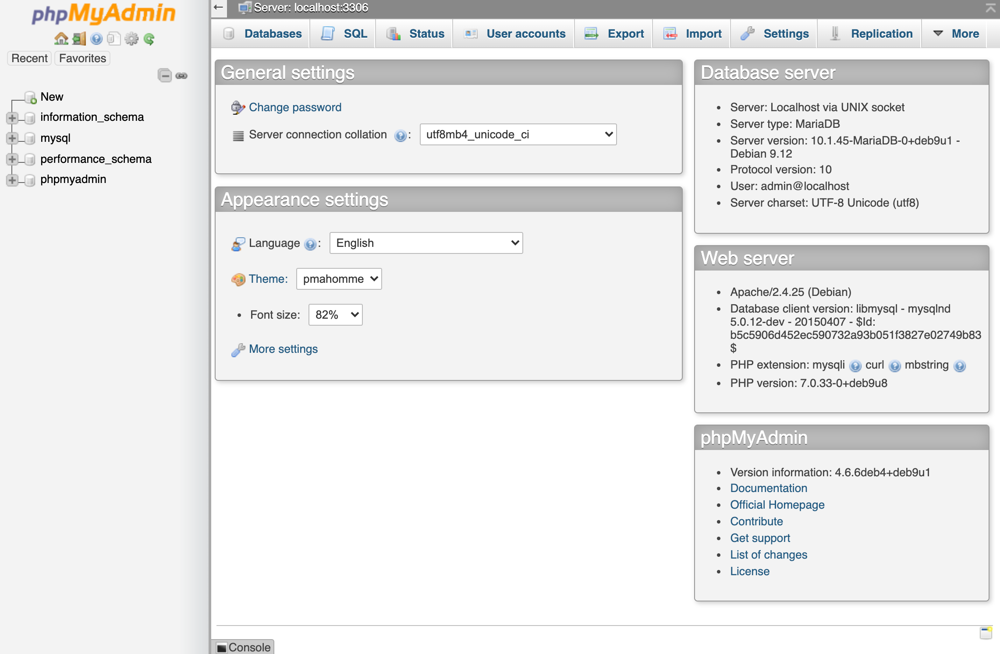

[phpMyAdmin](https://www.phpmyadmin.net/) is an open source web application that provides a GUI for MySQL database administration, giving you a convenient and powerful alternative to using the MySQL command line client. The phpMyAdmin Marketplace App deploys a Linode with phpMyAdmin installed and ready for you to begin managing a MySQL database.

## Deploying a Marketplace App

{}

{}


**Estimated deployment time:** phpMyAdmin should be fully installed within 2-5 minutes after the Compute Instance has finished provisioning.


## Configuration Options

- **Supported distributions:** Debian 11
- **Recommended minimum plan:** All plan types and sizes can be used.

### phpMyAdmin Options

- **phpMyAdmin/MySQL Admin User** *(required)*: The admin username for accessing your phpMyAdmin dashboard.
- **phpMyAdmin/MySQL Admin Password** *(required)*: The admin user password for accessing your phpMyAdmin dashboard.
- **MySQL root Password** *(required)*: The root user password for your MySQL database.


phpMyAdmin doesn't handle user management itself, but passes all user information onto MySQL. The Admin User you create here is created in MySQL.


{}

## Getting Started After Deployment

After installation is complete, the phpMyAdmin dashboard is accessible at your Linode's IP address followed by `/phpmyadmin` for example:

    http://your.linode.ip.address/phpmyadmin

However, entering your phpMyAdmin credentials through an HTTP connection is insecure. The next section provides instructions on how to enable HTTPS access to the phpMyAdmin dashboard from your domain by using [Certbot](https://certbot.eff.org/) to issue a free Let's Encrypt SSL Certificate so that you can access your phpMyAdmin deployment securely.

### Configure Your Domain with DNS Manager

The following sections require that you own a domain that has been configured for your use with your phpMyAdmin Linode. Following the instructions in the Linode [DNS Manager](/docs/products/networking/dns-manager/) guide, configure your domain's [name servers](/docs/products/networking/dns-manager/guides/authoritative-name-servers/) and add a [DNS record](/docs/products/networking/dns-manager/guides/manage-dns-records/) so that your domain is pointing to your phpMyAdmin Linode.

### Enable HTTPS with Certbot

1.  [Connect to Your Linode via SSH](/docs/products/compute/compute-instances/guides/set-up-and-secure/#connect-to-the-instance).

1.  Install Certbot for authentication with Python and Apache:

        sudo apt-get install certbot python-certbot-apache

1.  Run the Certbot script for Apache:

        sudo certbot --apache

1.  Complete the prompts from the Certbot script to create and deploy SSL certificates for your domain.

1.  Update your Linode's firewall to allow HTTPS access:

        sudo ufw allow https

### Access the phpMyAdmin dashboard

1.  In your browser, navigate to the following address, replacing `www.example.com` with the address of your domain:

        https://www.example.com/phpmyadmin

1.  At the login screen enter the **phpMyAdmin/MySQL Admin User** and **phpMyAdmin/MySQL Admin Password** you chose when you deployed the phpMyAdmin Marketplace App.

    

1.  You can now access the phpMyAdmin dashboard and begin managing your MySQL database.

    

## Software Included

The phpMyAdmin Marketplace App will install the following required software on your Linode:

| **Software** | **Description** |
|:--------------|:------------|
| [**phpMyAdmin**](https://docs.phpmyadmin.net/en/latest/) | phpMyAdmin is a free software tool written in PHP that is intended to handle the administration of a MySQL or MariaDB database server.  |
| [**MariaDB**](https://mariadb.org/documentation/) | MariaDB is a fork of the popular cross-platform MySQL database management system and is considered a full [drop-in replacement](https://mariadb.com/kb/en/mariadb-vs-mysql-features/) for MySQL. |

{}