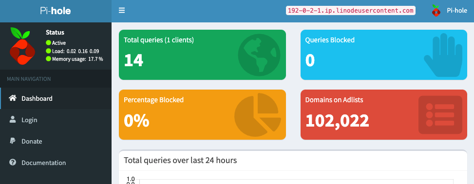

[Pi-hole](https://pi-hole.net/) is a [DNS sinkhole](https://en.wikipedia.org/wikic/DNS_sinkhole) that filters out requests to ad-serving domains, blocking ads and improving network performance. With Pi-hole, you can actively monitor every DNS request made on your network and block requests as they come in.

## Deploying a Marketplace App

{}

{}


**Estimated deployment time:** Pi-hole should be fully installed within 5-10 minutes after the Compute Instance has finished provisioning.


## Configuration Options

- **Supported distributions:** Ubuntu 24.04 LTS
- **Recommended plan:** All plan types and sizes can be used.

### Pi-hole Options

- **Email address** *(required)*: Enter the email address you want to use for generating the SSL certificates and configuring the server and DNS records.

{}

{}

{}

### Obtain the Credentials

Once the app is deployed, you need to obtain the credentials from the server.

To obtain the credentials:

1.  Log in to your new Compute Instance using one of the methods below:

    - **Lish Console**: Log in to Cloud Manager, click the **Linodes** link in the left menu, and select the Compute Instance you just deployed. Click **Launch LISH Console**. Log in as the `root` user. To learn more, see [Using the Lish Console](/docs/products/compute/compute-instances/guides/lish/).
    - **SSH**: Log in to your Compute Instance over SSH using the `root` user. To learn how, see [Connecting to a Remote Server Over SSH](/docs/guides/connect-to-server-over-ssh/).

1.  Run the following command to access the credentials file:

    ```command
    cat /home/$USERNAME/.credentials
    ```

This returns passwords that were automatically generated when the instance was deployed. Save them. Once saved, you can safely delete the file.

## Getting Started after Deployment

### Accessing the Pi-hole App

1.  Open your web browser and navigate to `http://[domain]/admin`, where *[domain]* can be replaced with the custom domain you entered during deployment, your Compute Instance's rDNS domain (such as `192-0-2-1.ip.linodeusercontent.com`), or your IPv4 address. See the [Managing IP Addresses](/docs/products/compute/compute-instances/guides/manage-ip-addresses/) guide for information on viewing IP addresses and rDNS.

    The Pi-Hole dashboard should now be displayed.

    

1.  To log yourself in and access most of Pi-hole's features, click the **Login** link on the left menu. Enter the Pi-hole user password that is found in your credentials file.

Now that you’ve accessed your dashboard, check out [the official Pi-hole documentation](https://docs.pi-hole.net/) to learn how to further use your Pi-hole instance.

{}