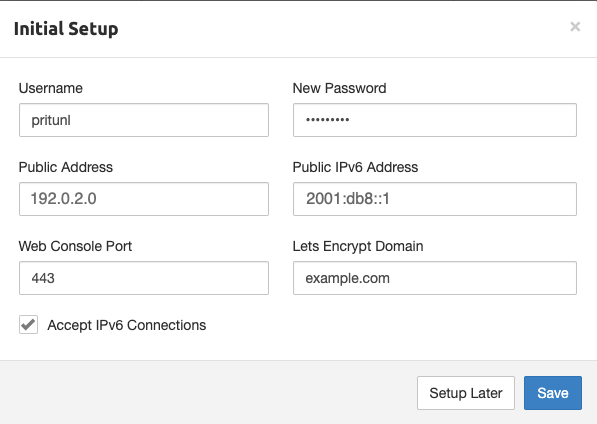

Pritunl is an open source VPN server and management panel. It gives the user the power of the OpenVPN protocol while using an intuitive web interface.

## Deploying a Marketplace App

{}

{}


**Estimated deployment time:** Pritunl should be fully installed within 2-5 minutes after the Compute Instance has finished provisioning.


## Configuration Options

- **Supported distributions:** Ubuntu 24.04 LTS
- **Recommended plan:** All plan types and sizes can be used.

### Pritunl Options

{}

{}
- **Email address for the SOA record:** The start of authority (SOA) email address for this server. This is a required field if you want the installer to create DNS records.
{}

## Getting Started after Deployment

### Obtain the Credentials

Once the app is deployed, you need to obtain the credentials from the server.

To obtain credentials:

1.  Log in to your new Compute Instance using one of the methods below:

    - **Lish Console**: Log in to Cloud Manager, click the **Linodes** link in the left menu, and select the Compute Instance you just deployed. Click **Launch LISH Console**. Log in as the `root` user. To learn more, see [Using the Lish Console](/docs/products/compute/compute-instances/guides/lish/).
    - **SSH**: Log in to your Compute Instance over SSH using the `root` user. To learn how, see [Connecting to a Remote Server Over SSH](/docs/guides/connect-to-server-over-ssh/).

1.  Run the following command to access the credentials file:

    ```command
    cat /home/$USERNAME/.credentials
    ```

This returns passwords that were automatically generated when the instance was deployed. Save them. Once saved, you can safely delete the file.

### Accessing the Pritunl App

1.  Open a web browser and navigate to the domain you entered when creating the instance: `https://domain.tld`. If you didn't enter a domain, use your Compute Instance's default rDNS domain (`192-0-2-1.ip.linodeusercontent.com`). To learn more on viewing the rDNS value, see [Managing IP Addresses](/docs/products/compute/compute-instances/guides/manage-ip-addresses/). Make sure to use the `https` prefix in the URL to access the website securely.

    
    In Chrome, you can accept the self-signed certificate by clicking on Advanced and then click Proceed to <ip> (unsafe). In Firefox, click on Advanced, then Add Exception, and then Confirm Security Exception.
    

1.  The login prompt appears. Enter `pritunl` as the username and then use the password generated in the credentials file.

    

1.  Once you're logged in, you can change the default password and enter the domain information so Pritunl can setup the SSL certificates automatically:

    

Now that you’ve accessed your dashboard, check out [the official Pritunl documentation](https://docs.pritunl.com/docs/connecting) to learn how to add users and further use your Pritunl instance.

{}