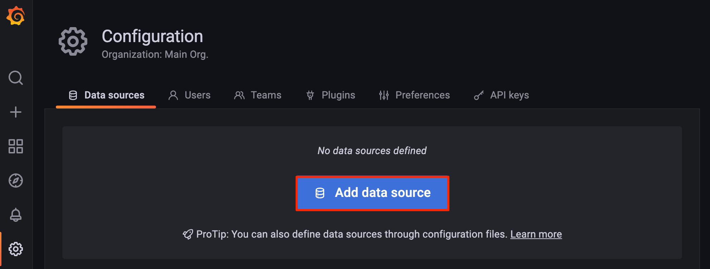
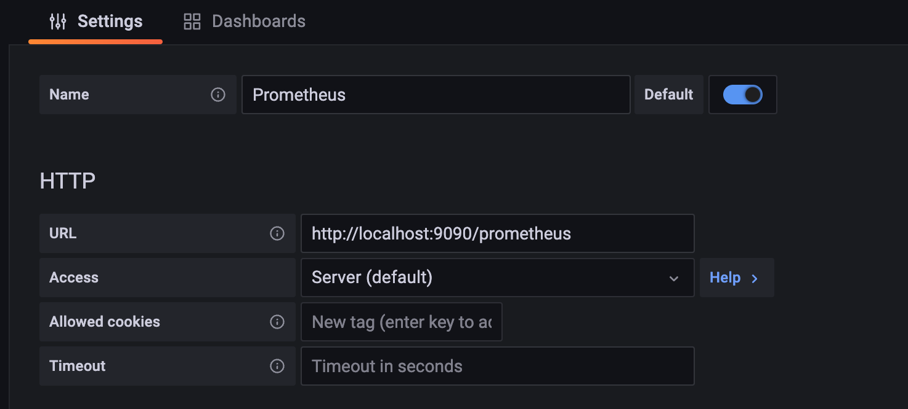
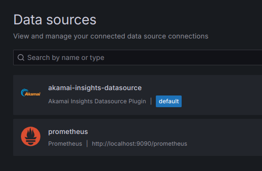
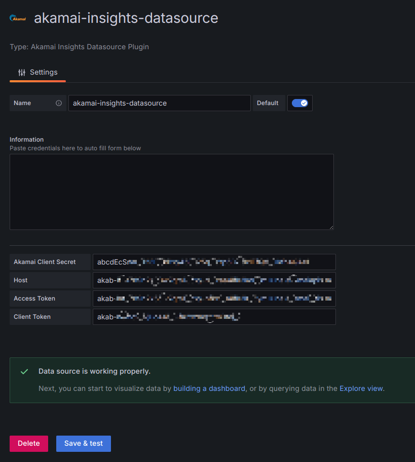

This Marketplace App installs both [Prometheus](https://prometheus.io/) and [Grafana](https://grafana.com/oss/grafana/), two open source tools that are commonly used together to collect and view data.

Use Prometheus to collect metrics and receive alerts. Prometheus monitors targets that you define at given intervals by scraping their metrics HTTP endpoints. This tool is particularly well-suited for numeric time series data, which makes it ideal for machine-centric monitoring as well as monitoring of highly dynamic service-oriented architectures.

Grafana is an analytics and monitoring solution with a focus on accessibility for metric visualization. You can use Grafana to create, monitor, store, and share metrics with your team to keep tabs on your infrastructure. Grafana is very lightweight and does not use a lot of memory and CPU resources.

## Deploying a Marketplace App

{}

{}


**Estimated deployment time:** Prometheus and Grafana should be fully installed within 2-5 minutes after the Compute Instance has finished provisioning.


## Configuration Options

- **Supported distributions:** Ubuntu 22.04 LTS
- **Suggested plan:** All plan types and sizes can be used.

### Prometheus and Grafana Options

- **Email address** *(required)*: Enter the email address to use for generating the SSL certificates.

{}

{}

{}

#### Akamai Datasource Plugin (Optional)

If your Akamai account contract has **Reporting** enabled you can take advantage of the **[Akamai Reporting API V2](https://techdocs.akamai.com/reporting/v2/reference/api)**. This allows you to expose data to monitor traffic, analyze patterns and long-term trends directly into Grafana.

Before you can fill out the necessary fields below you will need to create API client credentials. Please refer to Akamai's Techdocs to create the necessary credentials needed:

- [Get Started](https://techdocs.akamai.com/reporting/v2/reference/get-started)
- [Create Authentication Credentials](https://techdocs.akamai.com/developer/docs/set-up-authentication-credentials)


In order to configure the Akamai Insights Datasource plugin you **must** fill out all of the fields. Leaving any of the fields blank will result in the plugin not being installed.


- **Akamai client_secret:** Enter your `client_secret` value.
- **Akamai host:** Enter your Akamai `host` value. This typically ends in **luna.akamaiapis.net**.
- **Akamai access_token:** Enter your `access_token` value.
- **Akamai client_token:** Enter your `client_token` value.


Akamai's Grafana data source plugin, as being offered here, is licensed to you under Apache License Version 2.0.  Copyright Akamai 2024.  Akamai's Grafana data source plugin uses Grafana's Plugin tools (https://github.com/grafana/plugin-tools) software, which is licensed under Apache License Version 2.0 whose terms are available at http://www.apache.org/licenses/LICENSE-2.0. Please note that this is an unsigned plugin and is provided as-is.


## Getting Started after Deployment

### Access Grafana and Prometheus

To access the front end interfaces for either Grafana or Prometheus, first [obtain the credentials](#obtain-the-credentials). Then, open your web browser and navigate to the *Location* URL of the app you wish to access. In the login prompt that appears, enter the username and password as shown in the *credentials.txt* file.

### Obtain the Credentials

Once the app has been *fully* deployed, you need to obtain the credentials from the server.

1.  Log in to your new Compute Instance using one of the methods below:

    - **Lish Console:** Within Cloud Manager, navigate to **Linodes** from the left menu, select the Compute Instance you just deployed, and click the **Launch LISH Console** button. Log in as the `root` user. See [Using the Lish Console](/docs/products/compute/compute-instances/guides/lish/).
    - **SSH:** Log in to your Compute Instance over SSH using the `root` user, or with the sudo user created during deployment. See [Connecting to a Remote Server Over SSH](/docs/guides/connect-to-server-over-ssh/) for assistance.

1.  Once logged in, find the URLs and credential files listed in the MOTD:

    ```command
    cat /etc/motd
    ```

    ```output
    *********************************************************
    Akamai Connected Cloud Prometheus & Grafana Marketplace App
    Grafana URL: https://$EXAMPLE_DOMAIN.COM
    Prometheus URL: https://$EXAMPLE_DOMAIN.COM/prometheus
    Credentials File: /home/$SUDO_USER/.credentials
    Documentation: https://www.linode.com/docs/products/tools/marketplace/guides/prometheus-grafana/
    *********************************************************
    ```

    To delete this message of the day, use `rm /etc/motd`.

1.  The `/home/$SUDO_USER/.credentials` file contains the credentials for the created sudo user, Prometheus, and Grafana, as shown in the example output below:

    ```command
    cat /home/$SUDO_USER/.credentials
    ```

    ```output
    Sudo Username: $SUDO_USER
    Sudo Password: QAV!BHw3Ud-EcM4XYt3q
    Prometheus Username: prometheus
    Prometheus Password: XnYGi8CTPNKugQhaC9@2nze6
    Grafana Username: admin
    Grafana Password: *qs6.rbpWyb_rwKm3ciFYW82
    ```

### Add Prometheus as a Data Source to Grafana

1.  Log in to the Grafana front end. See [Access Grafana and Prometheus](#access-grafana-and-prometheus).

1.  On the main menu, hover over the gear icon to open the *Configuration* menu. Then click **Data Sources**.

    

1.  Within the *Data sources* page that appears, click the **Add data source** button.

    

1.  Select **Prometheus** from the *Time series database* section of the *Add data source* page.

1.  A data source labeled *Prometheus* is automatically created and its configuration settings are now visible. Within the **URL** field, enter `http://localhost:9090/prometheus`. The rest of the settings can be adjusted as needed.

    

Now that the Prometheus Data Source is set, you can browse the [available Grafana dashboards](https://grafana.com/grafana/dashboards/) to see which dashboard fits your needs. Review the official [Prometheus](https://prometheus.io/docs/introduction/overview/) and [Grafana](https://grafana.com/docs/grafana/latest/) documentation to learn how to further use your instance.

### Akamai Insights Datasource 

If you opted to add the Akamai Insights Datasource plugin you will find the datasource present in the Data Sources tab.
    


Once you click **akamai-insights-datasource** You can test access by clicking the **Save & test** button. If everything is working correctly you will see the following message.
    

{}