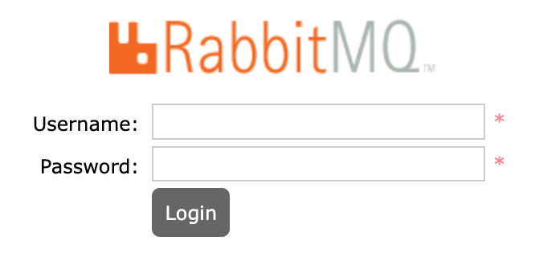
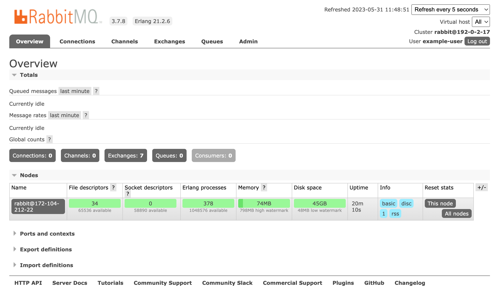

RabbitMQ is a popular open source **message broker**, or a tool that enables and empowers components of a system to communicate from a centralized source or application. By "translating" data from a number of different sources into a unified language, RabbitMQ allows component services to interact with each other through a centralized method.

The RabbitMQ Marketplace App installs a RabbitMQ server and a basic default configuration to assist with messaging tasks. By accessing The RabbitMQ Management console, you can further configure RabbitMQ and view important analytics at any time.

## Deploying a Marketplace App

{}

{}


**Estimated deployment time:** RabbitMQ should be fully installed within 2-5 minutes after the Compute Instance has finished provisioning.


## Configuration Options

- **Supported distributions:** Ubuntu 24.04 LTS
- **Recommended minimum plan:** All plan types and sizes can be used.

### RabbitMQ Options

- **Email address** *(required)*: Email address to use for generating the SSL certificates and configuring the server and DNS records.
- **Allowed IPs** *(required)*: IP addresses allowed to access the Management UI.
- **The version of RabbitMQ you'd like installed** *(required)*: RabbitMQ version to be installed during the setup.
- **RabbitMQ Admin Username** *(required)*: RabbitMQ admin username.
- **RabbitMQ Username** *(required)*: RabbitMQ limited AMQP user. Make sure to use a username different from the **RabbitMQ Admin Username**.

{}

{}

{}

### Obtain the Credentials

Once the app is deployed, you need to obtain the credentials from the server.

To obtain credentials:

1.  Log in to your new Compute Instance using one of the methods below:

    - **Lish Console**: Log in to Cloud Manager, click the **Linodes** link in the left menu, and select the Compute Instance you just deployed. Click **Launch LISH Console**. Log in as the `root` user. To learn more, see [Using the Lish Console](/docs/products/compute/compute-instances/guides/lish/).
    - **SSH**: Log in to your Compute Instance over SSH using the `root` user. To learn how, see [Connecting to a Remote Server Over SSH](/docs/guides/connect-to-server-over-ssh/).

1.  Run the following command to access the credentials file:

    ```command
    cat /home/$USERNAME/.credentials
    ```

This returns passwords that were automatically generated when the instance was deployed. Save them. Once saved, you can safely delete the file.

## Getting Started After Deployment

To get started:

1.  Open a web browser and navigate to the domain you entered when creating the instance: `https://domain.tld`. If you didn't enter a domain, use your Compute Instance's default rDNS domain (`192-0-2-1.ip.linodeusercontent.com`). To learn more on viewing the rDNS value, see [Managing IP Addresses](/docs/products/compute/compute-instances/guides/manage-ip-addresses/). Make sure to use the `https` prefix in the URL to access the website securely.

1. Log in with your username and password found in your /home/$USERNAME/.credentials file.

    

Now, you have full access to the RabbitMQ Management Console and you can start configuring your application. To learn more on RabbitMQ, see [RabbitMQ Tutorials](https://www.rabbitmq.com/getstarted.html).

    

{}