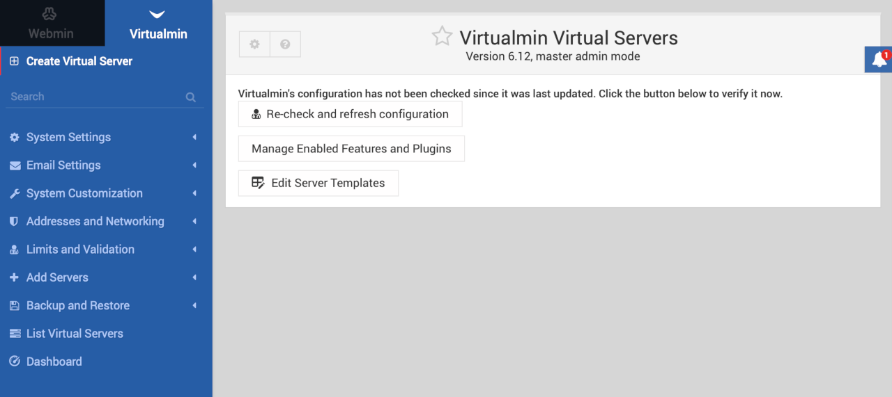
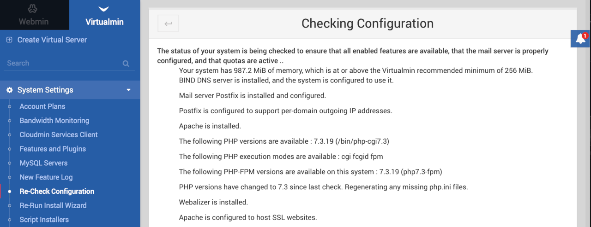


Virtualmin has been removed from the App Marketplace and can no longer be deployed. This guide has been retained for reference only.


[Virtualmin](https://www.virtualmin.com) is an open source control panel for web hosting management. It offers an easy to use graphical interface for managing websites, email, and databases. It's built on top of and integrated with the popular Webmin.

## Deploying a Marketplace App

{}

{}


**Estimated deployment time:** Virtualmin should be fully installed within 2-5 minutes after the Compute Instance has finished provisioning.


## Configuration Options

- **Supported distributions:** Debian 10, Ubuntu 22.04 LTS
- **Recommended minimum plan:** All plan types and sizes can be used.

### Virtualmin Options

{}
- **Enable passwordless sudo access for the limited user?** Select **Yes** to [disable SSH password authentication](/docs/products/compute/compute-instances/guides/set-up-and-secure/#ssh-daemon-options) for your limited sudo user as an additional security measure. Requires an **SSH Public Key** for SSH access to your Linode.

#### Additional Security Configuration

- **Configure automatic security updates?** Select **Yes** to enable automatic security updates for your Linode.
- **Use fail2ban to prevent automated instrusion attempts?** Select **Yes** to enable [SSH login protection with Fail2Ban](/docs/guides/using-fail2ban-to-secure-your-server-a-tutorial/) as an additional security measure.

{}
- **SOA Email for your domain** The email address to register as your Start of Authority (SOA). This field is required for creating DNS records for a new domain.
- **Do you need an MX record for this domain?** Select **Yes** to automatically configure an [MX record](/docs/guides/dns-overview/#mx) for the purpose of sending emails from your instance.
- **Do you need an SPF record for this domain?** Select **Yes** to automatically configure an [SPF record](/docs/guides/dns-overview/#spf) for the purpose of sending emails from your instance.

{}

## Getting Started after Deployment

Virtualmin is now installed and ready to use.

1.  Before you go to our app, if you filled out the optional Virtualmin configuration fields:

    - In Cloud Manager's [DNS Manager](/docs/products/networking/dns-manager/guides/create-domain/) there is now an entry for your domain with possible subdomain, MX, and SPF records pointing to your new server.
    - [Configure the rDNS](/docs/products/compute/compute-instances/guides/configure-rdns/) on your Linode.

1.  Virtualmin is served on port 10000, to access it, navigate to either the IP address of your server or to your domain name followed by port 10000. For example, `http://example.com:10000` or `http://203.0.113.0:10000`, replacing the domain name or IP address with values for your server.

    

1.  At the login screen, login using either:

    - The system root username and password
    - The sudo username and password if you set that up in the Virtualmin optional configuration during installation.

1.  After logging in for the first time, a Post-Installation Wizard walks you through some initial setup to optimize your system. If you choose `Cancel` the wizard will use the default settings.

    

1.  On the main dashboard, Virtualmin must check its configuration before virtual servers can be added. Click the **Re-check and refresh configuration** button.

    

1.  Virtualmin checks your system and returns a list of statuses and recommendations that you can choose to take action on if desired.

    

1.  Click the **Return to virtual servers list** button at the bottom of the screen when you are finished. You are now ready to start administering your server.

    

{}
