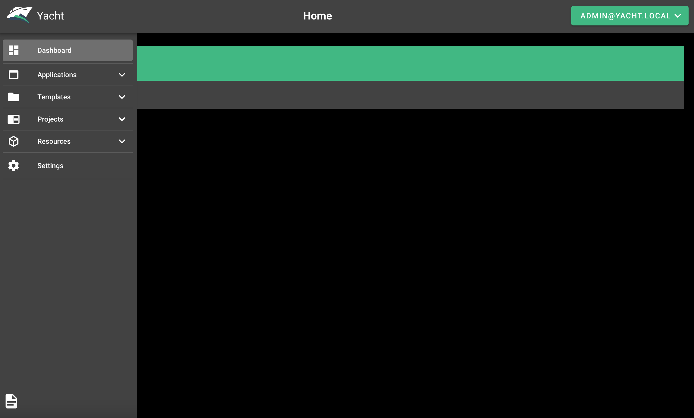

[Yacht](https://yacht.sh/) is a web interface for managing Docker containers, with an emphasis on templating to provide easy deployments. The ultimate goal of Yacht is to make Docker easy for anyone to use and manage with templates, template variables, and an intuitive UI.

## Deploying a Marketplace App

{}

{}


**Estimated deployment time:** Yacht should be fully installed within 2-5 minutes after the Compute Instance has finished provisioning.


## Configuration Options

- **Supported distributions:** Ubuntu 22.04 LTS
- **Recommended minimum plan:** All plan types and sizes can be used.

### Yacht Options

- **Email address** *(required)*: Enter the email address to use for generating the SSL certificates.

{}

{}

{}

- **Yacht Email:** The email address for your Yacht login. The default is admin@yacht.local.
- **Yacht Compose Support:** Support for using Yacht with [Docker Compose](https://yacht.sh/Advanced/docker-compose/).
- **Yacht Theme:** Yacht theme options: Default, RED, and OMV.

## Getting Started after Deployment

### Access your Yacht App

1.  Open your web browser and navigate to `https://DOMAIN/`, where *DOMAIN* can be replaced with the custom domain you entered during deployment or your Compute Instance's rDNS domain (such as `192-0-2-1.ip.linodeusercontent.com`). See the [Managing IP Addresses](/docs/products/compute/compute-instances/guides/manage-ip-addresses/) guide for information on viewing rDNS.

1. Enter your [Yacht email address and password](#yacht-options):

    

    You should see the Yacht administration panel:

    

Yacht provides elegant theme customization, templating, easy management of Docker resources (volumes, images, network), applications and projects. Click the page icon on the bottom-left corner to view a live demo and official [Yacht documentation](https://yacht.sh/).

{}