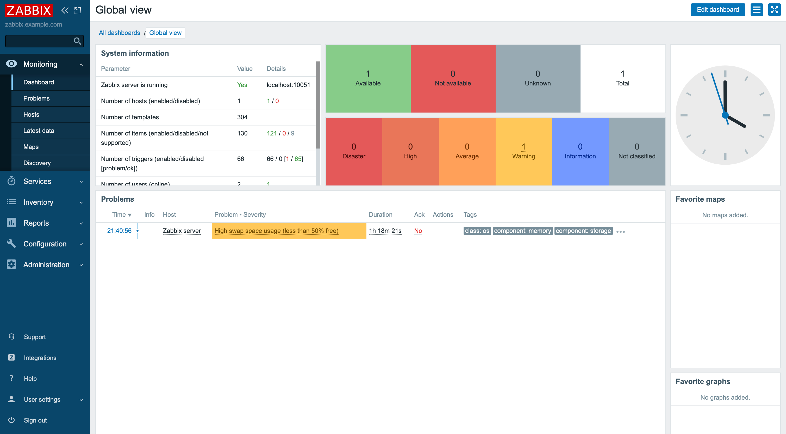

[Zabbix](https://www.zabbix.com/) is an enterprise-class, open-source, distributed monitoring solution. Designed as an all-in-one monitoring solution, Zabbix can track performance and availability of network servers, devices, services, and other IT resources. Zabbix empowers administrators to quickly respond to incidents with on-screen display capabilities and alerts by email, SMS, or Jabber. Users can also collect, store, manage, and analyze information received from IT infrastructure. Actively used by SMBs and large enterprises across all industries and in almost every country, Zabbix has a robust community driving its continued development.

## Deploying a Marketplace App

{}

{}


**Estimated deployment time:** Zabbix should be fully installed within 5-10 minutes after the Compute Instance has finished provisioning.


## Configuration Options

- **Supported distributions:** Ubuntu 22.04 LTS
- **Suggested minimum plan:** All plan types and sizes can be used.

### Zabbix Options

- **Email Address:** *(required)* SOA address for free Let's Encrypt SSL.

{}

{}

- **Zabbix Server Name:** Local hostname for Zabbix server. Defaults to `zabbix-server`

## Getting Started after Deployment

### Access your Zabbix App

After Zabbix has finished installing, you must first obtain the login credentials. You can then use these credentials to log in to your Zabbix App via a web browser.

1.  From your terminal, log in to your new Compute Instance as the `root` user, or the `sudo` user created during deployment. Use the following command, replacing `192.0.2.1` with your instance's [IPv4 address](/docs/products/compute/compute-instances/guides/manage-ip-addresses/):

    ```command
    ssh root@192.0.2.1
    ```

1.  Output the generated Zabbix credentials by using the following command, replacing `$USERNAME` with the `sudo` user created while deploying the Compute Instance.

    ```command
    cat /home/$USERNAME/.credentials

    Sudo Username: sudo_user
    Sudo Password: dX4ietUrbuYhWOOtbFJKYyRRM
    Zabbix Admin GUI Username: Admin
    Zabbix Admin GUI Password: hTEoofieRkqqcVvtp9sqVskDbygwaMZXfKUMNbiyHZiRT
    Zabbix DB User: zabbix
    Zabbix DB Password: elua1U25uQesggMt2hhNOB33H3Egec53OJQlUwsDKENOFS
    MySQL Root Password: fpzdhOpcyw0arno6pw9SGr5vlRiu4GeyrH45kFlypXKrR
    ```

1.  Access the Zabbix Admin panel by opening a web browser and navigating to the following URL: `https://[domain]`, replacing *[domain]* with the rDNS domain assigned to your new Compute Instance, or the custom domain entered on deployment. See the [Managing IP Addresses](/docs/products/compute/compute-instances/guides/manage-ip-addresses/) guide for information on viewing IP addresses.

    

1.  Enter the username and password you obtained in a previous step and then click **Sign in** to access the Zabbix control panel.

    

## Next Steps

For more on Zabbix, check out the following resources:

- [Learn from Zabbix Documentation](https://www.zabbix.com/documentation/5.0/manual)
- [Purchase Technical Support Contract](https://www.zabbix.com/support)
- [Visit the Zabbix Official Forum](https://www.zabbix.com/forum)

{}
