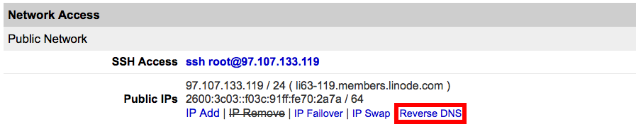

---
author:
  name: Linode
  email: docs@linode.com
description: 'Reverse DNS (rDNS) resolves an IP address to the designated domain name. This guide will teach you how to set it up.'
keywords: ["reverse", "dns", "PTR"]
license: '[CC BY-ND 4.0](https://creativecommons.org/licenses/by-nd/4.0)'
modified_by:
  name: Linode
published: 2015-07-09
title: Configure Your Linode for Reverse DNS (rDNS)
cloud_manager_link: networking/dns/configure-your-linode-for-reverse-dns/
hiddenguide: true
---

Computers use DNS to determine the IP address associated with a domain name. *Reverse* DNS lookup does the opposite by resolving an IP address to a designated domain name. You should always set the reverse DNS, even if your Linode hosts more than one domain.

Reverse DNS uses a *pointer record* (PTR) to match an IP address with a domain or subdomain. PTR records are generally set with a hosting provider, so reverse DNS is set in the Linode Manager.

Before setting the reverse DNS for your Linode, configure your domain zone and DNS records through Linode's [DNS Manager](/docs/platform/manager/dns-manager/). See our [Introduction to DNS Records](/docs/networking/dns/dns-records-an-introduction/) and [Common DNS Configurations](/docs/networking/dns/common-dns-configurations/) guides for more information about PTR and DNS.

## Setting Reverse DNS

1.  Select the Linode you wish to set up reverse DNS for from your Linodes tab.
2.  Click the **Remote Access** tab.
3.  Select the **Reverse DNS** link:

    

4.  Enter your Linode's fully qualified domain name in the **Hostname** field:

    

5.  Click **Look up**. A message will appear indicating that a match has been found for both your IPv4 and IPv6 addresses:

    

6.  Click **Yes** beneath the desired address. Note that you can select only one address at a time. If you want to set up reverse DNS for both the IPv4 and IPv6 addresses, you can perform another lookup and select the other address.
