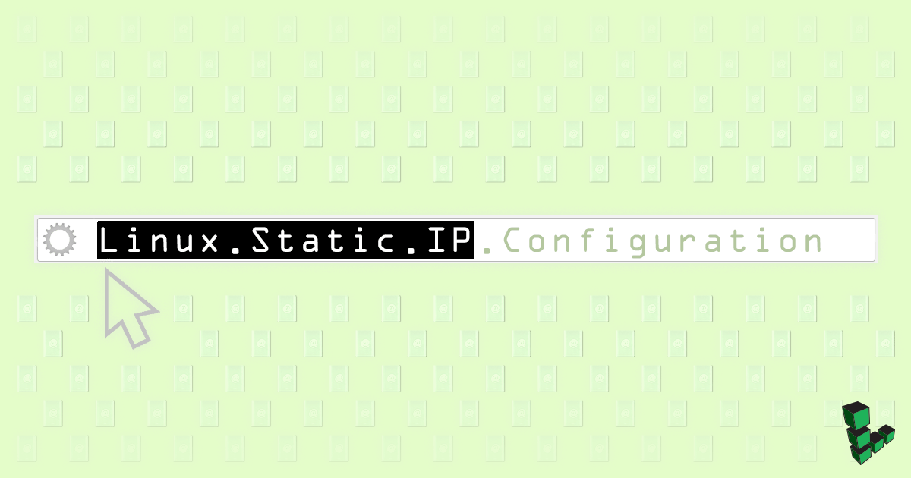
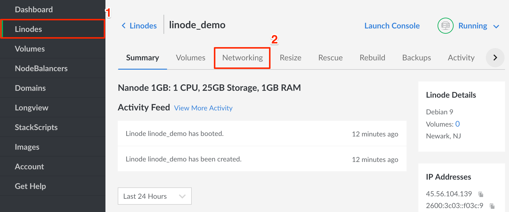
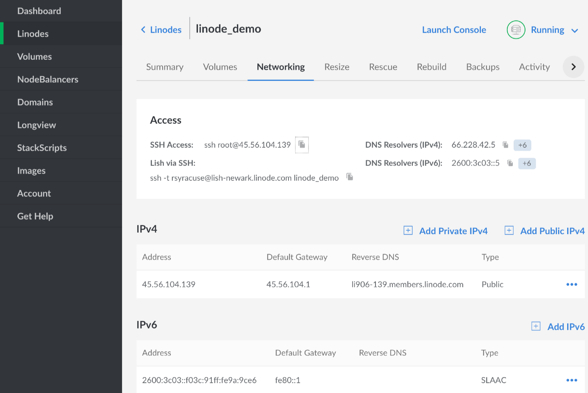

---
author:
  name: Linode
  email: docs@linode.com
description: 'Set static IP, routes and DNS in Linux.'
keywords: ["static", "ip address", "addresses"]
license: '[CC BY-ND 4.0](https://creativecommons.org/licenses/by-nd/4.0)'
aliases: ['networking/configuring-static-ip-interfaces/']
modified: 2018-01-02
modified_by:
  name: Linode
published: 2014-07-20
title: Linux Static IP Configuration
---

All Linodes are created with one IPv4 address and one for IPv6. An IPv4 address is assigned by our infrastructure from a pool of unused addresses when you create your Linode, and [Stateless Address Autoconfiguration](https://en.wikipedia.org/wiki/IPv6#Stateless_address_autoconfiguration_.28SLAAC.29) (SLAAC) is used for IPv6 assignment. Additional IPv4 or IPv6 addresses can be requested by opening a [support ticket](/docs/platform/billing-and-support/support/) and detailing your requirements.

If you want to manually configure static addressing in your Linode's operating system, this guide shows you how to do that. You will want to make these changes using [Lish](/docs/platform/manager/using-the-linode-shell-lish/), so if a configuration error disconnects your SSH session, you won't be locked out of a system that has no network access.

## General Information

**Interfaces**

Each Linode has only one virtual network interface, `eth0`, but depending on your distribution, additional IPs can be assigned to interface aliases (ex: `eth0:1`, `eth0:2`, etc.). Most outbound connections will originate from the IP assigned to `eth0`, but if you need server daemons to bind to a particular IP address or interface, you'll need to specify that in the appropriate configuration files.

**Addressing**

The IP blocks available to your Linode are shown below. Additionally, the subnet mask for private IPs should be `255.255.128.0`, not `255.255.255.0`.

*   Public IPv4 - /24
*   Private IPv4 - /17
*   IPv6 - /64

**Gateway**

Although your Linode may have multiple IP addresses assigned, and additionally may be using virtual interfaces and aliases, you should only specify a gateway for *one* interface. That gateway should be on the same network as the desired IP address.

For example, if the address `198.51.100.5` is assigned to the interface `eth0:3`, you should use `198.51.100.1` as the gateway. A gateway should not be specified for private IP addresses.

**DNS Resolution**

Your DNS resolver addresses are listed under the [**Networking**](/docs/platform/manager/remote-access/) tab of the Linode detail page in the [Cloud Manager](https://cloud.linode.com/dashboard), though of course you are free to use any resolvers you choose.

However, unless you have a specific reason for doing so, you should *not* change your Linode's nameservers by editing `/etc/resolv.conf`. Depending on your distribution, `resolv.conf` may be overwritten by a networking service such as NetworkManager or systemd-resolved. Resolver options are usually set in the network interface's configuration file.

## Disable Network Helper

Our [Network Helper](/docs/platform/network-helper/) tool is enabled by default for new Linodes. It automatically configures static IPv4 addresses, routing, and DNS on each bootup of your Linode. When manually setting static addressing, Network Helper must be *disabled* so it doesn't overwrite your changes on the next reboot. You can disable Network Helper either *globally* for all of the Linodes on your account, or for individual Linodes, by following the [Network Helper Settings](https://linode.com/docs/platform/network-helper/#network-helper-settings) section of our network helper guide.

## Configure Static Addressing

To find the networking information for each of your Linodes in your Linode Manager, click on the **Linodes** tab to the left of the page, select the Linode you'll be configuring, then click on the **Networking** towards the top.

You'll see the following information for your Linode. Use this information to configure your Linode's network settings as shown below.

*   IPv4 and IPv6 addresses (both private and public)
*   IPv4 gateway
*   IPv6 gateway
*   DNS resolvers (if you want to use Linode's)

Below are example configurations for the given Linux distribution. Edit the example files substituting the example IP addresses with those of your Linode, gateway and DNS nameservers. Depending on the amount of addresses you want to configure, not all lines will be necessary.

### Arch, CoreOS Container Linux

Networking in these distributions is managed entirely by *systemd*. See `man systemd-networkd` and `man systemd-resolved` for more information.


[Match]
Name=eth0

[Network]
DHCP=no
Domains=members.linode.com
IPv6PrivacyExtensions=false

# DNS resolvers (safe to mix IPv4 and IPv6)
DNS=203.0.113.1 2001:db8:0:123::1 203.0.113.2

# IPv4 gateway and primary address.
Gateway=198.51.100.1
Address=198.51.100.2/24

# Add a second public IPv4 address.
Address=198.51.100.3/24

# Add a private address:
Address=192.168.133.234/17

# IPv6 gateway and primary address.
Gateway=fe80::1
Address=2001:db8:2000:aff0::2/64

# Add a second IPv6 address.
Address=2001:db8:2000:aff0::3/32



On Container Linux, you need to rename or remove the original cloud config data so it doesn't take precedence on reboots over the eth0 configuration above. Do this with `sudo mv /var/lib/coreos-install/user_data /var/lib/coreos-install/user_data.bak`.


### CentOS 7, Fedora

Networking in CentOS 7 and Fedora is managed by *systemd* and *NetworkManager*. See `man systemd-networkd` and `man networkmanager` for more information. Note that NetworkManger in CentOS 7 and Fedora includes the tools `nmtui` and `nmcli` to modify network configurations. Those are additional options to set static addressing if you would prefer to not directly edit the network interface's configuration file. See `man nmtui` and `man nmcli` for more info.


# Edit this line from "dhcp" to "none":
BOOTPROTO=none

# If present, edit from "yes" to "no":
PEERDNS=no

# Edit from "yes" to "no".
IPV6_AUTOCONF=no

...

# Add the following lines:
DOMAIN=members.linode.com

# We specifically want GATEWAY0 here, not
# GATEWAY without an integer following it.
GATEWAY0=198.51.100.1

# DNS resolvers (safe to mix IPv4 and IPv6)
DNS1=203.0.113.1
DNS2=2001:db8:0:123::1 203.0.113.2

# Your primary IPv4 address. The netmask
# is taken from the PREFIX (where 24 is a
# public IP, 17 is a private IP)
IPADDR0=198.51.100.5
PREFIX0=24

# Add a second public IPv4 address.
IPADDR1=198.51.100.10
PREFIX1=24

# Add a private IPv6 address.
IPADDR2=192.0.2.6
PREFIX2=17

# IPv6 gateway and primary address.
IPV6_DEFAULTGW=fe80::1%eth0
IPV6ADDR=2001:db8:2000:aff0::2/128

# Add additional IPv6 addresses, separated by a space.
IPV6ADDR_SECONDARIES="2001:db8:2000:aff0::3/64 2001:db8:2000:aff0::4/64"


### CentOS 6

Networking CentOS 6 is managed by *dhclient*. NetworkManager is not installed by default, however a static configuration for CentOS 6 differs only slightly from CentOS 7 and Fedora. See the [RHEL 6 Deployment Guide](https://access.redhat.com/documentation/en-US/Red_Hat_Enterprise_Linux/6/html/Deployment_Guide/ch-Network_Interfaces.html) for more information.


# Edit this line from "dhcp" to "none":
BOOTPROTO=none

# If present, edit from "yes" to "no":
PEERDNS=no

# If present, edit from "yes" to "no":
IPV6_AUTOCONF=no

...

# Add the following lines:
DOMAIN=members.linode.com

# We specifically want GATEWAY0 here, not
# GATEWAY without an integer following it.
GATEWAY=198.51.100.1

# DNS resolvers (safe to mix IPv4 and IPv6)
DNS1=203.0.113.1
DNS2=2001:db8:0:123::1

# Your primary IPv4 address. The netmask
# is taken from the PREFIX (where 24 is a
# public IP, 17 is a private IP)
IPADDR0=198.51.100.5
PREFIX0=24

# Add a second public IPv4 address.
IPADDR1=198.51.100.10
PREFIX1=24

# Add a private IPv6 address.
IPADDR2=192.0.2.6
PREFIX2=17

# Your primary IPv6 address (specifying gateway not necessary).
IPV6ADDR=2001:db8:2000:aff0::2/64

# Add additional IPv6 addresses, separated by a space.
IPV6ADDR_SECONDARIES="2001:db8:2000:aff0::3/64 2001:db8:2000:aff0::4/64"


### Debian

Debian 7 through 9 all use *ifup* and *ifdown* to manage networking. In that configuration, Debian is one distribution where it's safe to directly edit `/etc/resolve.conf` because nothing will overwrite your changes if you reboot or restart networking services.

Though systemd-networkd and systemd-resolved are both present in Debian 8 and 9, they're not enabled. If you decide to enable these systemd services to manage networking, you can not set static addresses in the file `/etc/network/interfaces` as shown below. You'll need to use the section further above for [Arch and Container Linux](/docs/networking/linux-static-ip-configuration/#arch-coreos-container-linux). For more information, see `man ifup`, `man ifdown`, `man interfaces 5`, `man systemd-networkd` and `man systemd-resolved`.

1.  Edit your configuration file to add the appropriate information:

    
. . .

# IPv4 gateway and primary address. The netmask
# is taken from the PREFIX (where 24 is a
# public IP, 17 is a private IP)
iface eth0 inet static
  address 198.51.100.5/24
  gateway 198.51.100.1

# Add a second public IPv4 address.
iface eth0 inet static
  address 198.51.100.10/24

# IPv6 gateway and primary address.
iface eth0 inet6 static
  address 2001:db8:2000:aff0::1/64
  gateway fe80::1

# Add a second IPv6 address.
iface eth0 inet6 static
  address 2001:db8:2000:aff0::2/32


1.  Populate `resolv.conf` with DNS resolver addresses and resolv.conf options ([see man 5 resolv.conf](https://linux.die.net/man/5/resolv.conf)). Be aware that resolv.conf can only use up to three `nameserver` entries. The *domain* and *options* lines aren't necessary, but useful to have.

    
nameserver 203.0.113.1
nameserver 2001:db8:0:123::3
nameserver 203.0.113.3
domain members.linode.com
options rotate


### Gentoo

Networking in Gentoo is managed by *netifrc*. See the [Gentoo Wiki](https://wiki.gentoo.org/wiki/Netifrc) and [Gentoo handbook](https://wiki.gentoo.org/wiki/Handbook:X86/Full/Networking) for more information.


# IPv4 gateway. Not necessary to specify IPv6 gateway.
routes_eth0="default via 198.51.100.1"

# IPv4 addresses, private and public.
config_eth0="198.51.100.5/24
198.51.100.10/24
192.0.2.6/17"

# IPv6 Addresses
config_eth0="2001:db8:2000:aff0::1/64
2001:db8:2000:aff0::2/32
2001:db8:2000:aff0::3/32"

# DNS resolvers. Can mix IPv4 and IPv6.
dns_servers_eth0="203.0.113.1
2001:db8:0:123::2
203.0.113.3"


### OpenSUSE

Networking in OpenSUSE is managed by *wicked* and *netconfig*. In addition to directly editing the network configuration files shown below, you can also use [YaST](https://en.opensuse.org/Portal:YaST). See OpenSUSE's [networking documentation](https://doc.opensuse.org/documentation/leap/reference/html/book.opensuse.reference/cha.network.html) for more information.

1.  Modify the interface's config file:

    
BOOTPROTO=dhcp
STARTMODE=auto

IPV6_AUTOCONF=yes

NAME=eth0

# Your primary public IP address and gateway.
IPADDR=198.51.100.5/24
GATEWAY=198.51.100.1

# Add a second IPv4 address:
IPADDR1=198.51.100.10/24

# Primary IPv6 address and gateway.
IPV6ADDR=2001:db8:2000:aff0::2/128
IPV6_DEFAULTGW=fe80::1

# Add additional IPv6 addresses, separated by a space.
IPV6ADDR_SECONDARIES=2001:db8:2000:aff0::3/64 2001:db8:2000:aff0::4/64


1.  Then add your IPv4 gateway to the network routes file:

    
# Destination   Gateway                 Netmask                 Device
default         198.51.100.1            -                       eth0


1.  Last, set your DNS resolvers and options for netconfig, which then uses this info to modify `resolv.conf`:

    
. . .
NETCONFIG_DNS_STATIC_SERVERS="203.0.113.1 2001:db8:0:123::2 203.0.113.3"
. . .
NETCONFIG_DNS_STATIC_SEARCHLIST="members.linode.com"
. . .
NETCONFIG_DNS_RESOLVER_OPTIONS="rotate"


### Ubuntu 18.04

[Netplan](https://netplan.io/) is used to configure networking in Ubuntu 18.04 and later. Ubuntu Server is packaged with `systemd-networkd` as the [backend](https://netplan.io/design#design-overview) for Netplan, while NetworkManager is used as the Netplan backend in Ubuntu Desktop. The `ifupdown` package has been deprecated, and `/etc/network/interfaces` is no longer used, but it's still possible to configure static networking with `/etc/systemd/network/*.network` files.


If you have upgraded to Ubuntu 18.04 or later from an earlier version, you may need to enable `systemd-networkd`:

    systemctl enable systemd-networkd


1.  Remove default configuration files that may interfere with static addressing:

        sudo rm /etc/systemd/network/05-eth0.network
        sudo rm /etc/netplan/01-netcfg.yaml

1.  Create the configuration file for Netplan:

    
# This file describes the network interfaces available on your system
# For more information, see netplan(5).
network:
  version: 2
  renderer: networkd
  ethernets:
    eth0:
      dhcp4: no
      dhcp6: no
      addresses:
        - 198.51.100.5/24                         # Your Linode's public IPv4 address.
        - 192.168.1.2/17                          # Private IPv4 address.
        - "2001:db8:2000:aff0::2/64"              # Primary IPv6 address.
      gateway4: 198.51.100.1                      # Primary IPv4 gateway.
      gateway6: "fe80::1"                         # Primary IPv6 gateway.
      nameservers:
        search: [members.linode.com]              # Search domain.
        addresses: [203.0.113.20,203.0.113.21]    # DNS Server IP addresses.


1.  Apply the changes and reboot:

        sudo netplan apply

### Ubuntu 14.04, 16.04

Ubuntu 14.04 and 16.04 include [resolvconf](http://packages.ubuntu.com/xenial/resolvconf) in their base installation. This is an application which manages the contents of `/etc/resolv.conf`, so do not edit `resolv.conf` directly. Instead, add DNS resolver addresses and options to the network interface file as shown.

Like with Debian, systemd-networkd and systemd-resolved are both present but not enabled in Ubuntu 16.04. If you decide to enable these services to manage networking, you can not set static addresses in the file `/etc/network/interfaces` as shown below. You'll need to use the section further above for [Arch and Container Linux](/docs/networking/linux-static-ip-configuration/#arch-coreos-container-linux). For more information, see `man ifup`, `man ifdown`, `man interfaces 5`, `man systemd-networkd` and `man systemd-resolved`.


. . .

# IPv4 gateway and primary address. The netmask
# is taken from the PREFIX (where 24 is a
# public IP, 17 is a private IP)
iface eth0 inet static
  address 198.51.100.5/24
  gateway 198.51.100.1

# Add DNS resolvers for resolvconf. Can mix IPv4 and IPv6.
  dns-nameservers 203.0.113.1 2001:db8:0:123::2 203.0.113.3
  dns-search members.linode.com
  dns-options rotate

# Add a second public IPv4 address.
iface eth0 inet static
  address 198.51.100.10/24

# IPv6 gateway and primary address.
iface eth0 inet6 static
  address 2001:db8:2000:aff0::1/64
  gateway fe80::1

# Add a second IPv6 address.
iface eth0 inet6 static
  address 2001:db8:2000:aff0::2/32


## Apply Your Changes

To apply your changes, reboot from the Linode Manager's dashboard. Rebooting ensures that the new settings take effect without issues and that the all networking services reliably start again.

If for whatever reason you prefer not to reboot, you should be able to bring your networking online using the following series of commands with most major Distributions:

    sudo ip addr flush dev eth0
    ip link set eth0 up
    ip addr add 198.51.100.5/24 broadcast 198.51.100.255 dev eth0
    ip route add default via 198.51.100.1

## Test Connectivity

1.  Log into your Linode via SSH.

1.  Use the `ip` tool to be sure the addresses you set above were applied:

        root@localhost:~# ip addr | grep inet
        inet 127.0.0.1/8 scope host lo
        inet6 ::1/128 scope host
        inet 198.51.100.5/24 brd 198.51.100.255 scope global eth0
        inet6 2600:3c02::f03c:91ff:fe24:3a2f/64 scope global
        inet6 fe80::f03c:91ff:fe24:3a2f/64 scope link

1.  Confirm that your `/etc/resolv.conf` exists and is correct. Its contents will differ according to the Linux distribution.

        root@localhost:~# cat /etc/resolv.conf
        nameserver 8.8.8.8
        nameserver 2001:4860:4860::8888
        domain members.linode.com
        options rotate

1.  Try pinging something to confirm you have full connectivity, both over IPv4 and IPv6.

        ping -c 3 google.com
        ping6 -c 3 ipv6.google.com
