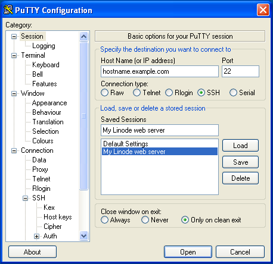
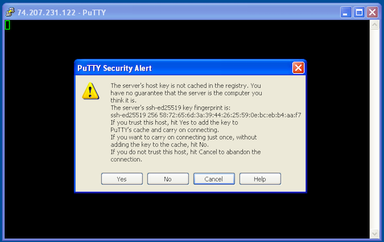
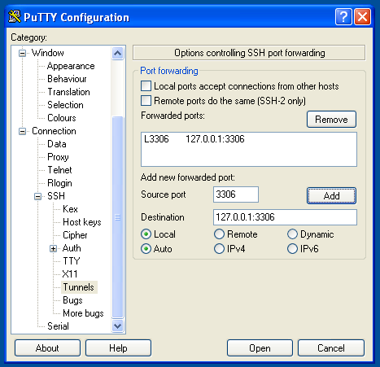

---
author:
  name: Linode
  email: docs@linode.com
description: 'Accessing remote servers with PuTTY, a free and open source SSH client for Windows and UNIX systems.'
keywords: ["putty", "putty ssh", "windows ssh client"]
license: '[CC BY-ND 4.0](https://creativecommons.org/licenses/by-nd/4.0)'
aliases: ['networking/using-putty/']
modified: 2018-08-20
modified_by:
  name: Linode
published: 2009-09-20
title: SSH Connections Using PuTTY on Windows
external_resources:
 - '[PuTTY Documentation](http://www.chiark.greenend.org.uk/~sgtatham/putty/docs.html)'
 - '[Xming Manual](http://www.straightrunning.com/XmingNotes/manual.php)'
---

PuTTY is a free and open source SSH client for Windows and UNIX systems. It provides easy connectivity to any server running an SSH daemon, so you can work as if you were logged into a console session on the remote system.

## Install PuTTY and Connect to a Remote Host

1.  Download and run the PuTTY installer from [here](http://www.chiark.greenend.org.uk/~sgtatham/putty/download.html).

1.  When you open PuTTY, you'll be shown the configuration menu. Enter the hostname or IP address of your Linode. PuTTY's default TCP port is `22`, the [IANA](https://en.wikipedia.org/wiki/Internet_Assigned_Numbers_Authority) assigned port for for SSH traffic. Change it if your server is listening on a different port. Name the session in the **Saved Sessions** text bar if you choose, and click **Save**:

    

1.  Click **Open** to start an SSH session. If you have never previously logged into this system with PuTTY, you will see a message alerting you that the server's SSH key fingerprint is new, and asking if you want to proceed.

    **Do not click anything yet! Verify the fingerprint first.**

    

1.  Use [Lish](/docs/networking/using-the-linode-shell-lish/) to log in to your Linode. Use the command below to query OpenSSH for your Linode's SSH fingerprint:

        ssh-keygen -E md5 -lf /etc/ssh/ssh_host_ed25519_key.pub

    The output will look similar to:

    
256 MD5:58:72:65:6d:3a:39:44:26:25:59:0e:bc:eb:b4:aa:f7  root@localhost (ED25519)


    
For the fingerprint of an RSA key instead of elliptical curve, use: `ssh-keygen -lf /etc/ssh/ssh_host_rsa_key.pub`.


1.  Compare the output from Step 4 above to what PuTTY is showing in the alert message in Step 3. **The two fingerprints should match.**

1.  If the fingerprints match, then click **Yes** on the PuTTY message to connect to your Linode and cache the host fingerprint.

    **If the fingerprints do not match, do not connect to the server!** You won't receive further warnings unless the key presented to PuTTY changes for some reason. Typically, this should only happen if you reinstall the remote server's operating system. If you receive this warning again from a system you already have the host key cached on, you should not trust the connection and investigate matters further.

## Port Forwarding (SSH Tunnels) with PuTTY

SSH tunnels allow you to access network services running on a remote server though a secure channel. This is useful in cases where the service you wish to access doesn't run over SSL, or you do not wish to allow public access to it. As an example, you can use tunneling to securely access a MySQL server running on a remote server.

To do so:

1.  In PuTTY's configuration window, go to the **Connection** category.
1.  Go to **SSH**, then **Tunnels**.
1.  Enter `3306` in the **Source port** field.
1.  Enter `127.0.0.1:3306` in the **Destination** field.
1.  Click **Add**, then click **Open** to log in:

    

Once you've connected to the remote server with this tunnel configuration, you'll be able to direct your local MySQL client to `localhost:3306`. Your connection to the remote MySQL server will be encrypted through SSH, allowing you to access your databases without running MySQL on a public IP.

## Run Remote Graphical Applications over SSH

PuTTY can securely run graphical applications hosted on a remote Linux server. You can run virtually any X11 application in this manner, and the connection will be encrypted through SSH, providing a safe means of interacting with remote graphical systems.

1.  You wll need an X11 server for Windows. Download and install [Xming](http://sourceforge.net/projects/xming/), a free X server for Windows. Accept the defaults presented by the installer and you'll be running an X11 server when the install process completes.

    
You will need the `xauth` package installed on your Linode for X11 forwarding to work correctly. It is installed by default on Debian and RedHat based systems, but may not be for other Linux distributions.


2.  Tell PuTTY to forward X11 connections to your desktop:

    1. In PuTTY's configuration window, make sure the remote server's hostname or IP, and the correct port, are entered on the **Session** category.
    1. In the **Connection** category, go to **SSH**, then **X11**.
    1. Check the box for **Enable X11 forwarding**.
    1. Enter `localhost:0` in the **X display location** field.
    1. Click **Open** to log in.

    

3.  Once you're logged into the remote server, you may start any graphical application hosted there. The application will be projected onto your local desktop. Here's the `xcalc` application running on a Windows desktop from a remote server:

    
