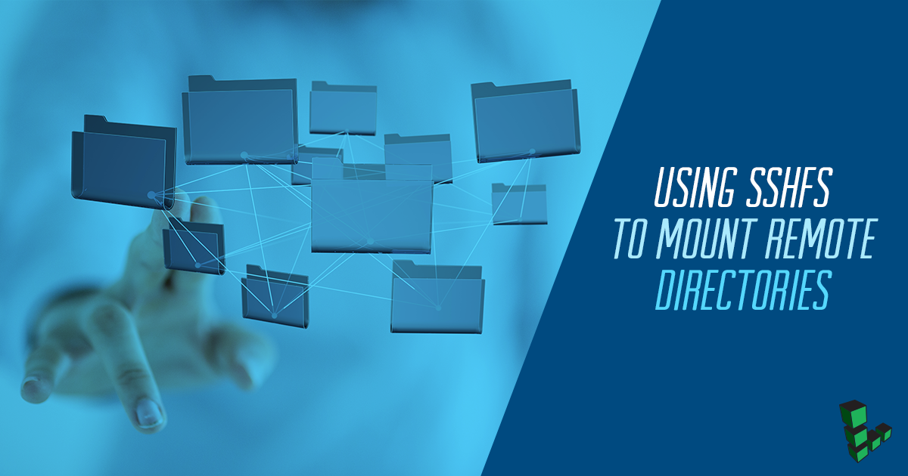

---
author:
  name: Linode
  email: docs@linode.com
description: 'Securely accessing remote filesystems with SSHFS on Linux.'
keywords: ["sshfs", "ssh filesystem", "sshfs linux", "sshfs macos"]
license: '[CC BY-ND 4.0](https://creativecommons.org/licenses/by-nd/4.0)'
aliases: ['networking/ssh-filesystems/','networking/ssh/using-sshfs-on-linux-and-macos-x/']
modified: 2019-01-23
modified_by:
  name: Angel Guarisma
published: 2009-10-26
title: Using SSHFS To Mount Remote Directories
external_resources:
 - '[SSHFS Home Page](http://fuse.sourceforge.net/sshfs.html)'
 - '[Linux Security Basics](/docs/security/basics)'
 - '[Use Public Key Authentication with SSH](/docs/security/use-public-key-authentication-with-ssh)'
---

# Using SSHFS To Mount Remote Directories

SSHFS (Secure Shell FileSystem), is a tool that allows users to securely access remote filesystems over the SSH protocol. This guide will get you started with SSHFS on your Linode. SSHFS can eliminate the need to use FTP/SFTP to transfer files to and from a remote server. For this guide you will need the SSH daemon running on your Linode. If you do not have the SSH daemon visit [Securing Your Server](/docs/security/securing-your-server) before returning to this guide.
For this guide we used two Ubuntu 16.10 systems, but `sshfs` can be installed on any Linode image.

### Install SSHFS

1. Before installing SSHFS, update your system:

        apt-get update && apt-get upgrade

1. Issue the following command to install sshfs:

        apt-get install sshfs

    
  The `sshfs` package is available with every Linux package manager. Use the commands specific to your distribution, if not using Debian or Ubuntu.
    

### Setting up your Linux Client

If you wish to use a normal user account to mount file systems using SSHFS, you'll need to add the user to the `fuse` group first.


If you are unfamiliar with users, groups and file permissions, visit the [Users and Groups](/docs/tools-reference/linux-users-and-groups) guide for a brief introduction.


1. To check if the `fuse` group exists run:

        cat /etc/group | grep 'fuse'

1. If the group exists, execute the following command with `sudo`, substituting your user account name in place of `username`:

        sudo usermod -a -G fuse username

1. If the group does not exist it has to be created and the user added to the `fuse` group:

        sudo groupadd fuse
        sudo usermod -a -G fuse username

    Log out and log back in before proceeding using a normal user account.

### Mounting the Remote File System
You can use the command `sshfs` to mount a remote filesystem. The syntax for mounting a filesystem with `sshfs` is:

    sshfs [user@]host:[directory] mountpoint [options]

1. To Mount the home directory of a user named `username` on a remote server at the IP address `192.0.2.0`, create a directory as a destination for the mounted folder.

        mkdir sshfs-dir

1. Then, use the `sshfs` command to mount the directory from the remote server to the directory on your local client:

        sshfs username@192.0.2.0:/home/user ssfhs-dir

1. To unmount the filesystem, use the `umount` command:

        umount sshfs-dir

    You can read more about `sshfs` in the [sshfs Manual](https://linux.die.net/man/1/sshfs).

### SSH Keys and Persistent Mounts

To keep your server's directory mounted on your system through reboots, you have to create a persistent mount.
Make sure you can access the remote server via SSH. The SSH Key is stored in the Linode's `authorized_keys` file.


If your system is older, this file may be named `authorized_keys2`. Consult your Linode's `/etc/ssh/sshd_config` if you are unsure.


Substitute values appropriate for your server in commands that include a hostname or user account name:

1. If your local client's user account doesn't already have an ssh key in `~/.ssh`, issue the same command on the client system, accepting the defaults:

        ssh-keygen -t rsa

1. Issue the following command on the client system to copy your public SSH key to the remote server:

        scp ~/.ssh/id_rsa.pub username@192.0.2.0:~/.ssh/authorized_keys

    At this point, you should be able to log into the remote server as `username` without entering a password.

1. You can force the mounted filesystem to remain persistent between reboots. This is done by including a mount directive for the remote user directory in `/etc/fstab`.

    
sshfs#username@192.0.2.0:/home/users /root/sshfsExample fuse defaults 0 0
    

    This entry will mount the home directory for "user" on the server "usersLinode.example.com" locally at `/root/sshfsExample` each time the system is booted. You may treat this entry like any other in `/etc/fstab`.

### Next Steps

After completing this guide you will be able to transfer files to a remote server from your local machine without using an FTP client. If you still want to learn how to use an FTP client, check out our guide: [Transfer Files with FileZilla](/docs/tools-reference/file-transfer/filezilla).
