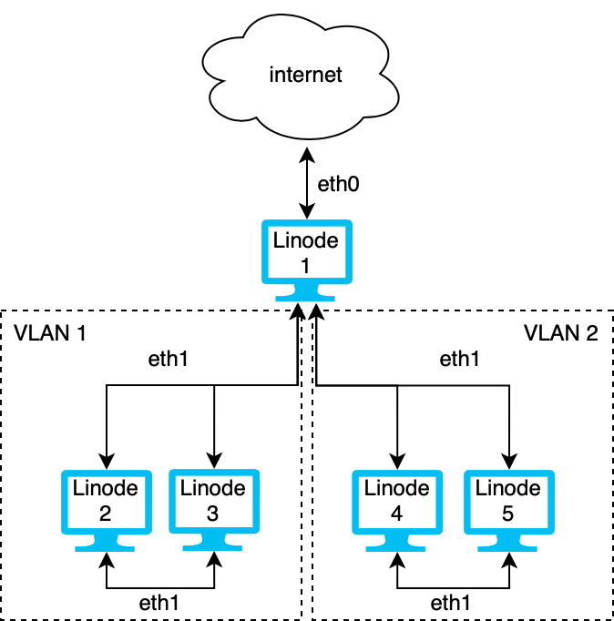
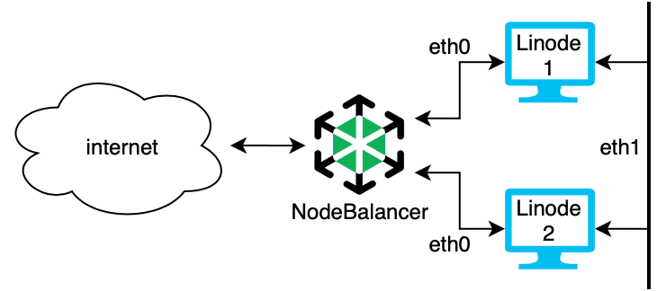

---
author:
  name: Linode Community
  email: docs@linode.com
description: 'Virtual Local Area Network (VLAN) is a private Layer 2 network. This means that two or more Linodes connected via the VLAN can see each other as if they were directly connected to the same physical Ethernet network.'
og_description: 'Virtual Local Area Network (VLAN) is a private Layer 2 network. This means that two or more Linodes connected via the VLAN can see each other as if they were directly connected to the same physical Ethernet network. This guide explains some common use cases for using Linode''s VLAN.'
image:
keywords: ['vlan','virtual local area network','use case']
license: '[CC BY-ND 4.0](https://creativecommons.org/licenses/by-nd/4.0)'
published: 2020-08-12
modified_by:
  name: Linode
title: "Common Linode VLAN Use Cases"
h1_title: "Common Use Cases for Linode VLAN"
contributor:
  name: Linode
---

## What is VLAN?

Virtual Local Area Network (VLAN) is a private [Layer 2](https://en.wikipedia.org/wiki/OSI_model#Layer_2:_Data_Link_Layer) network. This means that two or more Linodes connected via the VLAN can see each other as if they were directly connected to the same physical Ethernet network. This network supports all the logical Ethernet features like L2 broadcast and L2 multicast. Devices outside the network cannot see any traffic within the private network.

### Benefits

Linode's VLAN helps you create private LANs by creating a physical L2 network in the cloud where devices can communicate privately and securely.

## Use Cases

Some of the most popular use cases for VLAN are as follows.

### Secure Data and Traffic

If you have sensitive data on your network, you can use a VLAN to help keep it secure. By isolating the devices in the network with privileged data, you decrease the possibility of confidential information breaches. For example, the devices in an organization can be segmented into VLANs such as management, sales, support, guests, and others. The devices in one VLAN cannot directly access devices on another VLAN.

Likewise, the traffic in the VLAN is secure. All packets sent over the network in the VLAN are private and protected from access by anyone outside of the network.

#### Example: Web Server and Secure Database

In the diagram above, Linode 1 is a web server and has access to the internet over the `eth0` interface. It also has access to Linode 2 and the VLAN over the `eth1` interface. Linode 2 on the VLAN is a secure database that houses sensitive data. Communication between Linode 1 and 2 is transmitted over `eth1` and is secure and private.

#### Example: Kubernetes Cluster

In the diagram above, Linode 1 and 2 are both in a Kubernetes cluster. Both nodes have services exposed to the internet over the `eth0` interface and communication between Pods is kept private and secure on the VLAN over the `eth1` interface.

### Cost Effective Segmentation

VLANs reduce the cost of the networking by efficiently using the existing resources and bandwidth. For example, you can run a secure VLAN in the cloud that is protected from the rest of the internet without generating extra outbound network transfer costs since internal VLAN traffic is internal and private.

In the diagram above, Linode 1 has three virtual Ethernet NICs, one to the internet and two others to separate VLANs. The Linodes in VLAN 1 can communicate securely with each other. Likewise, the Linodes in VLAN 2 can communicate with each other. However, the Linodes in VLAN 1 and VLAN 2 cannot communicate with each other.

### Network Management

Traditional VLANs split L2 networks into multiple broadcast domains reduces unnecessary traffic on the network and increases network performance. Linode's VLAN works by creating a new physical L2 network to create a private network in the cloud.

#### Example: Add a NodeBalancer

You can increase performance and stability of your application by adding a [NodeBalancer](https://www.linode.com/products/nodebalancers/) while securing the communication between two dedicated servers. In the high availability system above, Linodes 1 and 2 both run the same web application. They both have a connection to the VLAN with the network interface `eth1` so they can communicate securely with each other and with Linode 3 which is a database. All communications made over `eth1` are private and secure. They are also connected to a NodeBalancer to manage the load over the `eth0` interface. The NodeBalancer directs traffic, maintains load balancing, and performs active health checks to make sure the system only directs traffic to healthy servers.

## Next Steps

If you're curious about how to setup and run your own VLAN on Linode, read the guide on [Building a Virtual Local Area Network (VLAN) on Linode](/docs/networking/vlan/how-to-build-a-vlan-on-linode).
