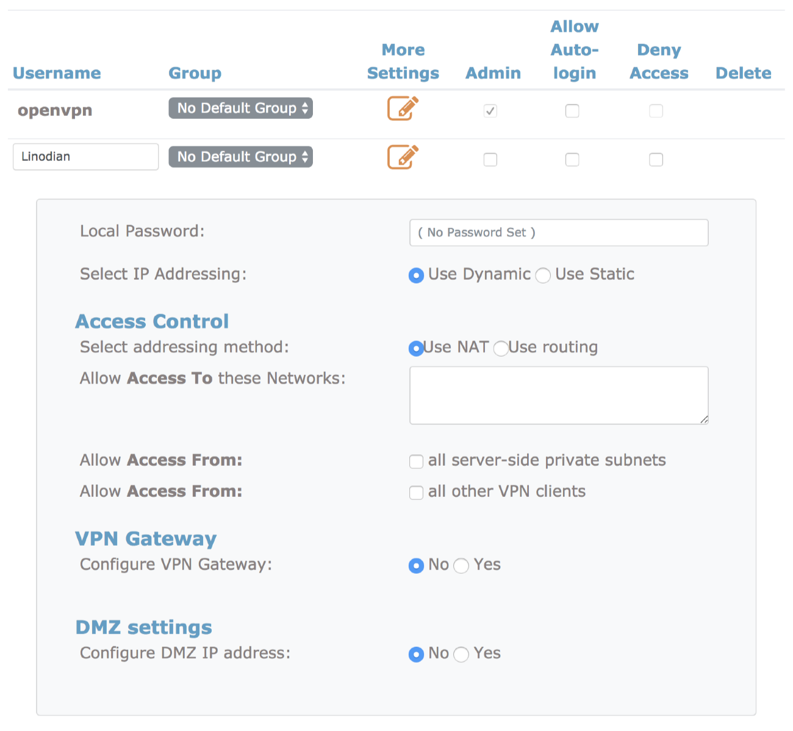
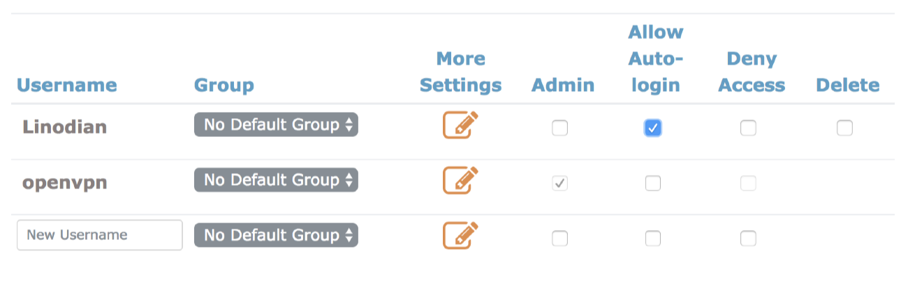

---
author:
    name: James Stewart
description: 'This guide will show how to install and configure an OpenVPN access server on Linux distributions for secure communications.'
keywords: ["openvpn", "vpn"]
aliases: ['networking/vpn/openvpn-access-server/','networking/vpn/configure-openvpn-access-server-to-tunnel-traffic/']
license: '[CC BY-ND 4.0](https://creativecommons.org/licenses/by-nd/4.0)'
modified: 2018-07-11
modified_by:
    name: Linode
published: 2015-04-30
title: Manage OpenVPN with OpenVPN Access Server
---

## What is OpenVPN?

OpenVPN is a popular software package which creates encrypted tunnels for secure data transfer.  In this guide, you will learn to configure your Linode as a VPN gateway using the OpenVPN Access Server software, and connect your Windows, macOS, or Linux computer to it.

Before installing OpenVPN Access Server, you will need to follow our [Getting Started](/docs/getting-started/) guide. We also suggest following our [Securing Your Server](/docs/security/securing-your-server/) guide.


After securing your server, ensure that TCP port `943` and UDP port `1194` are permitted through your firewall in order for the OpenVPN Access Server to function.


## Install OpenVPN Access Server

1.  Update the Linode to ensure that you have the latest packages, using your installed package manager.

2.  Create a new directory for the OpenVPN installer.

        mkdir openvpn
        cd openvpn

3.  Download the latest version of [OpenVPN Access Server](https://openvpn.net/index.php/access-server/download-openvpn-as-sw.html) for your distribution of choice.  Installation packages are provided for the listed distributions in supported package formats.  Install using the following commands, based on your system's package manager.

    Debian based systems (Debian/Ubuntu):

        sudo dpkg -i openvpn-as-*.deb

    RPM based systems(Fedora/CentOS/OpenSuse):

        sudo rpm --install openvpn-as-*.rpm

4.  Once the install process is complete, information on accessing the Admin and Client UI will be displayed.

        Access Server web UIs are available here:
        Admin  UI: https://192.0.2.1:943/admin
        Client UI: https://192.0.2.1:943/

    The Admin UI is where you configure the OpenVPN Access Server, while the Client UI is used to download the VPN packages to connect new client computers

5.  Set the password for the OpenVPN user.

        sudo passwd openvpn

## Configure OpenVPN Client Settings

1.  Connect to the Admin UI address shown at the end of the install process, using the password for your OpenVPN User.

    

2.  Click the **Client Settings** link, and ensure that all options besides "Offer server-locked profile" are checked.

    

3.  Once the changes to the settings have been saved, you will be prompted to update the running server.

    

### OpenVPN User Management

You can add additional users to your OpenVPN Access Server to enable auditing of connections to your VPN tunnel, and user level access control.


OpenVPN Access Server's free edition is limited to two users. If you require additional users for your VPN, you can view pricing details and purchase licenses at [OpenVPN's Website](https://openvpn.net/index.php/access-server/pricing.html)


1.  From the admin web interface, click the **User Permissions** link under User Management.

2.  Enter the new username that you wish to add in the `New Username` field at the bottom of the list.

    

3.  View and configure additional settings for the new user by clicking the **Show** link in the "More Settings" column.

    

4.  Click the **Save Settings** option at the bottom of the page to complete the creation of the new user account.

### Permit Autologin Profiles

If you wish to configure autologin profiles, you will need to modify your user settings to allow autologin profiles to be displayed on the connections page.


This configuration type can be useful for connecting other servers to your VPN on startup, or for configuring a system that will always route all of its traffic over the VPN automatically.  Utilizing this type of profile will cause all of your non-local traffic to be routed over the VPN automatically.  If you wish to enable and disable your VPN at will, you will want to utilize User or Server locked profiles instead.


1.  From the OpenVPN Access Server admin web interface, visit the User Permissions link.

2.  Fill in the check mark next to "Allow Auto Login" for the required user to enable this profile.

    

## Client Software Installation

### Windows

1.  Connect to the OpenVPN Access Server Client UI. Click the link to download the OpenVPN Connect software to your computer.

    

2.  When prompted, click run to kick off the installation process.

    

3.  Once the installation has completed, you should be presented with the OpenVPN login window. Your server's IP address should be pre-filled in.  You will need to enter the username and password of your OpenVPN user.

4.  You can utilize the OpenVPN icon located in your Windows taskbar to view the status of your VPN connection, and disconnect or reconnect to the VPN.

    

### macOS

1.  Connect to the OpenVPN Access Server Client UI, and click the link to download the OpenVPN Connect Software.

2.  Once the DMG package has downloaded, a Finder window will open with the Installer package icon.

    

3.  Double click the OpenVPN Connect installer package. A prompt will open requesting approval to open the package.  Click Open to continue with the installation.

    

4.  Once the installation process has completed, you will see an OpenVPN icon in your OSX taskbar. Right clicking this icon will bring up the context menu for starting your OpenVPN connection.

    

5.  Clicking Connect will bring up a window prompting for the OpenVPN username and password. Enter the credentials for your OpenVPN user and click Connect to establish a VPN tunnel.

    

### OpenVPN for Linux

1.  Download and install the OpenVPN client software using your distribution's package manager.

    CentOS:

        sudo yum install OpenVPN

    Debian/Ubuntu:

        sudo apt-get install openvpn

2.  Connect to the OpenVPN Access Server Client UI, and download the appropriate profile for your usage.

    

    
If you are connecting a headless machine to your OpenVPN server, such as another Linode, you will need to utilize the wget tool to download the appropriate profile.  You can do so by copying the link from the OpenVPN Access Server client page for your required profile, and then utilizing the [wget](/docs/tools-reference/tools/download-resources-from-the-command-line-with-wget) tool to download the client profile.


3.  Copy the downloaded profile to your `/etc/openvpn` folder, and rename it to `client.conf`. Replace `~/Downloads/client.ovpn` with the location of your download folder, if necessary.

        sudo cp ~/Downloads/client.ovpn /etc/openvpn/client.conf

4.  Start the OpenVPN Tunnel service. Unless you have configured and downloaded an autologin profile, you will be prompted for your OpenVPN user's username and password.

        sudo service openvpn start

5.  Run the ifconfig command to view your network connections. Once the VPN interface has come online, a `tun0` interface will be added to the list.

        ip addr

## Set Up OpenVPN Access Server for Tunneling

To configure OpenVPN for tunneling, you'll first need to log in to the Access Server Admin UI and navigate to the **VPN Settings** page.

1. In the **Routing** section, ensure that the option "Should client Internet traffic be routed through the VPN?" is set to **Yes**.

    

    The option "Should VPN clients have access to private subnets (non-public networks on the server side)?" can be set to **No**, since you are using the VPN to mask internet traffic. If you wish to give VPN users access to services listening on your Linode's local network, set this option to **Yes, using NAT**.

2. To avoid [DNS leaking](https://www.dnsleaktest.com/what-is-a-dns-leak.html), modify the DNS resolver settings. Under **DNS Settings**, select **Have clients use the same DNS servers as the Access Server host**.

    

    Alternatively, you can manually set the DNS resolvers that will be used by your VPN client machines, under **Have clients use these DNS servers**. This will require that you add both a primary and secondary server. Some popular public DNS servers to consider include:

    * Open DNS (primary: 208.67.222.222, secondary: 208.67.222.220)
    * Google Public DNS (primary: 8.8.8.8, secondary: 8.8.4.4)

    Once you've applied your changes, press **Save Settings**. You will be prompted to **Update Running Server** to push your new configuration to the OpenVPN server.

### Enable IP Forwarding

To connect additional private network devices behind your client machine and have their traffic forwarded through the VPN, you must first enable IP Forwarding. IP forwarding can be enabled by running these commands on your Linode, in order:

    echo 'net.ipv4.ip_forward=1' | sudo tee -a /etc/sysctl.d/99-sysctl.conf
    sudo sysctl -p

The first command enables traffic forwarding over IPv4 in your system configuration. The second command applies the change.

Once forwarding is enabled, restart OpenVPN by clicking on the **Stop the Server**, then **Start the Server** buttons under the **Status Overview** section in the Access Server Admin UI:

### Disable IPv6

Because OpenVPN does not support transfer over IPv4 and IPv6 simultaneously, you should follow our steps for [disabling IPv6](/docs/networking/vpn/set-up-a-hardened-openvpn-server#disable-ipv6), unless you have a specific reason not to do so.

## Test and Troubleshoot

Once you've [connected your client](/docs/networking/vpn/openvpn-access-server/#client-software-installation), you can use a website such as [WhatIsMyIP.com](http://www.whatismyip.com/) to confirm that your traffic is routing through the VPN server's address. You can also use [DNSLeakTest.com](https://www.dnsleaktest.com/) to ensure that your VPN connection is using the resolvers specified by your OpenVPN server to prevent leaking of your actual location via your ISP's resolvers.

### Compression

If you are connected to the VPN, but unable to browse the Internet, check the OpenVPN log located at `/var/log/openvpnas.log`. If you see entries similar to the following:

    2016-03-28 16:59:05+0800 [-] OVPN 11 OUT: 'Mon Mar 28 08:59:05 2016 guest/123.45.67.89:55385 Bad compression stub decompression header byte: 251'

This is likely an issue related to client compression. To resolve this, disable support for client compression from the **Advanced VPN** section in the Admin UI, by unchecking **Support compression on client VPN connections**:

