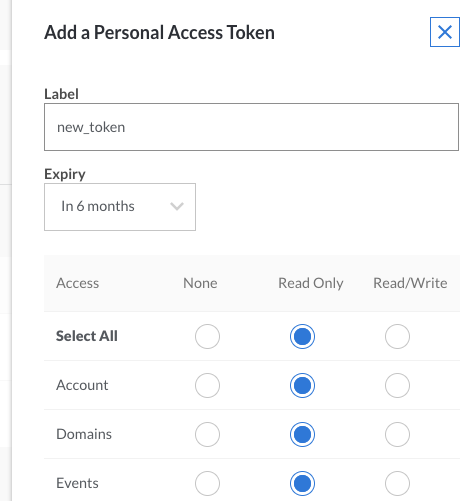

---
author:
  name: Jared Kobos
  email: docs@linode.com
description: 'This guide introduces the Linode API and demonstrates several basic queries. It also covers authentication and the process of creating a new Linode through the API.'
og_description: 'This guide introduces the Linode API and demonstrates several basic queries. It also covers authentication and the process of creating a new Linode through the API.'
keywords: ["linode api", "api v4", "access token"]
license: '[CC BY-ND 4.0](https://creativecommons.org/licenses/by-nd/4.0)'
modified: 2018-08-20
modified_by:
  name: Linode
published: 2018-04-03
title: Getting Started with the Linode API
external_resources:
  - '[API Documentation](https://developers.linode.com/v4/introduction)'
  - '[Linode CLI](https://github.com/linode/linode-cli)'
  - '[Linode API Python Library](https://github.com/linode/python-linode-api)'
shortguide: true
---

## Create a Linode Using the Linode API

The Linode API allows you to automate any task that can be performed by the Linode Manager, such as creating Linodes, managing IP addresses and DNS, and opening support tickets.

For example, this command creates a new 2GB Linode, deploys a Debian 9 image, and boots the system:

    curl -X POST https://api.linode.com/v4/linode/instances \
    -H "Authorization: Bearer $TOKEN" -H "Content-type: application/json" \
    -d '{"type": "g5-standard-2", "region": "us-east", "image": "linode/debian9", "root_pass": "root_password", "label": "prod-1"}'

This guide will help you get set up to run this example. Note that if you run this command, you will create and be [charged for a 2GB Linode](/pricing).

## Get an Access Token

Only authorized users can add Linodes and make changes to your account, and each request must be authenticated with an access token.

The easiest way to get a token is through the [beta Linode Manager](https://cloud.linode.com).

  
If you are building an application which will need to authenticate multiple users (for example, a custom interface to Linode's infrastructure for your organization), you can set up an [OAuth authentication flow](https://developers.linode.com/v4/access) to generate tokens for each user.


### Create an API Token

1.  Log in to the Manager and select the **API Tokens** tab from the **My Profile** menu:

    

    

2.  Click on **Add a Personal Access Token** and choose the access rights you want users authenticated with the new token to have. Privileges are cascading, so a token with *Create* access will also have *Modify* and *View* access.

    

    When you have finished, click **Submit** to generate an API token string. Copy the token and save it in a secure location. **You will not be able to view the token through the Manager after closing the popup.**

### Authenticate Requests

This token must be sent as a header on all requests to authenticated endpoints. The header should use the format:

    Authorization: Bearer <token-string>

Store the token as a temporary shell variable to simplify repeated requests. Replace `<token-string>` in this example:

    TOKEN=<token-string>

## Get Configuration Parameters

Specify the type, region, and image for the new Linode.

1.  Review the list of available images:

        curl https://api.linode.com/v4/images/

    Choose one of the images from the resulting list and make a note of the `id` field.

1.  Repeat this procedure to choose a type:

        curl https://api.linode.com/v4/linode/types/

1.  Choose a region:

        curl https://api.linode.com/v4/regions

## Build the Final Query

Replace the values in the command below with your chosen type, region, and image, and choose a label and secure password.

    curl -X POST https://api.linode.com/v4/linode/instances \
    -H "Authorization: Bearer $TOKEN" -H "Content-type: application/json" \
    -d '{"type": "g5-standard-2", "region": "us-east", "image": "linode/debian9", "root_pass": "root_password", "label": "prod-1"}'

## Advanced Query Options

### Pagination

If a results list contains more than 100 items, the response will be split into multiple pages. Each response will include the total number of pages and the current page. To view additional pages, add a `page` parameter to the end of the URL. For example, querying the available kernels produces more than 200 results:

    curl https://api.linode.com/v4/linode/kernels

  
{
    "results": 214,
    "page": 1,
    "data": [
        {
            "kvm": false,
            "architecture": "i386",
            "version": "2.6.28",
            "xen": true,
            "label": "2.6.28.3-linode17",
            "id": "linode/2.6.28.3-linode17",
            "pvops": true
        },
        {
            "kvm": false,
            "architecture": "i386",
            "version": "2.6.18",
            "xen": true,
            "label": "2.6.18.8-linode16",
            "id": "linode/2.6.18.8-linode16",
            "pvops": false
        },
    ]
        ...
    "pages": 3
}


The `pages` field indicates that the results are divided into three pages. View the second page:

    curl https://api.linode.com/v4/linode/kernels?page=2

If you prefer a smaller number of items per page, you can override the default value with the `page_size` parameter:

    curl https://api.linode.com/v4/linode/kernels?page_size=50

### Filter Results

The API also supports filtering lists of results. Filters are passed using the `X-Filter` header and use JSON format. You can filter on almost any field that appears in a response object and the [API documentation](https://developers.linode.com/v4/introduction) specifies which fields are filterable.

The following query uses the `deprecated` and `vendor` fields to return all current Debian images:

    curl https://api.linode.com/v4/images/ -H 'X-Filter: { "vendor": "Debian", "deprecated": false}'

  
{
    "page": 1,
    "pages": 1,
    "data": [
        {
            "size": 1024,
            "type": "manual",
            "label": "Debian 8",
            "created_by": "linode",
            "vendor": "Debian",
            "is_public": true,
            "created": "2015-04-27T20:26:41",
            "deprecated": false,
            "id": "linode/debian8",
            "description": ""
        },
        {
            "size": 1100,
            "type": "manual",
            "label": "Debian 9",
            "created_by": "linode",
            "vendor": "Debian",
            "is_public": true,
            "created": "2017-06-16T20:02:29",
            "deprecated": false,
            "id": "linode/debian9",
            "description": null
        }
    ],
    "results": 2
}


More complex searches are possible through the use of logical operators. Use `or` to return a list of all Debian and Ubuntu images:

    curl https://api.linode.com/v4/images/ -H "{"+or": [{"vendor":"Debian"}, {"vendor":"Ubuntu"}]}"

See the [Linode API documentation](https://developers.linode.com/v4/filtering) for a full list of supported operators.
