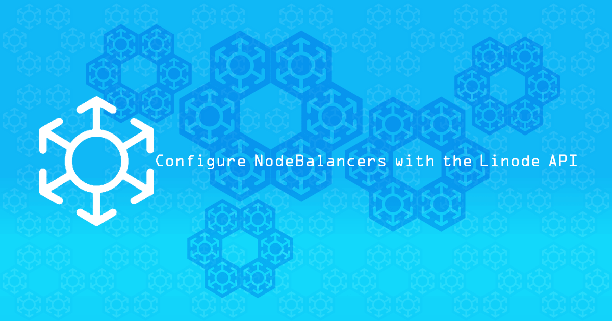

---
author:
  name: Linode
  email: docs@linode.com
description: 'Using the Linode API, it is possible to set up NodeBalancers without using the Linode Manager. This guide will demonstrate the API calls needed to add and configure a NodeBalancer with two back end nodes.'
og_description: 'Using the Linode API, it is possible to set up NodeBalancers without using the Linode Manager. This guide will demonstrate the API calls needed to add and configure a NodeBalancer with two back end nodes.'
keywords: ["nodebalancer", "load balancing", "high availability", "linode api"]
license: '[CC BY-ND 4.0](https://creativecommons.org/licenses/by-nd/4.0)'
aliases: ['linux-tools/common-commands/tail/']
modified: 2018-04-05
modified_by:
  name: Linode
published: 2018-04-05
title: Configure NodeBalancers with the Linode API
external_resources:
  - '[Getting Started with NodeBalancers](https://linode.com/docs/platform/nodebalancer/getting-started-with-nodebalancers/)'
---

[NodeBalancers](https://www.linode.com/nodebalancers) can be used to provide high availability load balancing for almost any type of website or service hosted on a Linode. This guide will demonstrate how to use the Linode API to create a NodeBalancer with two back end nodes.

You will need a Personal Access Token for the Linode API to complete the steps in this guide. The easiest way to get an access token is by visiting the beta [Linode Manager](https://cloud.linode.com/profile/tokens); for more information, as well as a basic introduction to using the Linode API, see our guide on [Getting Started with the Linode API](/docs/platform/api/getting-started-with-the-linode-api/).

## Create a NodeBalancer

1.  Store your Personal Access Token as a shell variable:

        export TOKEN=<token-string>

2.  Using a text editor, create a file to store configuration options:

    
{
  "region": "us-central",
  "label": "nodebalancer-1",
  "client_conn_throttle": 10
}


3.  Create a NodeBalancer by making a POST request to the `/nodebalancers` endpoint:

        curl https://api.linode.com/v4/nodebalancers \
        -H "Authorization: Bearer $TOKEN" \
        -H "Content-Type: application/json" \
        -X POST -d @nodebalancer.json

4.  If the NodeBalancer is successfully created, the response will include its ID. Copy the ID to use in subsequent requests.

## Add Configuration

NodeBalancers are created without any configuration profiles attached. Each profile configures a single port on the NodeBalancer. Once the port is configured, the NodeBalancer will begin listening for traffic on that port.

1.  Create a new configuration file:

    
{
  "label": "nodebalancer-1",
  "port": 80,
  "check": "connection"
  }


2.  Substitute the NodeBalancer's ID into the URL below:

        curl https://api.linode.com/v4/nodebalancers/$nodebalancer-id/configs \
        -H "Authorization: Bearer $TOKEN" \
        -H "Content-Type: application/json" \
        -X POST -d @nodebalancer-config.json


For more information about configuration options, see our [NodeBalancer Reference Guide](https://www.linode.com/docs/platform/nodebalancer/nodebalancer-reference-guide/).


## Add Nodes

Even with a working configuration profile, the NodeBalancer isn't doing anything yet, since it has no nodes connected to it. Repeat the steps in this section for each node you would like to add; usually you will want at least two nodes.

### Create Linodes

1.  Add the following options to a new config file. Adjust the type, image, and region to suit your needs; make sure the new Linode is in the same region as your NodeBalancer and choose a secure root password.

    
{
  "region": "us-central",
  "type": "g5-standard-2",
  "image": "linode/debian9",
  "root_pass": "password",
  "booted": false
}


2.  Use the API to create a Linode:

        curl https://api.linode.com/v4/linode/instances/ \
        -H "Authorization: Bearer $TOKEN" \
        -H "Content-Type: application/json" \
        -X POST -d @create-linode.json

    Make a note of the new Linode's ID.

3.  Add configuration options for adding a private IPv4 address:

    
{
  "type": "ipv4",
  "public": false,
  "linode_id": 7449584
}


4.  Add a private IP address to the new Linode:

        curl https://api.linode.com/v4/networking/ips \
        -H "Authorization: Bearer $TOKEN" \
        -H "Content-Type: application/json" \
        -X POST -d @ip-address.json

5.  Boot the Linode:

        curl -X POST https://api.linode.com/v4/linode/instances/$linode-id/boot \
        -H "Authorization: Bearer $TOKEN"

### Add Nodes to NodeBalancer

Add the new Linodes to the NodeBalancer's nodes.

1.  Add configuration options for adding nodes. Substitute the private IP address of the node into the `address` field and give each node a unique label.

    
{
  "label": "node-1",
  "address": "$node-private-ip:80"
  }


2.  Use the `/nodes` endpoint to add a node:

        curl https://api.linode.com/v4/nodebalancers/$nodebalancer-id/configs/$config-id/nodes \
        -H "Authorization: Bearer $TOKEN" \
        -H "Content-Type: application/json" \
        -X POST -d @add-node.json

3.  Repeat this process for each additional node.

## Check Node Status

Check the status of the two nodes:

    curl https://api.linode.com/v4/nodebalancers/$nodebalancer-id/configs/$config-id \
    -H "Authorization: Bearer $TOKEN"

  
. . .
  "nodes_status": {
      "up": 0,
      "down": 2
  },
. . .


Both nodes are down because there is no process for the NodeBalancer to connect to on the designated port. As a demonstration, a basic install of NGINX will listen on port 80 automatically. SSH into each node and install NGINX:

    apt update && apt upgrade && apt install nginx

If you check the NodeBalancer config again, it should report that both nodes are now up. You can also navigate to the NodeBalancer's public IP address in a browser; the default NGINX landing page should be displayed.

## Configure HTTPS

NodeBalancers can also be configured to use HTTPS. You will need to have a TLS certificate before enabling this option.

1. If you do not have an existing TLS certificate, generate a self-signed certificate using OpenSSL:

        openssl req -new -newkey rsa:4096 -x509 -sha256 -days 365 -nodes -out MyCertificate.crt -keyout MyKey.key

    
Provide values for country name, common name, etc. when prompted. The Linode API will reject the certificate if these are left blank.


2.  Edit your `nodebalancer-config.json` configuration file:

    
{
  "protocol":"https",
  "port": 443,
  "ssl_cert": <contents of MyCertificate.crt>,
  "ssl_key": <contents of MyKey.key>
}


3.  Use a PUT request to update your NodeBalancer's configuration:

        curl -X PUT https://api.linode.com/v4/nodebalancers/$nodebalancer-id/configs/$config-id \
        -H "Authorization: Bearer $TOKEN" \
        -H "Content-Type: application/json" \
        -d @nodebalancer-config.json
