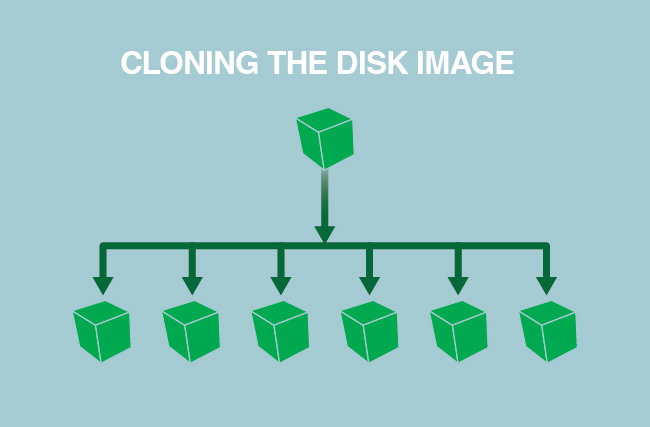

---
author:
  name: Linode
  email: docs@linode.com
description: Our guide to automating server builds with the Linode Manager.
keywords: ["server builds", "disks", "golden disk", "puppet", "chef"]
license: '[CC BY-ND 4.0](https://creativecommons.org/licenses/by-nd/4.0)'
modified: 2019-01-11
modified_by:
  name: Linode
published: 2013-06-28
title: Automating Server Builds
---

## Why You Should Automate Server Builds

Manually configuring systems is a good way to learn, but it's also a time consuming process which is prone to human error. There are multiple ways to automate deploying new systems and various degrees to which that automation can be applied.

For example, if your needs are relatively straightforward and concise, a shell script or Linode [StackScript](https://www.linode.com/stackscripts) could be all that is necessary. For more complex solutions, configuration orchestration and management exists to deploy and manage fleets of systems and services across multiple regions, networks, and service providers.

## Working with a Golden Image

Using a *golden image* as a configuration base is a frequent starting point in cloud environment automation. This helps quickly deploy multiple systems which are exactly identical. Across the industry, golden images are also referred to as *master*, *base*, or *clone* images, among other terms. Irrespective of name, the idea behind a golden disk is simple: create the desired image and preserve it for cloning/deploying to other servers, thereby simplifying the deployment process and eliminating configuration gap.

### Create a Golden Image

1. Create a new Linode.
1. Configure all packages, applications, and system settings as desired.
1. Remove any system users you don't want to appear on your duplicated systems.
1. Shut down the Linode and either:
    - [Duplicate the disk](/docs/platform/disk-images/disk-images-and-configuration-profiles/#duplicating-a-disk).
    - Alternatively, [take a snapshot](/docs/platform/disk-images/linode-backup-service/#take-a-manual-snapshot) of the disk with Linode Backups.
1. Store your golden image. This can be done in a variety of ways. A few examples are:
  - As a snapshot using [Linode Images](/docs/platform/disk-images/linode-images/) or [Linode Backups](/docs/platform/linode-backup-service/#take-a-manual-snapshot).
  - In a [version control](/docs/development/version-control/introduction-to-version-control/) system running on a remote or local server.
  - On [local](/docs/platform/disk-images/copying-a-disk-image-over-ssh/) storage.

### Restore a Golden Image

1. Copy the duplicate disk to your other Linodes, either using [the Linode API](https://developers.linode.com/api/v4#operation/cloneLinodeDisk) or [manually](/docs/platform/disk-images/copying-a-disk-image-to-a-different-account/#copying-the-disk). If you're using a Linode Backups snapshot, you would [restore it](/docs/platform/disk-images/linode-backup-service/#restore-from-a-backup) to the desired Linodes.
1. Create [configuration profiles](/docs/platform/disk-images/disk-images-and-configuration-profiles/#creating-a-configuration-profile) on those additional Linodes to boot using the duplicated disk.
1. Any user credentials from the golden image will also be on the duplicated disks so you should change the new system's root password.
1. Update the new Linode's [hostname](/docs/getting-started/#setting-the-hostname).
1. If your golden system was configured to use a static IP address, you'll also need to [reconfigure the IP address](/docs/networking/linux-static-ip-configuration/#static-network-configuration) on your duplicated disks.

## Third-Party Tools

Golden disks are capable of handling automated server builds for most individuals and small businesses, but if you work for a large business that manages dozens of Linodes, you may need to turn to third-party configuration management and orchestration tools, such as:

-   **Puppet:** An open source configuration management tool that manages systems declaratively. It can automates IT tasks like application configuration, patch management, and even infrastructure audit and compliance. See the following Puppet guides:

    - [Basic Puppet Setup and Configuration](/docs/websites/puppet/basic-puppet-setup-and-configuration/)
    - [Manage and Automate Systems Configuration with Puppet](/docs/websites/puppet/manage-and-automate-systems-configuration-with-puppet/)
    - [Use Puppet Modules to Create a LAMP Stack](/docs/applications/configuration-management/use-puppet-modules-to-create-a-lamp-stack/)
    - [Install and Manage MySQL Databases with Puppet Hiera on Ubuntu 16.04](/docs/applications/configuration-management/install-and-manage-mysql-databases-with-puppet-hiera-on-ubuntu-16-04/)

-   **Chef:** An open source configuration management tool used to turn your infrastructure into code. See the [Chef website](https://www.chef.io/) for more information. The [knife Linode](https://github.com/chef/knife-linode) subcommand can also be used to manage Linodes with Chef. See the following Chef guides to get started:

    
Knife Linode is based on Linode's deprecated APIv3.
    

    - [A Beginner's Guide to Chef](https://linode.com/docs/applications/configuration-management/beginners-guide-chef/)
    - [Creating Your First Chef Cookbook](/docs/applications/configuration-management/creating-your-first-chef-cookbook/)
    - [Install a Chef Server Workstation on Ubuntu 18.04](/docs/applications/configuration-management/install-a-chef-server-workstation-on-ubuntu-18-04/)

-   **Ansible:** An open source platform for configuring and managing systems. It works by connecting to your systems via SSH — it doesn't install anything on the remote systems. See the [AnsibleWorks website](http://www.ansible.com/) for more information. Read more about the [Linode Module from Ansible](http://docs.ansible.com/ansible/latest/linode_module.html) in the official documentation. To start using Ansible, check out the following guides:

    
The Linode Module from Ansible is based on Linode's deprecated APIv3.
    

    - [Getting Started With Ansible - Basic Installation and Setup](/docs/applications/configuration-management/getting-started-with-ansible/)
    - [Automate Server Configuration with Ansible Playbooks](/docs/applications/configuration-management/running-ansible-playbooks/)
    - [How to use the Linode Ansible Module to Deploy Linodes](/docs/applications/configuration-management/deploy-linodes-using-ansible/)

- **Salt:** Salt (also referred to as SaltStack) is a Python-based configuration management and orchestration system. Salt uses a master/client model in which a dedicated Salt master server manages one or more Salt minion servers. To learn more about Salt, see the following guides:

    - [A Beginner's Guide to Salt](https://www.linode.com/docs/applications/configuration-management/beginners-guide-to-salt/)
    - [Getting Started with Salt - Basic Installation and Setup](/docs/applications/configuration-management/getting-started-with-salt-basic-installation-and-setup/)
    - [SaltStack Command Line Reference](/docs/applications/configuration-management/salt-command-line-reference/)
    - [Introduction to Jinja Templates for Salt](/docs/applications/configuration-management/introduction-to-jinja-templates-for-salt/)
    - [Test Salt States Locally with KitchenSalt](/docs/applications/configuration-management/test-salt-locally-with-kitchen-salt/)
    - [Secrets Management with Salt](/docs/applications/configuration-management/secrets-management-with-salt/)
    - [Use and Modify Official SaltStack Formulas](/docs/applications/configuration-management/use-and-modify-official-saltstack-formulas/)
    - [Use Salt States to Configure a LAMP Stack on a Minion](/docs/applications/configuration-management/use-salt-states-to-configure-a-lamp-stack-on-a-minion/)
    - [Monitoring Salt Minions with Beacons](/docs/applications/configuration-management/monitoring-salt-minions-with-beacons/)
    - [Create a Salt Execution Module](/docs/applications/configuration-management/create-a-salt-execution-module/)
    - [Automate Static Site Deployments with Salt, Git, and Webhooks](/docs/applications/configuration-management/automate-a-static-site-deployment-with-salt/)
    - [Use Salt States to Create LAMP Stack and Fail2ban Across Salt minions](/docs/applications/configuration-management/use-salt-states-to-create-lamp-stack-and-fail2ban-across-salt-minions/)
    - [Configure and Use Salt Cloud and Cloud Maps to Provision Systems](/docs/applications/configuration-management/configure-and-use-salt-cloud-and-cloud-maps-to-provision-systems/)

- **Terraform:** Terraform by HashiCorp is an orchestration tool that allows you to represent your Linode instances and other resources with declarative code inside configuration files, instead of manually creating those resources via the Linode Manager or API. This practice is referred to as Infrastructure as Code, and Terraform is a popular example of this methodology.

    
The Terraform Linode provider is based on [Linode's APIv4](https://developers.linode.com/api/v4).
    

    - [A Beginner's Guide to Terraform](/docs/applications/configuration-management/beginners-guide-to-terraform/)
    - [Introduction to HashiCorp Configuration Language (HCL)](/docs/applications/configuration-management/introduction-to-hcl/)
    - [Use Terraform to Provision Linode Environments](/docs/applications/configuration-management/how-to-build-your-infrastructure-using-terraform-and-linode/)
    - [Import Existing Infrastructure to Terraform](/docs/applications/configuration-management/import-existing-infrastructure-to-terraform/)
    - [Secrets Management with Terraform](/docs/applications/configuration-management/secrets-management-with-terraform/)
    - [Create a NodeBalancer with Terraform](/docs/applications/configuration-management/create-a-nodebalancer-with-terraform/)
    - [Deploy a WordPress Site Using Terraform and Linode StackScripts](/docs/applications/configuration-management/deploy-a-wordpress-site-using-terraform-and-linode-stackscripts/)
    - [Create a Terraform Module](/docs/applications/configuration-management/create-terraform-module/)

There are plenty of other third-party configuration management tools to be used should the above options not suit your needs.

