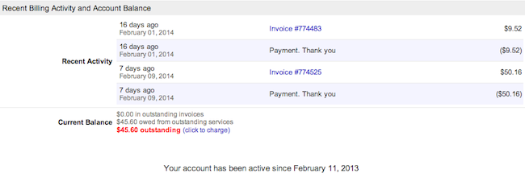

---
author:
  name: Linode
  email: docs@linode.com
description: Our guide to billing and payments.
keywords: ["billing", "payments"]
license: '[CC BY-ND 4.0](https://creativecommons.org/licenses/by-nd/4.0)'
modified: 2018-05-17
modified_by:
  name: Linode
published: 2014-02-28
title: Billing and Payments
cloud_manager_link: platform/billing-and-support/billing-and-payments/
hiddenguide: true
---

We've done our best to create straightforward billing and payment policies. Still have questions? Use this guide to learn how our hourly billing works and how to make payments, update your billing information, get referral credits, and remove services. If you have a question that isn't answered here, please feel free to [contact support](/docs/platform/billing-and-support/support/).

## How Hourly Billing Works

All services are billed automatically at the end of the month. If you used a service for the entirety of the past month, you'll be billed the **monthly cap** amount for that service. If you used a service for only part of the past month, you'll be billed at the **hourly** rate for that service. If your usage during any given month hits the monthly cap for the service, hourly billing stops. You'll never be billed more than the monthly cap for any service, excluding network [transfer overages](/docs/platform/billing-and-support/network-transfer-quota/#how-overages-work). In other words, if you've used a service for the entire month, you'll have a predictable amount on your bill.

## Linode Cloud Hosting and Backups

### Standard Plans

| Service      | Hourly Rate | Monthly Cap | Backups Hourly Rate | Backups Monthly
|:-------------|:------------|:--------|:--------------------|:---------------
| Linode 1GB   | $0.0075/hr  | $5/mo   | $0.003/hr           | $2/mo
| Linode 2GB   | $0.015/hr   | $10/mo  | $0.004/hr           | $2.50/mo
| Linode 4GB   | $0.03/hr    | $20/mo  | $0.008/hr           | $5/mo
| Linode 8GB   | $0.06/hr    | $40/mo  | $0.015/hr           | $10/mo
| Linode 16GB  | $0.12/hr    | $80/mo  | $0.03/hr            | $20/mo
| Linode 32GB  | $0.24/hr    | $160/mo | $0.06/hr            | $40/mo
| Linode 64GB  | $0.48/hr    | $320/mo | $0.12/hr            | $80/mo
| Linode 96GB   | $0.72/hr   |  $480/mo | $0.18/hr           | $120/mo  |
| Linode 128GB  | $0.96/hr    | $640/mo | $0.24/hr            | $160/mo
| Linode 192GB  | $1.44/hr    | $960/mo | $0.36/hr            | $240/mo

Full specs of each plan can be found on our [pricing page](https://www.linode.com/pricing#standard)

### High Memory Plans

| Service      | Hourly Rate | Monthly Cap | Backups Hourly Rate | Backups Monthly
|:-------------|:------------|:--------|:--------------------|:---------------
| Linode 24GB  | $0.09/hr    | $60/mo  | $0.0075/hr          | $5/mo
| Linode 48GB  | $0.18/hr    | $120/mo | $0.015/hr           | $10/mo
| Linode 90GB  | $0.36/hr    | $240/mo | $0.03/hr            | $20/mo
| Linode 150GB | $0.72/hr    | $480/mo | $0.06/hr            | $40/mo
| Linode 300GB | $1.44/hr    | $960/mo | $0.12/hr            | $80/mo

Full specs of each plan can be found on our [pricing page](https://www.linode.com/pricing#high_memory)

### Additional Linode Services

| Service          | Hourly Rate | Monthly
|:-----------------|:------------|:-------
| Additional IP    | $0.0015/hr  | $1/mo
| Linode Managed   | $0.15/hr    | $100/mo
| NodeBalancer     | $0.03/hr    | $20/mo
| Longview Pro 3   | $0.03/hr    | $20/mo
| Longview Pro 10  | $0.06/hr    | $40/mo
| Longview Pro 40  | $0.15/hr    | $100/mo
| Longview Pro 100 | $0.30/hr    | $200/mo


A large base amount of network transfer is included with all Linode plans, but exceeding that amount can result in a [transfer overage](#transfer-overages) charge beyond the monthly cap.

Due to the [impending exhaustion of the IPv4 address space](http://en.wikipedia.org/wiki/IPv4_address_exhaustion), Linode requires users to provide technical justification. To add another public IP address, please [contact support](/docs/platform/billing-and-support/support/) with your justification.


## Viewing Current Balance

To view your current balance, follow the steps below. This shows you the sum of all Linode services used so far in the month, down to the hour.

1.  Log in to the [Linode Manager](http://manager.linode.com).
2.  Select the **Account** tab.
3.  In the **Account** tab, in the **Recent Billing Activity and Account Balance** section, you can see the **Current Balance**:

    

Here, you can keep track of your outstanding balance. In the example above, the customer has used $45.60 worth of Linode services in the month so far. You can check this as frequently or infrequently as you wish. It gets updated every hour as you use and add Linode services.

## Mid-Month Billing

You may receive a mid-month bill from Linode if you reach a certain threshold of Linode services used within a single month. For many users, this amount will be **$50.00**, although your account history with Linode can adjust that amount. In general, a history of on-time payments to Linode will increase the threshold amount. In the example image in the previous section, the user received a mid-month bill for $50.16 on February 9th.

What does a mid-month bill mean? Your existing active services will stay active. However, you must pay the mid-month bill before you can activate additional Linode services. Once your payment is processed, you may continue adding new services.

## Tax Information

Review our [Tax Information](/docs/platform/billing-and-support/tax-information-classic-manager/) guide for information about which taxes Linode may charge.

## If My Linode is Powered Off, Will I Be Billed?

**If your Linode is powered off you will still be billed for it.** Linode maintains your saved data and reserves your ability to use other resources like RAM and network capacity, even when your Linode is powered off. You will also be billed for any other active Linode service, such as Longview Pro or extra IP's.

If you want to stop being billed for a particular Linode service, you need to [remove](#removing-services) it from your account entirely.

## Network Transfer Quota

Your *network transfer quota* represents the total monthly amount of traffic your services can use as part of your Linode plans' basic pricing. It is possible to use more traffic than your account's monthly transfer quota, and this will incur [overages](/docs/platform/billing-and-support/network-transfer-quota/#how-overages-work). For more information on your transfer quota, review the [Network Transfer Quota](/docs/platform/billing-and-support/network-transfer-quota) guide.

## Payment Methods

We accept Visa, MasterCard, Discover, and American Express. We also accept PayPal, as well as checks and money orders (which *must* be in USD) made out to "Linode, LLC" and sent to our [office address](http://www.linode.com/contact#contact-address). Please [contact support](/docs/platform/billing-and-support/support/) before paying with check or money order. Note that we do not accept bank/wire transfers.

The following video will show you how to make a payment via PayPal:




PayPal payments can only be made **after** an account is opened with an initial payment from a credit or debit card.


If you overpay, credit will be applied to your account; this allows you to prepay if desired. Service credit is always used before charging the credit card on file for ongoing service.

## Making a Payment

You can use the Linode Manager to pay an outstanding balance or prepay for Linode services. Here's how:

1.  Log in to the [Linode Manager](http://manager.linode.com).
2.  Click the **Account** tab.
3.  Click the **Make a Payment** tab.
4.  Enter the amount of money you would like to pay in the **Amount to Charge** field.
5.  Enter the CVV number on the back of you credit card in the **CVV** field.
6.  Click **Continue**. A verification prompt appears.
7.  Click **Charge Credit Card**.

The payment may take a few minutes to be applied to your account. Click the **Account** subtab to view your new account balance.

## Accessing Billing History

All of your billing history is stored in the Linode Manager. Here's how to access it:

1.  Log in to the [Linode Manager](http://manager.linode.com).
2.  Select the **Account** tab.
3.  Select the **Billing History** tab.

Select an invoice to view the charges for a particular month. You can also download invoices in PDF format.

## Referral Credits

You can receive service credit by referring new users to Linode. When you refer someone who maintains at least one active Linode for 90 days, your account will be issued a $20 service credit. Here's how to find your account referral code and URL:

1.  Log in to the [Linode Manager](http://manager.linode.com).
2.  Select the **my profile** link.
3.  Select the **Referrals** tab.
4.  The referral code and URL are listed under the **Referrals** section. You can provide the code to friends and use the URL on your website to generate referrals.

Referral service credits must be used to purchase Linode services, and cannot be refunded as cash.

## Updating Credit Card Information

Keep your credit card information up to date to prevent service interruptions. Here's how:

1.  Log in to the [Linode Manager](http://manager.linode.com).
2.  Click the **Account** tab.
3.  Click the **Update Credit Card** tab.
4.  Enter your credit card number and the card's expiration date.
5.  Click **Update Credit Card**.

Your credit card information will be updated.

 
If you have an outstanding balance, you will need to make a manual payment to bring your account up to date. See the [Making a Payment](#making-a-payment) section for more information.

 
A $1.00 authorization hold may be placed on your credit card by your banking institution when our payment processor tests the validity of the card. This is normal behavior and does not result in a charge on your card.


## Removing Services

Our services are provided without a contract, so you're free to remove services from your account at any time. Here's how:

1.  Log in to the [Linode Manager](http://manager.linode.com).
2.  To remove a Linode from your account, click the **Linodes** tab, and then select the **Remove** link next to the Linode you want to remove.
3.  To remove extras from your account, click the **Linodes** tab, select a Linode, click the **Extras** tab, and then select the **Remove** link.
4.  To remove a NodeBalancer from your account, click the **NodeBalancers** tab, and then select the **Remove** link next to the NodeBalancer you want to remove.
5.  To remove the Linode Backup Service, go to the **Backups** tab in your Linode's Dashboard, and click the **Cancel Backups** link at the bottom of the page.

## Canceling Your Account

You can cancel your account and receive a refund. Here's how:

1.  Log in to the [Linode Manager](http://manager.linode.com).
2.  Click the **Accounts** tab.
3.  At the bottom of the page, select the **Cancel this Account** link. The cancel account webpage appears.
4.  If you have a prepaid service credit on your account at the time of cancellation, you are entitled to a refund, minus a $5 processing fee. To request a refund, enter a note in the text field. Note that credits from sources other than prepaying cannot be refunded.
5.  Select the confirmation checkbox.
6.  Click the **Cancel this Account Immediately** checkbox.

Your account will be canceled and all of your services will be deactivated.


You do not have to cancel your account to prevent recurring charges. Instead, you can remove all Linodes and services from your account via the **Linodes** tab in the Linode Manager. This will allow you to retain your Linode account. If you use Longview with non-Linode services, or want to keep your account name and history, you may find this to be a useful option. See the [Removing Services](#removing-services) section for more information.


## Prepaid Billing

If you created your account before hourly billing was first available and have not converted to hourly billing, your account uses prepaid billing. Review the legacy [Prepaid Billing](/docs/platform/billing-and-support/prepaid-billing-and-payments-legacy/) guide for more information on how your bills and invoices are prepared.
