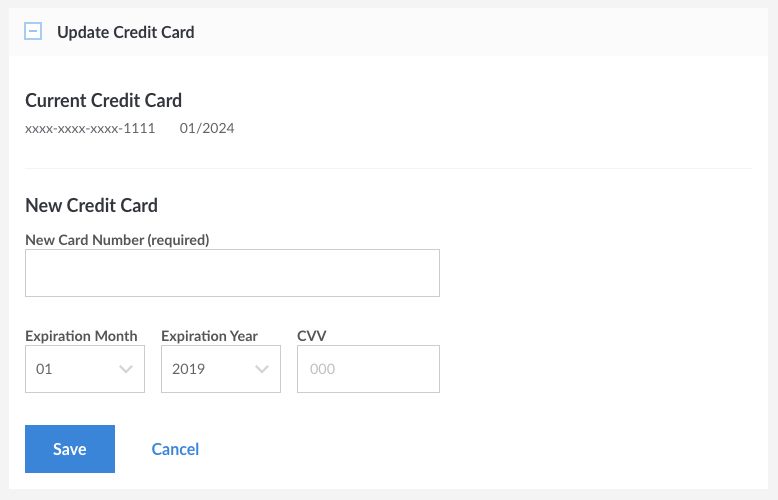

---
author:
  name: Linode
  email: docs@linode.com
description: Our guide to billing and payments.
keywords: ["billing", "payments","cancel account"]
license: '[CC BY-ND 4.0](https://creativecommons.org/licenses/by-nd/4.0)'
aliases: ['billing-and-payments/','platform/billing-and-payments/','platform/billing-and-support/billing-and-payments-new-manager/']
modified: 2018-05-17
modified_by:
  name: Linode
published: 2014-02-28
title: Billing and Payments
deprecated: true
classic_manager_link: platform/billing-and-support/billing-and-payments-classic-manager/
---


This guide has been updated and split into two:

- [How Linode Billing Works](/docs/platform/billing-and-support/how-linode-billing-works/)
- [Manage Billing in Cloud Manager](/docs/platform/billing-and-support/manage-billing-in-cloud-manager/)


We've done our best to create straightforward billing and payment policies. Still have questions? Use this guide to learn how our hourly billing works and how to make payments, update your billing information, get referral credits, and remove services. If you have a question that isn't answered here, please feel free to [contact support](/docs/platform/billing-and-support/support/).

## How Hourly Billing Works

All services are billed automatically at the end of the month. If you used a service for the entirety of the past month, you'll be billed the **monthly cap** amount for that service. If you used a service for only part of the past month, you'll be billed at the **hourly** rate for that service. If your usage during any given month hits the monthly cap for the service, hourly billing stops. You'll never be billed more than the monthly cap for any service, excluding network [transfer overages](/docs/platform/billing-and-support/network-transfer-quota/#how-overages-work). In other words, if you've used a service for the entire month, you'll have a predictable amount on your bill.

## Linode Cloud Hosting and Backups

Full specs of each plan can be found on our [pricing page](https://www.linode.com/pricing)

A large base amount of network transfer is included with all Linode plans, but exceeding that amount can result in a [transfer overage](/docs/platform/billing-and-support/network-transfer-quota/#how-overages-work) charge beyond the monthly cap.

Due to the [impending exhaustion of the IPv4 address space](http://en.wikipedia.org/wiki/IPv4_address_exhaustion), Linode requires users to provide technical justification in order to add extra public IPv4 addresses to an instance. If you need access to additional IPv4 addresses, please [contact Support](/docs/platform/billing-and-support/support/) with your justification.

## Object Storage

Review our [Object Storage Pricing and Limitations](/docs/platform/object-storage/pricing-and-limitations/) guide for information on Object Storage pricing and how Object Storage interacts with your account's network transfer pool.

## Network Transfer

Review our [Network Transfer Quota](/docs/platform/billing-and-support/network-transfer-quota/) guide for complete information and examples of how Linode bills for network transfer.

## Viewing Current Balance

To view your current balance, follow the steps below. This shows you the sum of all Linode services used so far in the month, down to the hour.

1.  Log in to the [Linode Cloud Manager](http://cloud.linode.com).
1.  Select **Account** from the sidebar links.
1.  On the right side you will see your **Billing Information** panel.

    

    **Amount Due** is the current invoiced balance and **Uninvoiced Balance** is the accrued balance that has not yet been invoiced for the month.

    Here, you can keep track of your outstanding balance. In the example above, the customer has accrued a $63.52 balance for Linode services this month so far, but it has not been invoiced yet. You can check this as frequently or infrequently as you wish. It gets updated every hour as you use and add Linode services.

## Mid-Month Billing

You may receive a mid-month bill from Linode if you reach a certain threshold of Linode services used within a single month. For many users, this amount will be **$50.00**, although your account history with Linode can adjust that amount. In general, a history of on-time payments to Linode will increase the threshold amount.

What does a mid-month bill mean? Your existing active services will stay active. However, you must pay the mid-month bill before you can activate additional Linode services. Once your payment is processed, you may continue adding new services.

## Tax Information

Review our [Tax Information](/docs/platform/billing-and-support/tax-information/) guide for information about which taxes Linode may charge.

## If My Linode is Powered Off, Will I Be Billed?

**If your Linode is powered off you will still be billed for it.** Linode maintains your saved data and reserves your ability to use other resources like RAM and network capacity, even when your Linode is powered off. You will also be billed for any other active Linode service, such as Longview Pro or extra IP addresses.

If you want to stop being billed for a particular Linode service, you need to [remove](#removing-services) it from your account entirely.

## Payment Methods

We accept Visa, MasterCard, Discover, and American Express. We also accept PayPal, as well as checks and money orders (which *must* be in USD) made out to "Linode, LLC" and sent to our [office](http://www.linode.com/contact). Please [contact Support](/docs/platform/billing-and-support/support/) before paying with check or money order. Note that we do not accept bank/wire transfers.

PayPal payments can only be made **after** an account is opened with an initial payment from a credit or debit card. PayPal cannot be used for automatic monthly payments. If you wish to pay your balance with PayPal, you'll need to log into [Cloud Manager](http://cloud.linode.com) and submit a manual payment.

If you overpay, credit will be applied to your account; this allows you to prepay if desired. Service credit is always used before charging the credit card on file for ongoing service.

## Making a Payment

You can use the Cloud Manager to pay an outstanding balance or prepay for Linode services. Here's how:

1.  Log in to the [Linode Cloud Manager](http://cloud.linode.com).
1.  Select **Account** from the sidebar links.
1.  Select **Account & Billing**.
1.  Expand the **Make a Payment** panel.

    

1.  Enter the amount of money you would like to pay in the **Amount to Charge** field.
1.  Enter the CVV number on the back of your credit card in the **CVV** field.
1.  Click **Confirm Payment**.

The payment may take a few minutes to be applied to your account.

## Accessing Billing History

All of your billing history is stored in the Cloud Manager. Here's how to access it:

1.  Log in to the [Linode Cloud Manager](http://cloud.linode.com).
1.  Select **Account** from the sidebar links.
1.  Select **Account & Billing**.
1.  Expand the **Recent Invoices** and **Recent Payments** panels.

Select an invoice to view the charges for a particular month. <!-- You can also download invoices in PDF format. -->

## Referral Credits

You can receive service credit by referring new users to Linode. When you refer someone who maintains at least one active Linode for 90 days, your account will be issued a $20 service credit. Here's how to find your account referral code and URL:

1.  Log in to the [Linode Cloud Manager](http://cloud.linode.com).
1.  Select the **My Profile** link by clicking on your username at the top of the page.
1.  Select the **Referrals** tab.
1.  The referral code and URL are listed under the **Referrals** section. You can provide the code to friends and use the URL on your website to generate referrals.

Referral service credits must be used to purchase Linode services, and cannot be refunded as cash.

## Updating Credit Card Information

Keep your credit card information up to date to prevent service interruptions. Here's how:

1.  Log in to the [Linode Cloud Manager](http://cloud.linode.com).
1.  Select **Account** from the sidebar links.
1.  Select **Account & Billing**.
1.  Expand the **Update Credit Card** box and enter your credit card number and the card's expiration date.
1.  Click **Save**. Your credit card information will be updated.

    

    
If you have an outstanding balance, you will need to make a manual payment to bring your account up to date. See the [Making a Payment](#making-a-payment) section for more information.

    
A $1.00 authorization hold may be placed on your credit card by your banking institution when our payment processor tests the validity of the card. This is normal behavior and does not result in a charge on your card.


## Removing Services

Our services are provided without a contract, so you're free to remove services from your account at any time. Here's how:

1.  Log in to the [Linode Cloud Manager](http://cloud.linode.com).
1.  To remove a Linode from your account, select **Linodes** from the sidebar links. Select the Linode you would like to remove, then select the **Settings** tab. Expand the **Delete Linode** panel and click **Delete**.
1.  To remove a NodeBalancer from your account, select **NodeBalancers** from the sidebar links. Open the menu of the NodeBalancer you would like to remove, then select **Remove**.
1.  To remove the Linode Backup Service, select **Linodes** from the sidebar links. Select the corresponding Linode. Under the **Backups** tab click the **Cancel Backups** button at the bottom of the page.

## Canceling Your Account

You can cancel your account at any time. Please note that when you cancel your account, any uninvoiced balance remaining on your account will be charged to your account's credit card. If you have any positive credit on your account at time of cancellation, then that credit will be used to pay for your uninvoiced balance.

1.  Log into [Cloud Manager](https://cloud.linode.com).
1.  Click the **Accounts** link in the sidebar.
1.  On the right of the page, select the **Close Account** link.
1.  A confirmation form will appear. Enter your Linode username in the first field and enter any comments you'd like to leave in the second field.
1.  Click the **Close Account** button to complete your account cancellation.

Your account will be canceled and all of your services will be deactivated.


You do not have to cancel your account to prevent recurring charges. Instead, you can remove all Linodes and services from your account via the **Linodes** tab in the Cloud Manager. This will allow you to retain your Linode account. If you use Longview with non-Linode services, or want to keep your account name and history, you may find this to be a useful option. See the [Removing Services](#removing-services) section for more information.

