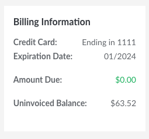
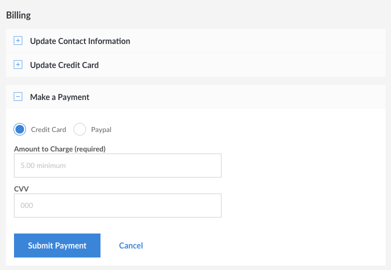
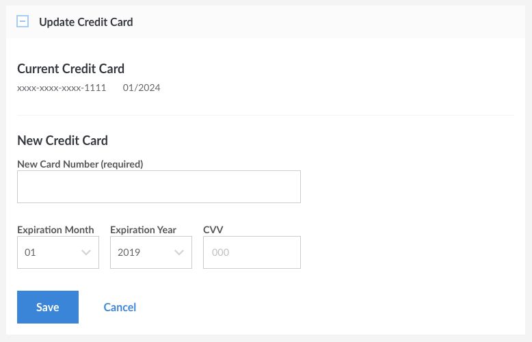

---
author:
  name: Linode
  email: docs@linode.com
description: Our guide to managing your bill in Cloud Manager.
keywords: ["billing", "payments","cancel account"]
license: '[CC BY-ND 4.0](https://creativecommons.org/licenses/by-nd/4.0)'
modified_by:
  name: Linode
published: 2019-10-25
title: Manage Billing in Cloud Manager
---

We've done our best to create straightforward billing and payment policies. Still have questions? Use this guide to learn how to make payments, update your billing information, and remove services. To learn how billing works see the [How Linode Billing Works](/docs/platform/billing-and-support/how-linode-billing-works/) guide. If you have a question that isn't answered in either guide, please feel free to [contact Support](/docs/platform/billing-and-support/support/).

## Viewing Current Balance

To view your current balance, follow the steps below. This shows you the sum of all Linode services used so far in the month, down to the hour.

1.  Log in to the [Linode Cloud Manager](http://cloud.linode.com).
1.  Select **Account** from the sidebar links.
1.  On the right side you will see your **Billing Information** panel.

    

    **Amount Due** is the current invoiced balance and **Uninvoiced Balance** is the accrued balance that has not yet been invoiced for the month.

    Here, you can keep track of your outstanding balance. In the example above, the customer has accrued a $63.52 balance for Linode services this month so far, but it has not been invoiced yet. You can check this as frequently or infrequently as you wish. It gets updated every hour as you use and add Linode services.

## Making a Payment

You can use the Cloud Manager to pay an outstanding balance or prepay for Linode services. Here's how:

1.  Log in to the [Linode Cloud Manager](http://cloud.linode.com).
1.  Select **Account** from the sidebar links.
1.  Select **Account & Billing**.
1.  Expand the **Make a Payment** panel.

    

1.  Enter the amount of money you would like to pay in the **Amount to Charge** field.
1.  Enter the CVV number on the back of your credit card in the **CVV** field.
1.  Click **Confirm Payment**.

The payment may take a few minutes to be applied to your account.

## Updating Credit Card Information

Keep your credit card information up to date to prevent service interruptions. Here's how:

1.  Log in to the [Linode Cloud Manager](http://cloud.linode.com).
1.  Select **Account** from the sidebar links.
1.  Select **Account & Billing**.
1.  Expand the **Update Credit Card** box and enter your credit card number and the card's expiration date.
1.  Click **Save**. Your credit card information will be updated.

    

    
If you have an outstanding balance, you will need to make a manual payment to bring your account up to date. See the [Making a Payment](#making-a-payment) section for more information.

    
A $1.00 authorization hold may be placed on your credit card by your banking institution when our payment processor tests the validity of the card. This is normal behavior and does not result in a charge on your card.


## Accessing Billing History

All of your billing history is stored in the Cloud Manager. Here's how to access it:

1.  Log in to the [Linode Cloud Manager](http://cloud.linode.com).
1.  Select **Account** from the sidebar links.
1.  Select **Account & Billing**.
1.  Expand the **Recent Invoices** and **Recent Payments** panels.

Select an invoice to view the charges for a particular month. <!-- You can also download invoices in PDF format. -->

## Removing Services

Our services are provided without a contract, so you're free to remove services from your account at any time. Here's how:

1.  Log in to the [Linode Cloud Manager](http://cloud.linode.com).
1.  To remove a Linode from your account, select **Linodes** from the sidebar links. Select the Linode you would like to remove, then select the **Settings** tab. Expand the **Delete Linode** panel and click **Delete**.
1.  To remove a NodeBalancer from your account, select **NodeBalancers** from the sidebar links. Open the menu of the NodeBalancer you would like to remove, then select **Remove**.
1.  To remove the Linode Backup Service, select **Linodes** from the sidebar links. Select the corresponding Linode. Under the **Backups** tab click the **Cancel Backups** button at the bottom of the page.

## Canceling Your Account

You can cancel your account at any time. Please note that when you cancel your account, any uninvoiced balance remaining on your account will be charged to your account's credit card. If you have any positive credit on your account at time of cancellation, then that credit will be used to pay for your uninvoiced balance.

1.  Log into [Cloud Manager](https://cloud.linode.com).
1.  Click the **Accounts** link in the sidebar.
1.  On the right of the page, select the **Close Account** link.
1.  A confirmation form will appear. Enter your Linode username in the first field and enter any comments you'd like to leave in the second field.
1.  Click the **Close Account** button to complete your account cancellation.

Your account will be canceled and all of your services will be deactivated.


You do not have to cancel your account to prevent recurring charges. Instead, you can remove all Linodes and services from your account via the **Linodes** tab in the Cloud Manager. This will allow you to retain your Linode account. If you use Longview with non-Linode services, or want to keep your account name and history, you may find this to be a useful option. See the [Removing Services](#removing-services) section for more information.

