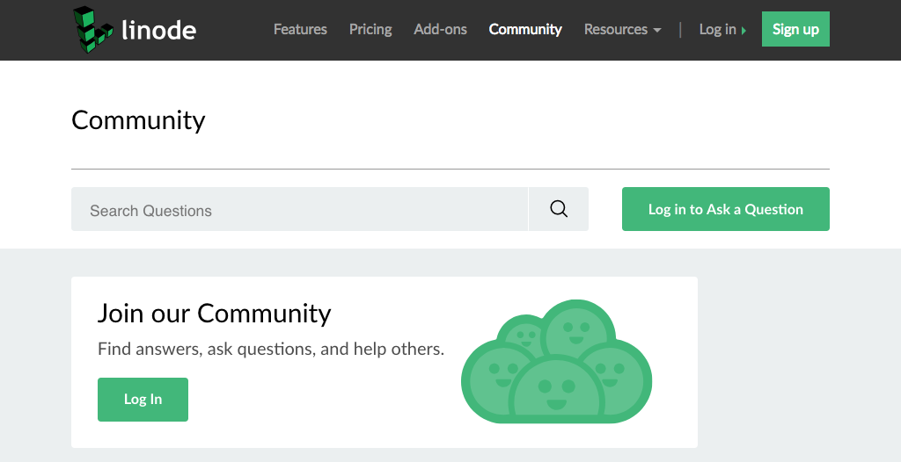
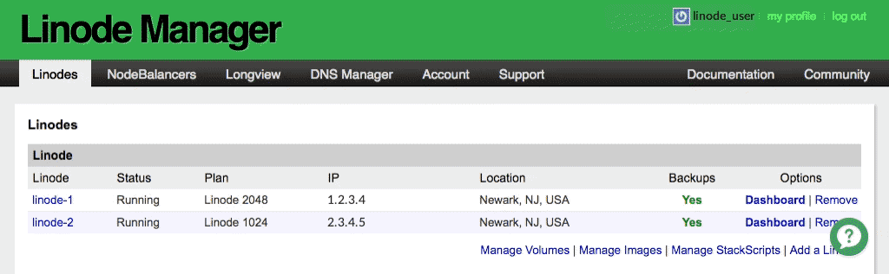

---
author:
  name: Linode
  email: docs@linode.com
description: Our guide to submitting support tickets and getting technical support.
keywords: ["support", "tech support", "tickets", "help desk"]
license: '[CC BY-ND 4.0](https://creativecommons.org/licenses/by-nd/4.0)'
modified: 2019-01-07
modified_by:
  name: Linode
published: 2012-03-21
title: Linode Support
cloud_manager_link: platform/billing-and-support/support/
hiddenguide: true
---

Linode provides live technical support services 24 hours a day, 7 days a week. Linode Support ensures network availability, verifies that you can access your Linode, resolves performance issues with hosts, and works to fix any service-related issues you may be experiencing.

Linode also offers a number of resources you can refer to when troubleshooting application and server configuration issues. These issues are generally outside the scope of Linode Support, and the other resources Linode provides can help you find solutions for your questions.

## Resources

Linode provides community spaces, an AI-powered assistant, libraries of reference material, and status updates for infrastructure components:

-   **Linode Community and the Community Site:** Customers and staff discuss the projects they're working on in the [Linode Community Site](/community/). You can search this site to see if your issue has already been addressed there. If you can't find any existing posts related to your issue, you can create a new one or ask your question in the [IRC channel](/chat/).

    

-   **Linode Support Bot:** The Linode Support Bot can answer a number of technical, billing, and account management questions, and it learns new answers every day. If the Linode Support Bot does not know an answer, it can create a support ticket for you. This feature is available from the Linode Manager by clicking the green and white question mark button in the bottom right corner of the page. After clicking this button, a chat panel will slide in from the right side of the page:

    

-   **Linode Guides & Tutorials:** The [Guides & Tutorials](/docs/) library hosts a catalogued and searchable list of guides on a large number of topics. Here are a few that focus on troubleshooting:

  - The [Troubleshooting](/docs/troubleshooting/troubleshooting/) quick start guide provides answers for common server connectivity and management issues.

  - The [Linode Beginner's Guide](/docs/platform/billing-and-support/linode-beginners-guide/) displays a curated list of the most frequently asked questions from Linode customers.

  - The [Quick Answers](/docs/quick-answers/) section offers short guides with fast answers.

-   **Network Status:** If a data center experiences downtime, Linode's staff will regularly update the [Status webpage](http://status.linode.com/) until the issue has been resolved.

## Scope of Support

As declared in Linode's [Terms of Service](https://www.linode.com/tos), the Linode Support Team does not provide support regarding the installation or configuration of application software, such as mail and web server software, nor does it provide support regarding the configuration of Linux on your server. For these issues, please consult the various other [resources](#resources) Linode makes available. If you are providing a service to your customers, Linode does not offer tech support for those customers.

Linode provides support related to the physical operation of your Linode virtual servers, such as: ensuring that your network traffic is properly routed to and from your Linodes' IP addresses; helping with base system performance issues that may be related to Linode's virtualization systems; and resolving potential hardware issues within Linode's infrastructure.

Linode also helps with products such as NodeBalancers and Block Storage. Additionally, Linode Support can help you use Linode software such as the Linode Manager, and can help you with understanding and paying your bill.

## Contacting Linode Support

If you are not able to solve an issue with the resources listed above, you can contact Linode Support. As a reminder, application configuration and other similar topics are outside the [scope of Linode Support](#scope-of-support). The primary method for contacting Linode Support is to open a support ticket from the Linode Manager:

1.  Log in to the [Linode Manager](https://manager.linode.com).
2.  Select the **Support** link.
3.  Select the **Open a new Support Ticket** link. A support ticket form will appear at the bottom of the page that loads.
4.  Enter a summary of your issue in the **Summary** field of this form.
5.  From the **Regarding** menu, select an option related to the issue you are reporting.
6.  Enter a description of the problem in the **Description** field. Please provide as many details as possible.
7.  Click **Open Ticket**.

The Linode Support Team will respond as soon as possible.

If you are having difficulty logging in to the Linode Manager and opening a support ticket, you can email Linode Support at <support@linode.com>. You can also call Linode 24 hours a day at **(609) 380-7100** (international) or **(855) 454-6633** (North America toll-free). If your call is diverted to voicemail, please leave a detailed message explaining your problem. Your call will be returned as quickly as possible.

## Reporting Abuse

Email <abuse@linode.com> to report network abuse, unauthorized access attempts, or spam originating from the Linode platform. Please forward spam with the full headers intact, and include logs documenting unauthorized access.
