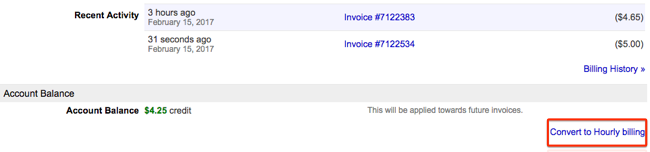
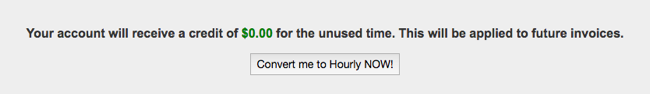
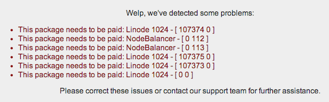
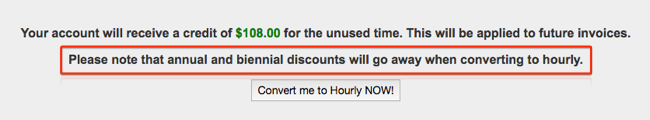

---
author:
  name: Linode
  email: docs@linode.com
description: Convert your prepaid account to Hourly billing
keywords: ["prepaid", "billing", "payments", "hourly"]
license: '[CC BY-ND 4.0](https://creativecommons.org/licenses/by-nd/4.0)'
aliases: ['platform/upgrade-to-hourly-billing/']
modified: 2017-02-15
modified_by:
  name: Linode
published: 2017-02-15
title: 'Upgrade to Hourly Billing'
deprecated: true
---

This guide will show you how to upgrade your legacy prepaid billing Linode account to use Hourly billing. For more information on Hourly billing, see our [Billing Guide](/docs/platform/billing-and-support/billing-and-payments/).

## Upgrading

To upgrade to the Hourly billing system, follow these steps:

1.  Log in to the [Linode Manager](http://manager.linode.com).
2.  Click the **Account** tab.
3.  From the **Account** tab, select the **Convert to Hourly billing** link in the lower right.

    

4.  You'll be taken to a page with a brief overview of the Hourly billing system. If you have any prepaid amounts on your account from the current month or year, you will receive that amount as a credit on your account to be used toward future invoices. Click the **Convert me to Hourly NOW!** button to finalize the conversion.

    

5.  You will receive a confirmation message that your account has been converted to Hourly billing.

    
- Prepaid discounts will not carry over to the new system


## Possible Notices

When you select the **Convert to Hourly billing** link in Step 3 above, you may receive an error or notice. For example, this account has several notices that **This package needs to be paid**:

To resolve unpaid packages, you can:

-   Check for unpaid invoices, and attempt to pay them immediately. Use the **click to charge** link on the main **Account** tab
-   Check for **extras** packages, and [remove](/docs/platform/billing-and-support/billing-and-payments/#removing-services) them manually
-   [Contact support](/docs/platform/billing-and-support/support/) for other notices on this page

You will no longer receive the annual discount when you switch to Hourly billing. If you have a discounted package on your account, you will receive this notice:

On March 31st, 2019 all prepaid accounts will be automatically converted to to Hourly billing.
