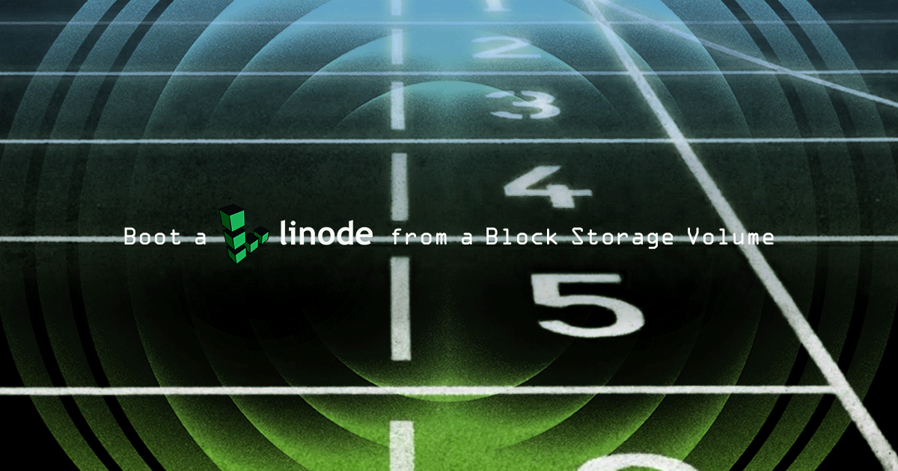
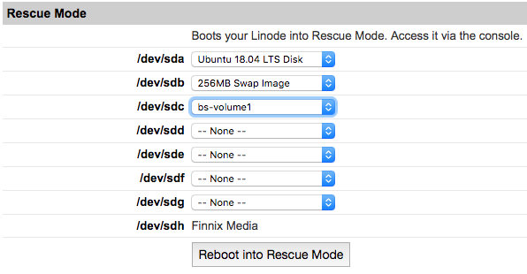
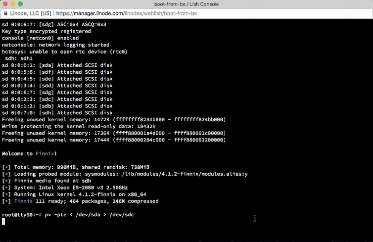
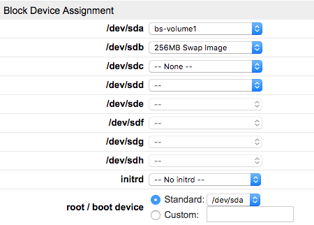

---
author:
  name: Linode
  email: docs@linode.com
description: "This guide shows how to boot a Linode from a Block Storage Volume."
og_description: "This guide shows how to boot a Linode from a Block Storage Volume."
keywords: ["block storage","volume","media","storage","disk", "boot", "boot disk"]
license: '[CC BY-ND 4.0](https://creativecommons.org/licenses/by-nd/4.0)'
modified: 2018-12-19
modified_by:
  name: Linode
published: 2018-05-04
title: Boot a Linode from a Block Storage Volume
---

<!--  -->

Linode’s Block Storage service allows you to attach additional storage volumes to your Linode. In addition to storing files and media, you can also use a Block Storage Volume as a boot disk. This can provide a low-cost way to maintain an image that can be quickly attached to a new Linode and booted up when needed.

This guide shows how to create a duplicate of a primary disk to be booted from a Block Storage Volume. Once complete, the Linode can be booted from the Block Storage Volume. The process may be reversed in order to restore the primary disk from the Block Storage backup.

## Create the Block Storage Volume

Create a Block Storage Volume and attach it to the target Linode. Ensure that the Volume is the same size as, or larger than, the primary disk and in the same data center as the Linode. Failure to ensure the Volume is the right size will result in an error.

Visit our [Block Storage guide](/docs/platform/how-to-use-block-storage-with-your-linode/) to create a Block Storage Volume.

## Duplicate a Primary Disk to a Block Storage Volume

1.  Reboot into Rescue Mode and mount the Block Storage Volume as `/dev/sdc` as shown below. Visit our [Rescue and Rebuild guide](/docs/troubleshooting/rescue-and-rebuild/#booting-into-rescue-mode) for more information on booting into Rescue Mode.

    

    Connect to the Linode via [Lish](/docs/platform/manager/using-the-linode-shell-lish/).

2.  Use `fdisk` to make sure your primary disk and Block Storage Volume are available as `dev/sda` and `dev/sdc`, respectively:

        fdisk -l

3.  Use pv to copy the contents of the primary disk to the Block Storage Volume. The options `-pte` display progress, elapsed time, and estimated time remaining and may be omitted:

        pv -pte < /dev/sda > /dev/sdc

    

## Set the Block Storage Volume as Primary and Reboot

1.  In the Linode Manager, shut the Linode down.

2.  Edit the configuration profile and set `/dev/sda` to the Block Storage Volume. Change `/dev/sdc` to `-- None --`. Click **Save Changes**

    

3.  Boot the Linode.

The Linode should boot normally from the Block Storage Volume. Keep in mind that Block Storage may not be as fast as the SSD disks and performance may be affected. Check the Lish console for status updates.
