---
author:
  name: Linode
  email: docs@linode.com
description: This tutorial explains how to use Linode's block storage service.
keywords: ["block storage", " volume", "media", "resize", "storage", "disk"]
license: '[CC BY-ND 4.0](https://creativecommons.org/licenses/by-nd/4.0)'
modified: 2018-02-01
modified_by:
  name: Linode
published: 2017-06-16
title: How to Use Block Storage with Your Linode
cloud_manager_link: platform/block-storage/how-to-use-block-storage-with-your-linode/
hiddenguide: true
---

Linode’s Block Storage service allows you to attach additional storage volumes to your Linode. A single volume can range from 10 GiB to 10,000 GiB in size and costs $0.10/GiB per month. They can be partitioned however you like and can accommodate any filesystem type you choose. Up to eight volumes can be attached to a single Linode, be it new or already existing, so you do not need to recreate your server to add a Block Storage Volume.

The Block Storage service is currently available in the Dallas, Fremont, Frankfurt, London, Newark, Tokyo, Toronto, Mumbai, and Singapore data centers.


-  Linode's backup services do not cover Block Storage Volumes. You must execute [your own backups](/docs/security/backups/backing-up-your-data/) for this data.

-  Your Linode must be running in Paravirtualization mode. Block storage currently does not support Full-virtualization.


## How to Add a Block Storage Volume to a Linode

This guide assumes a Linode with the root disk mounted as `/dev/sda` and swap space mounted as `/dev/sdb`. In this scenario, the Block Storage Volume will be available to the operating system as `/dev/disk/by-id/scsi-0Linode_Volume_EXAMPLE`, where `EXAMPLE` is a label you assign the volume in the Linode Manager. Storage volumes can be added when your Linode is already running, and will show immediately in `/dev/disk/by-id/`.

### Add a Volume from the Linode Dashboard

1.  Go to the dashboard page of the Linode to which you want to attach a Block Storage Volume. Select **Create a new Volume**:

    [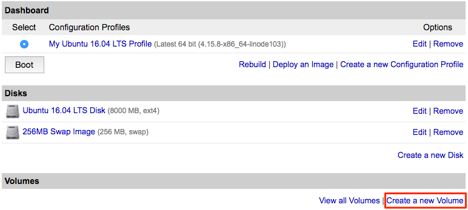](bs-manager-create-new-volume.png)

2.  Assign the Block Storage Volume a label and size. The label can be up to 32 characters long and consist only of ASCII characters `a-z; 0-9.-_`. The maximum volume size is 10,000 GiB. When finished, click *Add this Volume!*:

    [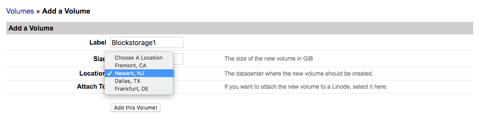](bs-add-a-volume.png)

    
There is currently a soft limit of 100 TB of Block Storage Volume per account.


3.  Once you add a volume, you'll be presented with the Volume Attached page as shown below. This page provides customized instructions which show you how to make a filesystem in your volume from any of our supported Linux distributions. The page shows how to mount the volume, and how to add it to `/etc/fstab` so it's mounted automatically whenever you reboot your Linode:

    [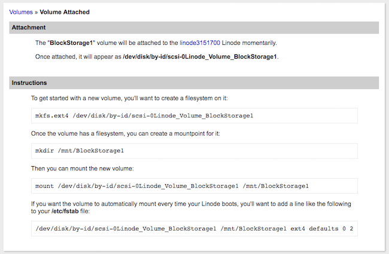](bs-volume-instructions.png)

4.  If your Linode is not already running, boot and SSH into your Linode to execute the commands as shown on the instructions page. If you need to see the volume mount instructions again, click **Edit** to the right of the volume in that Linode's dashboard:

    [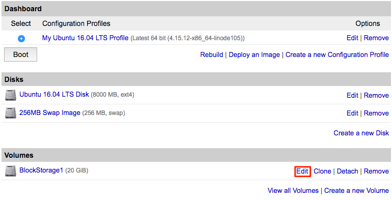](bs-edit.png)

### Add a Volume from Your Account's Volume List

1.  In the **Linodes** tab of Linode manager, click **Manage Volumes** to see your account's volume list:

    [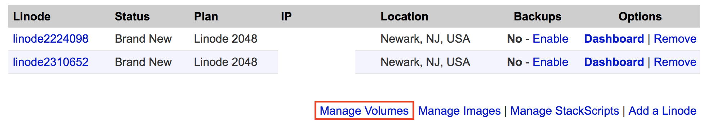](bs-manage-volumes.png)

2.  Click the **Attach** option for the volume you want to attach to a Linode:

    [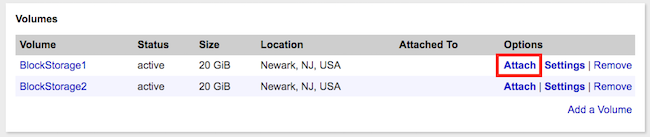](bs-volume-list.png)

3.  Select the label of the Linode you want to attach the volume to. Then click **Attach**:

    [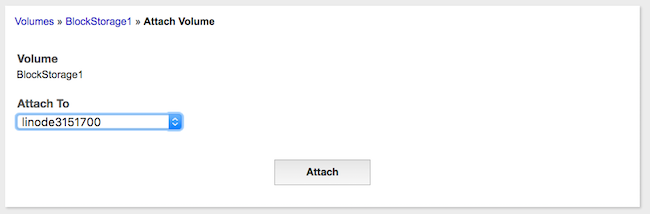](bs-volume-attach.png)

4.  Once you add a volume, you'll be presented with the Volume Attached page as shown below. This page provides customized instructions which show you how to make a filesystem in your volume from any of our supported Linux distributions. The page shows how to mount the volume, and how to add it to `/etc/fstab` so it's mounted automatically whenever you reboot your Linode:

    

5.  If your Linode is not already running, boot and SSH into your Linode to execute the commands as shown on the instructions page. If you need to see the volume mount instructions again, click **Edit** to the right of the volume in that Linode's dashboard:

    

## How to Detach a Block Storage Volume from a Linode

1.  Go back to the dashboard of the Linode which the volume is attached to. Shut down the Linode.

2.  When the Linode is powered off, click **Detach** under the **Volumes** list:

    [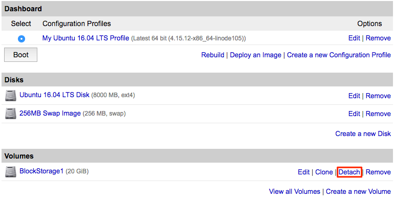](bs-detach.png)

3.  A confirmation screen appears and explains that the volume will be detached from the Linode. Click **Detach** to confirm:

    [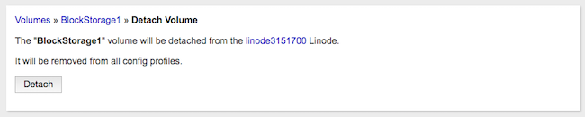](bs-detach-confirm.png)

    The Linode's dashboard does not show the volume present anymore:

    [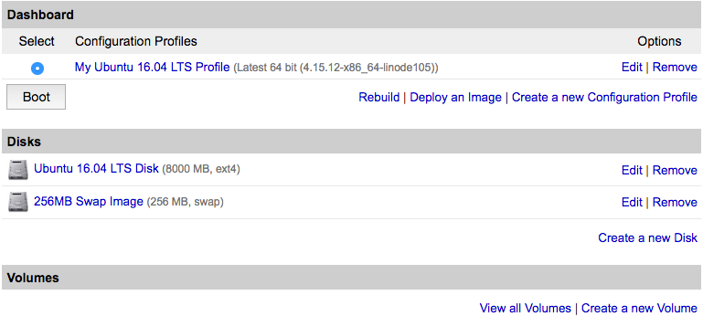](bs-detached.png)

    The volume still exists on your account and you can see it if you click **View all Volumes**:

    


If a volume is currently mounted, detaching it while the Linode is powered on could cause data loss or an unexpected reboot. You can unmount the volume for safe live-detaching using the `umount` command:

    umount /dev/disk/by-id/scsi-0Linode_Volume_BlockStorage1

To avoid additional issues with your Linode, remove the detached volume's line from your `/etc/fstab/` configuration:
    `FILE_SYSTEM_PATH /mnt/BlockStorage1 ext4 defaults 0 2`



## How to Delete a Block Storage Volume


The removal process is irreversible, and the data will be permanently deleted.


1.  Shut down the Linode.

2.  Detach the volume as described [above](#how-to-detach-a-block-storage-volume-from-a-linode).

3.  Click the volume's **Remove** option in either the volume list or the attached Linode's dashboard.

## How to Resize a Block Storage Volume

Storage volumes **cannot** be sized down, only up. Keep this in mind when sizing your volumes.

1.  Shut down your Linode.

2.  Click the **Edit** option for the volume you want to resize.

3.  Enter the new volume size. The minimum size is 10 GiB and maximum is 10,000 GiB. Then click **Save Changes**.

    [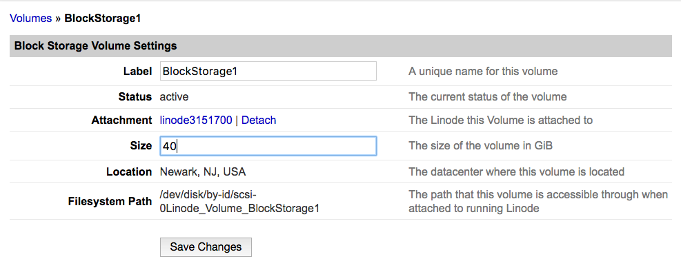](bs-resize-volume.png)

4.  You'll be returned to the volume list and the **Status** column for the volume should say **resizing**.

    [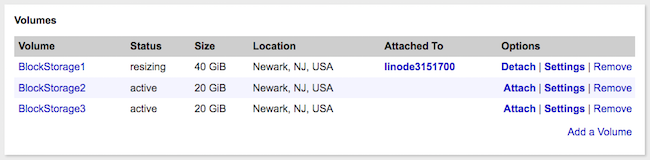](bs-volume-resizing.png)

5.  Reboot your Linode.

6.  Once your Linode has restarted, make sure the volume is unmounted for safety:

        umount /dev/disk/by-id/scsi-0Linode_Volume_BlockStorage1

7.  Assuming you have an ext2, ext3, or ext4 partition, resize it to fill the new volume size:

        resize2fs /dev/disk/by-id/scsi-0Linode_Volume_BlockStorage1

8.  Mount it back onto the filesystem:

        mount /dev/disk/by-id/scsi-0Linode_Volume_BlockStorage1 /mnt/BlockStorage1

## Where to Go From Here?

Need ideas for what to do with space? We have several guides which walk you through installing software that would make a great pairing with large storage volumes:

[Install Seafile with NGINX on Ubuntu 16.04](/docs/applications/cloud-storage/install-seafile-with-nginx-on-ubuntu-1604/)

[Install Plex Media Server on Ubuntu 16.04](/docs/applications/media-servers/install-plex-media-server-on-ubuntu-16-04/)

[Big Data in the Linode Cloud: Streaming Data Processing with Apache Storm](/docs/applications/big-data/big-data-in-the-linode-cloud-streaming-data-processing-with-apache-storm/)

[Using Subsonic to Stream Media From Your Linode](/docs/applications/media-servers/install-subsonic-media-server-on-ubuntu-or-debian/)

[Install GitLab on Ubuntu 14.04](/docs/development/version-control/install-gitlab-on-ubuntu-14-04-trusty-tahr/)
