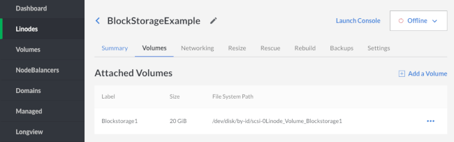
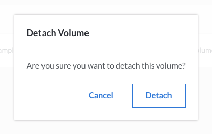
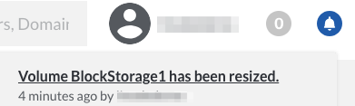

---
author:
  name: Linode
  email: docs@linode.com
description: This tutorial explains how to use Linode's block storage service.
keywords: ["block storage", " volume", "media", "resize", "storage", "disk"]
license: '[CC BY-ND 4.0](https://creativecommons.org/licenses/by-nd/4.0)'
modified: 2018-02-01
modified_by:
  name: Linode
published: 2018-08-17
aliases: ['platform/how-to-use-block-storage-with-your-linode/']
title: How to Use Block Storage with Your Linode
hiddenguide: true
---

Linode’s Block Storage service allows you to attach additional storage volumes to your Linode. A single volume can range from 10 GiB to 10,000 GiB in size and costs $0.10/GiB per month. They can be partitioned however you like and can accommodate any filesystem type you choose. Up to eight volumes can be attached to a single Linode, be it new or already existing, so you do not need to recreate your server to add a Block Storage Volume.

The Block Storage service is currently available in the Dallas, Fremont, Frankfurt, London, Newark, Tokyo, Toronto, Mumbai and Singapore data centers.


-  Linode's backup services do not cover Block Storage Volumes. You must execute [your own backups](/docs/security/backups/backing-up-your-data/) for this data.

-  Your Linode must be running in Paravirtualization mode. Block storage currently does not support Full-virtualization.


## How to Add a Block Storage Volume to a Linode

This guide assumes a Linode with the root disk mounted as `/dev/sda` and swap space mounted as `/dev/sdb`. In this scenario, the Block Storage Volume will be available to the operating system as `/dev/disk/by-id/scsi-0Linode_Volume_EXAMPLE`, where `EXAMPLE` is a label you assign the volume in the Linode Manager. Storage volumes can be added when your Linode is already running, and will show immediately in `/dev/disk/by-id/`.

### Add a Volume from the Linode Dashboard

1.  Go to the page of the Linode to which you want to attach a Block Storage Volume.

    

2.  Click on the **Volumes** tab, then click **Add a Volume**:

    

3.  Assign the Block Storage Volume a label and size. The label can be up to 32 characters long and consist only of ASCII characters `a-z; 0-9.-_`. The maximum volume size is 10,000 GiB. When finished, click *Submit*:

    

    
There is currently a soft limit of 100 TB of Block Storage Volume per account.


1.  Once you add a volume it will appear under Attached Volumes with the new volume's label, size, and file system path.

    

2.  You'll need to create a filesystem in your new volume. If your Linode is not already running, boot then SSH into your Linode and execute the following command, where `FILE_SYSTEM_PATH` is your volume's file system path:

        mkfs.ext4 FILE_SYSTEM_PATH

3.  Once the volume has a filesystem, you can create a mountpoint for it:

        mkdir /mnt/BlockStorage1

4.  You can then mount the new volume:

        mount FILE_SYSTEM_PATH /mnt/BlockStorage1

5.  If you want to mount the new volume automatically every time your Linode boots, you'll want to add the following line to your **/etc/fstab** file:

        FILE_SYSTEM_PATH /mnt/BlockStorage1 ext4 defaults 0 2

### Attach a Volume from Your Account's Volume List

1.  Click on the **Volumes** page of the Linode Manager to see your account's volume list:

    

2.  Click the menu option (three dots) for the volume you want to attach to a Linode and select **Attach**:

    

3.  Select the label of the Linode you want to attach the volume to from the dropdown menu, then click **Save**:

    

    
The Linodes available in this dropdown menu all share the same region as your volume.


4.  You'll need to create a filesystem in your new volume. If your Linode is not already running, boot then SSH into your Linode and execute the following command, where `FILE_SYSTEM_PATH` is your volume's file system path:

        mkfs.ext4 FILE_SYSTEM_PATH

5.  Once the volume has a filesystem, you can create a mountpoint for it:

        mkdir /mnt/BlockStorage1

6.  You can then mount the new volume, where `FILE_SYSTEM_PATH` is your volume's file system path:

        mount FILE_SYSTEM_PATH /mnt/BlockStorage1

7.  If you want to mount the new volume automatically every time your Linode boots, you'll want to add the following line to your **/etc/fstab** file:

        FILE_SYSTEM_PATH /mnt/BlockStorage1

## How to Detach a Block Storage Volume from a Linode

1.  Go back to the page of the Linode which the volume is attached to. Shut down the Linode.

2.  When the Linode is powered off, click on the **Volumes** tab, then click **Detach** under the volume's menu (three dots):

    

3.  A confirmation screen appears and explains that the volume will be detached from the Linode. Click **Detach** to confirm:

    

    The Linode's dashboard does not show the volume present anymore:

    

    The volume still exists on your account and you can see it if you view the **Volumes** page:

    

To avoid issues with your Linode, remove this line from your `/etc/fstab/` configuration:

`FILE_SYSTEM_PATH /mnt/BlockStorage1 ext4 defaults 0 2`


## How to Delete a Block Storage Volume


The removal process is irreversible, and the data will be permanently deleted.


1.  Shut down the attached Linode.

2.  Detach the volume as described [above](#how-to-detach-a-block-storage-volume-from-a-linode).

3.  Click the volume's **Delete** option on the **Volumes** page.

    

## How to Resize a Block Storage Volume

Storage volumes **cannot** be sized down, only up. Keep this in mind when sizing your volumes.

1.  Shut down your Linode.

2.  Click the **Resize** option for the volume you want to resize.

    

3.  Enter the new volume size. The minimum size is 10 GiB and maximum is 10,000 GiB. Then click **Submit**.

    

4.  You'll be returned to the volume list and the notification bell in the top right of the page will notify you when the resizing is complete.

    

5.  Reboot your Linode.

6.  Once your Linode has restarted, make sure the volume is unmounted for safety:

        umount /dev/disk/by-id/scsi-0Linode_Volume_BlockStorage1

7.  Assuming you have an ext2, ext3, or ext4 partition, resize it to fill the new volume size:

        resize2fs /dev/disk/by-id/scsi-0Linode_Volume_BlockStorage1

8.  Mount it back onto the filesystem:

        mount /dev/disk/by-id/scsi-0Linode_Volume_BlockStorage1 /mnt/BlockStorage1

## Where to Go From Here?

Need ideas for what to do with space? We have several guides which walk you through installing software that would make a great pairing with large storage volumes:

[Install Seafile with NGINX on Ubuntu 16.04](/docs/applications/cloud-storage/install-seafile-with-nginx-on-ubuntu-1604/)

[Install Plex Media Server on Ubuntu 16.04](/docs/applications/media-servers/install-plex-media-server-on-ubuntu-16-04/)

[Big Data in the Linode Cloud: Streaming Data Processing with Apache Storm](/docs/applications/big-data/big-data-in-the-linode-cloud-streaming-data-processing-with-apache-storm/)

[Using Subsonic to Stream Media From Your Linode](/docs/applications/media-servers/install-subsonic-media-server-on-ubuntu-or-debian/)

[Install GitLab on Ubuntu 14.04](/docs/development/version-control/install-gitlab-on-ubuntu-14-04-trusty-tahr/)
