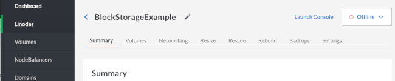
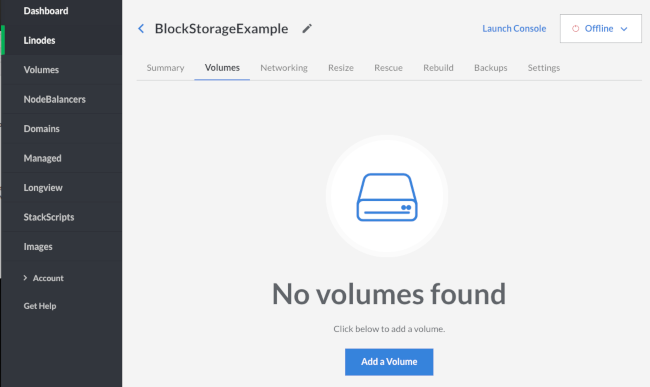
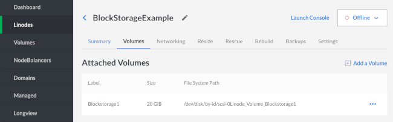
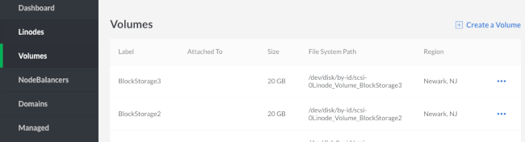
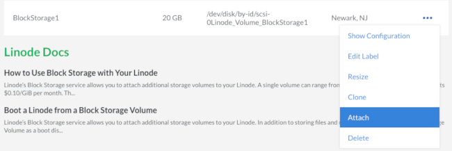
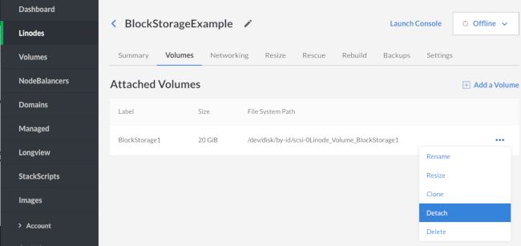
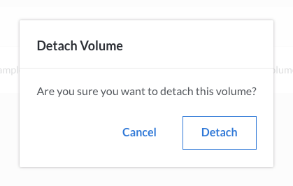
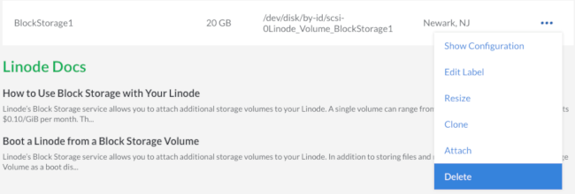
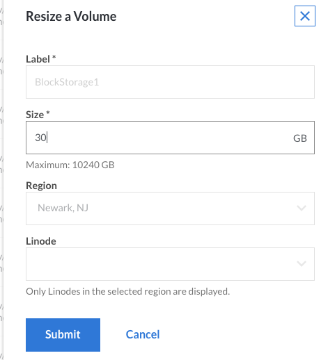
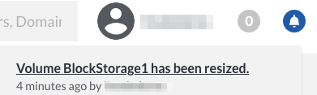

---
author:
  name: Linode
  email: docs@linode.com
description: This tutorial explains how to use Linode's block storage service.
keywords: ["block storage", " volume", "media", "resize", "storage", "disk"]
license: '[CC BY-ND 4.0](https://creativecommons.org/licenses/by-nd/4.0)'
modified: 2018-02-01
modified_by:
  name: Linode
published: 2018-08-17
aliases: ['platform/how-to-use-block-storage-with-your-linode/','platform/block-storage/how-to-use-block-storage-with-your-linode-new-manager/']
title: How to Use Block Storage with Your Linode
classic_manager_link: platform/block-storage/how-to-use-block-storage-with-your-linode-classic-manager/
---

Linode’s Block Storage service allows you to attach additional storage Volumes to your Linode. A single Volume can range from 10 GiB to 10,000 GiB in size and costs $0.10/GiB per month. They can be partitioned however you like and can accommodate any filesystem type you choose. Up to eight Volumes can be attached to a single Linode, be it new or already existing, so you do not need to recreate your server to add a Block Storage Volume.

The Block Storage service is currently available in the Dallas, Fremont, Frankfurt, London, Newark, Tokyo, Toronto, Mumbai, and Singapore data centers.


-  Linode's backup services do not cover Block Storage Volumes. You must execute [your own backups](/docs/security/backups/backing-up-your-data/) for this data.

-  Your Linode must be running in Paravirtualization mode. Block storage currently does not support Full-virtualization.


## How to Add a Block Storage Volume to a Linode

This guide assumes a Linode with the root disk mounted as `/dev/sda` and swap space mounted as `/dev/sdb`. In this scenario, the Block Storage Volume will be available to the operating system as `/dev/disk/by-id/scsi-0Linode_Volume_EXAMPLE`, where `EXAMPLE` is a label you assign the Volume in the Linode Cloud Manager. Storage Volumes can be added when your Linode is already running, and will show immediately in `/dev/disk/by-id/`.

### Add a Volume from the Linode Detail Page

1.  Click on the **Linodes** link in the sidebar.

1.  Select the Linode to which you want to attach a Block Storage Volume. The detail page for the Linode will appear.

    

1.  Click on the **Volumes** tab, then click **Add a Volume**:

    

1.  Assign the Block Storage Volume a label and size. The label can be up to 32 characters long and consist only of ASCII characters `a-z; 0-9.-_`. The maximum Volume size is 10,000 GiB. When finished, click *Submit*:

    

    
There is currently a soft limit of 100 TB of Block Storage Volume per account.


1.  Once you add a Volume it will appear under Attached Volumes with the new Volume's label, size, and file system path.

    

1.  You'll need to create a filesystem in your new Volume. If your Linode is not already running, boot then SSH into your Linode and execute the following command, where `FILE_SYSTEM_PATH` is your Volume's file system path:

        mkfs.ext4 FILE_SYSTEM_PATH

1.  Once the Volume has a filesystem, you can create a mountpoint for it:

        mkdir /mnt/BlockStorage1

1.  You can then mount the new Volume:

        mount FILE_SYSTEM_PATH /mnt/BlockStorage1

1.  If you want to mount the new Volume automatically every time your Linode boots, you'll want to add the following line to your **/etc/fstab** file:

        FILE_SYSTEM_PATH /mnt/BlockStorage1 ext4 defaults 0 2

    
If you plan on detaching the volume regularly or moving it between other Linodes, you may want to consider adding the flags `noatime` and `nofail` to the **/etc/fstab** entry.

* `noatime` - This will save space and time by preventing writes made to the filesystem for data being read on the volume.
*  `nofail`  - If the volume is not attached, this will allow your server to boot/reboot normally without hanging at dependency failures if the volume is not attached.

Example:

    FILE_SYSTEM_PATH /mnt/BlockStorage1 ext4 defaults,noatime,nofail 0 2

    

### Attach a Volume from Your Account's Volume List

1.  Click on the **Volumes** link in the sidebar to see your account's Volume list:

    

1.  Click the **more options ellipsis** to open the menu for the Volume you want to attach to a Linode and select **Attach**:

    

1.  Select the label of the Linode you want to attach the Volume to from the dropdown menu, then click **Save**:

    

    
The Linodes available in this dropdown menu all share the same region as your Volume.


1.  You'll need to create a filesystem in your new Volume. If your Linode is not already running, boot then SSH into your Linode and execute the following command, where `FILE_SYSTEM_PATH` is your Volume's file system path:

        mkfs.ext4 FILE_SYSTEM_PATH

1.  Once the Volume has a filesystem, you can create a mountpoint for it:

        mkdir /mnt/BlockStorage1

1.  You can then mount the new Volume, where `FILE_SYSTEM_PATH` is your Volume's file system path:

        mount FILE_SYSTEM_PATH /mnt/BlockStorage1

1.  If you want to mount the new Volume automatically every time your Linode boots, you'll want to add the following line to your **/etc/fstab** file:

        FILE_SYSTEM_PATH /mnt/BlockStorage1

## How to Detach a Block Storage Volume from a Linode

1.  Go to the detail page page of the Linode which the Volume is attached to. Shut down the Linode.

1.  When the Linode is powered off, click on the **Volumes** tab, click the **more options ellipsis** next to the Volume you would like to detach, then click **Detach**.

    

1.  A confirmation screen appears and explains that the Volume will be detached from the Linode. Click **Detach** to confirm:

    

    The Linode's dashboard does not show the Volume present anymore:

    

    The Volume still exists on your account and you can see it if you view the **Volumes** page:

    


If a volume is currently mounted, detaching it while the Linode is powered on could cause data loss or an unexpected reboot. You can unmount the volume for safe live-detaching using the `umount` command:

    umount /dev/disk/by-id/scsi-0Linode_Volume_BlockStorage1

To avoid additional issues with your Linode, remove the detached volume's line from your `/etc/fstab/` configuration:

`FILE_SYSTEM_PATH /mnt/BlockStorage1 ext4 defaults 0 2`


## How to Delete a Block Storage Volume


The removal process is irreversible, and the data will be permanently deleted.


1.  Shut down the attached Linode.

1.  Detach the Volume as described [above](#how-to-detach-a-block-storage-volume-from-a-linode).

1.  On the **Volumes** page, click the **more options ellipsis** next to the Volume you would like to delete.

1.  Click **Delete**.

    

## How to Resize a Block Storage Volume

Storage Volumes **cannot** be sized down, only up. Keep this in mind when sizing your Volumes.

1.  Shut down your Linode.

1.  Click the **more options ellipsis** next to the Volume you would like to resize to bring up the Volume's menu.

1.  Click **Resize**.

    

1.  Enter the new Volume size. The minimum size is 10 GiB and maximum is 10,000 GiB. Then click **Submit**.

    

1.  You'll be returned to the Volume list and the notification bell in the top right of the page will notify you when the resizing is complete.

    

1.  Reboot your Linode.

1.  Once your Linode has restarted, make sure the Volume is unmounted for safety:

        umount /dev/disk/by-id/scsi-0Linode_Volume_BlockStorage1

1.  Assuming you have an ext2, ext3, or ext4 partition,first run a file system check:

        e2fsck -f /dev/disk/by-id/scsi-0Linode_Volume_BlockStorage1

1.  Then resize it to fill the new Volume size:

        resize2fs /dev/disk/by-id/scsi-0Linode_Volume_BlockStorage1

1.  Mount your volume back onto the filesystem:

        mount /dev/disk/by-id/scsi-0Linode_Volume_BlockStorage1 /mnt/BlockStorage1

## How to Transfer a Volume to a New Linode

1. Follow the steps to safely detach your volume as mentioned [above]
(#how-to-detach-a-block-storage-volume-from-a-linode).

1.   Click the **more options ellipsis** to open the menu for the Volume you want to attach to a Linode and select **Attach**:

     

1.   Since the Volume already has a filesystem on it, create a mountpoint for the new Linode, provided it hasn't already been created:

        mkdir /mnt/BlockStorage1

1.   Mount the new Volume, where FILE_SYSTEM_PATH is your Volume’s file system path:

        FILE_SYSTEM_PATH /mnt/BlockStorage1

## How to Transfer Block Storage Data Between Data Centers

Block Storage volumes cannot be directly migrated to a different Data Center. This section will show you how to transfer a volume's data to a different data center.


Consult our [Network Transfer Quota](/docs/platform/billing-and-support/network-transfer-quota/#which-traffic-applies-to-the-transfer-quota) guide for information on charges related to outbound traffic when downloading Linode data outside of Linode's private network.


### Use SCP to Transfer Block Storage Volume Data to Another Data Center

1. [Attach and mount](/docs/platform/block-storage/how-to-use-block-storage-with-your-linode/#how-to-add-a-block-storage-volume-to-a-linode) your Block Storage volume to a Linode, if you have not already.

1. [Use the Secure Copy Protocol (SCP)](/docs/security/data-portability/download-files-from-your-linode/#download-specific-files-or-directories-over-ssh) to download your volume's data to the receiving computer or Linode.

    
  You will need a device that has enough storage capacity to receive the entirety of your Block Storage volume's data.
    

1. Once your Block Storage volume's data has been copied, [create a new Block Storage volume in the desired data center and attach it to a Linode](/docs/platform/block-storage/how-to-use-block-storage-with-your-linode/#how-to-add-a-block-storage-volume-to-a-linode).

1. [Use SCP to upload the data from the receiving computer or Linode](/docs/security/data-portability/download-files-from-your-linode/#download-specific-files-or-directories-over-ssh) to the new Block Storage volume. The new Block Storage volume must be attached and mounted to a Linode.

## Where to Go From Here?

Need ideas for what to do with space? We have several guides which walk you through installing software that would make a great pairing with large storage Volumes:

- [Install Seafile with NGINX on Ubuntu 16.04](/docs/applications/cloud-storage/install-seafile-with-nginx-on-ubuntu-1604/)

- [Install Plex Media Server on Ubuntu 16.04](/docs/applications/media-servers/install-plex-media-server-on-ubuntu-16-04/)

- [Big Data in the Linode Cloud: Streaming Data Processing with Apache Storm](/docs/applications/big-data/big-data-in-the-linode-cloud-streaming-data-processing-with-apache-storm/)

- [Using Subsonic to Stream Media From Your Linode](/docs/applications/media-servers/install-subsonic-media-server-on-ubuntu-or-debian/)

- [Install GitLab on Ubuntu 14.04](/docs/development/version-control/install-gitlab-on-ubuntu-14-04-trusty-tahr/)
