---
author:
  name: Linode
  email: docs@linode.com
description: 'This guide shows you how to add a Cloud Firewall and apply it to a Linode service using the Linode Cloud Manager. You will also learn how to edit your Cloud Firewall rules, add new custom rules, and disable and enable Firewalls. Linode Cloud Firewalls analyze traffic against a set of predefined rules at the network layer and determine if the traffic will be permitted to communicate with the Linode Service it secures. Cloud Firewalls are an integral component of your infrastructure''s security.'
og_description:  'This guide shows you how to add a Cloud Firewall and apply it to a Linode service using the Linode Cloud Manager. You will also learn how to edit your Cloud Firewall rules, add new custom rules, and disable and enable Firewalls. Linode Cloud Firewalls analyze traffic against a set of predefined rules at the network layer and determine if the traffic will be permitted to communicate with the Linode Service it secures. Cloud Firewalls are an integral component of your infrastructure''s security.'
keywords: ["firewall", "cloud firewall", "security", "securing"]
license: '[CC BY-ND 4.0](https://creativecommons.org/licenses/by-nd/4.0)'
modified: 2020-07-24
modified_by:
  name: Linode
published: 2020-07-24
title: Adding and Configuring Linode Cloud Firewalls - A Tutorial
h1_title: A Tutorial for Adding and Configuring Linode Cloud Firewalls
---

## What are Linode Cloud Firewalls?

Linode Cloud Firewalls is a free service used to create, configure, and add stateful network-based firewalls to Linode services using the Linode Cloud Manager and the Linode APIv4. A Cloud Firewall is independent of the service it is attached to, so you can apply a single Firewall to multiple Linode services.

### Features

Linode Cloud Firewalls analyze traffic against a set of predefined rules at the network layer and determine if the traffic will be permitted to communicate with the Linode Service it secures. Cloud Firewalls work as a whitelist with an implicit deny rule-- it will block all traffic by default and only pass through network traffic that meets the parameters of the configured rules.

### Limitations

- Currently Linode Cloud Firewalls can only be applied to Linodes.
- You can apply up to three Cloud Firewalls per Linode service.

### Inbound and Outbound Rules

A Cloud Firewall can be configured with *Inbound* and *Outbound* rules. Inbound rules limit incoming network connections to a Linode service based on the port(s) and sources you configure. Outbound rules limit the outgoing network connections coming from a Linode service based on the port(s) and destinations you configure.

### Predefined Rules

The Linode Cloud Manager provides a list of *predefined rules* that you can add to your Cloud Firewalls. The predefined rules support common networking use cases and provide an easy foundation to get started with Cloud Firewalls. Since you can edit any rule applied to a Cloud Firewall you can use the predefined rules as a foundation and further [edit their configurations](#edit-cloud-firewall-rules) and also [add new custom rules](#add-new-cloud-firewall-rules) to your Firewall.

## Add a Cloud Firewall

1. Log into your [Linode Cloud Manager](https://cloud.linode.com/) and select **Firewalls** from the navigation menu.

    

1. From the **Firewalls** listing page, click on the **Add a Firewall** link.

    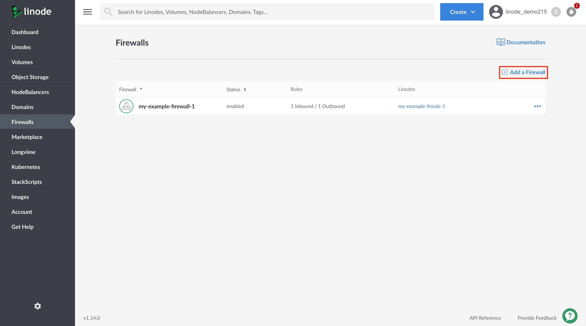

1. The **Add a Firewall** drawer will appear with the Firewall configurations needed to add a Firewall. Configure your Firewall with at minimum the required fields:

    | **Configuration** | **Description** |
    | :---------------: | :---------------: |
    | **Label** | The label is used an identifier for this Cloud Firewall. *Required*|
    | **Rules** | The Firewall rule(s) to add to this Firewall. Choose from a list of predefined Inbound and Outbound Firewall rules that support common networking use cases. You can select more than one Firewall rule. You can [edit your selected rules](#edit-cloud-firewall-rules) after adding the Firewall, if needed. *Required*|
    | **Linodes**| The Linode(s) on which to apply this Firewall. A list of all Linodes on your account will be visible. You can skip this configuration if you do not yet wish to apply the Firewall to a Linode. |

1. Click on the **Create** button. This will create the Cloud Firewall and you will see it appear on the **Firewalls** listing page.

    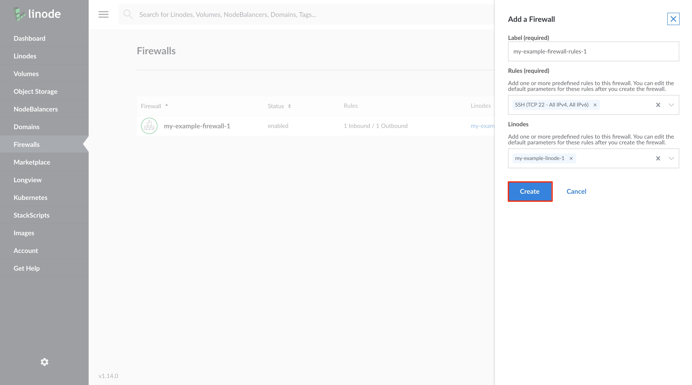

## Assign a Cloud Firewall to a Linode Service

1. Log into your [Linode Cloud Manager](https://cloud.linode.com/) and select **Firewalls** from the navigation menu.

    

1. From the **Firewalls** listing page, click on the Firewall that you would like to attach to a Linode. This will take you to the Firewall's **Rules** page.

1. Click on the **Linodes** tab. This will take you to the **Firewalls Linodes** page. If the Firewall is assigned to any Linode services they will be displayed on the page.

1. Click on the **Add Linodes to Firewall** link.

    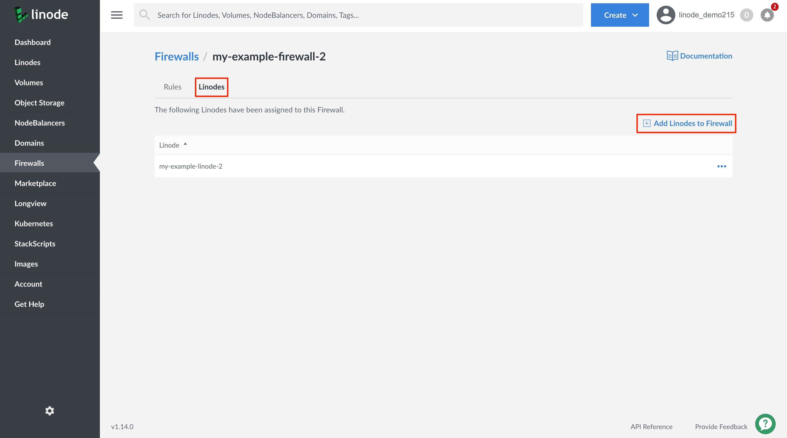

1. From the **Add Linode to Firewall** drawer, click on the dropdown menu and select the Linode service to which you'd like to apply this Firewall. You can also start typing the Linode service's label to narrow down your search.

    
You can assign the Firewall to more than one Linode service at a time. Continue the previous step to assign the Firewall to another Linode service.
    

1. Click on the **Add** button to assign the Firewall to your Linode(s).

    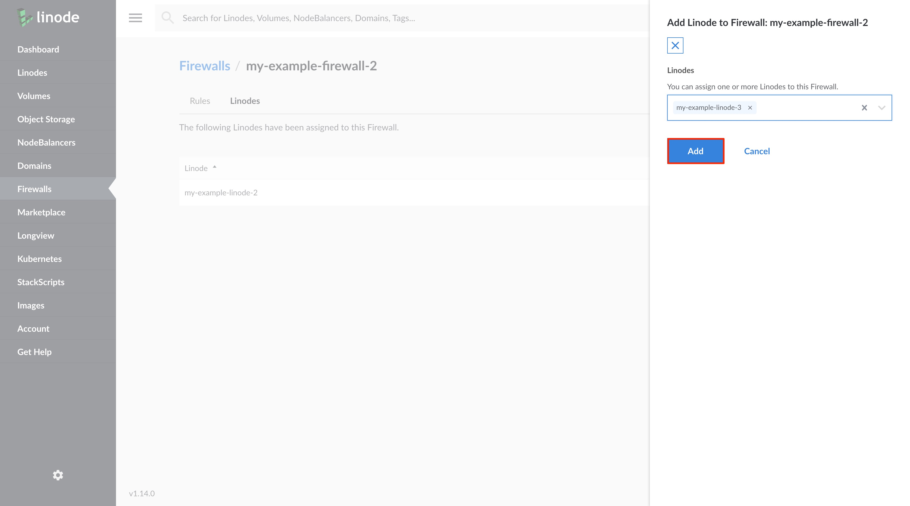


If you have a Cloud Firewall attached to a Linode and you attempt to [migrate the Linode to a data center](/docs/platform/disk-images/how-to-initiate-a-cross-data-center-migration-for-your-linode/) that does not support Cloud Firewalls, the migration will fail.


## Configure Cloud Firewall Rules

Upon initial creation of a Cloud Firewall, you are required to select Firewall rules from a predefined list that supports common networking use cases. This section will show you how to add new Firewall rules to your Firewall's existing rules, edit your Firewall's predefined rules, and delete Firewall rules.

### Add New Cloud Firewall Rules

1. Log into your [Linode Cloud Manager](https://cloud.linode.com/) and select **Firewalls** from the navigation menu.

1. From the **Firewalls** listing page, click on the Firewall that you would like to add new rules to. This will take you to the Firewall's **Rules** page.

1. Click on the **Add an Inbound/Outbound Rule** link (click on the appropriate link for the type of Rule you would like to add).
    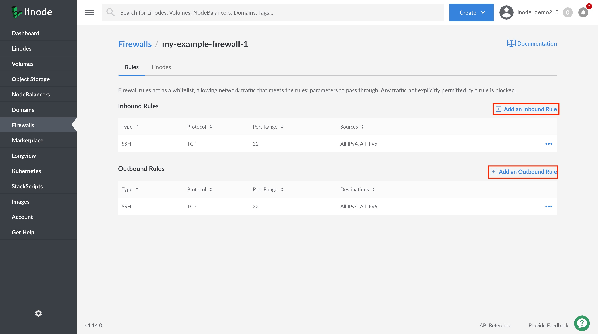

    The **Add an Inbound/Outboud Rule** drawer will appear.

1. Provide the following Rule configurations:

    | **Configuration** | **Description** |
    | :---------------: | :---------------: |
    | **Type** | &bull; Select from a list of predefined Firewall rules or select **Custom** to define your own Rule.    &bull;Selecting a predefined rule will fill in the remaining Rule configuration values, however, they can all be edited.   &bull;Selecting **Custom**, will leave all configuration values empty for you to define. *Required*|
    | **Protocol** | Select the Transport Layer protocol to use for this Firewall rule. *Required*|
    | **Port Range**| &bull; Provide a port number or a range of ports on which to allow network traffic.    &bull; This configuration is required for TCP and UDP Firewall rules. `ICMP` does not have a port abstraction, so does not require this configuration.   &bull; To configure a **Port Range** provide the starting and ending port numbers. For example, `2000-3000`.  *Required*|
    | **Sources / Destinations**| &bull; When creating an **Inbound Rule**, select from a list of **Sources** that will limit incoming connections to the chosen internet protocol, netmask, or specific IP address(es).   &bull; When creating an **Outbound Rule**, select from a list of **Destinations** that will limit the outgoing connections to the chosen internet protocol, netmask, or specific IP address(es). |

1. Click on **Add Rule** to add the new rule to this Firewall. If you would like to add any additional rules, repeat the process outlined in this section.

    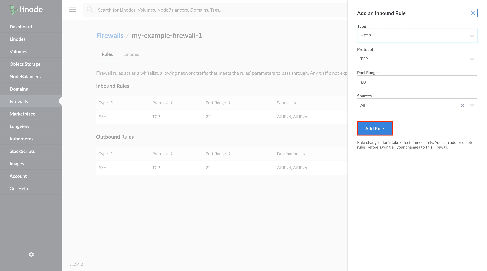

1. When you are done adding new Firewall rules, click on the **Apply Changes** button on the **Rules** page.

    
Any newly added rules will not take effect until you **Apply Changes** to the Firewall.
    

    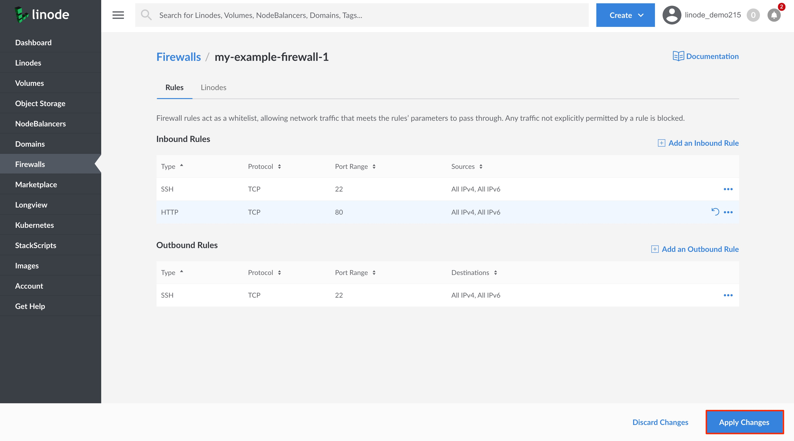

### Edit Cloud Firewall Rules

Follow the steps in this section to edit predefined and custom Firewall Rules.

1. Log into your [Linode Cloud Manager](https://cloud.linode.com/) and select **Firewalls** from the navigation menu.

1. From the **Firewalls** listing page, click on the Firewall whose rules you'd like to edit. This will take you to the Firewall's **Rules** page.

1. Click on the ***more options ellipsis*** corresponding to the rule you'd like to edit and select **Edit** from the dropdown menu.

    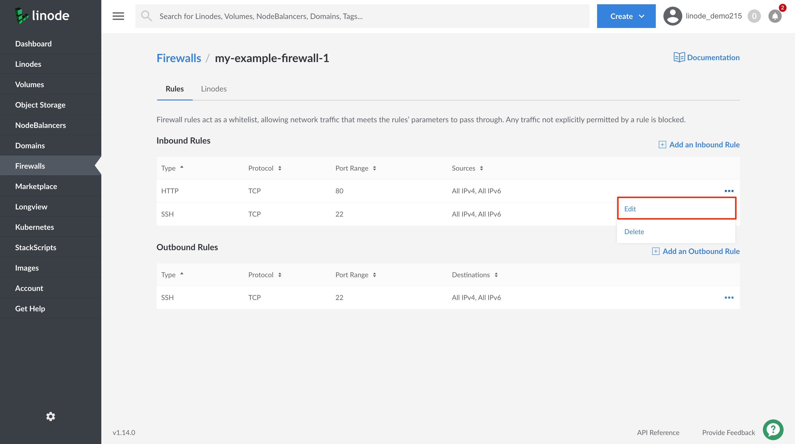

1. From the **Edit Rule** drawer, update the rule's configurations as needed.

1. Click on the **Edit Rule** button to save your changes and apply them to the rule. If you would like to edit any additional rules, repeat the process outlined in this section.

    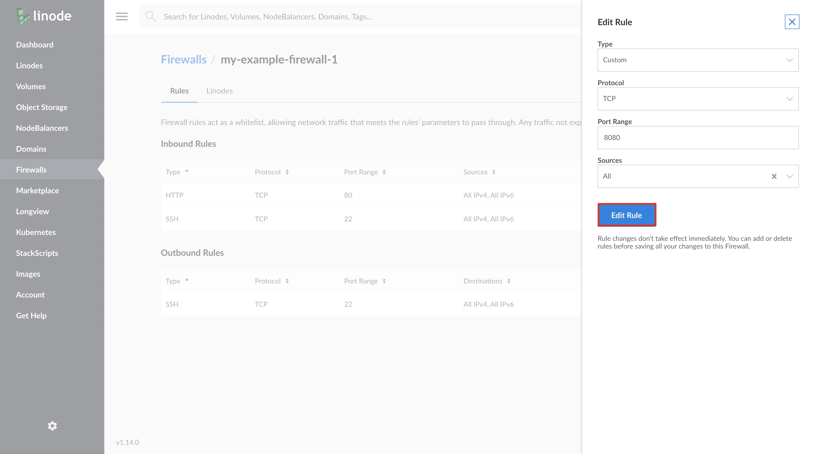

1. When you are done editing your Firewall rules, click on the **Apply Changes** button on the **Rules** page.

    
Any edits made to rules will not take effect until you **Apply Changes** to the Firewall.
    

    

### Delete Cloud Firewall Rules

1. Log into your [Linode Cloud Manager](https://cloud.linode.com/) and select **Firewalls** from the navigation menu.

1. From the **Firewalls** listing page, click on the Firewall whose rule(s) you'd like to delete. This will take you to the Firewall's **Rules** page.

1. Click on the ***more options ellipsis*** corresponding to the rule you'd like to delete and select **Delete** from the dropdown menu. If you would like to delete any additional rules, repeat the process outlined in this section.

1. When you are done, click on the **Apply Changes** button on the **Rules** page.

    
Any rule deletion(s) will not take effect until you **Apply Changes** to the Firewall.
    

## Update a Cloud Firewall's Status

When you [add a Cloud Firewall](#add-a-cloud-firewall), the Firewall is enabled by default. Enabled means that the Firewall is active and if it is applied to a Linode service it will filter your Linode service's network traffic according to the Firewall's rules. Disabling a Firewall will deactivate the Firewall and it will no longer filter any traffic for the Linode services it has been applied to.

1. Log into your [Linode Cloud Manager](https://cloud.linode.com/) and select **Firewalls** from the navigation menu. This will take you to the **Firewalls** listing page.

1. Click on the **more options ellipsis** corresponding to the Firewall whose status you'd like to update.

1. From the dropdown menu, click on **Enable/Disable** to update the Firewall's status.

    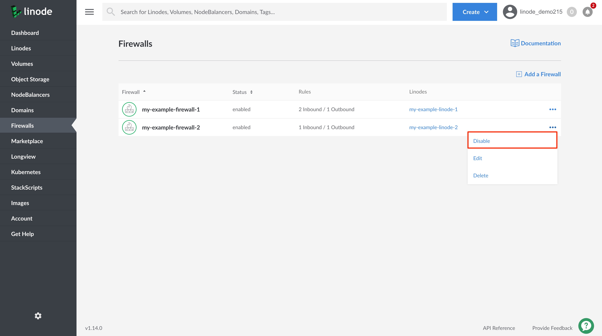

    The **Status** column on the **Firewalls** listing page will update to display the Firewall's current status.

    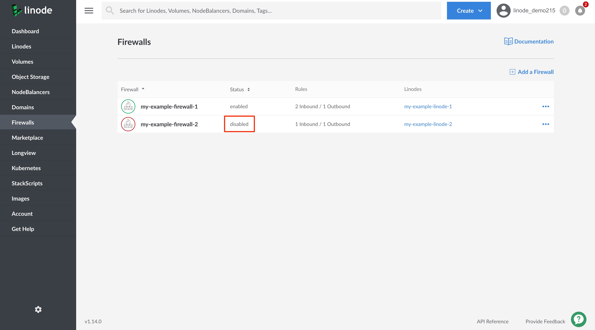

## Delete a Cloud Firewall

1. Log into your [Linode Cloud Manager](https://cloud.linode.com/) and select **Firewalls** from the navigation menu. This will take you to the **Firewalls** listing page.

1. Click on the **more options ellipsis** corresponding to the Firewall that you'd like to delete.

1. From the dropdown menu, click on **Delete**. You will be prompted to confirm deleting the Firewall. Click **Delete** to proceed.

    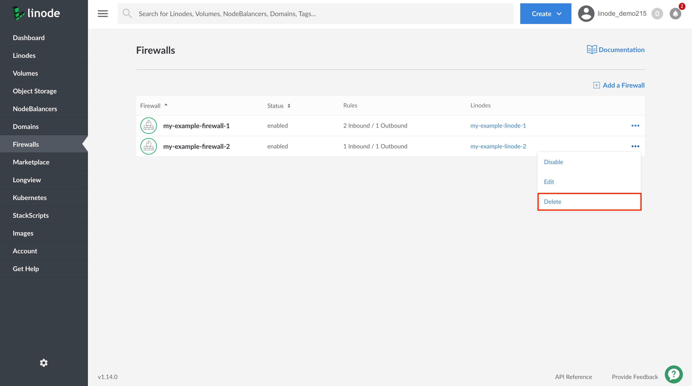

    The Firewall will be deleted and any services that the Firewall was applied to will no longer have their network traffic filtered by the Firewall.