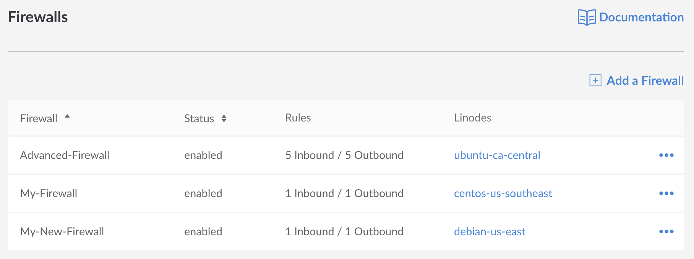
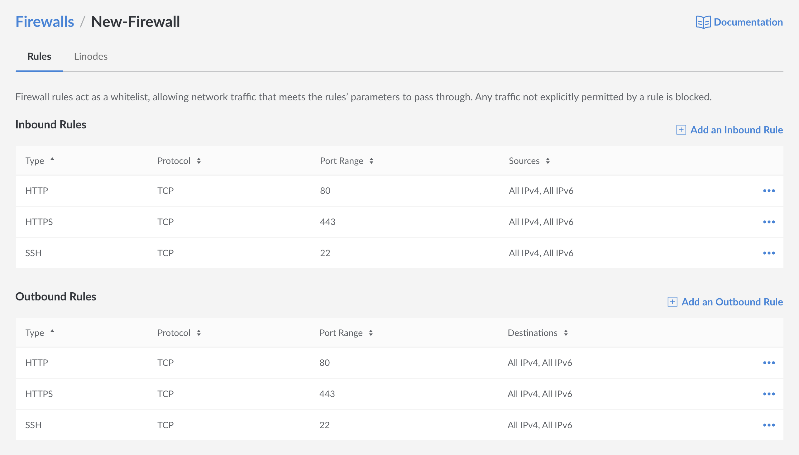
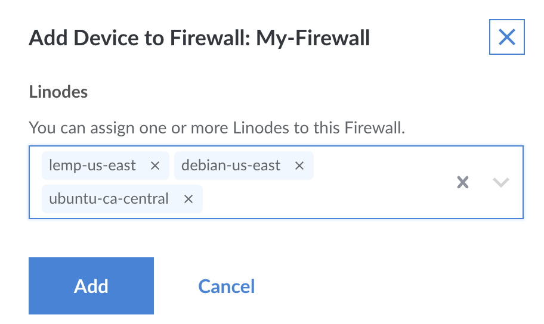

---
author:
  name: Linode
  email: docs@linode.com
description: Our guide to Getting Starting with Cloud Firewall.
og_description: Our guide to Getting Starting with Cloud Firewall.
keywords: ["firewall", "cloud firewall", "security", "securing"]
license: '[CC BY-ND 4.0](https://creativecommons.org/licenses/by-nd/4.0)'
aliases: []
modified: 2020-03-12
modified_by:
  name: Linode
published: 2020-03-12
title: Getting Started with Cloud Firewall
---

Firewalls are tools that are used to analyze traffic against a set of pre-defined rules that determine whether or not traffic will be permitted to communicate with a host. If you've ever used [iptables](/docs/security/firewalls/control-network-traffic-with-iptables/), [UFW](/docs/security/firewalls/configure-firewall-with-ufw/), or [FirewallD](/docs/security/firewalls/introduction-to-firewalld-on-centos/), then you're already familiar with how firewalls can increase your security by limiting the types of network traffic that will be accepted, enabling you to reduce the size of any potential attack surface to a minimum.

**Linode's Cloud Firewall** is a free add-on service built on Iptables that provides the ability to create and configure a stateful firewall for your Linodes directly from the Linode Cloud Manager and the Linode API. Cloud Firewall works as a whitelist with an implicity deny rule, meaning that a firewall will block all traffic by default until additional rules are added. All rules added to a cloud firewall require you to determine what traffic will be permitted to reach your Linode.

Cloud Firewalls are a network based firewall, meaning that you are able to create both a Cloud Firewall and an internal host based firewall on the Linode itself using tools like `iptables` for a layered defense-in-depth approach to your Linode's security.

## Creating a Firewall

To add a Firewall for your Linode, log into your [Linode Cloud Manager](https://cloud.linode.com/) and select the **Firewalls** option on the navigation sidebar to the left of the page. Next, click on the **Add a Firewall** button on the top right of the page. This will open a Sidebar Menu which requires that you select the following options:

| **Configuration** | **Description** |
|-------------------|-----------------|
| **Label** | The label is used an identifier for your set of firewall rules. This can be recalled later if you want to apply the firewall rules to multiple deployments. *Required*|
| **Rules** | This allows you to choose from a list of common pre-defined rules for different unique services. While this field is required, you will have the option to customize your rules further in later steps. *Required*|
| **Linodes**| A list of Linodes on your account that the Firewall can be applied to. Assignment is not required immediately, and you can skip this option to create rules which can be applied later as needed. |

From here your Firewall be created with an initial set of basic rules.

## Additional Configuration Options

Also found in the [Firewall Section](cloud.linode.com/firewalls) of the Cloud Manager, will be a list of all of the Firewalls you have available on your account, listed in alphabetical order by their label. This section will also display a Firewall's `Status`, the number of Inbound and Outbound `Rules`, and list labels for any  `Linodes` that the Firewall has been applied to.

For additional options, select the **more options ellipsis** to the far right of each Firewall. From here, you'll see the following options:

| **Option** | **Description** |
|-------------------|-----------------|
| **Disable** or **Enable** | This will disable or enable your Firewall, removing the rules from any active Linodes while keeping the list of rules available for you to review so you can reapply and re-enable them later. |
| **Edit** | This option will open up an additional menu that will enable you to add additional custom rules with a higher level of detail. |
| **Delete**| This will disable your Firewall, removing the rules from any active Linodes while also permanently deleting the rule set. Unlike the disable option, this means that your rules will not be able to reapplied in the future. |

## Customizing your Firewall

To customize your Firewall further by adding more specific rules, including the ability to select a range of ports, highlight the Firewall you'd like to select and click. From here, you'll be moved to an advanced configuration page:

Included in this page, you'll be able to see a list of all Inbound and outbound rules defined by the following:

| **Configuration** | ** Description** |
|-------------------|-----------------|
| **Type** | An identifier describing the type of rule that you're setting. Options include `SSH`, `HTTP`, `HTTPS`, `MySQL`, `DNS` and `Custom`.|
| **Protocol** | The protocol your rule will be targeting. Options include `TCP`, `ICMP`, `UDP` and `ALL`. |
| **Port Range** | The `port` or range of ports you've chosen to whitelist.|
| **Sources** | The whitelisted source of the traffic. Can be `All`, `IPv4`, `IPv6`, and `IP/Netmask`, which will allow you to select individual IP addresses. Only used for Inbound Rules. |
| **Destinations** | The whitelisted destination of  traffic.

### Add an Inbound or Outbound Rule

To add a new rule, navigate to the [Firewall](cloud.linode.com/firewalls) section of the Cloud Manager, select the Firewall you'd like to add new rules for and then click on the `Add an Inbound Rule` or `Add an Outbound Rule` to the right of each respective section. Click on this button, and you'll see a sidebar appear to the right of the page which will enable you to add a new rule using the `type`, `protocol`, and `port range`. and `sources` pool.

To add more than one IP, the **Add IP** button can be clicked multiple times to add an additional IP field.

### Remove a Rule

To remove a rule, navigate to the [Firewall](cloud.linode.com/firewalls) section of the Cloud Manager, select the Firewall you'd like to add new rules for and then click on the `more options ellipsis` next to any rules you'd like to delete. Select the `delete` option to delete your rule.

### Add Linodes to a Firewall

To add Linodes to a firewall you've already created, navigate to the [Firewall](cloud.linode.com/firewalls) section of the Cloud Manager, select the Firewall you'd like to use, then click on the `Linodes` tab towards the top of the page. This will take you to a new page displaying all of the Linodes that this Firewall is currently being applied to.

To add a new Linode, click on the "Add Linodes to Firewall" button at the top right of the page, select the Linode you'd like to add using the dropdown menu, and then click the `Add` button. Once completed, your Linode will be successfully added to the firewall.


The dropdown menu can be re-opened to add multiple Linodes to your Firewall.


