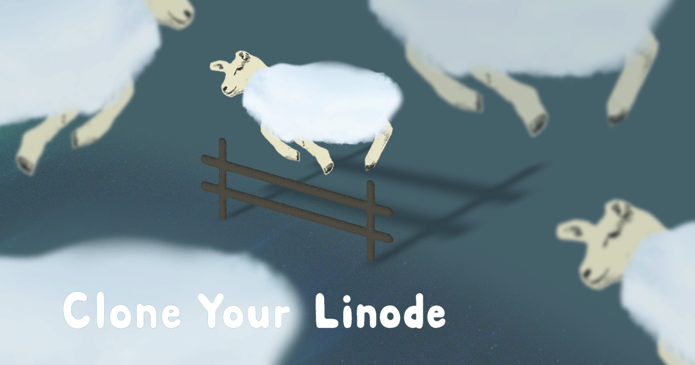
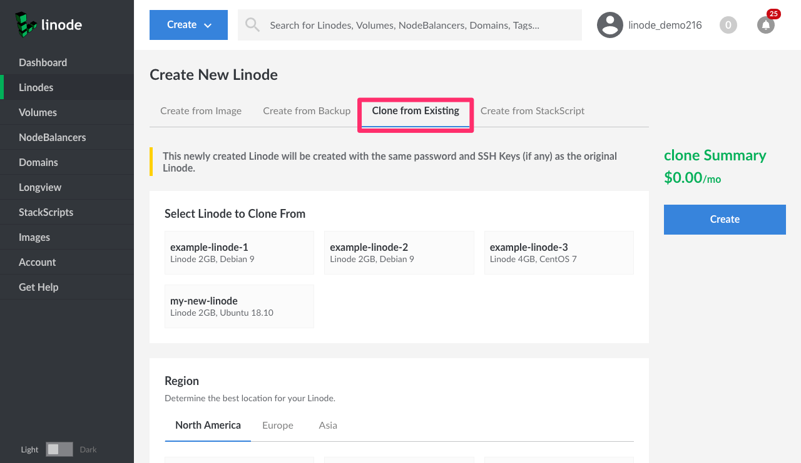

---
author:
  name: Linode
  email: docs@linode.com
description: Clone your Linode to another Linode.
keywords: ["clone", " cloning", "cloud manager"]
license: '[CC BY-ND 4.0](https://creativecommons.org/licenses/by-nd/4.0)'
aliases: ['migrate-to-linode/disk-images/clone-your-linode/']
modified_by:
  name: Linode
published: 2019-03-18
title: 'Clone Your Linode'
classic_manager_link: 'platform/disk-images/clone-your-linode-classic-manager/'
---

This guide will show you how to clone one of your Linode’s existing [disks and configuration profiles](/docs/platform/disk-images/disk-images-and-configuration-profiles/) to a new Linode on your account.

## Clone Your Linode

1. Log in to the [Linode Cloud Manager](https://cloud.linode.com).

1. **Recommended**: Power off the Linode you would like to clone. This is recommended to prevent data corruption.

1. Click **Create** at the top of the Cloud Manager and select **Linode**.

1. In the **Create New Linode** form, click on the **My Images** tab and then the **Clone Linode** tab:

    

1. Under **Select Linode to Clone From**,click on the Linode you wish to clone.

1. Select the region and plan for the clone.

  
You will not be able to choose a plan for your clone that is smaller than the plan of the Linode you are cloning. For example, a 2GB Linode can not be cloned into a 1GB Nanode.


1. Provide a label for your new Linode.

1. Click **Create**.

1. The cloning process will begin. Depending on the size of your Linode, it may take some time. You will see a status bar above the Linode you cloned with the percentage of completion.

1. While your Linode is being cloned, your new clone will appear on the Linodes page in a powered off state. Once the cloning process is complete you will need to manually power on your new Linode.

  
You may want to swap your IP address from the Linode you originally created to your cloned Linode in order to have your clone function over the network without making any configuration changes. To complete this, you'd just need to follow this [guide](/docs/platform/manager/remote-access/#swapping-ip-addresses).
