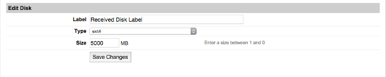
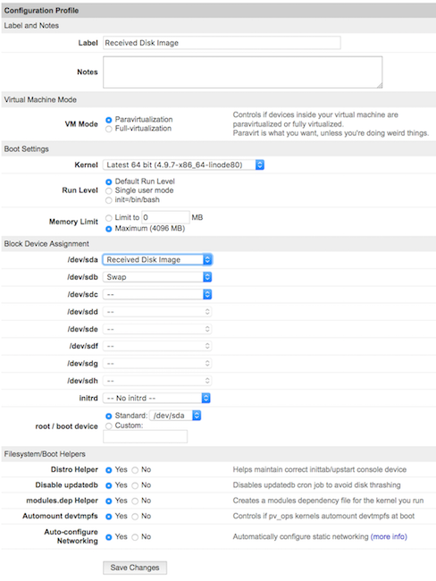

---
author:
  name: Linode
  email: docs@linode.com
description: "Create a disk image using dd and download it to another machine over SSH."
keywords: ["copy", "disk", "ssh", "dd"]
license: '[CC BY-ND 4.0](https://creativecommons.org/licenses/by-nd/4.0)'
aliases: ['migration/ssh-copy/','migrate-to-linode/disk-images/copying-a-disk-image-over-ssh/','platform/disk-images/copying-a-disk-image-over-ssh/']
modified_by:
  name: Linode
published: 2012-06-04
title: "Copy a Disk Over SSH"
---

Piping SSH commands to utilities such as `dd`, `gzip`, or `rsync` is an easy way to copy a Linode's data into a single file for later extraction. This can effectively back up your Linode's disk or migrate your installed system among Linodes.

This guide demonstrates how to download a `.img` file to your computer over SSH containing a block-level copy of your Linode's disk device created with `dd`.


If the amount of data on your disk is much less than the size of the disk, then downloading a copy with `dd` can take longer than just downloading your files. If you're interested in downloading individual files or directories, review the options listed in our [Download Files from Your Linode](/docs/security/data-portability/download-files-from-your-linode/) and [Backing Up Your Data](/docs/security/backups/backing-up-your-data/) guides.


## Download a Disk over SSH

### Boot into Rescue Mode

1.  Prepare the receiving computer by verifying that SSH is installed. Most Linux/Unix-like systems include OpenSSH in their package base by default. If the receiving system is Microsoft Windows, there are multiple SSH solutions available such as [Cygwin and PuTTY](/docs/networking/ssh/using-ssh-on-windows).

1.  Reboot Your Linode into [Rescue Mode](/docs/troubleshooting/rescue-and-rebuild/#booting-into-rescue-mode) and connect to it using [Lish](/docs/platform/manager/remote-access/#console-access).

1.  Set a root password for the rescue system and start the SSH server:

        passwd
        service ssh start

### Copy and Download the Disk

1.  Copy the disk over SSH from the Linode to the receiving machine. Replace `192.0.2.9` with the Linode's IP address and `/home/archive/linode.img` with the path where you want to store the disk.

        ssh root@192.0.2.9 "dd if=/dev/sda " | dd of=/home/archive/linode.img

    
The device `/dev/sda` is used for Linodes running on KVM. If your Linode is still using XEN, then use `/dev/xvda` throughout this guide instead.


1.  The receiving machine will connect to the Linode. Verify the SSH key fingerprints. If valid, type `yes` and press **Enter** to continue:

        The authenticity of host '192.0.2.9 (192.0.2.9)' can't be established.
        RSA key fingerprint is 39:6b:eb:05:f1:28:95:f0:da:63:17:9e:6b:6b:11:4a.
        Are you sure you want to continue connecting (yes/no)? yes

1.  Enter the root password you created above for the rescue system:

        Warning: Permanently added '192.0.2.9' (RSA) to the list of known hosts.
        root@192.0.2.9's password:

    When the transfer completes, you'll see a summary output similar to below:

    
        4096000+0 records in
        4096000+0 records out
        2097152000 bytes (2.1 GB) copied, 371.632 seconds, 5.6 MB/s
    

    Copying your disk can take a while. If you have a slow internet connection, add the `-C` option to the SSH command to enable gzip compression of the disk image. If you receive a `Write failed: Broken pipe` error, repeat this process.

### Verify the Disk

Once the copy has completed, verify it by mounting the image on the receiving machine.

1.  Switch users to `root` on receiving machine:

        su

1.  Make a directory to mount the disk as:

        mkdir linode

1.  Mount the disk. Replace `linode.img` with the name of the of your Linode's disk.

        mount -o loop linode.img linode

1.  List the directories on the disk to indicate if everything has transferred. Your output of `ls` is similar to below:

        ls linode

    
        bin   dev  home  lost+found  mnt  proc  sbin     srv  tmp  var
        boot  etc  lib   media       opt  root  selinux  sys  usr


## Upload a Disk over SSH

You may want to upload your disk image to a new server. For example, if you previously downloaded your Linode disk and deleted the Linode to halt billing on it, you can create a new Linode at a later date and upload the disk to resume your services.

1.  Prepare the new Linode by first creating a new swap disk. Doing this first means that you can simply use the Linode's remaining space for the system disk without doing any subtraction. A swap disk is typically starts at 256 MB or 512 MB in size, but can be larger or smaller depending upon your needs.

1.  Access your Linode through the Linode Manager. Select **Create a new disk** and select `swap` from the **Type** drop down menu.

    

1.  Now use the remaining disk space to create the system drive you'll copy your disk image to. Enter a descriptive name in the **Label** field, and be sure the **Size** is large enough to hold the contents of the disk you are uploading. Click **Save Changes**.

1. Reboot Your Linode into [Rescue Mode](#boot-into-rescue-mode) and start the SSH server as described above.

1. Upload the disk over SSH to the Linode. Replace `192.0.2.9` with the Linode's IP address and `/home/archive/linode.img` with the disk images's path.

        dd if=/home/archive/linode.img | ssh root@192.0.2.9 "dd of=/dev/sda"

    When the transfer completes, you'll see a summary output similar to below:

    
        49807360+0 records in
        49807360+0 records out
        25501368320 bytes (26 GB) copied, 9462.12 s, 2.7 MB/s


    Copying your disk can take a while. If you receive a `Write failed: Broken pipe` error, repeat this process.

### Expand the Filesystem

If the disk you created on the new server is larger than the source disk (for example you're transferring a disk from a smaller Linode to a larger Linode), you'll have to resize the filesystem to make use of the new space.

You can check if this is necessary by comparing the space of the filesystem to the space of the new disk:


    root@localhost:~# df -h
    Filesystem      Size  Used Avail Use% Mounted on
    /dev/sda         24G   19G  4.0G  83% /



    root@localhost:~# lsblk
    NAME  MAJ:MIN RM  SIZE RO TYPE MOUNTPOINT
    sda     8:0    0   30G  0 disk /


In the above example, the values in the **Size** column don't match. Although the disk is 30 GB, the filesystem can only see 24 GB.

To use all available space on the new disk, execute the following from Rescue Mode. Replace `/dev/sdx` with your system disk's device identifier (/dev/sda, /dev/sdb, etc.).

    e2fsck -f /dev/sdx
    resize2fs /dev/sdx

### Boot from the Disk

You will now need to create a new configuration profile on the receiving Linode.

1.  Select your Linode and select **Create a New Configuration Profile**.

    

1.  Enter a name for the configuration profile in the **Label** field, and in the **Block Device Assignment** section set the `/dev/sda` to the new system disk you created earlier in this section of the guide. Set `/dev/sdb` to the swap image.

1.  The Linode is now ready to reboot using the new system disk.