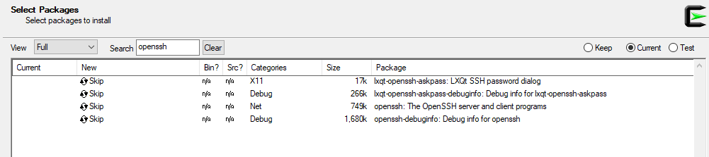
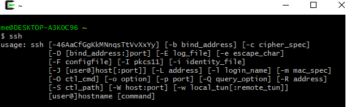

---
author:
  name: Linode
  email: docs@linode.com
description: "Our guide to copying a disk over SSH"
keywords: ["copy", "disk", "ssh"]
license: '[CC BY-ND 4.0](https://creativecommons.org/licenses/by-nd/4.0)'
aliases: ['migration/ssh-copy/','migrate-to-linode/disk-images/copying-a-disk-image-over-ssh/']
modified: 2017-01-08
modified_by:
  name: Linode
published: 2012-06-04
title: "Copying a Disk Over SSH"
---

You can use SSH to copy a Linode's disk to a system that resides on a different network. This is an effective way to back up your Linode's disks to a personal computer or another server. In this guide, you'll learn how to use SSH to copy a Linode's disk to a local system.



You have successfully transferred your Linode's disk to another host using SSH.

## Upload a Disk over SSH

Once you have a copy of your Linode's disk you may want to upload that copy from your local machine to a Linode in the future. For example, if you previously downloaded your Linode disk and removed the Linode to halt billing on it, you can create a new Linode at a later date and upload the disk to it to resume your services.

1.  Prepare your empty Linode by creating a new disk. Access your Linode through the Linode Manager and select **Create a new disk**:

    

2.  Enter a descriptive name in the **Label** field, and be sure the **Size** is large enough to hold the contents of the disk you are uploading. Click **Save Changes**.

3. [Boot the Linode in Rescue Mode and start SSH](#starting-your-linode-in-rescue-mode)

4. From your **receiving machine** issue the following command, replacing `/home/archive/linode.img/` with your disk image's path, and `123.45.67.89` with your Linode's IP.

        dd if=/home/archive/linode.img | ssh root@123.45.67.89 "dd of=/dev/sda"

    When the transfer is done, you will see an output similar to this:

        49807360+0 records in
        49807360+0 records out
        25501368320 bytes transferred in 9468.878375 secs (2693177 bytes/sec)
        49807360+0 records in
        49807360+0 records out
        25501368320 bytes (26 GB) copied, 9462.12 s, 2.7 MB/s

    
Copying your disk can take a while. Please be patient. If you receive a `Write failed: Broken pipe` error, repeat this step.


### Verify the Disk

As above, you will want to verify the disk by mounting it on the receiving Linode. Log in to your Linode through SSH.

1.  Make a new directory for the disk:

        mkdir linode

2.  Mount the disk:

        mount /dev/sda linode

3.  View the directories in the disk:

        ls linode/

    The output should be similar to below:

        bin   dev  home  lib64       media  opt   root  sbin     srv  tmp  var
        boot  etc  lib   lost+found  mnt    proc  run   selinux  sys  usr

### Expand the Filesystem

If the disk you created on the receiving Linode is larger than the source disk (for example you're transferring a disk from a smaller Linode to a larger Linode), you'll have to resize the filesystem in order to make use of the new space.

You can check if this is necessary by comparing the space reported by the filesystem:

    # df -h
    Filesystem      Size  Used Avail Use% Mounted on
    /dev/sda         24G   19G  4.0G  83% /

To the space reported by the disk:

    # lsblk
    NAME  MAJ:MIN RM  SIZE RO TYPE MOUNTPOINT
    sda     8:0    0   30G  0 disk /

In the above example, the values in the **Size** column don't match. Although the disk is 30GB (the Linode Manager will also show the disk as 30GB), the filesystem can only see 24G. To use all available space on the new disk, execute the following from Rescue Mode:

    e2fsck -f /dev/sda
    resize2fs /dev/sda

### Create the Swap Disk

If your Linode still has enough space for a swap disk, simply [create](/docs/platform/disk-images/disk-images-and-configuration-profiles/#creating-a-blank-disk) one from your Linode's Dashboard by selecting `swap` from the **Type** drop down menu. A swap disk is typically between 256MB and 512MB in size, but can be made larger or smaller depending upon your needs. If all of the free space on your Linode is assigned to the disk you created previously, [resize](/docs/platform/disk-images/disk-images-and-configuration-profiles/#resizing-a-disk) the disk to make enough room for the swap disk, and then follow the steps to [create](/docs/platform/disk-images/disk-images-and-configuration-profiles/#creating-a-blank-disk) it.

### Boot from the Disk

You will now need to create a new configuration profile on the receiving Linode to boot from.

1.  From within your Linode Manager, select your Linode and select **Create a New Configuration Profile**.

    

2.  Enter the name for the configuration profile in the **Label** field, and in the **Block Device Assignment** section set the `/dev/sda` to the new disk you created earlier in this section of the guide. Set `/dev/sdb` to the swap image. Save changes.

3.  Return to the Linode's dashboard manager, and select the configuration profile that you just created. Click **Reboot** to start the Linode using the disk you just transferred.

### Windows Cygwin Instructions

1.  Download and install [Cygwin](https://www.cygwin.com/)

2.  Install the OpenSSH package, by clicking on the Cygwin install **after** the install succeeds.

    

3. Type `openssh` into the search bar, and press install.

    

4. Test if the `ssh` function of Cygwin works:

    
