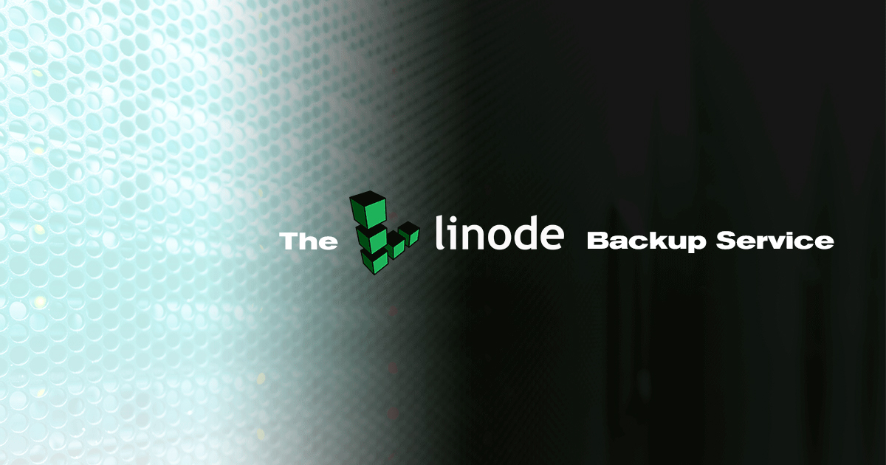
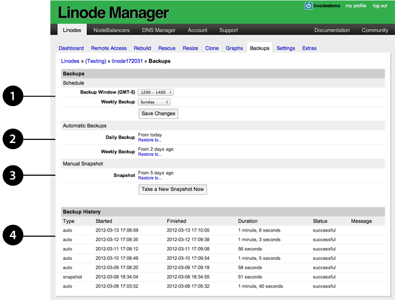
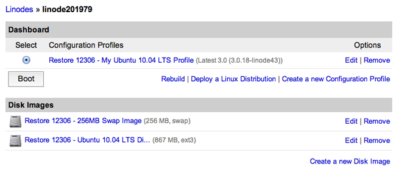

---
author:
  name: Alex Fornuto
description: 'Use the Linode Backup Service to protect and secure your data.'
keywords: ["backup service", "linode platform", "linode backup service", "enable a backup", "manage a backup", "schedule a backup", "disable a backup", "restore from a backup", "boot from a backup", "disk space"]
license: '[CC BY-ND 4.0](https://creativecommons.org/licenses/by-nd/4.0)'
modified: 2019-01-28
modified_by:
  name: Linode
published: 2012-03-14
title: 'The Linode Backup Service'
cloud_manager_link: platform/disk-images/linode-backup-service/
hiddenguide: true
---

The *Linode Backup Service* is a subscription service add-on that automatically performs daily, weekly, and biweekly backups of your Linode. It's affordable, easy to use, and provides peace of mind. This guide explains how to enable and schedule your backups, make a manual backup snapshot, restore from a backup, and disable the Backup Service.

## Pricing

Pricing is per Linode and varies depending upon your Linode's plan:

### Standard Plans

| Service      | Backups Hourly Rate | Backups Monthly
|:-------------|:--------------------|:---------------
| Linode 1GB   | $0.003/hr           | $2/mo
| Linode 2GB   | $0.004/hr           | $2.50/mo
| Linode 4GB   | $0.008/hr           | $5/mo
| Linode 8GB   | $0.016/hr           | $10/mo
| Linode 16GB  | $0.03/hr            | $20/mo
| Linode 32GB  | $0.06/hr            | $40/mo
| Linode 64GB  | $0.12/hr            | $80/mo
| Linode 96GB  | $0.18/hr            | $120/mo
| Linode 128GB  | $0.24/hr           | $160/mo
| Linode 192GB  | $0.36/hr           | $240/mo  |

### High Memory Plans

| Service      | Backups Hourly Rate | Backups Monthly
|:-------------|:--------------------|:---------------
| Linode 24GB  | $0.0075/hr           | $5/mo
| Linode 48GB  | $0.015/hr           | $10/mo
| Linode 90GB  | $0.03/hr            | $20/mo
| Linode 150GB | $0.06/hr            | $40/mo
| Linode 300GB | $0.12/hr            | $80/mo

## Enable the Backup Service

Use the Linode Manager to enable the Backup Service on a Linode. Here's how:

1.  Log in to the [Linode Manager](https://manager.linode.com).
2.  From the **Linodes** tab, select the Linode you want to back up.
3.  Click the **Backups** tab.
4.  Click **Enable backups for this Linode**. The *Complete Your Order* webpage appears.
5.  Review the pro-rated total, and then click **Complete Order**.

The Linode Backup Service is now enabled for the selected Linode.

You can also follow along with this video to enable the Backup Service on your Linode:



### Auto Enroll New Linodes in the Backup Service

You can automatically enroll all new Linodes in the Backup Service. To do so, navigate to the **Account** tab in the Linode Manager, then select the **Account Settings** tab. In the  **Linode Backup Enrollment** section, select the **AUTOMATIC** option and save the change.


Enabling this setting does not retroactively enroll any previously created Linodes in the Backup Service. To enroll your existing Linodes in the Backup Service, click the **Enable backups for all existing Linodes** link in the **Linode Backup Enrollment** section and then confirm your choice in the page that appears.


## Manage Backups

You'll manage your backups with a simple web interface in the Linode Manager. There's no software to install, and there are no commands to run. Just log in to the Linode Manager, click the **Linodes** tab, select a Linode, and then click the **Backups** tab. The backups interface is shown below.

1.  Schedule automated backups. For more information, see [Scheduling Backups](#schedule-backups).
2.  Indicates when the daily and weekly backups were performed. Click the **Restore to...** link to restore a backup to a Linode.
3.  Manually back up your Linode by taking a *manual snapshot*. For more information, see [Taking a Manual Snapshot](#take-a-manual-snapshot).
4.  Review the history to see when backups were created. If there are any error messages, they will also be displayed in this section.

## How Linode Backups Work

Backups are stored on a separate system in the same data center as your Linode. The space required to store the backups is *not* subtracted from your storage space. You can store four backups of your Linode, three of which are automatically generated and rotated:

-   **Daily backup:** Automatically initiated daily within the backup window you select. Less than 24 hours old.
-   **Current week's backup:** Automatically initiated weekly within the backup window, on the day you select. Less than 7 days old.
-   **Last week's backup:** Automatically initiated weekly within the backup window, on the day you select. Between 8 and 14 days old.
-   **Manual Snapshot:** A user-initiated snapshot that stays the same until another snapshot is initiated.

The daily and weekly backups are automatically erased when a new backup is performed. The Linode Backup Service does not keep automated backups older than 8 - 14 days.

## Schedule Backups

You can configure when automatic backups are initiated. Here's how:

1.  From the **Linodes** tab, select the Linode.
2.  Click the **Backups** tab.
3.  Select a time interval from the **Backup Window** menu. The Linode Backup Service will generate all backups between these hours.
4.  Select a day from the **Weekly Backup** menu. This is the day whose backup will be promoted to the weekly slot. The back up will be performed within the backup window you specified in step 3.
5.  Click **Save Changes**.

The Linode Backup Service will backup your Linode according to the schedule you specified.

## Take a Manual Snapshot

You can make a manual backup of your Linode by taking a *snapshot*. Here's how:

1.  From the **Linodes** tab, select the Linode.
2.  Click the **Backups** tab.
3.  Click **Take a New Snapshot Now**.

    
Taking a new snapshot will overwrite a saved snapshot.


4.  A warning appears asking if you would like to overwrite the previous snapshot. Click **OK**.

The Linode Backup Service initiates the manual snapshot. Be patient. Creating the manual snapshot can take several minutes, depending on the size of your Linode and the amount of data you have stored on it. Other Linode Manager jobs for this Linode will not run until the snapshot job has been completed.



### Restore to a Linode in a Different Data Center

To restore a backup to a different data center from the source Linode's location, first restore to a Linode in the same data center, creating a new one if necessary. Once the restore is complete, use the [Clone](/docs/migrate-to-linode/disk-images/clone-your-linode/) tab to copy the disk(s) to a Linode in a different data center.

## Boot from a Backup

After the backup has been restored, the disks and configuration profiles will be available to the Linode you selected. Select the restored configuration profile and reboot your Linode to start up from the restored disks. Here's how:

1.  From the **Linodes** tab, select the Linode that you restored the backup to. The Linode's dashboard appears, as shown below.

    

2.  Select the configuration profile that was restored.
3.  Click **Boot** or **Reboot** to start your Linode from the backup disks.

The Linode will start from the backup disks. Watch the *Host Job Queue* to monitor the progress.

## Cancel the Backup Service

You can cancel the Backup Service at any time. From your Linode's dashboard, choose the **Backups** tab and click the **Cancel Backups** link at the bottom of the page. Cancelling the service will remove your backups from our servers.

## Limitations

There are some limitations to what the Linode Backup Service can back up. Here are some things you should be aware of:

-   The Backup Service must be able to mount your disks. If you've created partitions, configured full disk encryption, or made other changes that prevent us from mounting the disk as a filesystem, you will likely not be able to use the Linode Backup Service. The backup system operates at the file level, not at the block level.
-    Because the Backup Service is file-based, the number of files stored on disk will impact both the time it takes for backups and restores to complete, and your ability to successfully take and restore backups. Customers who need to permanently store a large number of files may want to archive bundles of smaller files into a single file, or consider other backup services.

    
The percentage of customers who may run into this limitation is low. If you are not sure if this limitation applies to you, please [contact Linode Support](/docs/platform/billing-and-support/support/#contacting-linode-support).


-   Backups taken of ext4 or ext3 filesystems will be restored as ext4. Backups taken of other mountable filesystem types will have their contents restored using ext4.
-   Files that have been modified but have the same size and modify time will not be considered "changed" during a subsequent backup. ACLs and extended attributes are *not* tracked.
-   The Backup Service uses a snapshot of your disks to take consistent backups while your Linode is running. This method is very reliable, but can fail to properly back up the data files for database services like MySQL. If the snapshot occurs during a transaction, the database's files may be backed up in an unclean state. We recommend scheduling routine dumps of your database to a file on the filesystem. The resulting file will then be backed up, allowing you to restore the contents of the database if you need to restore from a backup.
