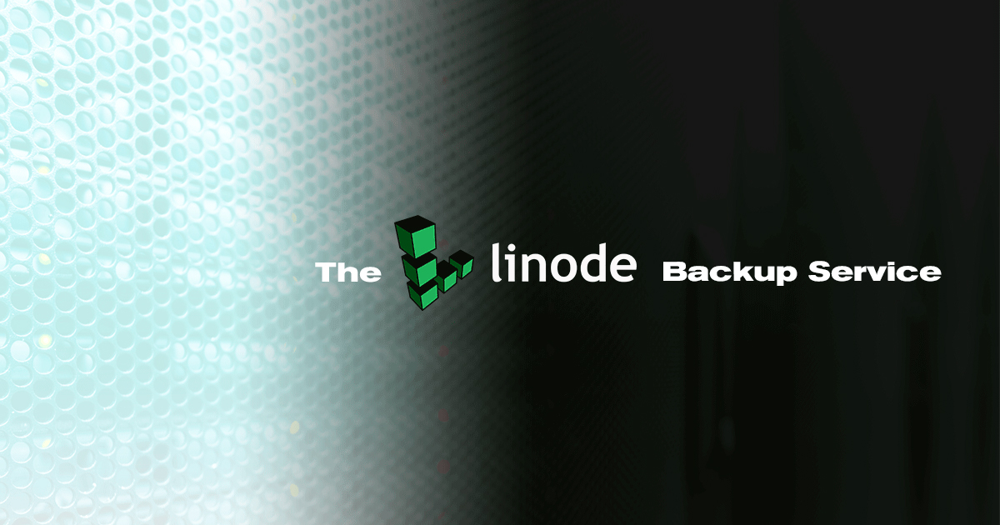
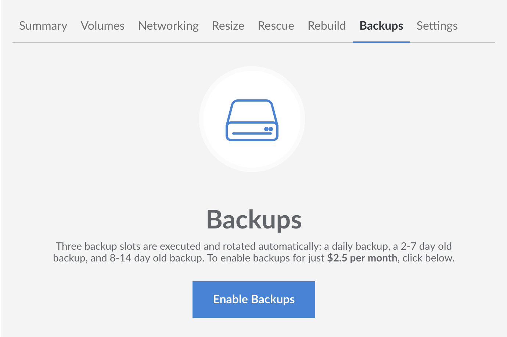
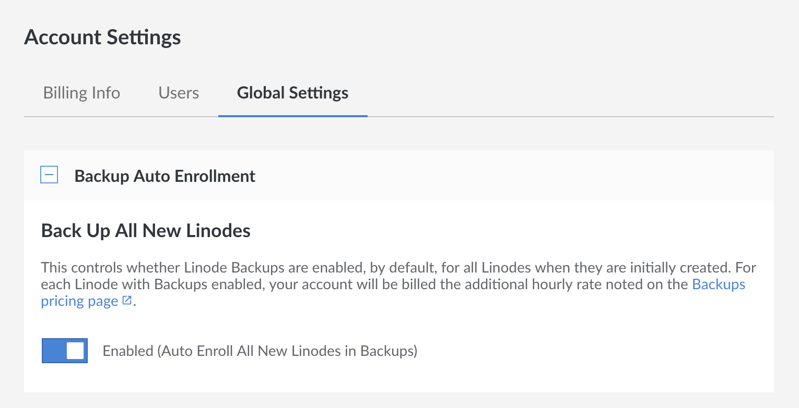
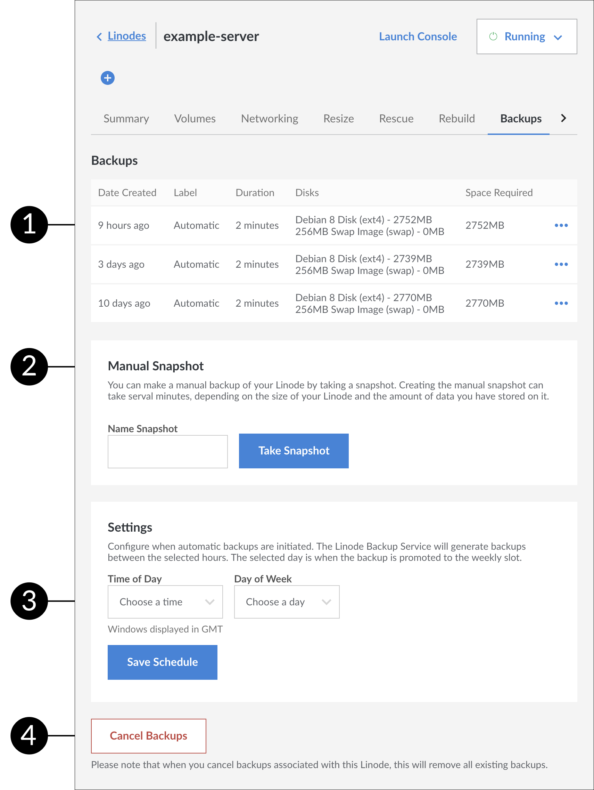
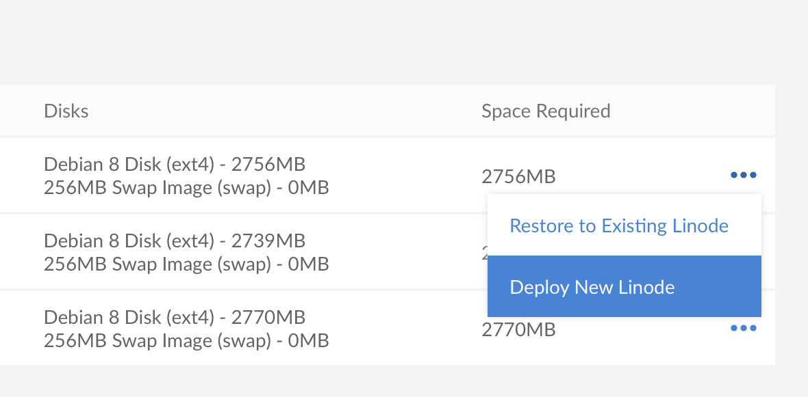
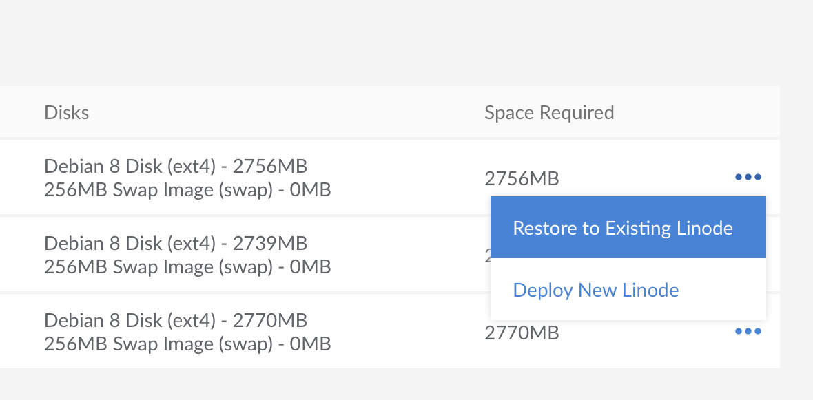
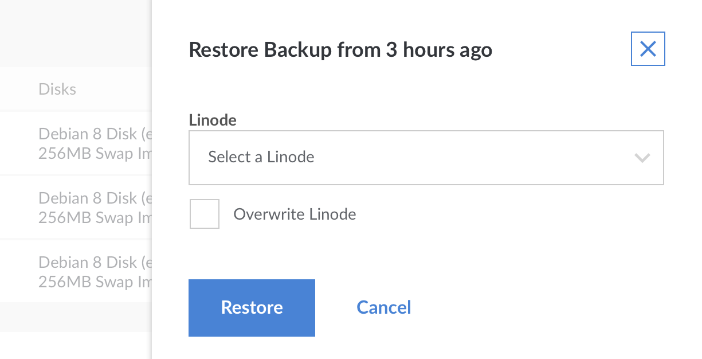
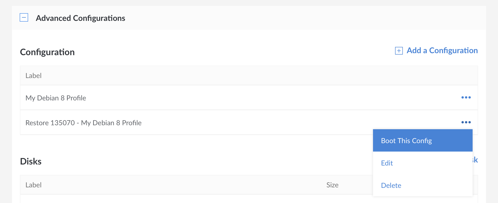

---
author:
  name: Alex Fornuto
description: 'Use the Linode Backup Service to protect and secure your data.'
keywords: ["backup service", "linode platform", "linode backup service", "enable a backup", "manage a backup", "schedule a backup", "disable a backup", "restore from a backup", "boot from a backup"]
license: '[CC BY-ND 4.0](https://creativecommons.org/licenses/by-nd/4.0)'
aliases: ['backup-service/','platform/backup-service/', 'security/backups/linode-backup-service/','platform/linode-backup-service/']
modified: 2018-18-18
modified_by:
  name: Linode
published: 2018-18-18
title: 'The Linode Backup Service'
hiddenguide: true
---

The *Linode Backup Service* is a subscription service add-on that automatically performs daily, weekly, and biweekly backups of your Linode. It's affordable, easy to use, and provides peace of mind. This guide explains how to enable and schedule your backups, make a manual backup snapshot, restore from a backup, and disable the Backup Service.

## Pricing

Pricing is per Linode and varies depending upon your Linode's plan:

### Standard Plans

| Service      | Backups Hourly Rate | Backups Monthly
|:-------------|:--------------------|:---------------
| Linode 1GB   | $0.003/hr           | $2/mo
| Linode 2GB   | $0.004/hr           | $2.50/mo
| Linode 4GB   | $0.008/hr           | $5/mo
| Linode 8GB   | $0.016/hr           | $10/mo
| Linode 16GB  | $0.03/hr            | $20/mo
| Linode 32GB  | $0.06/hr            | $40/mo
| Linode 64GB  | $0.12/hr            | $80/mo
| Linode 96GB  | $0.18/hr            | $120/mo
| Linode 128GB  | $0.24/hr           | $160/mo
| Linode 192GB  | $0.36/hr           | $240/mo  |

### High Memory Plans

| Service      | Backups Hourly Rate | Backups Monthly
|:-------------|:--------------------|:---------------
| Linode 24GB  | $0.0075/hr           | $5/mo
| Linode 48GB  | $0.015/hr           | $10/mo
| Linode 90GB  | $0.03/hr            | $20/mo
| Linode 150GB | $0.06/hr            | $40/mo
| Linode 300GB | $0.12/hr            | $80/mo

## Enable the Backup Service

Use the Linode Manager to enable the Backup Service on a Linode. Here's how:

1.  Log in to the [Linode Cloud Manager](https://cloud.linode.com).
2.  From the **Linodes** screen, select the Linode you want to back up.
3.  Click the **Backups** tab.

    

4.  Click **Enable Backups**.

The Linode Backup Service is now enabled for the selected Linode.

<!-- You can also follow along with this video to enable the Backup Service on your Linode:

 -->

## Auto Enroll All Linodes in the Backup Service

You can automatically enroll all new Linodes in the Backup Service. To do so, navigate to the **Account** page in the left hand navigation, then select the **Global Settings** tab.

Under **Backup Auto Enrollment** click on the toggle button to enable backups on all new Linodes.

## Manage Backups

You'll manage your backups with a simple web interface in the Linode Manager. There's no software to install, and there are no commands to run. Just log in to the Linode Manager, click the **Linodes** tab, select a Linode, and then click the **Backups** tab. The backups interface is shown below.

1. A list of available backups. Listed in this view are the date created, the label, how long the backup took to be created, the disks imaged, and the size of the resulting image.
2. Manually create a backup by taking a *manual snapshot*. For more information, see [Take a Manual Snapshot](#take-a-manual-snapshot).
3. Configure backup schedule settings. For more information, see [Scheduling Backups](#schedule-backups).
4. Cancel backups. After cancelling your backups you will have to wait 24 hours to re-enable them again.

## How Linode Backups Work

Backups are stored on a separate system in the same data center as your Linode. The space required to store the backups is *not* subtracted from your storage space. You can store four backups of your Linode, three of which are automatically generated and rotated:

-   **Daily backup:** Automatically initiated daily within the backup window you select. Less than 24 hours old.
-   **Current week's backup:** Automatically initiated weekly within the backup window, on the day you select. Less than 7 days old.
-   **Last week's backup:** Automatically initiated weekly within the backup window, on the day you select. Between 8 and 14 days old.
-   **Manual Snapshot:** A user-initiated snapshot that stays the same until another snapshot is initiated.

The daily and weekly backups are automatically erased when a new backup is performed. The Linode Backup Service does not keep automated backups older than 8 - 14 days.

## Schedule Backups

You can configure when automatic backups are initiated. Here's how:

1.  From the **Linodes** page, select the Linode.
2.  Click the **Backups** tab.
3.  Under **Settings**, select a time interval from the **Time of Day** menu. The Linode Backup Service will generate all backups between these hours.
4.  Select a day from the **Day of Week** menu. This is the day whose backup will be promoted to the weekly slot. The back up will be performed within the time period you specified in step 3.
5.  Click **Save Changes**.

The Linode Backup Service will backup your Linode according to the schedule you specified.

## Take a Manual Snapshot

You can make a manual backup of your Linode by taking a *snapshot*. Here's how:

1.  From the **Linodes** page, select the Linode.
2.  Click the **Backups** tab.
3.  Under **Manual Snapshot**, give your snapshot a name and click **Take Snapshot**.

    
Taking a new snapshot will overwrite a previously saved snapshot.


The Linode Backup Service initiates the manual snapshot. Be patient. Creating the manual snapshot can take several minutes, depending on the size of your Linode and the amount of data you have stored on it. Other Linode Manager jobs for this Linode will not run until the snapshot job has been completed.

## Restore from a Backup

This section shows how to restore a backup to a [new](#restore-to-a-new-linode) Linode, or to an [existing](#restore-to-an-existing-linode) Linode.

Restoring a backup will create a new [configuration profile](/docs/platform/disk-images/disk-images-and-configuration-profiles/#configuration-profiles) and a new set of [disks](/docs/platform/disk-images/disk-images-and-configuration-profiles/#disks) on your Linode. The restore process does not restore single files or directories automatically. Restoring particular files can be done by completing a normal restore, copying the files off of the new disks, and then removing the disks afterward.


The size of the disk(s) created by the restore process will only be slightly larger than the total size of the files restored. This means that the disk(s) created will be 'full'.

Some applications, like databases, need some amount of free unused space inside the disk in order to run. As a result, you may want to [increase your disk(s) size](/docs/platform/disk-images/resizing-a-linode/) after the restore process is completed.


To restore a backup to a different data center, first restore to a Linode in the same data center, creating a new one if necessary. Once the restore is complete, use the [Clone](/docs/migrate-to-linode/disk-images/clone-your-linode/) tab to copy the disk(s) to a Linode in a different data center.

### Restore to a New Linode

You can restore a backup to any Linode located in the same data center, even if the target does not have the Backup Service enabled. This section covers how to restore a backup to a new Linode that does not have any disks deployed to it. If you wish to restore your backup to an existing Linode, see the [next section](#restore-to-an-existing-linode).

1.  From the Dashboard of the Linode whose backups you intend to restore, click on the **Backups** tab. Select the ellipsis (three dots) next to the backup you would like to restore, and click **Deploy New Linode**.

    

2.  You will be taken to the **Create New Linode** screen and navigated to the **Create from Backup** tab. Select a Linode plan and label and click **Create**. The new Linode will be created with the same password and SSH keys (if any) as the original.

    The backup disks and configuration profiles will be restored to the Linode you selected. Watch the notifications area for updates on the process. Restoring from a backup can take several minutes depending on the size of your Linode and the amount of data you have stored on it.

### Restore to an Existing Linode

To restore a backup to an existing Linode, you will need to make sure that you have enough storage space that is not currently assigned to disk images.


If you are attempting to restore a disk to the same Linode the backup was created from, the restoration process will not delete the original disk for you. Manually delete the original disk to make room for the backup.


1.  Start by confirming the size of the backup that you wish to restore. From the **Backups** tab in your Linode's Dashboard, select the ellipsis (three dots) next to the backup you would like to restore, and click **Restore to Existing Linode**.

    

2.  A menu will open with the Linodes that you can restore to. Select a Linode and click **Restore**.

    

    You will be notified if you do not have enough space on your Linode to restore your backup. Optionally, you can choose to overwrite the Linode you are restoring to.

    As an example, if the total size of the backup comes to 3107MB, this means you would need at least that much free space to restore the backup to your Linode.

3.  If the amount of space available is greater than the size of the backup, you can proceed with restoring. If the amount of unallocated space is less than the size of the backup, you can [resize your existing disks](/docs/platform/disk-images/disk-images-and-configuration-profiles/#resizing-a-disk) to make room for it.

    
In some cases, you will not be able to shrink your disks enough to fit the restored backup. As an alternative, you can [change your Linode's plan](/docs/platform/disk-images/resizing-a-linode/) to a higher tier that offers more disk space.


4.  You'll be notified in your notifications area once the disk resize has completed.

5.  From the **Restore to Existing Linode** menu, click **Restore**.

    Your backup will begin restoring to your Linode, and you can monitor its progress in the notifications area. Note that the time it takes to restore your backup will vary depending upon the restore size, and the number of files being restored.

## Boot from a Backup

After the backup has been restored, the disks and configuration profiles will be available to the Linode you selected. Select the restored configuration profile and reboot your Linode to start up from the restored disks. Here's how:

1.  From the **Linodes** tab, select the Linode that you restored the backup to. Navigate to the **Settingst** tab and open the **Advanced Configurations** section.
2.  Select the ellipsis icon (three dots) next to the configuration profile that was restored and select **Boot This Config**.

    

The Linode will start from the backup disks. Monitor the notifications area for progress.

## Cancel the Backup Service

You can cancel the Backup Service at any time. From your Linode's dashboard, choose the **Backups** tab and click the **Cancel Backups** link at the bottom of the page. Cancelling the service will remove your backups from our servers.

## Limitations

There are some limitations to what the Linode Backup Service can back up. Here are some things you should be aware of:

-   The Backup Service must be able to mount your disks. If you've created partitions, configured full disk encryption, or made other changes that prevent us from mounting the disk as a filesystem, you will likely not be able to use the Linode Backup Service. The backup system operates at the file level, not at the block level.
-    Because the Backup Service is file-based, the number of files stored on disk will impact both the time it takes for backups and restores to complete, and your ability to successfully take and restore backups. Customers who need to permanently store a large number of files may want to archive bundles of smaller files into a single file, or consider other backup services.
-   Backups taken of ext4 or ext3 filesystems will be restored as ext4. Backups taken of other mountable filesystem types will have their contents restored using ext4.
-   Files that have been modified but have the same size and modify time will not be considered "changed" during a subsequent backup. ACLs and extended attributes are *not* tracked.
-   The Backup Service uses a snapshot of your disks to take consistent backups while your Linode is running. This method is very reliable, but can fail to properly back up the data files for database services like MySQL. If the snapshot occurs during a transaction, the database's files may be backed up in an unclean state. We recommend scheduling routine dumps of your database to a file on the filesystem. The resulting file will then be backed up, allowing you to restore the contents of the database if you need to restore from a backup.
