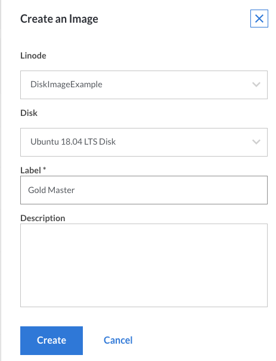
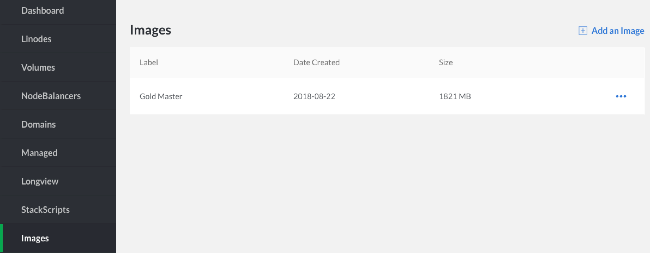
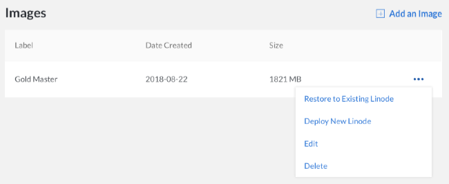
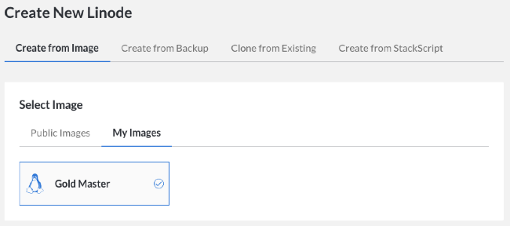

---
author:
  name: Linode
  email: docs@linode.com
description: How to retain Disks with the Linode Images service
keywords: ["linode Images", " imagize"]
license: '[CC BY-ND 4.0](https://creativecommons.org/licenses/by-nd/4.0)'
aliases: ['linode-images/','platform/linode-images/']
modified: 2018-08-22
modified_by:
  name: Linode
published: 2014-09-25
title: Linode Images
hiddenguide: true
---

*Linode Images* allows you to take snapshots of your disks, and then deploy them to any Linode under your account. This can be useful for bootstrapping a master image for a large deployment, or retaining a disk for a configuration that you may not need running, but wish to return to in the future. Linode Images will be retained whether or not you have an active Linode on your account, which also makes them useful for long term storage of a private template that you may need in the future. There is no additional charge to store Images for Linode users, with a limit of 2GB per Image and 3 Images per account.


When saving a Linode image it is the aspects of the Linode that are on the **disk** that are saved, not any additional aspects such as IP addresses, fully qualified domain names, and MAC addresses.


## Capturing Your Image

Linode Images captures an exact copy of your disk at the moment when the process is kicked off. Here's how to capture your first image.


While an image can be captured while your Linode is running, we would recommend shutting your Linode down first if you are running any active databases. Capturing an image that includes a running database can cause corruption or data loss in the imaged copy of the database.


1.  Navigate to your the Images page in the Linode Manager and select **Add an Image**.

    

2.  In the **Create an Image** menu select the Linode and disk you would like to freeze, and provide a label. You may also add an optional description of the image. Then, click **Create**..

    

3.  Once you click the **Submit** button, your image will be frozen for later use. You can view the progress under the bell notifications at the top of the page.

    

    
Linode Images are limited to 2048MB of data per disk.  You will need to ensure that data within your disk does not exceed this size limit.


    Once the job has completed, your Linode's disk has been captured and stored.

## Managing Your Images

The images captured from your Linodes are stored for future usage, and can be modified or removed at any time.

1.  Click on the **Images** page.

    

2.  From this page, you can delete existing disks, edit labels and descriptions, and deploy linodes from disk images.

    

## Deploy From A Saved Image

Deploying one of your saved images to any Linode under your account is a simple process.

1.  Navigate to the **Images** page, open the menu for the Image from which you would like to deploy, and select **Deploy New Linode**.

    

2.  Select your Image from *My Images* under the *Create from Image* tab.

    

3.  Select your desired Region, Linode Plan, Label, and set your root password, then click **Create** to create a Linode with your saved image.

    

Once you've completed these steps, your saved image will be deployed on your new Linode.
