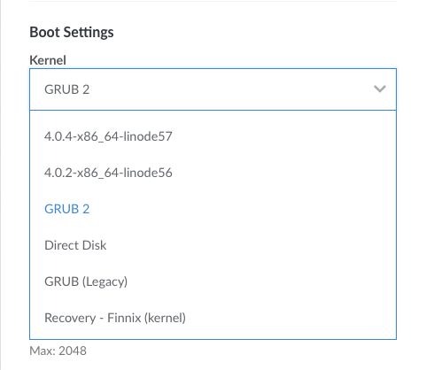
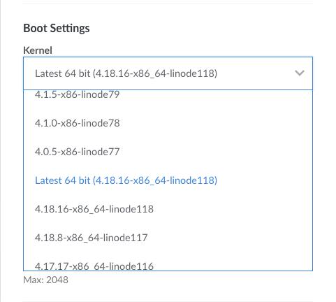
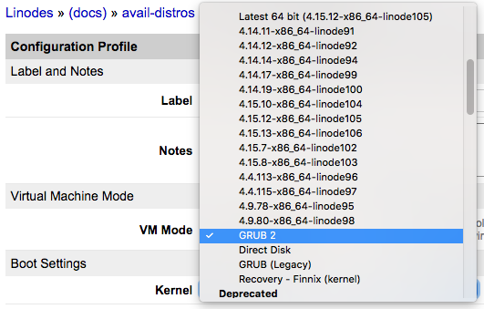
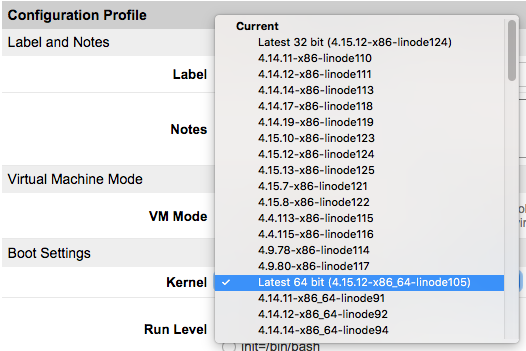
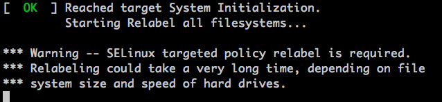

---
author:
  name: Linode
  email: docs@linode.com
description: 'Use the Linode Manager to change which kernel your Linode boots.'
keywords: ["kernel", "grub"]
license: '[CC BY-ND 4.0](http://creativecommons.org/licenses/by-nd/4.0/)'
aliases: ['run-a-distribution-supplied-kernel-with-kvm/','tools-reference/custom-kernels-distros/run-a-distribution-supplied-kernel/','tools-reference/custom-kernels-distros/run-a-distribution-supplied-kernel-with-kvm/']
modified: 2018-11-08
modified_by:
  name: Linode
published: 2015-06-29
title: How to Change your Linode's Kernel
---

This guide is about changing your Linode's kernel to an upstream kernel, a Linode kernel, or a kernel that you compile from source. For information on updating your Linode's current kernel, check out the [How to Update your Linode's Existing Kernel](/docs/platform/update-kernel/) guide.

## Which Kernel Am I Running?

Your Linode is capable of running one of three kinds of kernels:

-   An *upstream* kernel that is maintained and provided by your Linux distribution's authors (this is also referred to as the *distribution-supplied* kernel).

-   The Linode kernel. Linode maintains an up-to-date kernel: Linode's engineering team monitors for new versions of the Linux kernel and then packages them for users shortly after they are available. These kernels are not installed on your filesystem--instead, the Linode Manager supplies them at boot time to your system.

    
A version history for Linode's kernel is available [here](https://www.linode.com/kernels).


-   A kernel that you compile from source.

Most distributions that can be deployed from the Linode Manager boot the upstream kernel by default. CentOS 6, OpenSUSE Leap 42.3, Slackware, and Ubuntu 14.04, and older distributions are exceptions to this rule, and they boot the Linode kernel by default.

This guide demonstrates using the Linode Manager to change which kernel a KVM-based Linode will boot.

## Why Use Each Kernel?

The different kinds of kernels you can use offer different benefits:

-   The upstream kernel may support features not present in the Linode kernel (for example, [SELinux](/docs/security/getting-started-with-selinux/)). The upstream kernel is easily installed and updated from your distribution's package management system.

-   The Linode kernel is quick to update and does not require you to enter any terminal commands: if you're using the Linode kernel marked as *latest*, then you just need to reboot in order to update it.

-   Compiling a kernel can let you use features not available in the upstream or Linode kernels, but it takes longer to compile the kernel from source than to download it from your package manager.

## How to Switch your Kernel

1.  Select the Linode from the *Dashboard* and click the **Advanced** tab.

1. Find your current *Configuration*, click on the corresponding ellipses (**...**) menu and select **Edit**.

1.  Scroll to the *Boot Settings* section.

1.  Observe the **Kernel** dropdown menu. Depending on your distribution, this will be set to either `GRUB 2` or `Latest 64 bit (<kernel version>-x86_64-linode<linode kernel release number>)`.

    

1.  To use Linode's kernel, select `Latest 64 bit (<kernel version>-x86_64-linode)` from the Kernel menu. To change to the upstream kernel, or to use a kernel you've compiled from source, select `GRUB 2`. For more information on custom compiled kernels, review our guides for [Debian, Ubuntu,](/docs/tools-reference/custom-kernels-distros/custom-compiled-kernel-debian-ubuntu/) and [CentOS](/docs/tools-reference/custom-kernels-distros/custom-compiled-kernel-centos-7/).

    

1.  Click **Submit** at the bottom of the page and reboot into the new kernel.

1.  Once booted, you can verify the kernel information with `uname`:

        uname -r

    
4.17.15-x86_64-linode115


    You can switch back to your previous kernel setting at any time by repeating the steps above for the kernel of your choice.

<!-- ## How to Switch your Kernel

1.  Shut down your Linode from the Linode Manager.

2.  Click **Edit** to view a distribution's configuration profile options:

    

3.  Observe the **Kernel** dropdown menu under **Boot Settings**. Depending on your distribution, this will be set to either `GRUB 2` or `Latest 64 bit (<kernel version>-x86_64-linode<linode kernel release number>)`.

    

4.  To use Linode's kernel, select `Latest 64 bit (<kernel version>-x86_64-linode)` from the Kernel menu. To change to the upstream kernel, or to use a kernel you've compiled from source, select `GRUB 2`. For more information on custom compiled kernels, review our guides for [Debian, Ubuntu,](/docs/tools-reference/custom-kernels-distros/custom-compiled-kernel-debian-ubuntu/) and [CentOS](/docs/tools-reference/custom-kernels-distros/custom-compiled-kernel-centos-7/).

    

5.  Click **Save Changes** at the bottom of the page and reboot into the new kernel.

6.  Once booted, you can verify the kernel information with `uname`:

        [root@archlinux ~]# uname -r
        4.15.14-1-ARCH

    You can switch back to your previous kernel setting at any time by repeating the steps above for the kernel of your choice. -->

## Caveats when Booting under GRUB 2

### SELinux

CentOS 7 and Fedora ship with [SELinux](/docs/security/getting-started-with-selinux/) running in enforcing mode by default. When switching from the Linode kernel to the upstream kernel, SELinux may need to relabel your filesystem at boot. When the relabeling completes, the Linode will shut down. If you have [Lassie](/docs/uptime/monitoring-and-maintaining-your-server/#configure-shutdown-watchdog) enabled, the Linode Manager will automatically boot your Linode again following the shut down. If you do not have Lassie enabled, you will need to manually reboot from the Linode Manager.

You can trigger the relabel process by creating an empty `/.autorelabel` file and then rebooting:

    touch /.autorelabel

### No Upstream Kernel Installed

If your system does not boot and instead shows a GRUB command line prompt in Lish like shown below, then you need to install the kernel and configure GRUB. **This should only be necessary on Linodes which were created before February 2017.** If this is the case, switch back to the Linode kernel in your configuration profile, reboot your Linode, and then follow this guide's instructions for installing the kernel.

## Install the Upstream Kernel


This guide is written for a non-root user. Some commands may require elevated privileges and should be prefixed with `sudo`. If you're not familiar with the `sudo` command, visit our [Users and Groups](/docs/tools-reference/linux-users-and-groups/) guide.

All configuration files should be edited with elevated privileges. Remember to include `sudo` before running your text editor.



Most distributions that can be deployed from the Linode Manager boot the upstream kernel by default. CentOS 6, OpenSUSE Leap 42.3, Slackware, and Ubuntu 14.04, and older distributions are exceptions to this rule, and they boot the Linode kernel by default.


1.  Update your package management system:

    **Arch Linux**

        pacman -Syu

    **CentOS**

        yum update

    **Debian/Ubuntu**

        apt update

    **Gentoo**

        emerge -avDuN world

1.  Install the Linux kernel and GRUB 2. Choose `/dev/sda` if you're asked which disk to install to during installation. Linode provides the GRUB bootloader, so your system only needs to provide a `grub.cfg` file.

    **Arch Linux**

        pacman -S linux grub

    **CentOS 6**

        yum install kernel grub

    **CentOS 7**

        yum install kernel grub2

    **Debian**

        apt-get install linux-image-amd64 grub2

    **Gentoo**

    There are two main ways to install Gentoo's kernel: Manual configuration and using the `genkernel` tool. Which you use and how you configure the kernel will depend on your preferences, so see the [Gentoo Handbook](https://wiki.gentoo.org/wiki/Handbook:AMD64/Installation/Kernel) for instructions.

    **Ubuntu**

        apt install linux-generic grub2

When the installation finishes, you'll see the kernel and other components in the `/boot` directory. For example:


[root@archlinux ~]# ls /boot
grub  initramfs-linux-fallback.img  initramfs-linux.img  vmlinuz-linux


### Configure GRUB

After the kernel is installed, you'll need to configure the serial console and other GRUB settings so you can use [Lish](/docs/platform/manager/using-the-linode-shell-lish/) and [Glish](/docs/platform/manager/using-the-linode-graphical-shell-glish/).

1.  Open `/etc/default/grub` in a text editor and go to the line beginning with `GRUB_CMDLINE_LINUX`. Remove the word `quiet` if present, and add `console=ttyS0,19200n8 net.ifnames=0`. Leave the other entries in the line. For example, on CentOS 7 you should have something similar to:

        GRUB_CMDLINE_LINUX="crashkernel=auto rhgb console=ttyS0,19200n8 net.ifnames=0"

1.  Add or change the options in `/etc/default/grub` to match the following snippet. There will be other variables in this file, but the current changes are only focused on these lines.

    
GRUB_TERMINAL=serial
GRUB_DISABLE_OS_PROBER=true
GRUB_SERIAL_COMMAND="serial --speed=19200 --unit=0 --word=8 --parity=no --stop=1"
GRUB_DISABLE_LINUX_UUID=true
GRUB_GFXPAYLOAD_LINUX=text



1.  Prepare and update the bootloader:

    **Arch and Gentoo**

        grub-mkconfig -o /boot/grub/grub.cfg

    **CentOS**

    The `.autorelabel` file is necessary to queue the SELinux filesystem relabeling process when rebooting from the Linode kernel to the CentOS kernel.

        mkdir /boot/grub
        ln -s /boot/grub2/grub.cfg /boot/grub/grub.cfg
        grub2-mkconfig -o /boot/grub/grub.cfg
        touch /.autorelabel

    **Debian and Ubuntu**

        update-grub
