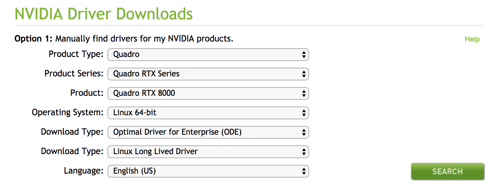

---
author:
  name: Linode
  email: docs@linode.com
description: 'Getting Started With GPU Linodes.'
keywords: ["", "grub"]
license: '[CC BY-ND 4.0](http://creativecommons.org/licenses/by-nd/4.0/)'
aliases: []
published: 2019-05-22
title: Getting Started With GPU Linodes
modified_by:
  name: Linode
---

The following guide will help you to get your dedicated GPU up and running on a number of popular distributions. In all cases where possible, this guide will use [NVIDIA's CUDA Toolkit](https://developer.nvidia.com/cuda-toolkit) to install the necessary NVIDIA driver.  For distributions like Debian 9 in which `CUDA` is not officially supported, the guide will show you how to manually install the NVIDIA driver only.

## Before You Begin

1. Follow our [Getting Started](https://www.linode.com/docs/getting-started/) and [Securing Your Server](https://www.linode.com/docs/security/securing-your-server/) guides for instructions on setting up your Linodes.

1. Make sure that your GPU is currently available:

        lspci -vnn | grep NVIDIA

    You should see something similar to the following, confirming that your Linode is currently running an NVIDIA GPU:

    
00:03.0 VGA compatible controller [0300]: NVIDIA Corporation TU102GL [Quadro RTX 6000/8000] [10de:1e30] (rev a1) (prog-if 00 [VGA controller])
    Subsystem: NVIDIA Corporation Quadro RTX 6000 [10de:12ba]


    
Depending on your distribution, you may need to install lspci manually first. On current RedHat and RHEL operating systems, you can install this utility with the following command:

    yum install pciutils


## Install Dependencies

Some dependencies may need to be installed prior to installing your driver. Listed below are the steps for installing these packages on many popular distributions:

### Ubuntu 18

    sudo apt-get install build-essential

### Debian 9

    sudo apt-get install build-essential
    sudo apt-get install linux-headers-`uname -r`

### CentOS 7
    sudo yum install kernel-devel-$(uname -r) kernel-headers-$(uname -r)
    sudo yum install wget
    sudo yum -y install gcc

### OpenSUSE
    zypper install gcc
    zypper install kernel-source

Issue a reboot to make sure you can use the missing kernel headers.

## Installing with CUDA

 This section of the guide will highlight how to install your GPU driver using [NVIDIA's Cuda Toolkit](https://developer.nvidia.com/cuda-toolkit), currently fully supported on CentOS 7,OpenSUSE, and other popular distributions. Optionally, you can also choose to install the full toolkit in it's entirety to gain access to a set of tools that will empower you to create GPU-accelerated applications.

1. Download the latest version of the installer from [CUDA's Downloads Page](https://developer.nvidia.com/cuda-downloads). From the "Select Target Platform" box, you want to select Linux, x86_64, the distribution you're using, the version number, and the installer type as "runfile (local)". Select the Download button to download the installer file on to your device and upload it to your GPU Linode. In our case, we used [Wget](https://www.linode.com/docs/quick-answers/linux/how-to-use-wget/) to download the file directly to our Linode.

        wget https://developer.nvidia.com/compute/cuda/10.1/Prod/local_installers/cuda_10.1.168_418.67_linux.run

1. Run your version of the installer script on your Linode to begin the installation process:

        sudo sh cuda_10.1.168_418.67_linux.run

    
The installer will take a few moments to run before generating any output. A full install will take several minutes to fully complete.


1. Read and accept the License Agreement.

1. Choose to install the CUDA Toolkit in it's entirety or partially. To use your GPU, you only need to install the driver, however the CUDA toolkit has additional functionality that may be useful depending on your use case. To only install the driver, uncheck all options directly below the Driver option. This would result in your screen resembling the following:

    

    

Installation on CentOS and RHEL operating systems will fail following this as the installer requires a reboot to fully remove the default Nouveau driver. Reboot, run the installer again, and your installation will be successful.



1. Once the installation has completed, use `nvidia-smi` to make sure that you're currently using your NVIDIA GPU with it's associated driver:

        nvidia-smi

    You should see output similar to the following:

    
+-----------------------------------------------------------------------------+
| NVIDIA-SMI 418.67       Driver Version: 418.67       CUDA Version: 10.1     |
|-------------------------------+----------------------+----------------------+
| GPU  Name        Persistence-M| Bus-Id        Disp.A | Volatile Uncorr. ECC |
| Fan  Temp  Perf  Pwr:Usage/Cap|         Memory-Usage | GPU-Util  Compute M. |
|===============================+======================+======================|
|   0  Tesla M60           Off  | 00000000:00:1E.0 Off |                    0 |
| N/A   29C    P0    42W / 150W |      0MiB /  7618MiB |     98%      Default |
+-------------------------------+----------------------+----------------------+

+-----------------------------------------------------------------------------+
| Processes:                                                       GPU Memory |
|  GPU       PID   Type   Process name                             Usage      |
|=============================================================================|
|  No running processes found                                                 |
+-----------------------------------------------------------------------------+


    In the output above, we can see that our Driver is installed and functioning correctly, the version of CUDA attributed to it, and other useful statistics.

## Manual Install

This section will walk you through the process of downloading and installing the latest NVIDIA driver on Debian 9. This process can be completed similarly on a Distro of your choice if needed:

1. Find the latest Driver from NVIDIA's [Driver Downloads Page](https://www.nvidia.com/Download/index.aspx?lang=en-us).

1. Make sure that the options from the drop-down menus reflect the following:

    

1. Select "Search", "Download", and download the Linux driver that appears on the following screen to your Linode.

1. Run the script to install the driver. Follow the prompts as necessary:

        sudo bash NVIDIA-Linux-x86_64-430.14.run

1. Select `OK` and `Yes` for all prompts as they appear.

1. Once the installer has completed, use `nvidia-smi` to make sure that you're currently using your NVIDIA GPU with it's associated driver:

        nvidia-smi