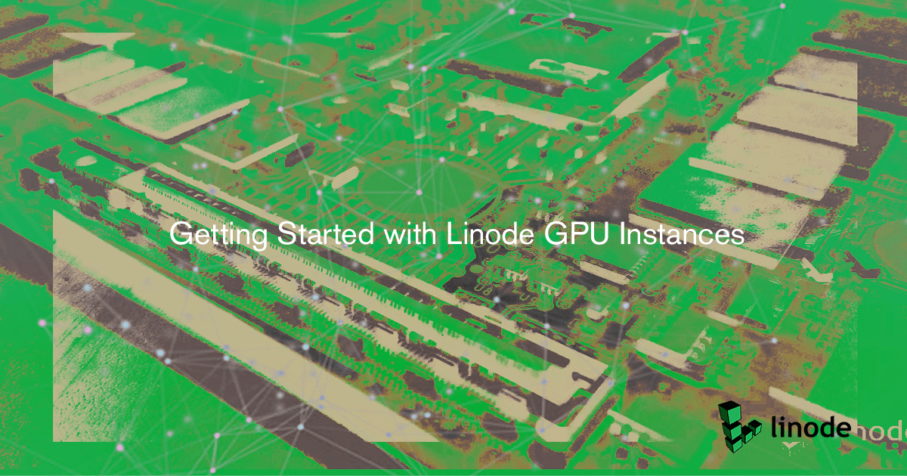
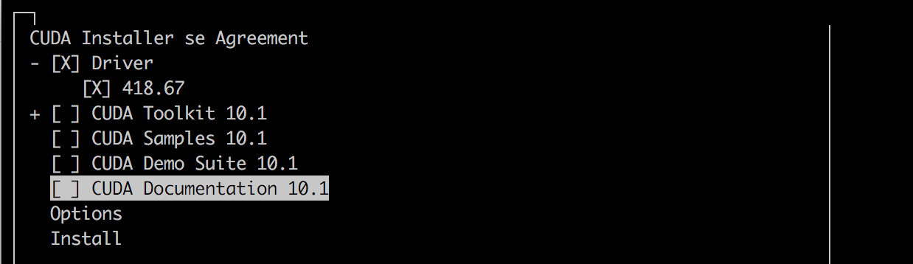
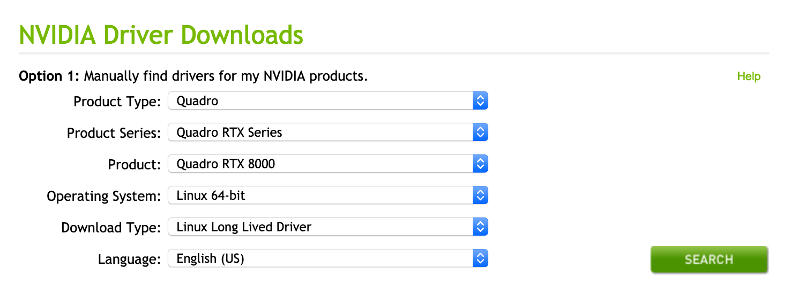
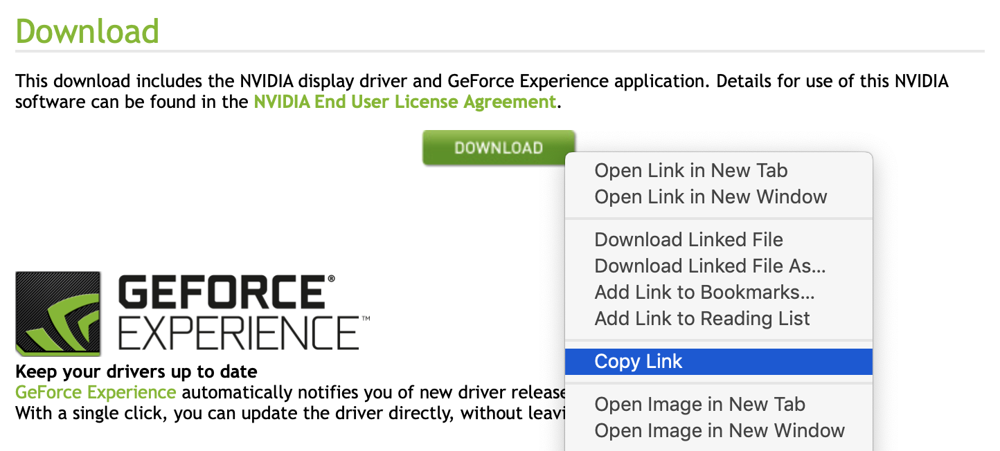

---
author:
  name: Linode
  email: docs@linode.com
description: 'Getting Started with Linode GPU Instances.'
keywords: ["GPU", "AI", "Machine Learning", "Video Encoding", "Linode GPU"]
license: '[CC BY-ND 4.0](http://creativecommons.org/licenses/by-nd/4.0/)'
aliases: []
published: 2019-06-05
title: Getting Started with Linode GPU Instances
modified_by:
  name: Linode
---

This guide will help you get your Linode GPU Instance up and running on a number of popular distributions. To prepare your Linode, you will need to install NVIDIA's proprietary drivers using [NVIDIA's CUDA Toolkit](https://developer.nvidia.com/cuda-toolkit).

When using distributions that are not fully supported by CUDA, like Debian 9, you can install the NVIDIA driver without the CUDA toolkit. To only install the NVIDIA driver, complete the [Before You Begin](#before-you-begin) section and then move on to the [Manual Install](#install-manually) section of this guide.

For details on the CUDA Toolkit's full feature set, see the [official documentation](https://docs.nvidia.com/cuda/cuda-installation-guide-linux/index.html#introduction).


Linode has chosen not to bundle NVIDIA's proprietary closed-source drivers with its standard Linux distribution images. While some operating systems are packaged with the open source [Nouveau](https://nouveau.freedesktop.org/wiki/) driver, the NVIDIA proprietary driver will provide optimal performance for your GPU-accelerated applications.


## Before You Begin

1. Follow our [Getting Started](https://www.linode.com/docs/getting-started/) and [Securing Your Server](https://www.linode.com/docs/security/securing-your-server/) guides for instructions on setting up your Linodes.

1. Make sure that your GPU is currently available on your deployed Linode:

        lspci -vnn | grep NVIDIA

    You should see a similar output confirming that your Linode is currently running a NVIDIA GPU. The example output was generated on Ubuntu 18.04. Your output may vary depending on your distribution.

    
00:03.0 VGA compatible controller [0300]: NVIDIA Corporation TU102GL [Quadro RTX 6000/8000] [10de:1e30] (rev a1) (prog-if 00 [VGA controller])
    Subsystem: NVIDIA Corporation Quadro RTX 6000 [10de:12ba]


    
Depending on your distribution, you may need to install lspci manually first. On current CentOS and Fedora systems, you can install this utility with the following command:

    sudo yum install pciutils


1. Move on to the next section to [install the dependencies](#install-nvidia-driver-dependencies) that NVIDIA's drivers rely on.

## Install NVIDIA Driver Dependencies

Prior to installing the driver, you should install the required dependencies. Listed below are commands for installing these packages on many popular distributions.

1. Find your Linode's distribution from the list below and install the NVIDIA driver's dependencies:

    ### Ubuntu 18.04

        sudo apt-get install build-essential

    ### Debian 9

        sudo apt-get install build-essential
        sudo apt-get install linux-headers-`uname -r`

    ### CentOS 7
        sudo yum install kernel-devel-$(uname -r) kernel-headers-$(uname -r)
        sudo yum install wget
        sudo yum -y install gcc

    ### OpenSUSE
        zypper install gcc
        zypper install kernel-source

1. After installing the dependencies, reboot your Linode from the [Cloud Manager](https://cloud.linode.com). Rebooting will ensure that any newly installed kernel headers are available for use.

## NVIDIA Driver Installation

After installing the required dependencies for your Linux distribution, you are ready to install the NVIDIA driver. If you are using Ubuntu 18.04, CentOS 7, and OpenSUSE, proceed to the [Install with CUDA](#install-with-cuda) section. If you are using Debian 9, proceed to the [Install Manually](#install-manually) section.
### Install with CUDA

 In this section, you will install your GPU driver using [NVIDIA's CUDA Toolkit](https://developer.nvidia.com/cuda-toolkit).
 For a full list of native Linux distribution support in CUDA, see the [CUDA toolkit documentation](https://docs.nvidia.com/cuda/cuda-installation-guide-linux/index.html#system-requirements).

1. Visit the [CUDA Downloads Page](https://developer.nvidia.com/cuda-downloads) and navigate to the **Select Target Platform** section.

1. Provide information about your target platform by following the prompts and selecting the appropriate options. Once complete, you will gain access to the correct download link for the CUDA Toolkit installer. Use the table below for guidance on how to respond to each prompt:

    | **Prompt** | **Selection** |
    |--------|-----------|
    | Operating System | Linux |
    | Architecture | x86_64 |
    | Distribution | Your Linode's distribution |
    | Version | Your distribution's version |
    | Installer type | runfile (local) |

    A completed set of selections will resemble the example:

    

1.  A **Download Installer** section will appear below the **Select Target Platform** section. The green **Download** button in this section will link to the installer file. Copy this link to your computer's clipboard:

    

1.  On your Linode, enter the `wget` command and paste in the download link you copied. This example shows the syntax for the command, but you should make sure to use the download link appropriate for your Linode:

        wget https://developer.nvidia.com/compute/cuda/10.1/Prod/local_installers/cuda_10.1.168_418.67_linux.run

1. After wget completes, run your version of the installer script to begin the installation process:

        sudo sh cuda_*_linux.run

    
The installer will take a few moments to run before generating any output.


1. Read and accept the License Agreement.

1. Choose to install the CUDA Toolkit in its entirety or partially. To use your GPU, you only need to install the driver. Optionally, you can choose to install the full toolkit to gain access to a set of tools that will empower you to create GPU-accelerated applications.

    To only install the driver, uncheck all options directly below the Driver option. This will result in your screen resembling the following:

    

1. Once you have checked your desired options, select **Install** to begin the installation. A full install will take several minutes to complete.

    

Installation on CentOS and Fedora will fail following this step, because the installer requires a reboot to fully remove the default Nouveau driver. If you are running either of these operating systems, reboot the Linode, run the installer again, and your installation will be successful.



1. When the installation has completed, run the `nvidia-smi` command to make sure that you're currently using your NVIDIA GPU device with its associated driver:

        nvidia-smi

    You should see a similar output:

        +-----------------------------------------------------------------------------+
        | NVIDIA-SMI 418.67       Driver Version: 418.67       CUDA Version: 10.1     |
        |-------------------------------+----------------------+----------------------+
        | GPU  Name        Persistence-M| Bus-Id        Disp.A | Volatile Uncorr. ECC |
        | Fan  Temp  Perf  Pwr:Usage/Cap|         Memory-Usage | GPU-Util  Compute M. |
        |===============================+======================+======================|
        |   0  Quadro RTX 6000     Off  | 00000000:00:03.0 Off |                  Off |
        | 34%   57C    P0    72W / 260W |      0MiB / 24190MiB |      0%      Default |
        +-------------------------------+----------------------+----------------------+

        +-----------------------------------------------------------------------------+
        | Processes:                                                       GPU Memory |
        |  GPU       PID   Type   Process name                             Usage      |
        |=============================================================================|
        |  No running processes found                                                 |
        +-----------------------------------------------------------------------------+

    In the output, you can see that the driver is installed and functioning correctly, the version of CUDA attributed to it, and other useful statistics.

### Install Manually

This section will walk you through the process of downloading and installing the latest NVIDIA driver on Debian 9. This process can also be completed on another distribution of your choice, if needed:

1. Visit NVIDIA's [Driver Downloads Page](https://www.nvidia.com/Download/index.aspx?lang=en-us).

1. Make sure that the options from the drop-down menus reflect the following values:

    | **Prompt** | **Selection** |
    |--------|-----------|
    | Product Type | Quadro |
    | Product Series | Quadro RTX Series |
    | Product | Quadro RTX 8000 |
    | Operating System | Linux 64-bit |
    | Download Type | Linux Long Lived Driver |
    | Language | English (US) |

    The form will look as follows when completed:

    

1. Click the **Search** button, and a page will appear that shows information about the driver. Click the green **Download** button on this page. The file will not download to your computer; instead, you will be taken to another download confirmation page.

1. Copy the link for the driver installer script from the green **Download** button on this page:

    

1.  On your Linode, enter the `wget` command and paste in the download link you copied. This example shows the syntax for the command, but you should make sure to use the download link you copied from NVIDIA's site:

        wget http://us.download.nvidia.com/XFree86/Linux-x86_64/430.26/NVIDIA-Linux-x86_64-430.26.run

1. After wget completes, run your version of the installer script on your Linode. Follow the prompts as necessary:

        sudo bash NVIDIA-Linux-x86_64-*.run

1. Select `OK` and `Yes` for all prompts as they appear.

1. Once the installer has completed, use `nvidia-smi` to make sure that you're currently using your NVIDIA GPU with its associated driver:

        nvidia-smi

    You should see a similar output:

        +-----------------------------------------------------------------------------+
        | NVIDIA-SMI 430.26       Driver Version: 430.26       CUDA Version: 10.2     |
        |-------------------------------+----------------------+----------------------+
        | GPU  Name        Persistence-M| Bus-Id        Disp.A | Volatile Uncorr. ECC |
        | Fan  Temp  Perf  Pwr:Usage/Cap|         Memory-Usage | GPU-Util  Compute M. |
        |===============================+======================+======================|
        |   0  Quadro RTX 6000     Off  | 00000000:00:03.0 Off |                  Off |
        | 34%   59C    P0     1W / 260W |      0MiB / 24220MiB |      6%      Default |
        +-------------------------------+----------------------+----------------------+

        +-----------------------------------------------------------------------------+
        | Processes:                                                       GPU Memory |
        |  GPU       PID   Type   Process name                             Usage      |
        |=============================================================================|
        |  No running processes found                                                 |
        +-----------------------------------------------------------------------------+
