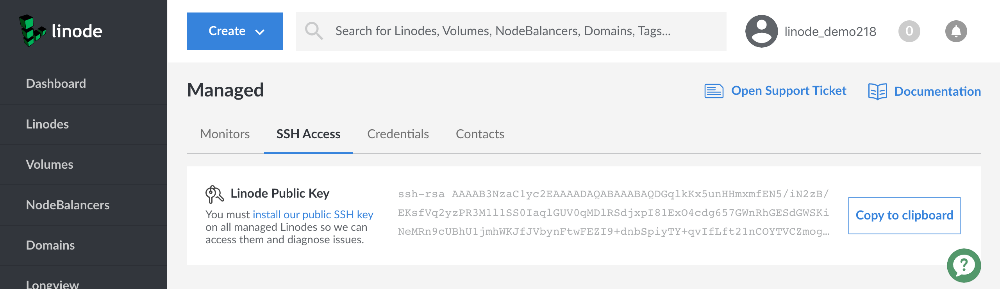
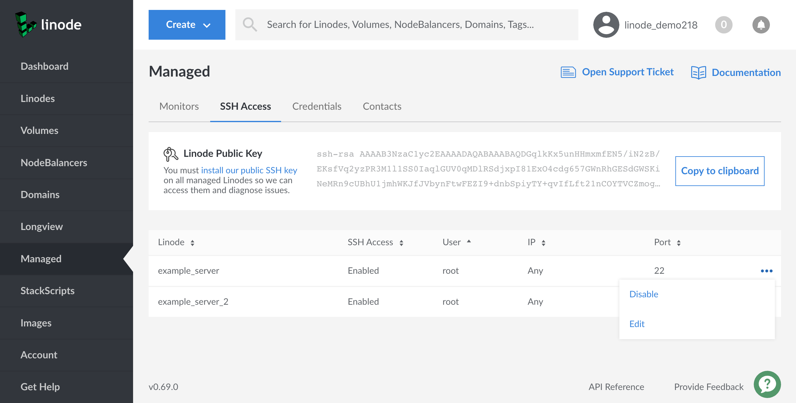
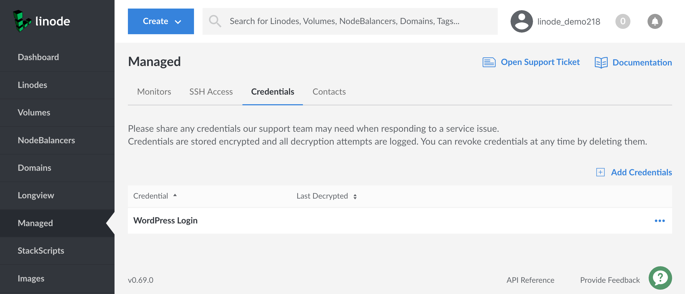
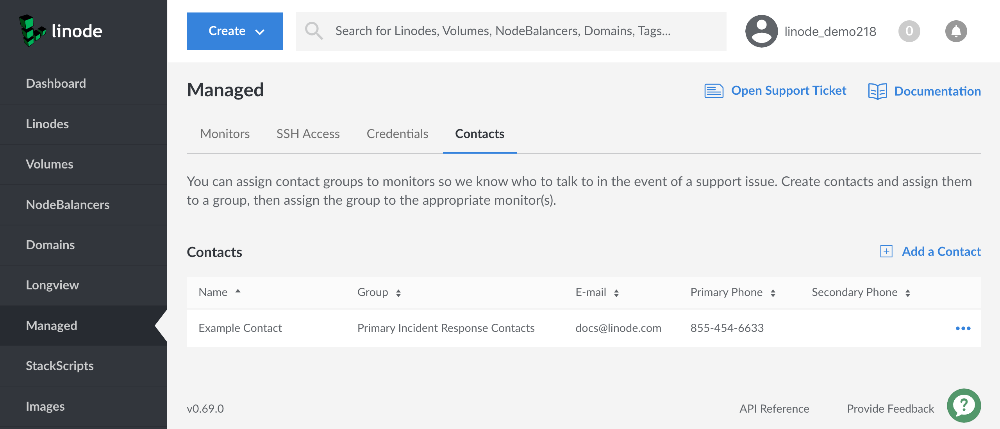
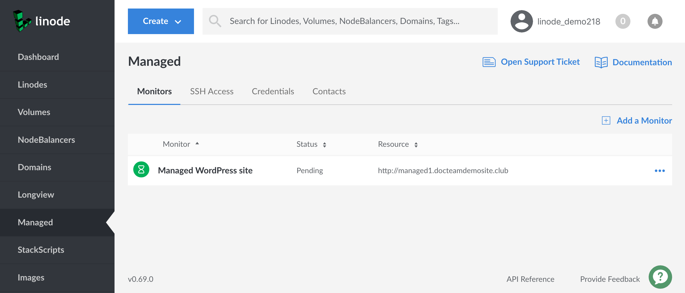
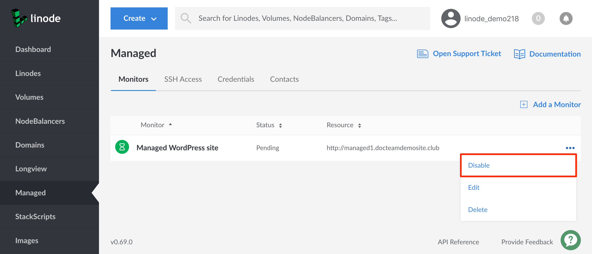

---
author:
  name: Linode
  email: docs@linode.com
description: How to configure service monitoring with Linode Managed.
keywords: ["linode managed", "service monitoring"]
license: '[CC BY-ND 4.0](https://creativecommons.org/licenses/by-nd/4.0)'
aliases: ['linode-managed/', 'uptime/linode-managed/']
modified_by:
  name: Linode
published: 2019-09-04
classic_manager_link: platform/linode-managed-classic-manager/
title: Linode Managed
---

[Linode Managed](https://www.linode.com/managed/) is a 24/7 incident response service. This robust, multi-homed monitoring system distributes monitoring checks to ensure that your servers remain online and available at all times. Linode Managed can monitor any service or software stack reachable over TCP or HTTP. Once you add a service to Linode Managed, Linode will monitor it for connectivity, response, and total request time. This guide shows you how to start monitoring your services with Linode Managed.


Linode Managed applies to all Linodes on an account and will be billed at a rate of $100 per month for each Linode. If this service is not needed for all Linodes, a second account can be created to separate Managed Linodes from non-Managed Linodes. If needed, Linodes can be transferred by [opening up a Support ticket](/docs/platform/billing-and-support/support/#contacting-linode-support) from both accounts and requesting the transfer.


## Getting Started

To sign up for Linode Managed:

1. Log into the [Linode Manager](https://manager.linode.com) and click the **Account** link in the sidebar.

1. Navigate to the **Settings** tab and click the **Add Linode Managed** button at the bottom of this page. A confirmation dialog will appear that describes the total cost of the service for your account.

1. Click the **Add Linode Managed** button in this confirmation dialog to enable the service for your account.

### Initial Configuration Checklist

After you've signed up for the service, you'll next want to let Support know about the websites and services you run, how to log into them, and who to contact if needed.


Your Managed service dashboard will be blank and the Linode Support Team won't receive health-check notifications for your services until these steps are completed. Please contact Linode Support if you have any questions when working through this checklist.


1.  Verify that your servers are responding to [ping (ICMP echo) requests](/docs/tools-reference/linux-system-administration-basics/#the-ping-command).
1.  [Install Linode's public SSH key](#adding-the-public-key) on all of your servers. This will be the primary method that Linode Support will use to log into your servers.
1.  [Add any service-specific credentials](#adding-service-credentials) you may have. For example, if you run a WordPress site that communicates with a MySQL database, you should provide the MySQL username and password if you would like us to troubleshoot it in the event of outage for your site.
1.  [Specify contacts and contact groups](#contacts). If Linode Support has any questions while troubleshooting your services, they will reach out to the contacts you provide.
1.  [Add services to be monitored](#adding-a-new-service). Services can be websites, databases, or any other custom application. You can even add checks to make sure specific strings of text appear on your monitored website or in the response body of your service.

## Credentials

To investigate any alerts received for your services, the Linode Support team will need access to your servers and the applications you run on them. There are two primary ways that they'll authenticate with your servers and applications:

- The Linode Support Team uses SSH to connect to your servers. Specifically, they use public key authentication for the connection. To support this, they generate a unique public/private keypair for your Managed service, and they ask that you [upload the public key to your servers](#adding-the-public-key).

- If you run any applications which require a password to administer, you can [supply those credentials to us in the Managed dashboard](#adding-service-credentials). They'll then refer to your list of credentials when troubleshooting.

### Adding the Public Key

Linode generates and assigns a unique public/private keypair to your account's Managed service. This keypair will be used by Linode Support to log into your server whenever an issue needs to be investigated. You can locate your Linode Managed public key through the following steps:

1.  Log into the [Linode Cloud Manager](https://cloud.linode.com).

1.  Click the **Managed** link in the sidebar.

1.  Navigate to the **SSH Access** tab.

1.  Linode's public key is displayed under this tab, and a **Copy to clipboard** button will appear next to it. Click on this button to copy it.

    

1.  After you've copied the key, you can install it on your server, either [under your root user](#installing-as-root) or [under another user](#installing-as-another-user). If you install it under another user, be sure to also update your [Linode's Managed SSH settings](#specifying-linode-ssh-settings) to reflect that user.

#### Installing as Root

Installing the public SSH key for the `root` user is the easiest way to add Linode's public key to your server. However, if your server's SSH configuration doesn't allow [root login](/docs/security/securing-your-server/#ssh-daemon-options), you may want to skip to the next section to add the public key to another user's account.

To install Linode's SSH key for the `root` user:

1.  Open a terminal window and [log into your Linode via SSH](/docs/getting-started/#connect-to-your-linode-via-ssh).

1.  Log in as `root`:

        su

    
If you followed the instructions in the [Securing Your Server](/docs/securing-your-server) guide to disable root login via SSH, you will need to reenable that feature to install the public key for the `root` user. Follow [these instructions](/docs/security/securing-your-server/#ssh-daemon-options) to edit the `sshd_config` file and reenable root login via SSH.


1.  Open the `authorized_keys` file in a text editor (for example, [nano](/docs/quick-answers/linux/use-nano-to-edit-files-in-linux/)):

        nano /root/.ssh/authorized_keys

    
The `/root/.ssh/` directory may not exist yet. If this is the case, you must create the directory using the following command before opening the `authorized_keys` file:

     mkdir /root/.ssh/


1.  Paste Linode's public key in a new line in the file.

1.  Save the changes to the `authorized_keys` file and exit your text editor. In the `nano` editor, enter **Control-X**, and then **Y** to confirm.

1. You have successfully added Linode's public key for the `root` user. If you'd like, you can [open a support ticket](/docs/platform/billing-and-support/support/#contacting-linode-support) to have the Linode Support team confirm that they have access. Repeat this process on every Linode you want to monitor with Linode Managed.

#### Installing as Another User

You can also install Linode's public SSH key for another non-root user. This allows you to disable SSH [root login](/docs/security/securing-your-server/#ssh-daemon-options) and still allow our support staff to log into your servers.

To install Linode's SSH key as a non-root user:

1.  [Log into your Linode via SSH](/docs/getting-started#connect-to-your-linode-via-ssh).

1.  If you haven't already created a non-root user on your server, you should do so now. See [Adding a New User](/docs/security/securing-your-server/#add-a-limited-user-account) for instructions.

    
After logging into your Linode as a non-root user, the Linode Support team will generally need [sudo privileges](/docs/tools-reference/linux-users-and-groups/#understanding-sudo) to run troubleshooting commands, so you should make sure to give your user sudo privileges.

The [Adding a New User](/docs/security/securing-your-server/#add-a-limited-user-account) guide shows how to add your user to the `sudo` group (or `wheel` or `admin` group, depending on your distribution), which will grant this privilege. When your user is in this group, your system will ask for the user's password whenever a sudo command is run. Because of this, you will also need to tell us your Linux user and password by following the [Adding Service Credentials](#adding-service-credentials) section.

Alternatively, you can set up *passwordless sudo* for your user, which means that your user's password won't be requested by the system when running sudo commands. To do this:

1.  Open the `sudoers` file for editing (this command will open the [Vim](https://en.wikipedia.org/wiki/Vim_(text_editor)) text editor):

        sudo visudo

1.  Type `i` to enter *insert mode* in Vim.

1.  In the *User privilege specification* section of the file, add the following line, replacing `example_user` with your user name:

    
example_user ALL=(ALL) NOPASSWD: ALL


1.  Press **Esc** to exit *insert mode*.

1.  Make sure this user is not in any other groups listed in `/etc/sudoers`, as this may override the passwordless sudo setting.

1.  Type `:wq` and press **Enter** to save and quit the file.


1.  Open the `authorized_keys` file for your user in a text editor (for example, [nano](/docs/quick-answers/linux/use-nano-to-edit-files-in-linux/)):

        nano /home/example_user/.ssh/authorized_keys

    
The `/home/example_user/.ssh/` directory may not exist yet. If so, create it with the following command before opening the `authorized_keys` file:

    mkdir -p /home/example_user/.ssh/


1.  Paste Linode's public key in a new line in the file.

1.  Save the changes to the `authorized_keys` file and exit your text editor. In the `nano` editor, enter **Control-X**, and then **Y** to confirm.

1. You have successfully added Linode's public key for the `root` user. If you'd like, you can [open a support ticket](/docs/platform/billing-and-support/support/#contacting-linode-support) to have the Linode Support team confirm that they have access. Repeat this process on every Linode you want to monitor with Linode Managed.

### Specifying Linode SSH Settings

You can customize Linode Managed's SSH settings for each of your Linodes:

- The Linux user that Support should attempt to log in as.
- Which of your Linode's IP addresses Support should connect via, if your Linode has more than one IP address.
- The port that Support should connect to, if your SSH service is listening on a non-standard port.

As well, you can disable Managed SSH access for one or more of your servers. This does not turn off the SSH service on your Linode or uninstall our public key from it. Instead the Linode Support Team's client software will simply not attempt connections if you have disabled access.


If you want us to investigate issues, it's important to keep SSH access enabled, which is the default.


To access these settings:

1.  Log into the [Linode Cloud Manager](https://cloud.linode.com).

1.  Click the **Managed** link in the sidebar.

1.  Select the **SSH Access** tab. Your Linodes and their Managed SSH settings will appear in the table below:

    

1.  To enable or disable Managed SSH access for a Linode, click on the **more options ellipsis** that corresponds to the Linode and then select the **Enable** or **Disable** option from the menu that appears.

1.  To change other Managed SSH settings for a Linode, click on the **more options ellipsis** that corresponds to the Linode and then select the **Edit** option. A form will appear with fields for each setting.

### Adding Service Credentials

Many of the applications running on your servers can only be accessed with the appropriate username and password combination. To provide Linode's staff with access to those applications, you should upload *credentials* for them to the Linode Cloud Manager. Once uploaded, you can also link credentials to specific Managed services to communicate which ones Linode Support should use when troubleshooting the service.


All credentials are securely stored in our encrypted database.


To add a credential:

1.  Log into the [Linode Cloud Manager](https://cloud.linode.com).

1.  Click the **Managed** link in the sidebar.

1.  Select the **Credentials** tab, then click on the **Add Credentials** link under this tab.

    

    
The table that lists your uploaded credentials will feature a **Last Decrypted** column. This column will show the most recent date/time that a member of Linode Support viewed each credential.


1.  A form for your new credentials will appear with these fields:

    | Field Name | Description |
    |------------|-------------|
    | Credential Label | A descriptive name for the credential that tells the Linode Support Team what it should be used for. For example, if you are entering the MySQL `root` password, you might label it as `MySQL Root`. |
    | Username (optional) | The username to supply when authenticating with the application. |
    | Password/Passphrase | The password or passphrase to supply when authenticating with the application. |

1.  Fill out the form and click the **Add** button.

## Contacts

Linode Managed allows you to specify *contacts* that will be contacted if an issue is detected with one of your services. Contacts are categorized in groups and can be linked to specific Managed services. You can create separate groups for the administrators responsible for your different services and systems. For example, you might add all of your database administrators to a group named *DBAs* and then link that group to your monitored MySQL service. When Linode Managed detects an issue with MySQL, all of your database administrators will be notified at the same time.

To add a contact to Linode Managed:

1.  Log into the [Linode Cloud Manager](https://cloud.linode.com).

1.  Click the **Managed** link in the sidebar.

1.  Select the **Contacts** tab, then click on the **Add a Contact** link under this tab.

    

1.  A form for your new contact will appear. The form accepts a primary and secondary phone number, which Linode Support may call if they need additional information to troubleshoot an issue on your servers.

    In the **Group** field, enter a group name. As described at the beginning of this section, groups can hold multiple contacts. Ideally, you'll combine all of the individuals responsible for a particular service or system into one group.

    
A Managed service can only be linked to a contact group and not to individual contacts, so you should  create at least one group, even if it only contains one contact.


1.  Fill out the form and click the **Save** button.

## Services

Linode Managed monitors the *services* running on your Linodes. Setting up services is an essential step in the configuration process--Linode Managed can't monitor anything until you add services to be monitored.

### Adding a New Service

To add a new monitored service to Linode Managed:

1.  Log into the [Linode Cloud Manager](https://cloud.linode.com).

1.  Click the **Managed** link in the sidebar.

1.  Select the **Monitors** tab, then click on the **Add a Monitor** link under this tab.

    

1.  A form for your new monitored service will appear with these fields:

    | Field Name | Description |
    |------------|-------------|
    | Monitor Label | A descriptive label for the service that will help the support team quickly identify and fix the service if it needs troubleshooting. |
    | Contact Group (optional) | One of the contact groups that you've registered with Linode Managed. Linode will contact the members of this group if they need help fixing the service. |
    | Monitor Type | Select **URL** to monitor a website or **TCP Connection** to monitor any other service running on your Linode. |
    | Response Timeout | The time (in seconds) for Linode Managed's requests to timeout if they do not receive a response. |
    | URL | If you selected **URL** for the **Monitor Type** field, enter a URL for a webpage that you'd like to monitor. If you selected **TCP Connection**, enter the domain or IP address and, optionally, a port number (separated by a colon) in the **TCP** field. |
    | Response Body Match (optional) | A string that Linode Managed will check for in the URL or TCP response. If not present, then an alert will be generated for the service. |
    | Instructions/Notes | Any notes or additional information about this service. The more information Linode Support has about the service and how it's configured, the more quickly they will be able to resolve any issues that may arise. |
    | Credentials (optional) | Any [credentials](#adding-service-credentials) that may need to be used to troubleshoot the service. You can select and save more than one credential for a service. |

1.  Fill out the form and click the **Add** button.

1.  Once added, the monitored service will initially appear as *Pending*. Linode Support will start monitoring the service in a few minutes--if the service is available, the dashboard will then indicate that the service's status is **Verified**.

### Temporarily Disabling Service Monitoring

Service monitoring can be temporarily disabled:


Linode Managed continuously monitors your services for availability. If you are going to perform scheduled maintenance on a service that temporarily makes it unavailable, you will receive a support ticket from Linode when they are alerted of the service's outage. You can disable monitoring for that service during the maintenance to avoid receiving these reports.


1.  Log into the [Linode Cloud Manager](https://cloud.linode.com).

1.  Click the **Managed** link in the sidebar.

1.  Select the **Monitors** tab. A table which lists your monitored services will appear below the tab.

1.  Find the service that you want to temporarily disable and click on the corresponding **more options ellipsis**. Select the **Disable** option from the menu that appears.

    

The service is now temporarily disabled. Linode Managed won't resume monitoring this service until you reenable monitoring, as described in the next section.

### Reenabling Disabled Services

To reenable monitoring for a service:

1.  Log into the [Linode Cloud Manager](https://cloud.linode.com).

1.  Click the **Managed** link in the sidebar.

1.  Select the **Monitors** tab. A table which lists your monitored services will appear below the tab.

1.  Find the service that you want to temporarily disable and click on the corresponding **more options ellipsis**. Select the **Enable** option from the menu that appears.

Linode Managed is now monitoring the service again. The service will be checked in a few minutes--if it's available, the dashboard will then indicate that the service's status is **Verified**.

### Removing Services

If you decide to remove or stop using a monitored service on your Linode, you should also remove the service from Linode Managed. For example, you should remove the Apache service from Linode Managed if you decide to start using Linode as a dedicated database server. To remove a monitored service:

1.  Log into the [Linode Cloud Manager](https://cloud.linode.com).

1.  Click the **Managed** link in the sidebar.

1.  Select the **Monitors** tab. A table which lists your monitored services will appear below the tab.

1.  Find the service that you want to remove and click on the corresponding **more options ellipsis**. Select the **Delete** option from the menu that appears.

1.  A confirmation dialog will appear. Click the **Delete** button on this dialog to confirm.

Linode Managed will stop monitoring the service.
