---
author:
  name: Linode
  email: docs@linode.com
description: "This guide shows how to install and use Linode Longview."
og_description: "Learn how to use Longview, Linode's system data graphing service."
keywords: ["system monitoring", "longview", "metrics"]
license: '[CC BY-ND 4.0](https://creativecommons.org/licenses/by-nd/4.0)'
aliases: ['longview/', 'uptime/longview/']
modified: 2018-11-20
modified_by:
  name: Linode
title: What is Longview and How to Use it
published: 2013-03-27
---

Longview is Linode's system data graphing service. It tracks metrics for CPU, memory, and network bandwidth, both aggregate and per-process, and it provides real-time graphs that can help expose performance problems.

The Longview client is [open source](https://github.com/linode/longview) and can be installed on any Linux distribution–including systems not hosted by Linode. However, **Linode only offers technical support for CentOS, Debian, and Ubuntu**.

## Install the Longview Client

1.  Log in to the [Linode Manager](https://manager.linode.com) and click the **Longview** tab.

    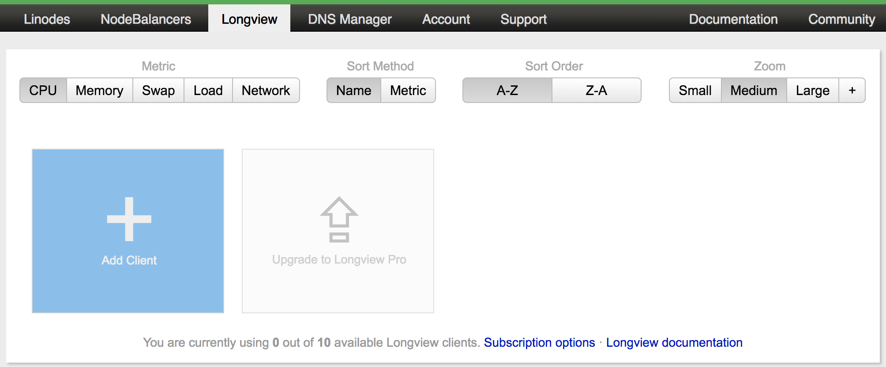

2.  Click the **Add Client** tile. This will bring up a modal window with a `curl` command at the center.

    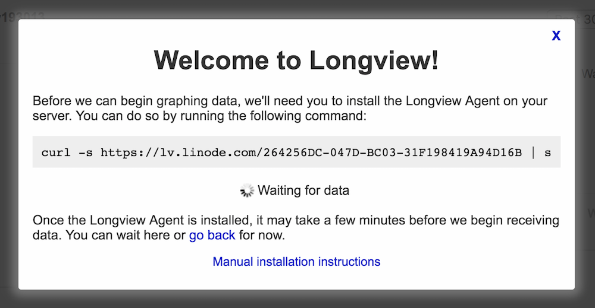

3.  Open a terminal on your local computer and log into your Linode over SSH. Change to the `root` user:

        su - root

4.  Copy the full `curl` command and paste it into the terminal. Press **Enter** to run it.

5.  The installation takes a few minutes and will return you to an empty terminal prompt when finished. Return to the Linode Manager in your browser. The modal window will have closed and you should now see the Longview client's overview screen.

    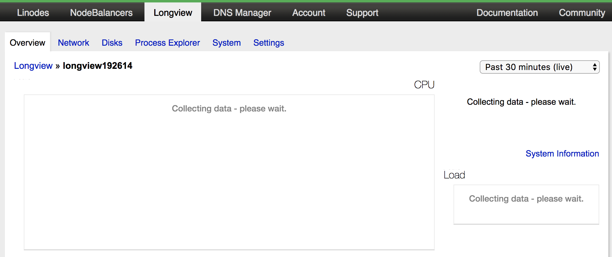

    It can take several minutes for data to start showing in the Manager but once it does, you'll see the graphs and charts populating with your Linode's metrics.

    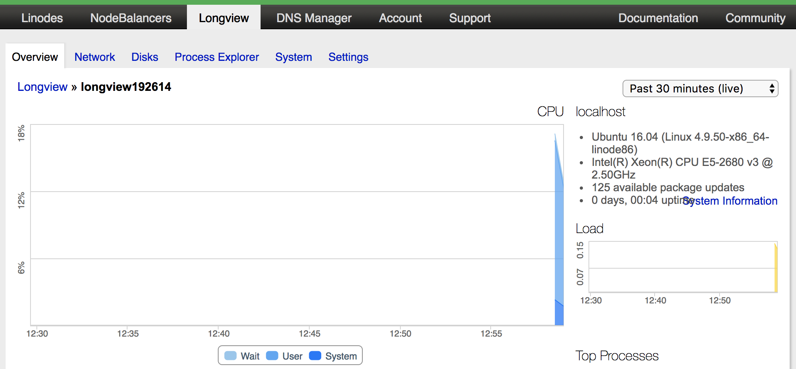

### Manual Installation with yum or apt

It's also possible to manually install Longview for CentOS, Debian, and Ubuntu. You should only need to manually install if the instructions in the previous section failed.

1.  Create a file to hold the repository information:

    **CentOS**

    Replace `REV` in the repository URL with your CentOS version (e.g., 7). If unsure, you can find your CentOS version number with `cat /etc/redhat-release`.

    
[longview]
name=Longview Repo
baseurl=https://yum-longview.linode.com/centos/REV/noarch/
enabled=1
gpgcheck=1


    **Debian and Ubuntu**

    Find the codename of the distribution running on your Linode.

        root@localhost:~# lsb_release -sc
        xenial

    Create a file with the repository for your distribution codename. In the command below, replace *xenial* with the output of the previous step.

    
deb http://apt-longview.linode.com/ xenial main


2.  Download the repository's GPG key and import or move it to the correct location:

    **CentOS**

        sudo curl -O https://yum-longview.linode.com/linode.key
        sudo rpm --import linode.key

    **Debian and Ubuntu**

        sudo curl -O https://apt-longview.linode.com/linode.gpg
        sudo mv linode.gpg /etc/apt/trusted.gpg.d/linode.gpg

4.  Create a directory for the API key:

        sudo mkdir /etc/linode/

5.  Copy the API key from the **Settings** tab of your Longview client's overview page in the Linode Manager. Put the key into a file, replacing the key in the command below with your own.

        echo '266096EE-CDBA-0EBB-23D067749E27B9ED' | sudo tee /etc/linode/longview.key

6.  Install Longview:

    **CentOS**

        sudo yum install linode-longview

    **Debian or Ubuntu**

        sudo apt-get update
        sudo apt-get install linode-longview

### Longview Client Labels

If you are monitoring multiple systems with Longview, you should relabel the clients in the Linode Manager to the system's hostname, or some other name which is easier to identify than the default client ID.

1.  Go to the **Longview** tab in the Linode Manager. You'll see an overview of all Longview clients on your Linode account.

    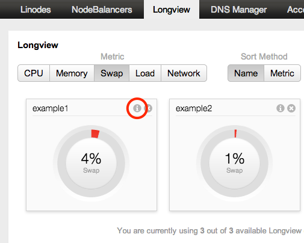

2.  Click the **i** button at the top left of the client you want to relabel. The webpage shown below appears.

    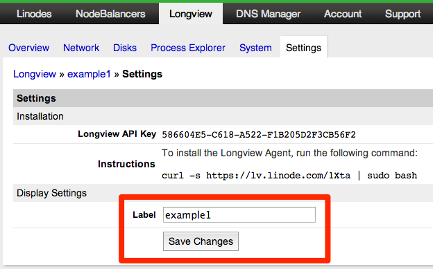

3.  In the **Label** field, enter a name for the system.
4.  Click **Save Changes**.

### Longview Apps

Once your system is set up as a Longview client, you will also have access to Linode's *Longview Apps*. These extend Longview's statistics reporting to specific services running on your Linode, currently [Apache](/docs/platform/longview/longview-app-for-apache/), [nginx](/docs/platform/longview/longview-app-for-nginx/), and [MySQL/MariaDB](/docs/platform/longview/longview-app-for-mysql/).

### Updating Longview

When an update is available for Longview, you'll receive a notice of this as a banner at the top of the Linode Manager.

- If you are using CentOS, Debian, or Ubuntu, the `linode-longview` package will update via the system's package manager, just like any other upstream package.

- If you are not using one of the Linux distributions mentioned above, the method for updating Longview is to run the cURL installation command again.

- Should the update process ask you to overwrite any of Longview's init scripts or systemd units with the package maintainer's version, choose **Yes** to do so.

## Longview's Data Explained

### Overview

The Overview tab shows all of your system's most important statistics in one place. The information on the graphs is correlated, so when you move your pointer over one graph, data points are automatically displayed on the other graphs at the same time, making it easy to troubleshoot problems with your system.

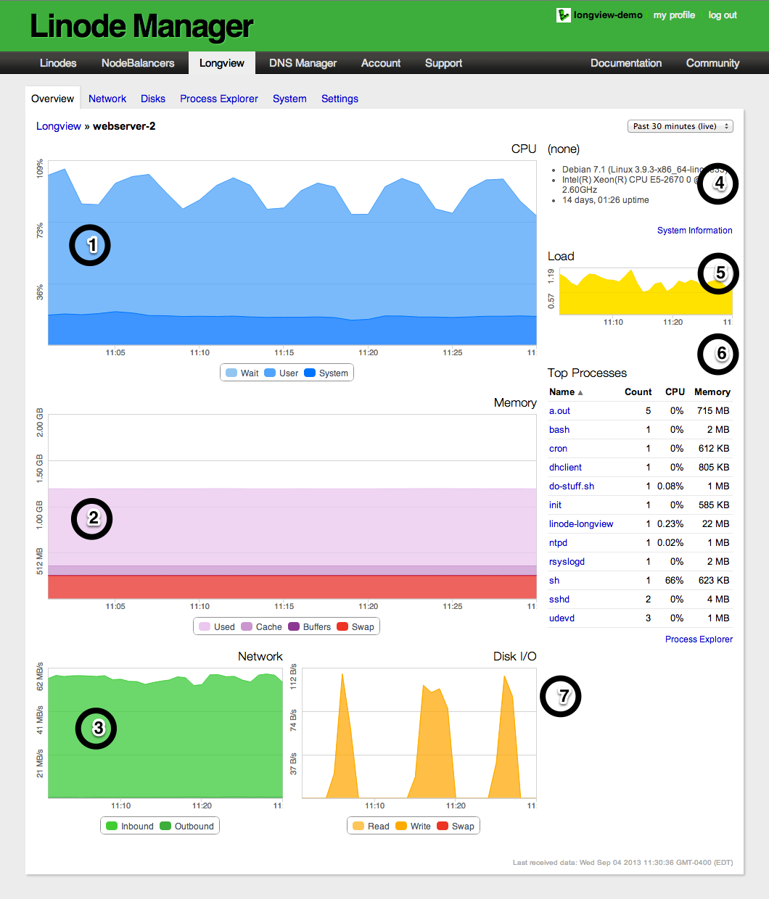

1.  Percentage of CPU time spent in wait (on disk), in user space, and in kernel space.
2.  Total amount of RAM being used, as well as the amount of memory in cache, in buffers, and in swap.
3.  Amount of network data that has been transferred to and from your system.
4.  Basic information about the system, including the operating system name and version, processor speed, uptime, and available updates.
5.  Average CPU load.
6.  Top active processes on the system. To access more detailed information, click the **Process Explorer** link at the bottom of the chart.
7.  Disk I/O. This is the amount of data being read from, or written to, the system's disk storage.

### Network

The Network tab allows you to monitor the inbound and outbound traffic to your system, updated every 5 minutes. The *All traffic* graph at the top of the page shows all incoming and outgoing traffic. The other graphs break that traffic down by Internet Protocol (IP) version and by data traveling over the public internet versus Linode's private network. To show or hide inbound or outbound traffic on a graph, click the **Inbound** or **Outbound** button under it. If you are monitoring a non-Linode system, only a single graph will be shown for each network interface.

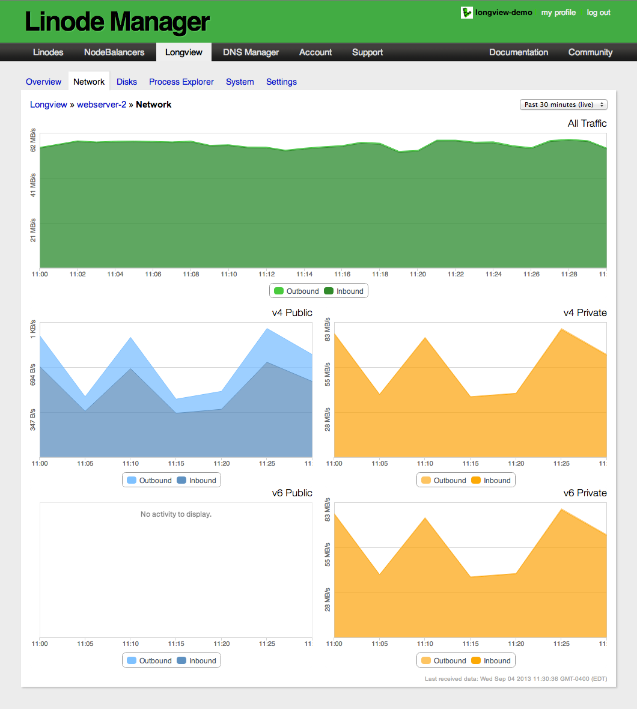

### Disks

The **Disks** tab displays information about storage mounted on your system. Select a disk from the left column and Longview displays the disk's I/O, available space, and inode use. You can show or hide the read and write lines on the IO graph by clicking **Read** or **Write**.

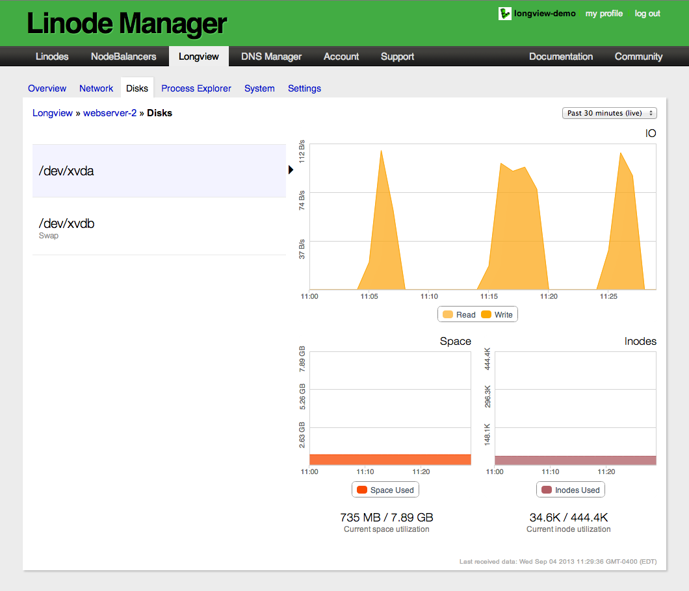

### Process Explorer

The **Process Explorer** tab displays all of the processes that were running on your system during the selected time interval. Select a process to examine its CPU, memory, and IO consumption. If you have a large number of processes running on your system, you can enter the name of the process in the **Filter** field to search for it, or you can click **More** at the bottom of the page to scroll through all of the processes.

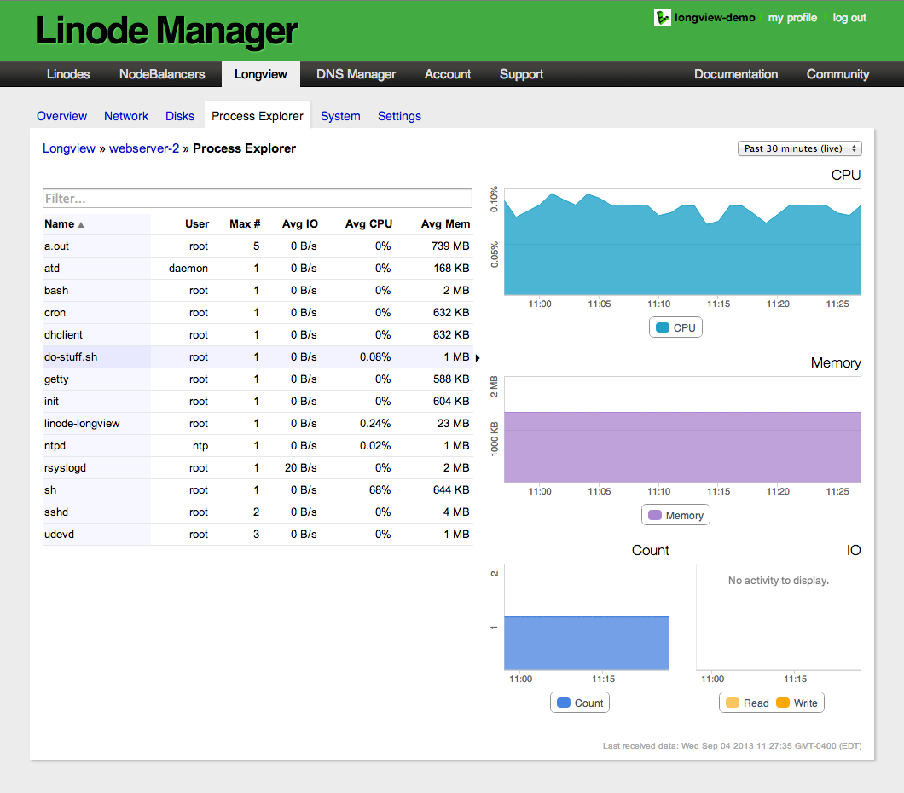

### System

Here you'll find general statistics about your Linode's hardware resources and network connections. To inspect the services that are actively waiting for a connection, select the **listening services** button. This is a good way to verify that your services are running and listening on a particular port.

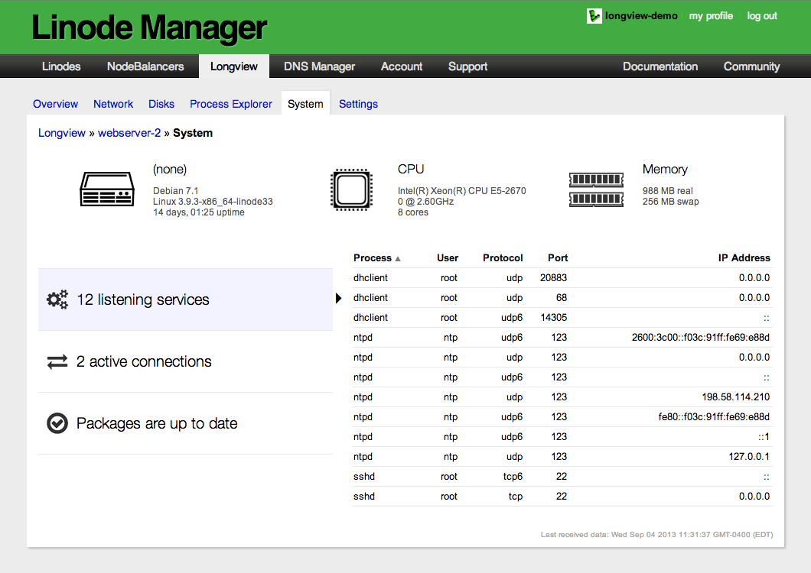

To view active connections to your system, select the **active connections** button. The `root` user may also appear in the list of active connections if there is an active SSH connection. That's because SSH runs as `root` before dropping privileges to the non-root account, and it never closes the file handle. This does not necessarily mean that the `root` user is connected via SSH.

The packages button will show if there are package updates available for your Linode's operating system. Packages are sorted by name, current version number, and new version number. To install the updates, you'll need to log in to your system and [update](/docs/uptime/monitoring-and-maintaining-your-server/#updating-installed-packages) using your distribution's package manager.

### Data Duration

Longview displays realtime statistics from the past thirty minutes by default, and this data is kept for 12 hours. [Longview Pro](#longview-pro) allows for longer durations of data which is kept for the time you hold the upgrade subscription.

By changing the viewing history, you'll be able to see statistics for a longer period of time. However, graphs will not automatically update with new data for duration selections other than the default 30 minutes. To reset the time interval and re-enable live updating, select **Past 30 minutes (live)** from the viewing history dropdown menu.

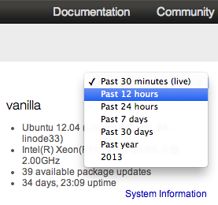

### Graph Zoom

Longview allows you to zoom in on graphs to take a closer look at a specific time interval. For example, if you saw a major spike in CPU use that lasted 19 minutes, you could zoom in on that 19 minute interval for more detail. To zoom in, click and drag the pointer to select a specific portion of the graph.

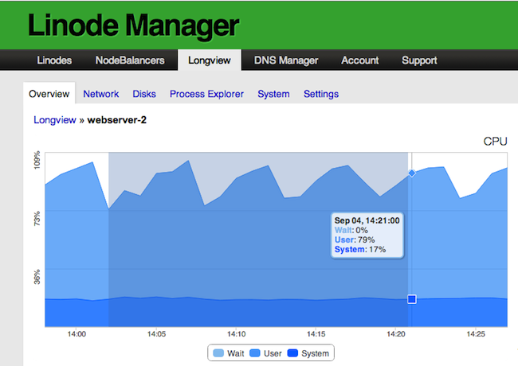

All of the graphs will be updated to display data for the time interval you selected. To reset the zoom view and restore all of the graphs to the default 30 minute time interval, select the **Reset Zoom** link in the top-right corner.

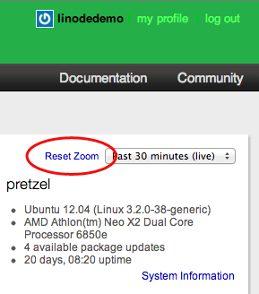

## Longview Pro

Longview Free updates every 5 minutes and provides only twelve hours of data history. Longview Pro gives you data resolution at 60 second intervals, and you can view a complete history of your Linode's data instead of only the previous 30 minutes. To change your plan level, follow these instructions:

1.  At the bottom of the Longview overview page in the Linode Manager, click the **Upgrade to Longview Pro** tile.

    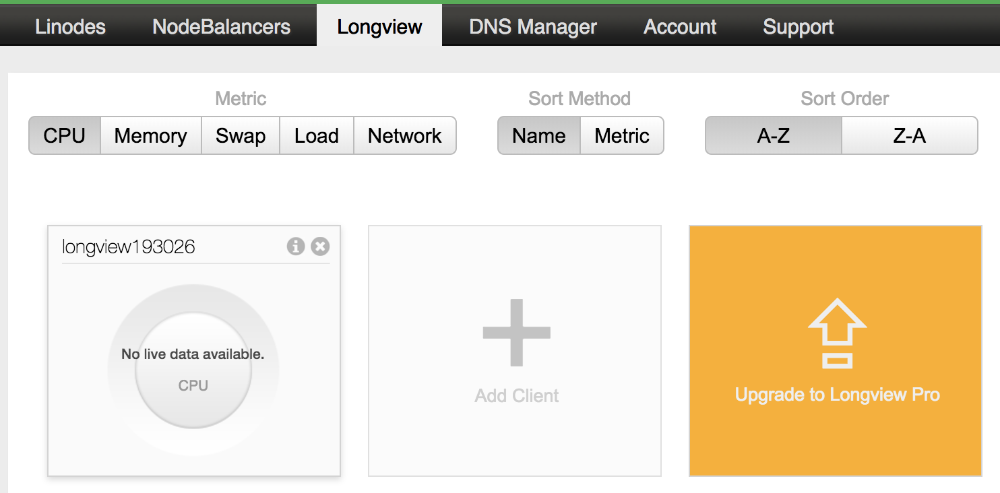

2.  You'll be taken to the Longview subscriptions page. Select the radio dial of the plan you want to change to.

3.  Click the **Continue >>** button.

4.  Review your order, then click **Complete Order**. Please note that it may take up to 24 hours for the upgrade process to complete.

## Troubleshooting

If you're experiencing problems with the Longview client, follow these steps to help determine the cause.

### Basic Diagnostics

Ensure that:

1.  Your system is [fully updated](/docs/getting-started/). Longview also requires Perl 5.8 or later.

2.  The Longview client is running. You can verify with one of the two commands below, depending on your distribution's initialization system:

        sudo systemctl status longview   # For distributions with systemd.
        sudo service longview status     # For distributions without systemd.

    If the Longview client is not running, start it with one of the following commands, depending on your distribution's init system:

        sudo systemctl start longview
        sudo service longview start

    If the service fails to start, check Longview's log for errors. The log file is located in `/var/log/linode/longview.log`.

### Debug Mode

Restart the Longview client in debug mode for increased logging verbosity.

1.  First stop the Longview client:

        sudo systemctl stop longview   # For distributions with systemd.
        sudo service longview stop     # For distributions without systemd.

2.  Then restart Longview with the `debug` flag:

        sudo /etc/init.d/longview debug

3.  When you're finished collecting information, repeat the first two steps to stop Longview and restart it again without the debug flag.

    If Longview does not close properly, find the process ID and kill the process:

        ps aux | grep longview
        sudo kill $PID

### Firewall Rules

If your Linode has a firewall, it must allow communication with Longview's aggregation host at `longview.linode.com`. You can view your firewall rules with one of the commands below, depending on the firewall controller used by your Linux distribution.

**firewalld**

    sudo firewall-cmd --list-all

**iptables**

    sudo iptables -S

**ufw**

    sudo ufw show added

If the output of those commands show no rules for the Longview domain, you must add them. See our [firewall documentation](/docs/security/firewalls/) for more information.

### Verify API key

The API key given in the Linode Manager should match that on your system in `/etc/linode/`.

1.  The API key is located on the same page of the Linode Manager as the Longview client label. Follow the [instructions above](#longview-client-labels) to get to that screen.

2.  SSH into your Linode. The Longview key is located at `/etc/linode/longview.key`. Use `cat` to view the contents of that file and compare it to what's shown in the Linode Manager:

        cat /etc/linode/longview.key

    The two should be the same. If they are not, paste the key from the Linode Manager into `longview.key`, overwriting anything already there.

### Cloned Keys

If you clone a Linode which has Longview installed, you may encounter the following error:


Multiple clients appear to be posting data with this API key. Please check your clients' configuration.


This is caused by both Linodes posting data using the same Longview key. To resolve it, uninstall & then reinstall Longview on the cloned system using the instructions [above](#install-the-longview-client). This will give the new Linode's system a Longview API key independent from the system which it was cloned from.

NOTE, the GUID shown in the Linode Manager Longview installation URL is not the same as the Linode Longview key.

### Contact Support

If you still need assistance after performing these checks, please open a [support ticket](/docs/platform/support/#contacting-linode-support).

## Uninstall the Longview Client

1.  In the Linode Manager, select the **Longview** tab to go to your account's overview of Longview clients.

2.  Click the **X** button next to the **i** at the top right of the client tile you want to remove.

3.  You'll be asked if you're sure you want to delete the Longview client. Click **Remove this Longview Client** to remove it from your account.

4.  Next, remove the Longview client application from the operating system you want to stop monitoring. SSH into your Linode.

5.  Remove the `linode-longview` package with the command appropriate for your Linux distribution.

    **CentOS**

        sudo yum remove linode-longview

    **Debian or Ubuntu**

        sudo apt-get remove linode-longview

    **Other distributions**

        sudo rm -rf /opt/linode/longview
