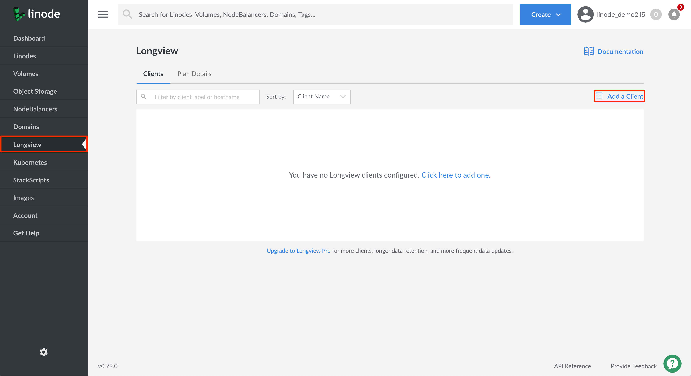
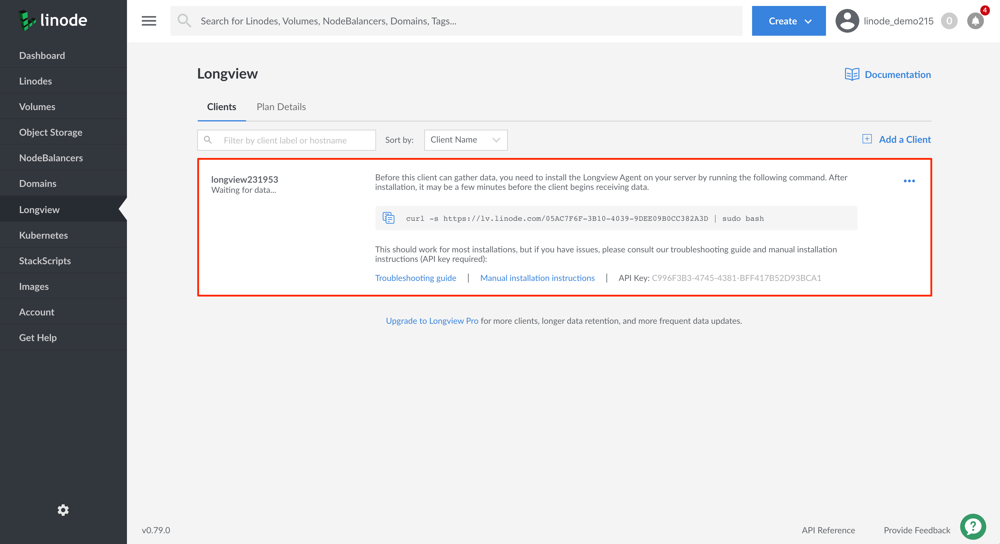
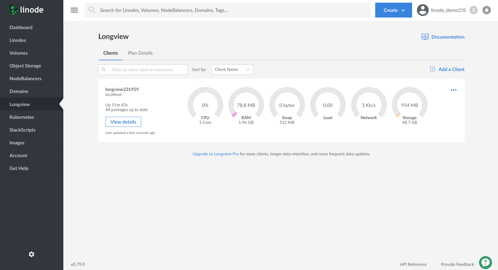
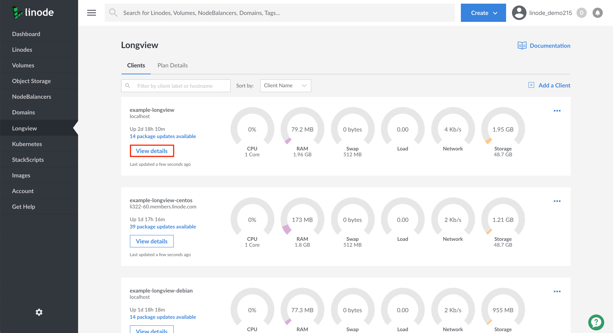
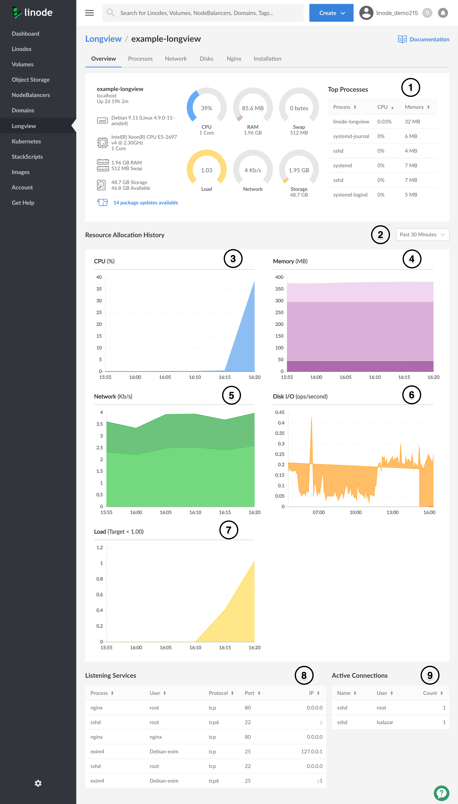
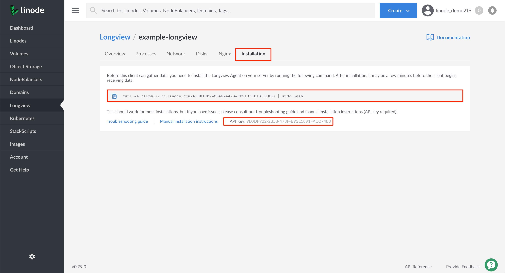
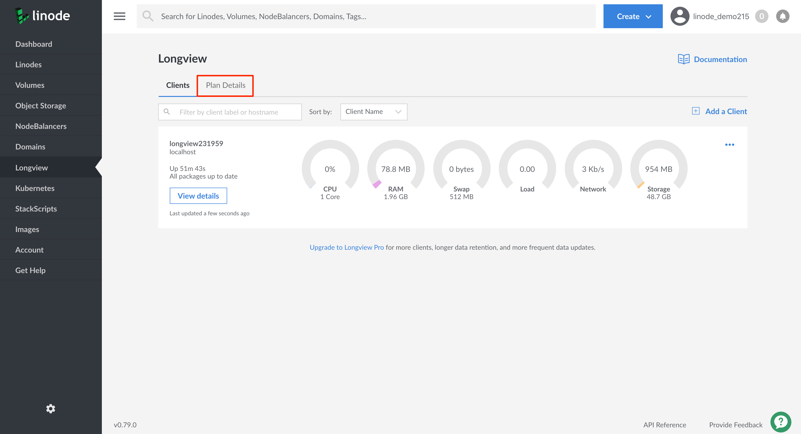
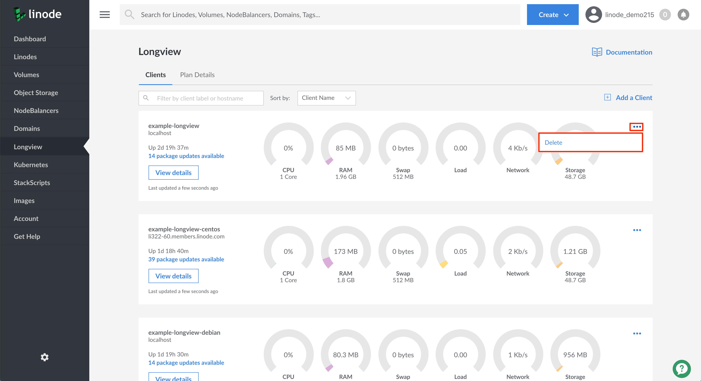

---
author:
  name: Linode Community
  email: docs@linode.com
description: 'This guide shows how to install and use Linode Longview. Longview is Linode’s system data graphing service. It tracks metrics for CPU, memory, and network bandwidth, both aggregate and per-process, and it provides real-time graphs that can help expose performance problems.'
keywords: ["system monitoring", "longview", "metrics"]
license: '[CC BY-ND 4.0](https://creativecommons.org/licenses/by-nd/4.0)'
aliases: ['platform/longview/longview/','platform/longview/longview-classic-manager-classic-manager/']
published: 2019-12-09
modified_by:
  name: Linode
title: "What is Linode Longview"
h1_title: "Understanding Linode Longview"
contributor:
  name: Linode

---

Longview is Linode’s system data graphing service. It tracks metrics for CPU, memory, and network bandwidth, both aggregate and per-process, and it provides real-time graphs that can help expose performance problems.

The Longview client is [open source](https://github.com/linode/longview) and provides an agent that can be installed on any Linux distribution–including systems not hosted by Linode. However, Linode only offers technical support for **CentOS**, **Debian**, and **Ubuntu**.


Longview for Cloud Manager is still being actively developed to reach parity with Linode's Classic Manager. This guide will be updated as development work continues. See the Cloud Manager's changelog for the latest information on [Cloud Manager releases](https://developers.linode.com/changelog/cloud-manager/).



Longview does not currently support CentOS 8.


## In this Guide:

This guide provides an overview of Linode Longview. You will learn how to:

* [Install the Longview Client](#install-linode-longview)
* [Access and view your Longview Client's data and graphs](#longview-s-data-explained)
* [Troubleshoot your Longview Client instance](#troubleshooting)
* [Uninstall the Longview Client](#uninstall-the-longview-client)

## Before you Begin

* In order to monitor and visualize a Linode's system statistics, you will need to install the Longview agent on your Linode. Have your [Linode's IP address](/docs/quick-answers/linode-platform/find-your-linodes-ip-address/) available in order to SSH into the machine and install the Longview agent.

## Install Linode Longview

In this section, you will create a Longview Client instance in the Linode Cloud Manager and then install the Longview agent on an existing Linode. These steps will enable you to gather and visualize important system statistics for the corresponding Linode.

### Add the Longview Client

1. Log into the [Linode Cloud Manager](https://cloud.linode.com/dashboard) and click on the **Longview** link in the sidebar.

1. Viewing the Longview Clients page, click on the **Add a Client** link on the top right-hand corner of the page. This will create a Longview Client instance.

      

1. An entry will appear displaying your Longview Client instance along with its auto-generated label, its current status, installation instructions, and API key. Its status will display as *Waiting for data*, since you have not yet installed the Longview agent on a running Linode.

    
The displayed `curl` command will be used in the [next section](#install-the-longview-agent) to install the Longview agent on the desired Linode. The long string appended to the url `https://lv.linode.com/` is your Longview Client instance's GUID (globally unique identifier).
    

      

### Install the Longview Agent

1. Install the Longview agent on the Linode whose system you'd like to monitor and visualize. Open a terminal on your local computer and log into your Linode over SSH. Replace the IP address with your own [Linode's IP address](/docs/quick-answers/linode-platform/find-your-linodes-ip-address/).

        ssh user@192.0.2.0

1. Change to the `root` user.

        su - root

1. Switch back to the Linode Cloud Manager in your browser, copy the Longview Client instance's `curl` command, and paste it into your Terminal window. Press **Enter** to execute the command. The installation will take a few minutes to complete.

    
Ensure you replace the example `curl` command below with your own Longview Client instance's GUID.
    

        curl -s https://lv.linode.com/05AC7F6F-3B10-4039-9DEE09B0CC382A3D | sudo bash

1. Once the installation is complete, verify that the Longview agent is running:

        sudo systemctl status longview

    You should see a similar output:

    > **Centos**:
    >
       
    ● longview.service - SYSV: Longview statistics gathering
      Loaded: loaded (/etc/rc.d/init.d/longview; bad; vendor preset: disabled)
      Active: active (running) since Tue 2019-12-10 22:35:11 UTC; 40s ago
        Docs: man:systemd-sysv-generator(8)
      CGroup: /system.slice/longview.service
              └─12202 linode-longview

Dec 10 22:35:11 li322-60.members.linode.com systemd[1]: Starting SYSV: Longview statistics gathering...
Dec 10 22:35:11 li322-60.members.linode.com longview[12198]: Starting longview: [  OK  ]
Dec 10 22:35:11 li322-60.members.linode.com systemd[1]: Started SYSV: Longview statistics gathering.


    > **Debian or Ubuntu**:
    >
    >  
● longview.service - LSB: Longview Monitoring Agent
   Loaded: loaded (/etc/init.d/longview; generated; vendor preset: enabled)
   Active: active (running) since Mon 2019-12-09 21:55:39 UTC; 2s ago
     Docs: man:systemd-sysv-generator(8)
  Process: 2997 ExecStart=/etc/init.d/longview start (code=exited, status=0/SUCCESS)
    Tasks: 1 (limit: 4915)
   CGroup: /system.slice/longview.service
           └─3001 linode-longview
       

    If the Longview agent is not running, start it with the following command:

        sudo systemctl start longview

    Your output should resemble the example output above.

1. Switch back to the Linode Cloud Manager's Longview Clients page in your browser and observe your Longview client's quick view metrics and graph.

    
  It can take several minutes for data to load and display in the Cloud Manager but once it does, you’ll see the graphs and charts populating with your Linode’s metrics.
    

    

### Manually Install the Longview Agent with yum or apt

It’s also possible to manually install Longview for CentOS, Debian, and Ubuntu. You should only need to manually install it if the instructions in the previous section failed.

1. Before completing the steps below, ensure you have [added a Longview Client instance](#add-the-longview-client) using the Cloud Manager.

1.  Add a configuration file to store the repository information for the Longview agent:

    > **CentOS**:
    >
>    Using the text editor of your choice, like [nano](https://www.linode.com/docs/quick-answers/linux/use-nano-to-edit-files-in-linux/), create a `.repo` file and copy the contents of the example file below. Replace `REV` in the repository URL with your CentOS version (e.g., 8). If unsure, you can find your CentOS version number with `cat /etc/redhat-release`.
>    
[longview]
name=Longview Repo
baseurl=https://yum-longview.linode.com/centos/REV/noarch/
enabled=1
gpgcheck=1


    > **Debian or Ubuntu**:
    >
    > Find the codename of the distribution running on your Linode.
    >
    >     root@localhost:~# lsb_release -sc
    >     stretch
    > Using the text editor of your choice, like [nano](https://www.linode.com/docs/quick-answers/linux/use-nano-to-edit-files-in-linux/), create a custom sources file that includes Longview's Debian repository and the Debian distribution codename. In the command below, replace *stretch* with the output of the previous step.
    > 
deb http://apt-longview.linode.com/ stretch main


1.  Download the repository's GPG key and import or move it to the correct location:

    > **Centos**:
    >
    >     sudo curl -O https://yum-longview.linode.com/linode.key
    >     sudo rpm --import linode.key

    > **Debian or Ubuntu**:
    >
    >     sudo curl -O https://apt-longview.linode.com/linode.gpg
    >     sudo mv linode.gpg /etc/apt/trusted.gpg.d/linode.gpg

1.  Create a directory for the API key:

        sudo mkdir /etc/linode/

1.  Copy the API key from the **Installation** tab of your Longview client's [detailed view](#access-your-longview-client-s-detailed-view) in the Linode Cloud Manager. Put the key into a file, replacing the key in the command below with your own.

        echo '266096EE-CDBA-0EBB-23D067749E27B9ED' | sudo tee /etc/linode/longview.key

1.  Install Longview:

    > **CentOS**:
    >
    >     sudo yum install linode-longview

    > **Debian or Ubuntu**:
    >
    >     sudo apt-get update
    >     sudo apt-get install linode-longview

1. Once the installation is complete, verify that the Longview agent is running:

        sudo systemctl status longview

    You should see a similar output:

    > **CentOS**:
    >
    > 
● longview.service - SYSV: Longview statistics gathering
   Loaded: loaded (/etc/rc.d/init.d/longview; bad; vendor preset: disabled)
   Active: active (running) since Tue 2019-12-10 22:35:11 UTC; 40s ago
     Docs: man:systemd-sysv-generator(8)
   CGroup: /system.slice/longview.service
           └─12202 linode-longview

Dec 10 22:35:11 li322-60.members.linode.com systemd[1]: Starting SYSV: Longview statistics gathering...
Dec 10 22:35:11 li322-60.members.linode.com longview[12198]: Starting longview: [  OK  ]
Dec 10 22:35:11 li322-60.members.linode.com systemd[1]: Started SYSV: Longview statistics gathering.
    

    > **Debian or Ubuntu**:
    >
    >  
● longview.service - LSB: Longview Monitoring Agent
   Loaded: loaded (/etc/init.d/longview; generated; vendor preset: enabled)
   Active: active (running) since Mon 2019-12-09 21:55:39 UTC; 2s ago
     Docs: man:systemd-sysv-generator(8)
  Process: 2997 ExecStart=/etc/init.d/longview start (code=exited, status=0/SUCCESS)
    Tasks: 1 (limit: 4915)
   CGroup: /system.slice/longview.service
           └─3001 linode-longview
      

    If the Longview client is not running, start it with the following command:

        sudo systemctl start longview

    Your output should resemble the example output above.

1. Switch back to the Linode Cloud Manager's Longview Clients page in your browser and observe your Longview client's quick view metrics and graph.

    
  It can take several minutes for data to load and display in the Cloud Manager but once it does, you’ll see the graphs and charts populating with your Linode’s metrics.
    

    

## Longview's Data Explained

This section will provide an overview of the data and graphs available to you in the [Longview Client's detailed view](#access-your-longview-client-s-detailed-view).

### Access your Longview Client's Detailed View

1. To view a Longview Client's detailed graphs and metrics, log into the [Linode Cloud Manager](https://cloud.linode.com/dashboard) and click on the **Longview** link in the sidebar.

    

1. Viewing the Longview Clients listing page, click on the **View Details** button corresponding to the client whose Linode's system statistics you'd like to view.

    

1. You will be brought to your Longview client's **Overview** tab where you can view all the data and graphs corresponding to your Linode.

    To learn more about the Data available in a Longview Client's Overview page, see the [Overview](#overview) section.

1. From here you can click on any of your Longview Client instance's tabs to view more related information.

    
If your Linode has NGINX, Apache, or MySQL installed you will see a corresponding tab appear containing related system data.
    

### Overview

The Overview tab shows all of your system’s most important statistics in one place. You can hover your cursor over any of your graphs in the **Resource Allocation History** section to view details about specific data points.

  

1. Basic information about the system, including the operating system name and version, processor speed, uptime, and available updates. This area also includes your system's top active processes.
1. The time resolution for the graphs displayed in the Resource Allocation History section. The available options are *Past 30 Minutes* and *Past 12 hours*.
1. Percentage of CPU time spent in wait (on disk), in user space, and in kernel space.
1. Total amount of RAM being used, as well as the amount of memory in cache, in buffers, and in swap.
1. Amount of network data that has been transferred to and from your system.
1. Disk I/O. This is the amount of data being read from, or written to, the system’s disk storage.
1. Average CPU load.
1. Listening network services along with their related process, owner, protocol, port, and IP.
1. A list of current active connections to the Linode.

### Installation

The Installation tab provides quick instructions on how to install the Longview agent on your Linode and also displays the Longview client instance's API key.

  

## Longview Plan Details

*Longview Free* updates every 5 minutes and provides twelve hours of data history. *Longview Pro* gives you data resolution at 60 second intervals, and you can view a complete history of your Linode’s data instead of only the previous 30 minutes.

There are four different Longview Pro plan tiers you can choose from. Each plan varies in the amount of clients that will be monitored by Longview.


Currently, it is not possible to have both *Longview Free* and *Longview Pro* clients. If you have active Longview clients under the Longview Free plan tier, when you switch to a Longview Pro plan, all of your currently active clients will be counted towards your new Longview Pro plan's client count.


To change your plan level or to view the different Longview Pro plans that are available, follow these steps:

1. Access your Longview account-wide plan details, log into the [Linode Cloud Manager](https://cloud.linode.com/dashboard) and click on the **Longview** link in the sidebar.

    

1. Viewing the Longview Clients listing page, click on the **Plan Details** tab.

    

1. On the Longview Plan Details page, you can view all available Longview plans and verify the plan you are currently subscribed to.

     

1. If you would like to change your current plan, select your preferred plan and click on the **Change Plan** button. You will see the page update to denote your current Longview plan.

## Troubleshooting

If you're experiencing problems with the Longview client, follow these steps to help determine the cause.

### Basic Diagnostics

Ensure that:

1.  Your system is [fully updated](/docs/getting-started/#install-software-updates).

    
  Longview requires Perl 5.8 or later.
    

2.  The Longview client is running. You can verify with one of the two commands below, depending on your distribution's initialization system:

    > **CentOS, Debian, and Ubuntu**
    >
    >     sudo systemctl status longview   # For distributions with systemd.

    >  **Other Distributions**
    >
    >     sudo service longview status     # For distributions without systemd.

    If the Longview client is not running, start it with one of the following commands, depending on your distribution's init system:

    > **CentOS, Debian, and Ubuntu**
    >
    >     sudo systemctl start longview

    >  **Other Distributions**
    >
    >     sudo service longview start

    If the service fails to start, check Longview's log for errors. The log file is located in `/var/log/linode/longview.log`.

### Debug Mode

Restart the Longview client in debug mode for increased logging verbosity.

1.  First stop the Longview client:

    > **CentOS, Debian, and Ubuntu**
    >
    >     sudo systemctl stop longview   # For distributions with systemd.

    >  **Other Distributions**
    >
    >     sudo service longview stop     # For distributions without systemd.

2.  Then restart Longview with the `debug` flag:

        sudo /etc/init.d/longview debug

3.  When you're finished collecting information, repeat the first two steps to stop Longview and restart it again without the debug flag.

    If Longview does not close properly, find the process ID and kill the process:

        ps aux | grep longview
        sudo kill $PID

### Firewall Rules

If your Linode has a firewall, it must allow communication with Longview's aggregation host at `longview.linode.com` (IPv4: `96.126.119.66`). You can view your firewall rules with one of the commands below, depending on the firewall controller used by your Linux distribution:

  > **firewalld**
  >
  >     sudo firewall-cmd --list-all
  >
  >  
Review our [Introduction to FirewallD on CentOS](/docs/security/firewalls/introduction-to-firewalld-on-centos/) guide for more help with FirewallD.
    

  >**iptables**
  >
  >     sudo iptables -S
  >
   
Review our [Control Network Traffic with iptables](/docs/security/firewalls/control-network-traffic-with-iptables/) guide for more help with iptables.
    

>  **ufw**
>
>     sudo ufw show added
>
>    
 Review our [How to Configure a Firewall with UFW](/docs/security/firewalls/configure-firewall-with-ufw/) guide for more help with UFW.
    

If the output of those commands show no rules for the Longview domain (or for `96.126.119.66`, which is the IP for the Longview domain), you must add them. A sample iptables rule that allows outbound HTTPS traffic to Longview would be the following:

    iptables -A OUTPUT -p tcp --dport 443 -d longview.linode.com -j ACCEPT


If you use iptables, you should also make sure to persist any of your firewall rule changes. Otherwise, your changes will not be enforced if your Linode is rebooted. Review the [iptables-persistent](/docs/security/firewalls/control-network-traffic-with-iptables/#introduction-to-iptables-persistent) section of our iptables guide for help with this.


### Verify API key

The API key given in the Linode Cloud Manager should match that on your system in `/etc/linode/longview.key`.

1. In the Linode Cloud Manager, the API key is located in the **Installation** tab of your Longview Client instance's [detailed view](#access-your-longview-client-s-detailed-view).

1.  SSH into your Linode. The Longview key is located at `/etc/linode/longview.key`. Use `cat` to view the contents of that file and compare it to what's shown in the Linode Cloud Manager:

        cat /etc/linode/longview.key

    The two should be the same. If they are not, paste the key from the Linode Cloud Manager into `longview.key`, overwriting anything already there.

### Cloned Keys

If you clone a Linode which has Longview installed, you may encounter the following error:


Multiple clients appear to be posting data with this API key. Please check your clients' configuration.


This is caused by both Linodes posting data using the same Longview key. To resolve it:

1. Uninstall the Longview agent on the cloned system.

    > **CentOS**:
    >
    >     sudo yum remove linode-longview

    > **Debian or Ubuntu**:
    >
    >     sudo apt-get remove linode-longview

    > **Other Distributions**:
    >
    >     sudo rm -rf /opt/linode/longview

1. Add a new [Linode Longview Client instance](#add-the-longview-client). This will create a new Longview API key independent from the system which it was cloned from.

    
  The GUID provided in the Longview Client's installation URL is not the same as the Longview API key.
    

1. [Install the Longview Agent](#install-the-longview-agent) on the cloned Linode.

### Contact Support

If you still need assistance after performing these checks, please open a [support ticket](/docs/platform/support/#contacting-linode-support).

## Uninstall the Longview Client

1.  Log into the [Linode Cloud Manager](https://cloud.linode.com/dashboard) and click on the **Longview** link in the sidebar.

      

2.  Click the **ellipsis** button corresponding to the Longview Client instance you'd like to remove and select **delete**.

      

4.  Next, remove the Longview agent from the operating system you want to stop monitoring. SSH into your Linode.

        ssh user@192.0.2.0

5.  Remove the `linode-longview` package with the command appropriate for your Linux distribution.

    > **CentOS**:
    >
    >     sudo yum remove linode-longview

    > **Debian or Ubuntu**:
    >
    >     sudo apt-get remove linode-longview

    > **Other Distributions**:
    >
    >     sudo rm -rf /opt/linode/longview

