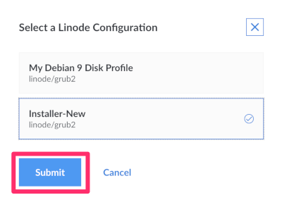
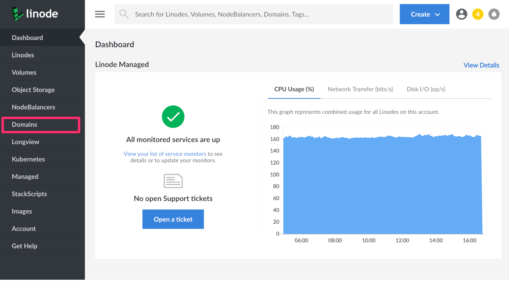

---
author:
  name: Linode
  email: docs@linode.com
description: 'This guide provides an overview of Linode''s Cloud Manager for users who are more familiar with the Classic Manager. You will find information about each section of the Cloud Manager, specific features that you may need help finding, and settings that might make your overall Cloud Manager experience.'
og_description: 'This guide provides an overview of Linode''s Cloud Manager for users who are more familiar with the Classic Manager. You will find information about each section of the Cloud Manager, specific features that you may need help finding, and settings that might make your overall Cloud Manager experience.'
keywords: ["classic manager","cloud manager","linode"]
license: '[CC BY-ND 4.0](https://creativecommons.org/licenses/by-nd/4.0)'
published: 2019-12-20
modified_by:
  name: Linode
title: 'An Overview of Linode''s Cloud Manager for Classic Manager Users'
h1_title: 'An Overview of Linode''s Cloud Manager for Classic Manager Users'
contributor:
  name: Linode
---
Linode's Classic Manager will be [retired on January 31, 2020](https://www.linode.com/2019/11/18/notice-legacy-linode-manager-users/). At that time, all users will be migrated to the new [Cloud Manager](https://cloud.linode.com/) when logging in to manage your infrastructure on Linode.

There have been substantial updates to Cloud Manager since it was introduced back in 2014. Cloud Manager has many new features, including an updated look-and-feel, modern user-interface, mobile support, and easy access to our recently released products. It’s also implemented solely atop our [public APIv4](https://developers.linode.com/api/v4).

[Development work for Cloud Manager](https://github.com/linode/manager/) will continue beyond January 31, 2020. As always, your feedback for Cloud Manager or any other aspect of our platform is welcome at feedback@linode.com.


We will continue to support APIv3 and the APIv3-based CLI beyond January 31, 2020.


## In this Guide

If you are a Classic Manager user, this guide will provide an overview of the features and services available in Linode's Cloud Manager. Some of the topics that will be discussed are:

- An introduction to each section of the Cloud Manager, including links to related guides throughout our documentation library.
- Specific features that you may need help finding due to differences in location between Classic Manager and Cloud Manager
- Settings that might make your overall Cloud Manager experience better

## Linodes

The Linodes section of Cloud Manager allows you to create and manage your Linodes. Each Linode instance in Cloud Manager includes:

- [Summary information](/docs/uptime/monitoring-and-maintaining-your-server/#linode-cloud-manager) about your Linode, like CPU usage, IPv4 and [IPv6 traffic](/docs/networking/an-overview-of-ipv6-on-linode/), and Disk IO
- Access to any of your Linode's attached Volumes and the ability to [create a Volume](/docs/platform/block-storage/how-to-use-block-storage-with-your-linode/#add-a-volume-from-the-linode-detail-page)
- Networking information and features, including the ability to add IPv4 and IPv6 addresses, [IP transfer](/docs/platform/manager/remote-access/#transferring-ip-addresses) and [IP sharing](/docs/platform/manager/remote-access/#configuring-ip-sharing)
- The ability to [resize your Linode](/docs/platform/disk-images/resizing-a-linode/), boot your Linode into [Rescue Mode](/docs/troubleshooting/rescue-and-rebuild/#rescue-mode-overview), and [rebuild your Linode](/docs/troubleshooting/rescue-and-rebuild/#rebuilding)
- Access to Linode's [Backup service](/docs/platform/disk-images/linode-backup-service/#enable-the-backup-service)
- An [Activity Feed](/docs/linode/cloud-manager/what-are-the-cloud-manager-events-and-activity-feeds) that displays any relevant events related to this Linode
- Settings that allow you to update your Linode's label, [reset your Linode's root password](/docs/quick-answers/linode-platform/reset-the-root-password-on-your-linode/), [manage system usage email notifications](/docs/uptime/monitoring-and-maintaining-your-server/#configure-linode-cloud-manager-email-alerts), [manage Watchdog](/docs/uptime/monitoring-and-maintaining-your-server/#configure-shutdown-watchdog) (Linode's automatic reboot feature), and delete your Linode
- An area to [manage and create disks and configuration profiles](/docs/platform/disk-images/disk-images-and-configuration-profiles/)
- [Cross data center migrations](/docs/platform/migrating-to-a-different-data-center/)

### Find Your Disks
In Classic Manager, Disks were located in the Linode Dashboard tab. In the Cloud Manager, Disks are now in the **Disks/Configs** tab of the Linode.

1.  Click the **Linodes** link in the sidebar menu and select the Linode whose disks you'd like to see.

1.  Then click the **Disks/Configs** tab. The disks are located in the **Disks** panel. Here you can [add a disk](/docs/platform/disk-images/disk-images-and-configuration-profiles/#disks), or for each individual disk, you can click the **more options ellipses** to get a drop down menu which will allow you to choose options such as `Rename`, `Resize`, `Imagize`, `Clone`, and `Delete`.

    

### Reboot Your Linode

You can reboot a Linode from two places within the Cloud manager.

1. From your [Linodes listing page](https://cloud.linode.com/linodes), click the **More Options Ellipses** and select *Reboot*.

    

    If you have more than one *[Configuration Profile](/docs/platform/disk-images/disk-images-and-configuration-profiles/#configuration-profiles)*, a panel will appear to allow you to select which Configuration to boot. Select a Config and click the **Submit** button. Otherwise, a confirmation dialog will appear.

    

1. You can also reboot your Linode from within any Linode detail screen by clicking on the **Status Icon**. A drop down menu will appear, select *Reboot*.

    

    Again, if you have more than one *Configuration Profile*, a panel will appear to allow you to select which Configuration to boot. Select a Config and click the **Submit** button. Otherwise, a confirmation dialog will appear.

### Delete a Public IP Address
You can delete public IP addresses in both Classic and Cloud managers. In Classic Manager, this was done under the **Remote Access** tab from the Linode you wished to modify. In Cloud Manager it is done in the **Networking** tab.

1.  Click **Linodes** from the sidebar menu.

1.  Choose the Linode you wish to modify to enter the Linode detail screen. Then, click on the **Networking** tab. Your IPv4 and IPv6 addresses will be listed here.

1.  Next to the public IPv4 address you wish to delete, click on the **more options ellipses**. Select the option to **Delete IP** from the drop down menu.

    

1.  A confirmation popup will appear where you can confirm the operation.

    
You must have at least one public IP on a Linode. If you attempt to delete the last public IP on a Linode you will receive an error message *after* you confirm the deletion.


## Volumes

The **Volumes** section of Cloud Manager gives you access to Linode's [Block Storage](https://www.linode.com/products/block-storage/) service. To learn how to create, and manage Block Storage volumes using Cloud Manager, see our [How to Use Block Storage with Your Linode](/docs/platform/block-storage/how-to-use-block-storage-with-your-linode/) guide.

### Find Volumes
In Classic Manager, Volumes were found within a Linode's Dashboard tab. In Cloud Manager, Volumes are their own top-level menu item in the sidebar.


In Cloud Manager, you can also access Volumes from a [Linode's detail page](/docs/platform/block-storage/how-to-use-block-storage-with-your-linode/#add-a-volume-from-the-linode-detail-page).


## Object Storage

The **Object Storage** section of Cloud Manager gives you access to Linode’s [Object Storage service](https://www.linode.com/products/object-storage/) which is a globally-available, S3-compatible method for storing and accessing data. The Object Storage service is not available in Classic Manager.

To learn how to begin using Object Storage, view our [How to Use Linode Object Storage](/docs/platform/object-storage/how-to-use-object-storage/) guide. To access all available Object Storage guides, see the [Object Storage section](/docs/platform/object-storage/) of our documentation site.

## NodeBalancers

Linode's [NodeBalancers service](https://www.linode.com/products/nodebalancers/) provides load balancing for your applications and services ensuring that they are highly available for users. To learn how to get started with NodeBalancers using Cloud Manager, see our [Getting Started with NodeBalancers](/docs/platform/nodebalancer/getting-started-with-nodebalancers/#additional-nodebalancers-and-features) guide.

## Domains (DNS Manager)
The DNS Manager allows you to control and manage your domains. In Cloud Manager, the DNS Manager is located in the **Domains** link in the sidebar.

For more information on Cloud Manager's DNS Manager, see the following guides:

- [DNS Manager](/docs/platform/manager/dns-manager/).
- [Common DNS Configurations](/docs/networking/dns/common-dns-configurations/)
- [Configure Your Linode for Reverse DNS](/docs/networking/dns/configure-your-linode-for-reverse-dns/)

### Zone Files

Cloud Manager does not include the **Check Zone** and **Zone File** features, since it automatically ensures that your Domain's zone file does not contain any errors:

- When creating a Zone File for a Domain, the [Linode API v4](https://developers.linode.com/api/v4) checks for any errors that may exist. If an error is found, the Cloud Manager will respond with the corresponding error. This means that the Cloud Manager will not allow you to create an invalid zone file.

- Once your Domain and corresponding Zone File is created, you can use the `dig` command to further verify that each domain record contains the information you expect, for example:

      dig example.com
      dig example.com MX

    See the [Use dig to Perform Manual DNS Queries](/docs/networking/dns/use-dig-to-perform-manual-dns-queries/) guide for more details on the `dig` command.

## Longview

The **Longview** section of Cloud Manager gives you access to Linode’s system data graphing service. It tracks metrics for CPU, memory, and network bandwidth, both aggregate and per-process, and it provides real-time graphs that can help expose performance problems. The Longview service offers both [free and paid plan tiers](/docs/platform/longview/what-is-longview/#longview-plan-details).

Longview is still being actively developed to reach parity with Classic Manager. To get started using Longview in Cloud Manager, see the [Understanding Linode Longview](/docs/platform/longview/what-is-longview/) guide.

## One-Click Apps

The **One-Click Apps** section of Cloud Manager gives you access to apps that make it easy to deploy and configure software on a Linode. Some popular One-Click Apps are [WordPress](/docs/platform/one-click/deploying-wordpress-with-one-click-apps/), [Minecraft](/docs/platform/one-click/deploying-minecraft-with-one-click-apps/), and [GitLab](/docs/platform/one-click/deploy-gitlab-with-one-click-apps/). We are actively adding new and useful One-Click apps. When a One-Click App is deployed, a new Linode is created and the appropriate software is installed with the configurations you provide. One-Click Apps are not available in Classic Manager.

See [How to Use Linode's One-Click Apps](/docs/platform/one-click/how-to-use-one-click-apps-at-linode/) to get started using One-Click Apps in Cloud Manager.

## Kubernetes

The Kubernetes section of Cloud Manager gives you access to our managed Kubernetes service, the Linode Kubernetes Engine (LKE). LKE is a fully-managed container orchestration engine for deploying and managing containerized applications and workloads. LKE combines Linode’s ease of use and [simple pricing](https://www.linode.com/pricing/) with the infrastructure efficiency of Kubernetes. LKE is not available in Classic Manager.

To get started using LKE, see our [Tutorial for Deploying and Managing a Cluster with Linode Kubernetes Engine](/docs/kubernetes/deploy-and-manage-a-cluster-with-linode-kubernetes-engine-a-tutorial/).

## StackScripts

[StackScripts](https://linode.com/stackscripts/) provide Linode users with the ability to automate the deployment of custom systems on top of our default Linux distribution images. StackScripts are usually Bash scripts, stored in the Linode Cloud Manager, and can be accessed when you deploy a Linode. Linodes deployed with a StackScript run the script as part of the first boot process.

To get started using StackScripts in Cloud Manager, see the [Automate Deployment with StackScripts](/docs/platform/stackscripts/) guide.

### Find StackScripts

In Classic Manager, access to StackScripts was found under the Linodes tab. In Cloud Manager, StackScripts are their own top-level menu item in the sidebar.

## Images

The Images section of Cloud Manager gives you access to Linode Images which allow you to take snapshots of your disks, and then deploy them to any Linode under your account. This can be useful for bootstrapping a master image for a large deployment, or retaining a disk for a configuration that you may not need running, but wish to return to in the future.

To get started using Images with Cloud Manager, see [Linode Images](/docs/platform/disk-images/linode-images/).

### Find Images
In Classic Manager, access to image management was found in the Linodes tab. In Cloud Manager, Images are their own top-level menu item in the sidebar.

## Account (Management and Billing)

The **Account** section of Cloud Manager allows you to manage your account's billing information and users, and to configure various account-wide settings.

You can manage the following account and billing settings in the Account section of Cloud Manager:

- [Update contact information](/docs/platform/manager/accounts-and-passwords/#updating-contact-information) and [credit card information](/docs/platform/billing-and-support/manage-billing-in-cloud-manager/#updating-credit-card-information)
- [Make a payment with a credit card or PayPal](/docs/platform/billing-and-support/manage-billing-in-cloud-manager/#making-a-payment)
- View account promotion credits
- [View recent invoices and payments](/docs/platform/billing-and-support/manage-billing-in-cloud-manager/#accessing-billing-history)
- [Add new users and manage exiting user's profiles and permissions](/docs/platform/manager/accounts-and-passwords/#users-and-permissions)
- [Enable Backup auto enrollment for all new Linodes on your account](/docs/platform/disk-images/linode-backup-service/#auto-enroll-new-linodes-in-the-backup-service)
- [Enable Network Helper](/docs/platform/network-helper/#global)
- [Cancel Object Storage](/docs/platform/object-storage/how-to-use-object-storage/#cancel-object-storage)
- [Add the Linode Managed service to your account](/docs/platform/linode-managed/#getting-started)

### Find Credit Remaining

In the Cloud Manager, to find the amount of available credit that you have:

1. Click on the **Account** link from the sidebar menu.

1. On the right hand side of the screen you’ll see the **Billing Information** section. If you have credit stored on your account, it’ll appear in green under the **Current Balance** field.

### Printing an Invoice
In Cloud Manager you can download a printable PDF of your invoice from your list of invoices or from within an individual invoice.

1.  Navigate to your Account by clicking on **Account** in the sidebar.

1.  Click on the **Recent Invoices** menu item in the **Billing** section. This will expand to show you a list of your recent invoices. Each invoice has a **Download PDF** link next to it.

    

1.  You can also click on any invoice to view it within the Cloud Manager. At the top of the invoice there is a **Download PDF** button.

    

### Import Display Groups
If you have used the Display Groups feature in the Classic Manager, you can import your Display Groups to the Cloud Manager as [tags](/docs/quick-answers/linode-platform/tags-and-groups/):

1.  Navigate to the **Account** page in the sidebar links menu, then click on the **Settings** tab.

1.  Expand the panel labeled **Import Display Groups as Tags** and then click **Import Display Groups**:

    

1.  A form will appear that lists your Display Groups and asks you to confirm the import action. To proceed, click the **Import Display Groups Now** button in this form.

    
Importing your Display Groups is a **one-time** operation. If you don't have any Display Groups configured in the Classic Manager this feature will not appear in the Cloud Manager.


### Password Management

The Cloud Manager does not support forcing password expirations. Forcing password resets on a schedule is [bad practice from a security perspective](https://pages.nist.gov/800-63-FAQ/#q-b05). Current security research indicates that forced password changes do more harm than good. If you want to force password resets for users of your Linode account, we recommend using a password manager for this purpose.

## My Profile

The **My Profile** section of Cloud Manager provides access to various settings related to your Linode account's profile. This area of Cloud Manager contains access to the following features and settings:

- [Changing your account's associated email address](/docs/platform/manager/accounts-and-passwords/#changing-your-email-address) and timezone
- [Resetting your Account password](/docs/platform/manager/accounts-and-passwords/#changing-or-resetting-your-linode-cloud-manager-password) managing trusted devices
- [Enabling two-factor authentication](/docs/security/linode-manager-security-controls/#enable-two-factor-authentication)
- Managing trusted devices
- [Adding and managing public SSH keys](/docs/security/authentication/use-public-key-authentication-with-ssh/#upload-your-ssh-key-to-the-cloud-manager)
- [Managing LISH authentication methods](/docs/platform/manager/using-the-linode-shell-lish/#add-your-public-key)
- [Add and manage personal and third party API v4 access tokens](/docs/platform/api/getting-started-with-the-linode-api/#get-an-access-token)
- [Creating and managing OAuth Apps](/docs/platform/api/how-to-create-an-oauth-app-with-the-linode-python-api-library/#obtaining-a-client-id-and-a-client-secret)
- [Access Linode referral codes](/docs/platform/billing-and-support/how-linode-billing-works/#referral-credits)
- Enable email alerts for account activity

### API Keys / API Tokens
API Keys from Classic Manager do not transfer. This means that if you have keys generated in Classic, you will not see them in Cloud Manager. In Cloud Manager, API Keys are called API Tokens (personal access tokens) and can be used for a variety of different uses.

1.  To generate a new personal access token, navigate to your profile by clicking on your username and select **My Profile** from the drop down menu. Then click on the **API Tokens** tab.

    

1.  Click **Add a Personal Access Token**. A panel will display allowing you to give this token a label and choose the access rights you want users authenticated with the new token to have.

    

1.  When you have finished, click **Submit** to generate a new Personal Access Token. Copy the token and save it to a secure location before closing the popup. **You will not be able to view this token through the Cloud Manager after closing the popup.**

### Manage Email Event Notifications

Email event notifications alert you when new events such as booting, shutting down, or updates to a Linode occur on your account. You can enable or disable email event notifications using the Cloud Manager.

In Classic Manager email events notifications were managed in the **Notifications** tab under **my profile**. In Cloud Manager this is done in the **Settings** tab from [**My Profile**](https://cloud.linode.com/profile/display).

## User Interface Enhancements

### Compact Mode and Dark Mode
Cloud Manager by default uses more whitespace on the screen. However, there is a *Compact Mode* which compresses this extra space and allows more information to be displayed on the screen. This setting is located at the bottom left hand corner of the screen when the gear icon is clicked. This is also where you can toggle on *Dark Mode*.

### Accessibility

The Linode Cloud Manager has been built with accessibility in mind. Currently, the Cloud Manager is actively being developed to achieve [WCAG 2.0 Level AA](https://www.w3.org/TR/WCAG20/).

We have received a lot of helpful feedback from our users regarding accessibility. While we have addressed a lot of your feedback, this is still a work in progress and will be iterated upon with time. Please contact feedback@linode.com with any comments or requests regarding accessibility.

## Next Steps

See the following guides for more features of Cloud Manager:

 - [What are the Cloud Manager Events and Activity Feeds](/linode/cloud-manager/what-are-the-cloud-manager-events-and-activity-feeds/)
 - [Longview in Cloud Manager](/platform/longview/what-is-longview/)

 If you still need help finding features in or using Cloud Manager, please contact [Linode Support](/platform/billing-and-support/support/).