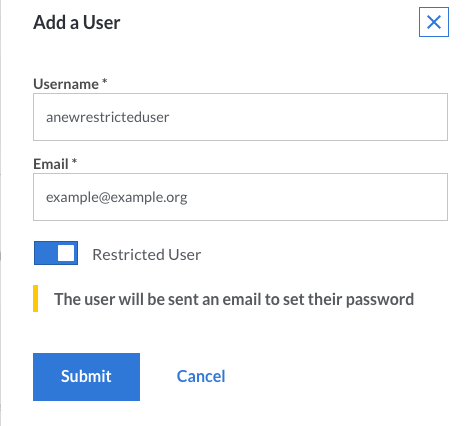
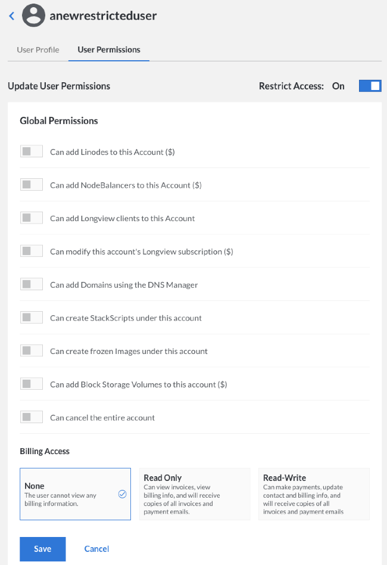
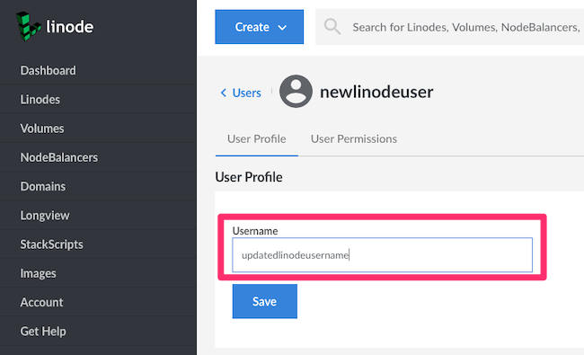
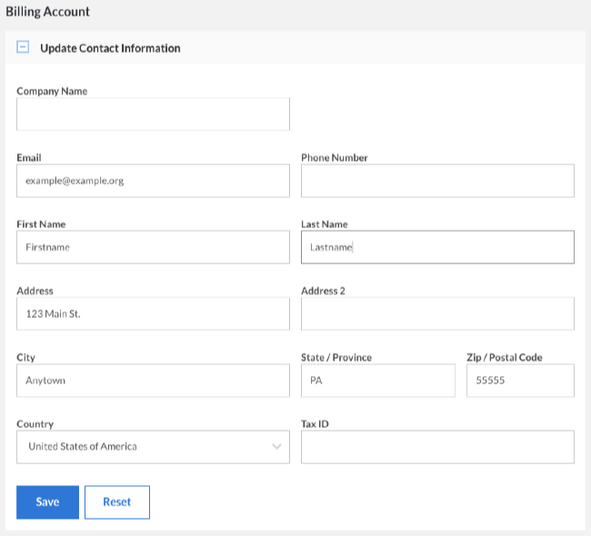
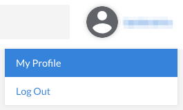
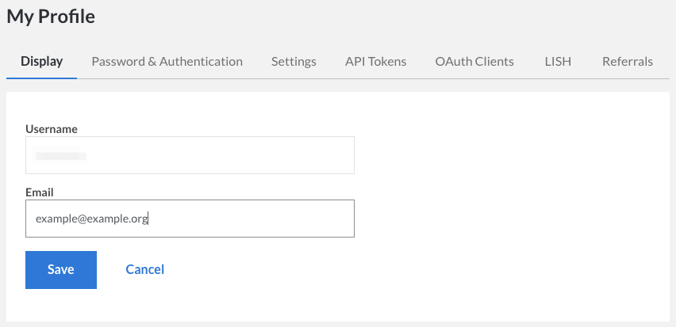

---
author:
  name: Linode
  email: docs@linode.com
description: Our guide to managing accounts and passwords.
keywords: ["accounts", "passwords", "Linode Cloud Manager", "manager"]
license: '[CC BY-ND 4.0](https://creativecommons.org/licenses/by-nd/4.0)'
aliases: ['platform/manager/accounts-and-passwords-new-manager/','accounts-and-passwords/','platform/accounts-and-passwords/']
modified: 2018-08-23
modified_by:
  name: Linode
published: 2012-04-03
title: Accounts and Passwords
classic_manager_link: platform/manager/accounts-and-passwords-classic-manager/
---

Maintaining your user Linode Cloud Manager accounts, passwords, and contact information is just as important as administering your Linode. This guide shows you how to control access to the Cloud Manager, update your contact information, and modify account passwords. Note that the information in this guide applies to the Cloud Manager only, except for the section on resetting the root password.

## Users and Permissions

You can grant other people access to your Linode Cloud Manager account by creating *users* and assigning *permissions* to restrict access to certain areas of the control panel. Adding users and configuring permissions is useful for groups that need to grant all team members access to the Linode Cloud Manager, or organizations that just want their billing department to have a separate account to receive invoices and billing information.

 
A single user was automatically created for your account when you signed up for Linode. If you will be the only person accessing the Linode Cloud Manager, you won't need to create any other users on your account.


### Adding a User

When you add a user, you give that individual permission to log in to the Linode Cloud Manager and, depending on the access level they are assigned, receive email notifications. There are two types of users: *Restricted users*, who have limited access to the Linode Cloud Manager, and *unrestricted users*, who have full access.

Here's how to add a user to your Linode account:

1.  Log in to the [Cloud Manager](https://cloud.linode.com).
1.  Click the **Account** link in the sidebar.
1.  Click the **Users** link.
    
1.  Click on **Add a User**. The *Add a User* menu appears.
    
1.  Enter a username for the user in the **Username** field.
1.  Enter the user's email address in the **Email** field. A password creation link will be sent to the new user's email address.
1.  To give the new user restricted access, toggle the **Restricted Access** button.
1.  Click **Submit**.

If you granted the user full access, the account will be created and no further action is required. If you opted to restrict the user, follow the instructions in the next section.

### Setting Permissions

Setting permissions restricts a user's access to certain areas of the Linode Cloud Manager. For example, you could limit a user to a single Linode and prevent them from removing the Linode or adding extra services. Don't worry--these settings aren't permanent. You can add or remove access for a user at any time in the future.

Here's how to set a user's access permissions:

1.  Click the **Account** link in the sidebar.
1.  Click the **Users** link.
1.  Select the user from the list.
1.  Select the **User Permissions** tab.

    

1.  Toggle the boxes in the **Global Permissions** section to allow the user to add [Linodes](/docs/getting-started/), [NodeBalancers](/docs/platform/nodebalancer/getting-started-with-nodebalancers/), [Domains](/docs/networking/dns/dns-manager-overview/#domain-zones), [Longview](/docs/platform/longview/longview/) clients, and [Block Storage Volumes](/docs/platform/block-storage/how-to-use-block-storage-with-your-linode/) to the account, create [StackScripts](/docs/platform/stackscripts/) and frozen [Images](/docs/platform/disk-images/linode-images/), access all billing information, and cancel the entire account.

    
Granting access to settings denoted with a dollar sign ($) will allow the user to perform actions that incur billing costs, such as adding or resizing a Linode.


1.  Select the appropriate permissions (None, Read Only, or Read-Write) in the **Permissions** section to allow the user access your Linodes, StackSripts, Images, NodeBalancers and Domains.
1.  When you have finished configuring the user's permissions, click **Save**. The user's permissions will be saved and effective immediately.

### Recovering a Lost Username

Did you forget your Cloud Manager username? Recover it with the *Forgot Username* webpage. Here's how:

1.  Visit the [Forgot Username](https://login.linode.com/forgot/username) webpage.
1.  Enter your email address in the **Email** field.
1.  Click **Submit**.

In a couple minutes, you'll receive an email message with any Linode Cloud Manager users that correspond to that email. If you do not receive information about any users, then you may have registered your account with a different email.

### Removing a User

You can permanently remove a user account from the Linode Cloud Manager. Here's how:

1.  Click the **Account** link in the sidebar.
1.  Click the **Users** tab.
1.  Locate the user in the list and click on the **more options ellipsis** to the right of the user.
1.  Select the **Delete** link from the menu. A warning appears asking you to confirm that you want to delete the user.
    
1.  Click **Delete**.

The account will be removed, and the user will no longer be able to access the Linode Cloud Manager.

### Changing a Username

You can update a username, including your own, from the Linode Cloud Manager.

1.  Click the **Account** link in the sidebar.
1.  Click the **Users** tab.
1.  Locate the user in the list and click on their current username.
1.  Enter a new username in the **Username** field.
    
1.  Click **Save**.

## Email Addresses and Contact Information

Linode uses the contact information on file in your account to notify and bill you. Keep this information current to prevent service interruptions. It's especially important to keep your email address current.

Both the *Account & Billing* and *My Profile* pages have an email address field. The email addresses saved on these pages receive different notifications, as described in the following sections. If you are the only user, you should enter your email address on both webpages. If there are multiple users, verify that the primary account holder's email address is current on the *Account* webpage.

### Updating Contact Information

Use the *Account & Billing* webpage to update the contact information for the Linode account. The email address saved on this webpage receives invoices, receipts, and credit card expiration warnings. Support tickets are *not* sent to this email address.

Here's how to update the contact information and the email address on the *Account* webpage:

1.  Click the **Account** link in the sidebar.
1.  Click the **Account & Billing** tab.
1.  Expand the **Update Contact Information** panel and update the contact information and the email address for the account.
    
1.  Click **Save**.

The account's contact information will be updated.

### Changing Your Email Address

Use the *My Profile* page to modify the email address associated with your user account. The email address saved on this webpage receives IP whitelist warnings, password reset messages, and support tickets for services that you have permission to access. You may also receive invoices and receipts, if the primary account holder grants you access to that information.

Here's how to change your email address on the *My Profile* webpage:

1.  Select the **My Profile** link by clicking on your username at the top of the page.
   
1.  In the **Display** tab, enter your email address in the **Email** field.
    
1.  Click **Save**.

Your profile's email account will be updated.

## Passwords

Creating strong passwords is essential to protecting your Linode and your Linode Cloud Manager account. If you suspect that an unauthorized user has gained access to one of your accounts, you should change the password immediately. Use the instructions in this section to change your Linode Cloud Manager password and reset the password for the `root` user on the Linode.

### Changing or Resetting Your Linode Cloud Manager Password

If you want to change your password, or you forgot your password and need a new one, you can accomplish these task through the *Forgot Password* webpage. Here's how:

1.  Visit the [Forgot Password](https://login.linode.com/forgot/password) webpage.
1.  Enter your username in the **Username** field.

    
  If you've forgotten your Linode Cloud Manager username, see [Recovering a Lost Username](#recovering-a-lost-username).


1.  Check your email for a message containing further instructions.

1.  Follow the instructions in the email message to reset your password.

### Resetting the Root Password

If you can't remember the password for the `root` user on a Linode, use the Linode Cloud Manager to reset it. Here's how:

1.  Click the **Linodes** link in the sidebar.
1.  Select a Linode. The Linode's details page appears.
1.  Click **Power Off** from the status menu to turn off your Linode. Monitor your bell notifications at the top of the page for a message indicating that your Linode has shut down.

    

1.  Click the **Settings** tab.
1.  Under the **Reset Root Password** panel, select your primary disk from the **Disk** menu.
1.  Enter a new password for the `root` user in the **Password** field.
1.  Click **Save**. The Linode's dashboard appears.
1.  Click **Power On** to turn on your Linode.

Now you can use the new `root` user password to log in to your Linode. See [Connecting to Your Linode](/docs/getting-started#connect-to-your-linode-via-ssh) for more information about connecting. If you are unable to connect with the `root` credentials via SSH, try connecting with [Lish](/docs/platform/manager/using-the-linode-shell-lish/) instead. If you are able to connect via Lish but not SSH, you may need to troubleshoot your SSH configuration and firewall rules.

## Next Steps

You can take additional steps to secure your Linode Cloud Manager account by enabling the two-factor authentication and IP address whitelisting features. You can also configure security event notifications and disable API access. For instructions, see the [Security](/docs/security/linode-manager-security-controls/) guide.
