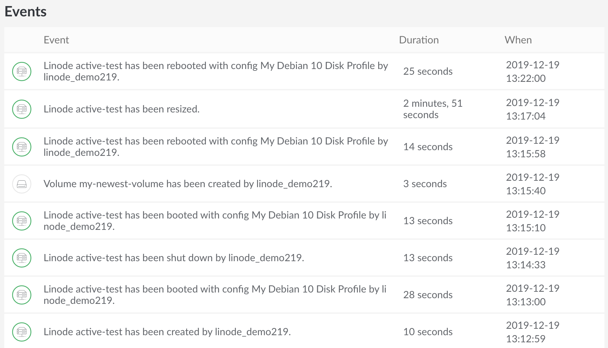

---
author:
  name: Linode
  email: docs@linode.com
description: Our guide to Events in the Linode Cloud Manager
keywords: ["accounts", "passwords", "linode manager", "manager"]
license: '[CC BY-ND 4.0](https://creativecommons.org/licenses/by-nd/4.0)'
title: "Cloud Manager Events and Activity"
date: 2019-12-19T10:30:30-05:00
---

Tasks performed using the Linode Cloud Manager or other account specific tools like our [CLI](https://www.linode.com/docs/platform/api/linode-cli/) or [API](https://www.linode.com/products/api/) will be logged to an individual Linode's activity feed, or on your account's [Events Page](https://cloud.linode.com/events). The events and activity pages are a user accessible log, or a history of events taking place on your account. They will contain details regarding most notable events affecting your Linodes, like reboots, shutdowns, migrations, and more. In this guide, we'll learn how to navigate to the events section of the [Cloud Manager](https://cloud.linode.com), an Individual Linode's activity feed, and learn exactly how the information is displayed, should we ever need it.


The Events Page will be limited to information tied into User Permissions as set by for each individual user on an account. For more information, see our [Accounts and Passwords](https://www.linode.com/docs/platform/manager/accounts-and-passwords/#users-and-permissions) guide.


## Event's Page

Your account's [Events Page](https://cloud.linode.com/events) is a history, or a log of all activity pertaining to your Linode Account. This includes changes to all billable resources, domains using our DNS Manager, Stackscripts, and other events that take place affecting your account, like opening a new support ticket.

1. The [Events Page](https://cloud.linode.com/events) can be found by logging into your Linode Manager and selecting the bell icon at the top right of the page. This will list the most recent events on your account, along with a brief descriptor for any event that has taken place, a rounded amount of time to give you an idea of how long ago it occurred, and in some cases show the user who initiated the event.

    

2. To view more events and additional details pertaining to them, select the `View All Events` button found at the bottom of the list.

3. The following page will list all events attributed to your account, including a description, the duration of the event, and a more precise time down to the exact second in Coordinated Universal Time (UTC) that the event was initiated. The list of events can contain a long history of the life of your account, and will continue to populate with past entries as you scroll down the page. If there are no entries left, you'll see the text "No more events to show" at the bottom of the page.

    

## Linode Activity Feed

The Linode Activity Feed is similar to your Account's [Events Page](#Events-Page), however this will be a filtered list only relevant to the specific Linode you're observing.

1. First, log into your Linode Cloud Manager and select the Linode you'd like to observe events for.

2. Towards the center of the following page you should see the Activity Feed, and can click on the `View More Activity` button to see a list of all of your Linode's activity in more detail.

3. On the next page, you'll see a list of events including a description, the duration of the event, and the time that the event was initiated in Coordinated Universal Time (UTC). In this case, you can see that the most recent event was a reboot that took 25 seconds to complete.

    

    The list of events can contain a long history of the life of your Linode, and will continue to populate with past entries as you scroll down the page. If there are no entries left, you'll see the text "No more events to show" at the bottom of the page.