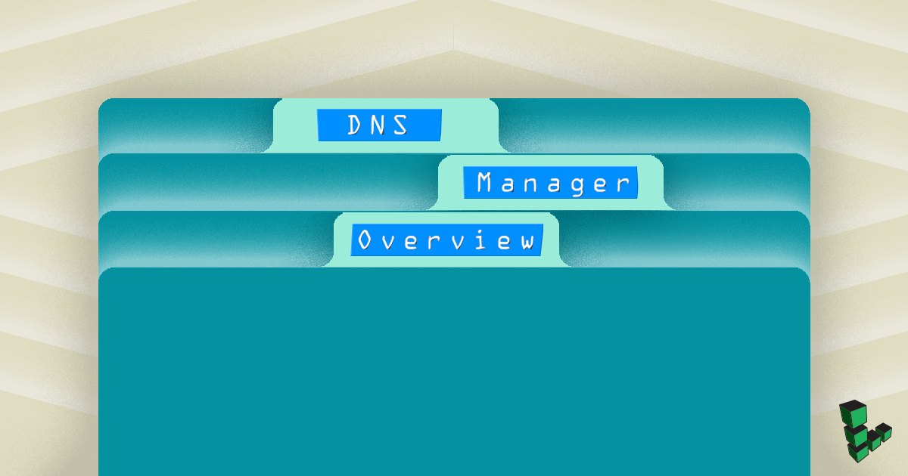
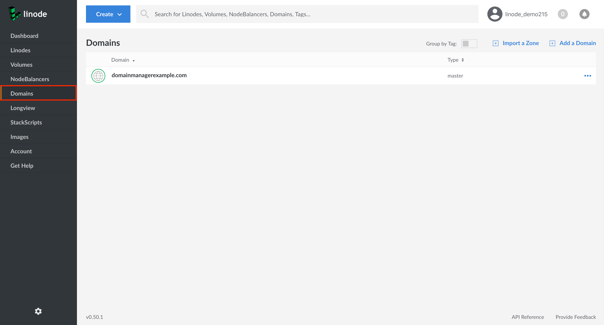
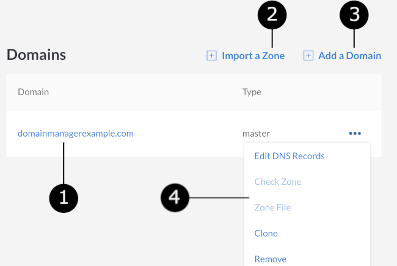
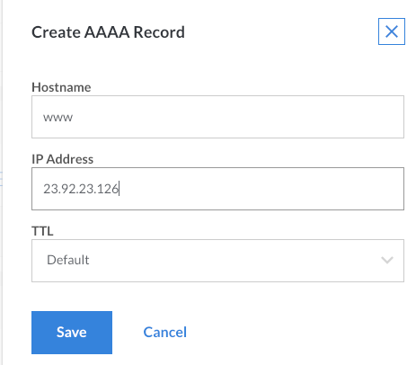
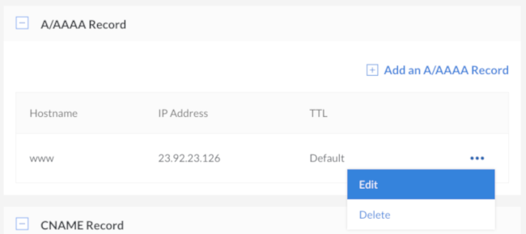
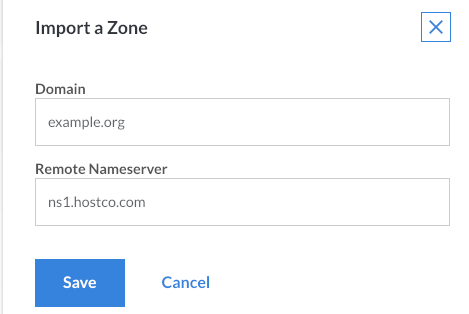
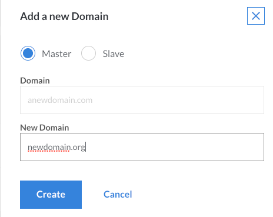

---
author:
  name: Linode
  email: docs@linode.com
description: 'Use the Domains section of the Linode Cloud Manger to Direct Domains to Your Linode.'
keywords: ["dns manager", "linode dns", "Linode Cloud Manager dns", "dns configuration", "ttl", "domain zones", "domain name"]
license: '[CC BY-ND 4.0](https://creativecommons.org/licenses/by-nd/4.0)'
aliases: ['networking/dns/dns-manager/','platform/manager/dns-manager-new-manager/','dns-guides/configuring-dns-with-the-linode-manager/','networking/dns/dns-manager-overview/','dns-manager/']
modified: 2018-08-24
modified_by:
  name: Linode
published: 2009-07-16
title: DNS Manager
classic_manager_link: platform/manager/dns-manager-classic-manager/
---

<!--  -->

The *Domains* section of the Linode Cloud Manager is a comprehensive DNS management interface that allows you to add DNS records for all of your domain names. This guide covers the use of the **Domains** section and basic domain setup. For an introduction to DNS in general, see our [Introduction to DNS Records](/docs/networking/dns/dns-records-an-introduction/) guide.


Linode's DNS service employs [Cloudflare](https://cloudflare.com) to provide denial of service (DDoS) mitigation, load balancing, and increased geographic distribution for our [name servers](/docs/networking/dns/dns-records-an-introduction/#name-servers). These factors make our service reliable, fast, and a great choice for your DNS needs.



To use the Linode DNS Manager to serve your domains you must have an active Linode on your account. If you remove all active Linodes your domains will no longer be served.


## Getting Started

The Domain Name System (DNS) attaches human-readable domain names to machine-usable IP addresses. In many ways, it is the phone book of the Internet. Just like a phone book can help you find the phone number of a business, DNS can take a domain name like `google.com` and translate it into an IP address like `74.125.19.147`. This global system allows users to remember the names of websites instead of their numeric IP addresses.


All steps in this guide are completed within the **[Domains](https://cloud.linode.com/domains)** section of the [Linode Cloud Manager](https://cloud.linode.com/).


## DNS Set-Up Checklist

DNS records are only actively hosted on accounts with at least one Linode. When setting up a domain name on your Linode, make sure you perform the following steps:

1.  Register (purchase) a domain name if you haven't already.
2.  Set your domain name to [use Linode's name servers](#use-linode-s-name-servers-with-your-domain). You'll need to do this on your domain registrar's website and then wait up to 24 hours for the change to take effect.
3.  Use the DNS Manager to [add a domain](#add-a-domain), and then start [adding some basic DNS records](#add-dns-records).
4.  [Set reverse DNS](/docs/networking/dns/configure-your-linode-for-reverse-dns/).
5.  If you have any special DNS requirements, such as when using a third-party email server, add additional DNS records [for your specific needs](/docs/networking/dns/common-dns-configurations/).

## Use Linode's Name Servers with Your Domain

After you purchase a domain, log in to your domain registrar's control panel and set the name servers for your domain name to the entries below. See the instructions on your domain name registrar's website for more information.

-   `ns1.linode.com`
-   `ns2.linode.com`
-   `ns3.linode.com`
-   `ns4.linode.com`
-   `ns5.linode.com`

 
DNS changes can take up to 24 hours to propagate throughout the internet, although the changes are usually visible within several hours.


## Create and Manage Domains

You can create and manage domains from the **Domains** section of the Linode Cloud Manager. To find this area, log in to your [Cloud Manager](https://cloud.linode.com/) account and click the **Domains** link in the sidebar:

### DNS Manager Options Overview

The section below provides a detailed description of the available options within the **Domains** section of the Linode Cloud Manager:

1.  All of your domains are listed under the **Domains** table. Click the name of a domain to add or edit DNS records within that domain's zone. Before you can add any DNS records, you must add a domain.

    
A *domain zone* is a collection of DNS records for a single domain name. **Creating a domain also creates its corresponding domain zone.** The term *domain zone* becomes synonymous with the term *domain*, both in terms of use and administration.


1.  If you have a zone that can be exported from a server or another hosting provider, click **Import a Zone** to import it.

1.  Click **Add a Domain** to create a new domain zone.

1.  Click on the **more options ellipsis** to corresponding to a domain zone to edit DNS records within a zone, clone an existing zone, or remove a zone.

### Add a Domain

If you're new to Linode, or if you've just purchased a new domain name, the first step is to add a new domain in the **Domains** section of the Cloud Manager. <!-- If you don't know what records to add, the DNS Manager can insert some basic records when you create the new domain zone. -->

<!--
This video runs through the process of adding a new domain zone:


-->

1.  From the **Domains** section, click on **Add a Domain**. The **Add a New Domain** panel will appear where you can fill out the form fields with your domain's information.

    

    If you want to add a *slave zone* instead of a master zone, click the **Slave** radio button.

    
In order for Linode's DNS servers to function as slaves, your DNS master server must notify and allow AXFR requests from the following IP addresses:

    104.237.137.10
    65.19.178.10
    75.127.96.10
    207.192.70.10
    109.74.194.10
    2600:3c00::a
    2600:3c01::a
    2600:3c02::a
    2600:3c03::a
    2a01:7e00::a


1.  Enter your domain name in the **Domain** field. An example is shown above.
1.  Enter an administrator's email address in the **SOA Email Address** field.
1.  Click **Create**.

<!--
1.  If you are unfamiliar with DNS, the DNS Manager can automatically create some basic DNS records to get you started. To have it insert these records, select **Yes, insert a few records to get me started**, then select from the drop-down menu the Linode with which you want this domain zone associated.

    Alternatively, to keep the domain zone empty and prevent the DNS Manager from creating DNS records, select **No, I want the zone empty**.

If you selected the option to have the DNS Manager insert basic DNS records, those records will be visible, as shown above. If you elected to keep the zone empty, you can start adding DNS records now. Skip to the [Adding DNS Records](/docs/networking/dns/dns-manager-overview/#add-records) section for instructions.

-->

### Add DNS Records

When you first create a domain, you'll need to add some DNS records. <!-- The DNS Manager can create some basic records to get you started when you create your domain zone, --> This section explains how to add your own records.

1.  Select a domain from within the **Domains** section of the Cloud Manager. The domain's detail page appears:

    

1.  The page is divided into different sections for each type of DNS record. Locate the section for the type of DNS record you want to add, then click **Add a [X] Record**. The example below shows how to add an A/AAAA record.

    

    
The exact form fields will vary depending on the type of DNS record you select.


1.  Enter a hostname in the **Hostname** field.

1.  Enter the IP address of your server in the **IP Address** field. See [this quick answer page](/docs/quick-answers/linode-platform/find-your-linodes-ip-address/) to find your Linode's IP address.

1.  Select a time interval from the **TTL** menu. *TTL* stands for *time to live*, and affects how long DNS records are cached by DNS resolvers. When the designated time to live is reached, the resolver must query the authoritative name servers for new records.

1.  Click **Save**. It can take up to 30 minutes for new DNS records to become active.

### Edit DNS Records

To modify a Domain's existing DNS records:

1.  From the **Domains** section of the Cloud Manager, select the domain whose DNS records you'd like to edit. The DNS records for the selected domain zone will appear.

1.  Next to the DNS record you would like to edit, click on the **more options ellipsis**.

1.  Select **Edit** from the menu.

    

1.  Edit the DNS record by modifying the existing values in the fields that appear.

1.  Click **Save**. It can take up to 30 minutes for the record to be updated.

### Wildcards

A wildcard DNS record will match requests for domains that do not exist. Wildcards are often used to point all non-existing subdomains to an existing top level domain. For example, if a queried first-level subdomain does not exist, the IP address specified in the wildcard DNS record will respond.

To create a [wildcard DNS record](https://en.wikipedia.org/wiki/Wildcard_DNS_record):

1. Navigate to the **Domains** section of the Cloud Manager and click on the Domain that you'd like to add a wildcard DNS record to.

1. Find the **A/AAAA Record** section and select **Add an A/AAAA Record**.

1. When the **Create A/AAAA Record** panel appears, enter an asterisk (`*`) in the **Hostname** field and provide a valid IP address in the **IP Address** field.

1. Click **Save**. It can take up to 30 minutes for the record to be updated.


A wildcard must always be the furthest subdomain from the TLD (top level domain), i.e. `*.example.com`. If you would like to add a wildcard as a subdomain for a subdomain, you will need to add a new domain zone for that subdomain and then add the wildcard record to it. For example, to create `*.subdomain.example.com`, you must add a separate domain zone for `subdomain.example.com` first, then add an A/AAAA DNS record to that zone as indicated above.


### Subdomains

The Linode Cloud Manager does not support the addition of a subdomain on top of an existing subdomain in the same domain zone. For example, if you have `example.com` as a domain with an A record for `subdomain.example.com`, you cannot create `another.subdomain.example.com` within that same domain zone.

Instead, [add the subdomain](#add-a-domain) to the Cloud Manager as a separate domain with its own domain zone and DNS records. Then add an A/AAAA record for the second-level subdomain. In the previous example, you would create a domain zone named `subdomain.example.com`, the create an A/AAAA record with hostname `another` inside of it.

### Import Domains with AXFR

If you're migrating domains to Linode from another hosting provider and that provider allows zone transfers from its DNS server, it may be possible to import your existing domain and its DNS records into the Linode Cloud Manager. If the import is successful, the domain along with all of its existing DNS records will be available in the **Domains** section of the Cloud Manager.

Here's how to import a zone file:

1.  From the **Domains** section, click on **Import a Zone**.

    

1.  Enter the domain name in the **Domain** field, as shown in the example above.

1.  Enter the name server in the **Remote Nameserver** field.

    
The name server must allow zone transfers (AXFR) from the following IP addresses:

    96.126.114.97
    96.126.114.98
    2600:3c00::5e
    2600:3c00::5f


1.  Click **Save**. The Linode Cloud Manager will connect to the remote name server and import your existing DNS records.

### Clone DNS records

The *Clone* feature allows you to copy DNS records from an existing domain in your Linode account to a new domain. If you've already set up DNS records for one of the services you host on your Linode account, this is a good way to quickly assign another domain to that same service.

Here's how to clone DNS records for an existing domain:

1.  Click on the **more options ellipsis** corresponding to the domain whose DNS records you would like to clone and select **Clone** from the menu.

1.  Enter the name of the new domain in the **New Domain** field.

    

1.  Click **Create**. The DNS records will then be copied from the existing domain to the domain.

### Remove Domains

If one of your domain names has expired or if you want to start hosting it on another DNS provider, you should permanently remove the domain and all of its associated DNS records.

1.  From the **Domains** section of the Cloud Manager, find the domain you would like to remove and click its **more options ellipsis**.

1.  Select **Remove** to permanently delete the domain, including all associated DNS records. It can take up to 30 minutes for the changes to take effect.


Once removed, you **MUST** delete the Linode nameserver entries from the domain at the registrar level. This is a very important step; if the entries are not removed, someone could use your domain without your permission.


## Troubleshoot DNS Records

Having problems with your DNS records? We recommend reviewing this section to help get your DNS settings back on track. Follow these tips to troubleshoot DNS issues.

### Wait for Propagation

DNS updates will take effect, or *propagate*, within the time period set by your zone file's [TTL](#set-the-time-to-live-or-ttl). If you've just made a DNS change and aren't seeing it reflected yet, the new information may not be available for up to 48 hours.

While you can't control DNS caching at every point on the Internet, you do have control over your web browser. Try holding down the *Shift* key or the *Control* key (depending on your browser) while you refresh the page to bypass your browser's cache of the old DNS data. You can also try bringing up your site in an alternate browser or editing your hosts file to [preview your website without DNS](/docs/networking/dns/previewing-websites-without-dns/).

### Set the Time To Live or TTL

In the context of DNS, Time to Live (TTL) tells internet servers how long to cache particular DNS entries. **The default TTL for Linode domain zone files is 24 hours**. This is fine for most situations because most people don't update their IP addresses often.

However, there are times when you'll want the TTL to be as low as possible. For instance, when you make a DNS change, you'll want that change to propagate quickly. Otherwise, some people will see the new site right away, and others (who had the old data cached) will still be visiting the website at your old server. Long caching times can be even more problematic when it comes to email, because some messages will be sent to the new server and some to the old one.

The solution is to lower your TTL before making a DNS change. You'll want to lower the TTL first, before making any other DNS changes. Here's a general overview of what should happen during a smooth DNS update:


TTL is always written out in seconds, so 24 hours = 86400 seconds.


1.  Check the TTL value for the DNS record you will be updating. Typically, this will be 24 or 48 hours.
1.  Update the relevant DNS records 48 to 96 hours in advance (for a 24-48 hour record), taking into account any intermediate DNS servers. Lower the TTL to five minutes (300 seconds, or the lowest allowed value). Do not make any other changes at this time.
1.  Wait out the original 48 to 96 hours.
1.  Visit your domain's DNS records in the Linode Cloud Manager again to update your IP address and anything else needed.
1.  The DNS changes should propagate within 30 minutes.

### Find Current DNS Information

Sometimes you may need to find the current DNS information for a domain. There are two great tools for doing this:

-   **dig**: Look up individual DNS entries. For example, you can find the IP address where your domain resolves.

-   **whois**: Find your registrar and nameserver information for your domain.

If you're using a computer that runs macOS or Linux, you can use these tools from the command line. To find your domain's IP (the primary A record), run:

    dig example.com

Look in the *answer* section of the output to locate your IP address. You can also query for other types of records. For example, to see the mail records for a domain, run:

    dig mx example.com

This returns all of your domain's MX records.

To find your domain's registrar and nameserver information, run:

    whois example.com

This generates a large amount of information about the domain. The basic information you need will be near the top of the output, so you might have to scroll back to see it.

For a web-based tool, you can also use [kloth.net](http://www.kloth.net/services/dig.php) for dig requests and [whois.net](http://whois.net/) for WHOIS requests. Note that since you're running these lookups from a third-party website, the information they find is not necessarily what your local computer has cached. There should be a difference only if you've made recent changes to your DNS information.

## DNSSEC Limitations

The Linode DNS Manager does not support DNSSEC at this time. If you have DNSSEC enabled at your domains registrar it will cause name resolution failures such as `NXDOMAIN` when an attempt is made to access the DNS.

## Next Steps

Now that you are familiar with Linode's DNS Manager, you should set up your [reverse DNS configuration](/docs/networking/dns/configure-your-linode-for-reverse-dns/), and consider reading through at our [Common DNS Configurations](/docs/networking/dns/common-dns-configurations/) guide.
