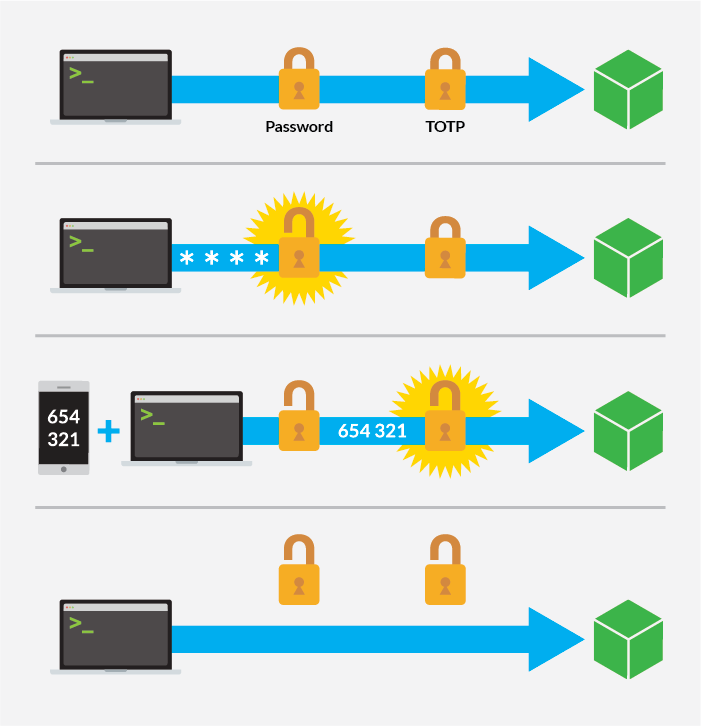

---
author:
  name: Linode
  email: docs@linode.com
description: 'How to use two-factor authentication and other security controls in the Linode Manager.'
og_description: 'This guide describes the security features of the Linode Manager, including two-factor authentication, API access controls, forced password expiration, and more.'
keywords: ["two-factor authentication", "password", "security", "Linode Manager", "token"]
license: '[CC BY-ND 4.0](https://creativecommons.org/licenses/by-nd/4.0)'
aliases: ['linode-manager-security/','security/linode-manager-security-controls/']
modified: 2019-01-08
modified_by:
  name: Linode
published: 2013-05-02
title: How to Keep Your Linode Account Safe
cloud_manager_link: security/linode-manager-security-controls-new-manager
---

<!--  -->

The [Classic Manager](https://manager.linode.com) is the gateway to your Linode products and services, and you should take steps to protect it from unauthorized access. Linode supports and recommends implementing the following security measures:

1.   Enable [two-factor authentication](#two-factor-authentication).

1.   Configure and monitor [event notifications](#linode-event-notifications).

These measures make it much more difficult for someone else to log in to your account without your knowledge. However, you should also take steps to make sure you don't accidentally lock yourself out of your account, too. Here are a few things you can do to minimize the chance of that happening:

1.  Record a [scratch code](#record-your-scratch-code) for your two-factor authentication.

2.  [Create a backup user](#create-a-backup-user) that you can log in to your Linode account with in addition to your primary user.

3.  Be aware of [the documentation](#recovery-procedure) that Linode requires in case you are otherwise unable to access to your account.

The following sections describe these measures in more detail.


These measures describe security controls for the Classic Manager and API, which are distinct from the authorization protocols for your individual servers. If you are collaborating with other people to work on your services, or if you are concerned about unauthorized access to your Linodes, review the [Create an Account for a Developer to Work on Your Linode](/docs/platform/create-limited-developer-account/) guide for more on how to control access to your servers.


## Two-Factor Authentication

Two-factor authentication (2FA) increases the security of your account by requiring two forms of authentication: something you have, and something you know. You're already familiar with this concept if you've ever used a debit card at an ATM. The debit card is something you have, and the PIN access code is something you know. You need both the debit card and the PIN to access your bank account.

In this analogy, your card's PIN is akin to your Linode account's password, and your debit card is like your 2FA code. Your 2FA code is provided by a two-factor authorization application that supports the *Time-based One-Time Password (TOTP) algorithm*. You generally install a 2FA app on your phone so that it's always handy. Under TOTP, your 2FA app will provide a code that is valid for only a short amount of time, after which a new code is generated.

### Enable Two-Factor Authentication

1.  Install an OTP generation app on your smartphone or tablet. For example, you can use any of the following applications:

    * [Authy](https://authy.com/features/setup/) (Android/iOS/Chrome)
    * [Google Authenticator](https://play.google.com/store/apps/details?id=com.google.android.apps.authenticator2) (Android/iOS)
    * [Duo Mobile](http://guide.duosecurity.com/third-party-accounts) (Android/iOS)
    * [FreeOTP](https://freeotp.github.io/) (Android/iOS)

1.  Click the **my profile** link at the top right corner of the Classic Manager.

1.  Re-authenticate using your Linode user's password.

1.  From the **Password & Authentication** page of the Classic Manager, click **Enable Two-Factor Authentication**.

1.  You'll then be shown a secret key and a QR code. **The key will be shown only once. Do not refresh this page until you have configured a 2FA app on your phone.** Write down the secret key and store it in a safe place. If you get locked out of your account, [contact support](/docs/support) to regain access.

1.  Open your phone's 2FA app and add a new account.

1.  Scan the QR code shown in the Classic Manager. Your 2FA app will create a new login token labeled *LinodeManager:user*.

1.  Enter the token from your 2FA app in the **Generated Token** field of the page above. Click **Confirm my token, and enable two-factor auth!**

1.   Note the scratch code and store it in a secure place. **This is important.** You will use this code if your 2FA device is not available.

### Log in with Two-Factor Authentication

1.  Open the [Classic Manager](https://manager.linode.com) in your web browser and log in as normal using your username and password. The authentication code text field will then appear.

1.  Open the 2FA app on your smartphone, then select your *LinodeManager:user* account.

1.  Enter the 2FA token from your phone and click **Authenticate**. Checking the box below the authentication option will add your computer to the trusted computer list for 30 days and generate a confirmation email to the address on file for your account.

### Record Your Scratch Code

In the event that your smartphone is unavailable or your secret key is lost, you can use a one-time scratch code to log back in to the Classic Manager and regenerate the key. Scratch codes are disabled by default. **We highly recommend you generate a scratch code** and store it somewhere accessible and secure.

1.  Return to the **Password & Authentication** tab in the Classic Manager and click the **generate** link to create a scratch code.

1.  A pop-up will appear asking you to confirm the action. Click **OK**.

1.  The scratch code will then be shown. **This code will be displayed only once**--copy or write it down and store it somewhere safe.

### Generate a New Key

The Classic Manager allows you to generate a new secret key for your two-factor authentication device. This is useful if you buy a new phone or otherwise need to set up a new 2FA app. To generate a new secret key:

1.  Return to the **Password & Authentication** tab.

1.  In the *Two-Factor Authentication* section, click **Regenerate Secret Key**.

1.  A new secret key and barcode will be generated for your account and displayed on the screen. Follow the instructions in the [Enabling Two-Factor Authentication](#enable-two-factor-authentication) section to add the new key to your smartphone.

### Disable Two-Factor Authentication

You can disable two-factor authentication for your Classic Manager account at any time.

1.  Return to the **Password & Authentication** tab.

1.  In the **Two-Factor Authentication** section, select **Disable**.

1.  A confirmation window appears asking if you want to disable two-factor authentication. Click **OK**.

### Recovery Procedure

If you lose your token and get locked out of the Classic Manager, email <support@linode.com> to regain access to your account. Should you need us to disable your Two-Factor Authentication, the following information is required:

1.  An image of the front and back of the payment card currently associated with your account, which clearly shows the last 6 digits, expiration date, and cardholder name.
2.  An image of the front and back of a matching government-issued photo ID.

## Linode Event Notifications

By default, the Classic Manager automatically sends event notifications via email when any jobs are added to the *Host Job Queue* of one of your Linodes. Monitoring these emails will help you detect potential unusual activity on your servers, which could be a sign of an unauthorized login. You can also subscribe to an RSS feed of these notifications.

To review your event notification settings:

1.  Click the **my profile** link at the top right corner of the Classic Manager.

1.  Re-authenticate using your Linode user's password.

1.  Go to the **Notifications** tab.

1.  The **Events Email Notifications** label will show whether email notifications are enabled or disabled. Click the **Toggle Event Email Notifications** button to adjust this setting.

### RSS

The URL for your event notifications RSS feed is displayed in the **Notifications** tab. To regenerate the URL for the RSS feed, click the **Generate a new RSS key** button. If you regenerated the URL for the RSS feed, you will need to update it in your RSS reader.

## Create a Backup User

Creating a second user on your account will allow you to log in to your account if you are locked out of your first user. For example, if the email address that your first user is associated with becomes inaccessible for any reason, then you will not be able to receive password reset and other notification emails from Linode for that user. In this situation, having a second user associated with a different email address is useful. In particular, it's recommended that you use an email under a different domain, in case your first email's domain is facing service or DNS issues.

This backup user should be created with unrestricted permissions so that you can fully administer your account from it. The [Accounts and Passwords](/docs/platform/manager/accounts-and-passwords/) guide provides more information on creating a second user. It is recommended that you also enable this guide's security measures for this backup user.

## Other Security Measures

### Configure Users for Other Team Members

If you have multiple individuals accessing the same Linode account, you should create separate user accounts for each individual. Once you've created the accounts, you can assign permissions to restrict access to certain areas of the control panel.

This is useful for groups that need to grant all team members access to the Classic Manager, or perhaps if you just want the billing department to have a separate account to receive invoices and billing information. The [Accounts and Passwords](/docs/platform/manager/accounts-and-passwords/) guide provides more information on user creation and permissions. The [Create an Account for a Developer to Work on Your Linode](/docs/platform/create-limited-developer-account/) guide is also available and describes best practices when hiring a developer.

### API Access

The [Linode API](https://www.linode.com/api/) is a programmatic interface for many of the features available in the Classic Manager. For this reason, the Classic Manager provides two security controls for your account's API key. First, you can generate a new API key if you suspect that your existing key has been compromised. And if you're not using the API key, you can remove access to it altogether.

See the [API Key](/docs/platform/api/api-key/) article for details.

### Force Password Expirations

Your company's policy may require users to change their passwords after a fixed interval of time. The Classic Manager can be configured to require password resets every 1, 3, 6, or 12 months. For more information, see the documentation on [Passwords in the Classic Manager](/docs/platform/accounts-and-passwords/#passwords).
