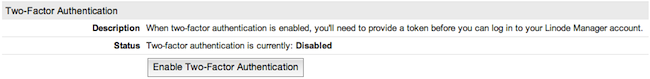
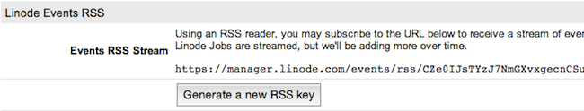

---
author:
  name: Linode
  email: docs@linode.com
description: 'How to use two-factor authentication and other security controls in the Linode Manager.'
og_description: 'This guide describes the security features of the Linode Manager, including two-factor authentication, IP address whitelisting, API access controls, forced password expiration, and more.'
keywords: ["two-factor authentication", "password", "security", "Linode Manager", "token"]
license: '[CC BY-ND 4.0](https://creativecommons.org/licenses/by-nd/4.0)'
aliases: ['linode-manager-security/','security/linode-manager-security-controls/']
modified: 2018-09-04
modified_by:
  name: Linode
published: 2013-05-02
title: Linode Manager Security Controls
---

The [Linode Manager](https://manager.linode.com) is the gateway to your Linode products and services, and you should take steps to protect it from unauthorized access. This guide documents several of Linode Manager's features that can help mitigate your risk.

## Two-Factor Authentication

Two-factor authentication increases the security of your account by requiring two forms of authentication: something you have, and something you know. You're already familiar with this concept if you've ever used a debit card at an ATM. The debit card is something you have, and the PIN access code is something you know. You need both the debit card and the PIN to access your bank account.

All 2FA settings are on the **Password & Authentication** page of the Linode Manager. To get there:

1.  Log in and click the **my profile** link at the top right corner.
1.  Re-authenticate using the password you just logged in with.

### Install a 2FA App

Install an OTP generation app on your smartphone or tablet. For example, you can use any of the following applications:

* [Authy](https://authy.com/features/setup/) (Android/iOS/Chrome)
* [Google Authenticator](https://play.google.com/store/apps/details?id=com.google.android.apps.authenticator2) (Android/iOS)
* [Duo Mobile](http://guide.duosecurity.com/third-party-accounts) (Android/iOS)
* [FreeOTP](https://freeotp.github.io/) (Android/iOS)

### Enable Two-Factor Authentication

1.  From the **Password & Authentication** page of the Linode Manager, click **Enable Two-Factor Authentication**.

    

1.  You'll then be shown a secret key and a QR code. **The key will be shown only once.** Write down the secret key and store it in a safe place. Do not refresh this page until you have configured a 2FA app on your phone.  If you get locked out of your account, [contact support](/docs/support) to regain access.

    

1.  Open your phone's 2FA app and add a new account.

1.  Scan the QR code shown in the Linode Manager. Your 2FA app will create a new login token labeled **LinodeManager:user**.

1.  Enter the Linode Token in the **Generated Token** field of the page above. Click **Confirm my token, and enable two-factor auth!**

1. Note the scratch code and store it in a secure place. **This is important.** You will use this code if your 2FA device is not available.

### Log in with Two-Factor Authentication

1.  Open the [Linode Manager](https://manager.linode.com) in your web browser and log in as normal using your username and password. The authentication code text field will then appear:

    

1.  Open the 2FA app on your smartphone, then select your **LinodeManager:user** account.

1.  Enter the 2FA token from your phone and click **Authenticate**. Checking the box below the authentication option will add your computer to the trusted computer list for 30 days and generate a confirmation email to the address on file for your account.

### Scratch Code

In the event that your smartphone is unavailable or your secret key is lost, you can use a one-time scratch code to log back in to the Linode Manager and regenerate the key. Scratch codes are disabled by default. **We highly recommend you generate a scratch code** and store it somewhere accessible.

1.  Return to the **Password & Authentication** tab in the Linode Manager and click the **generate** link to create a scratch code.

    

1.  A pop-up will appear asking you to confirm the action. Click **OK**.

    

1.  The scratch code will then be shown. **This code will be displayed only once**--copy or write it down and store it somewhere safe.

    

### Generate a New Key

The Linode Manager allows you to generate a new secret key for your two-factor authentication device, for example, if you buy a new phone. To generate a new secret key:

1.  Go to the **Password & Authentication** tab.
1.  In the *Two-Factor Authentication* section, click **Regenerate Secret Key**, as shown below.

    

1.  A new secret key and barcode will be generated for your account and displayed on the screen. Follow the instructions in the [Enabling Two-Factor Authentication](#enabling) section to add the new key to your smartphone.

### Disable Two-Factor Authentication

You can disable two-factor authentication for your Linode Manager account at any time.

1.  Go to the **Password & Authentication** tab.
1.  In the **Two-Factor Authentication** section, select **Disable**, as shown below.

    

1.  A confirmation window appears asking if you want to disable two-factor authentication. Click **OK**.

### Recovery Procedure

If you lose your token and get locked out of the Linode Manager, email <support@linode.com> to regain access to your account. Should you need us to disable your Two-Factor Authentication, the following information is required:

1.  An image of the front and back of the payment card currently associated with your account, which clearly shows the last 6 digits, expiration date, and cardholder name.
2.  An image of the front and back of a matching government-issued photo ID.

## IP Address Whitelisting

IP address whitelisting only allows access from addresses on the whitelist. It's also possible to add addresses remotely. If you ever attempt to log in from an IP address that is not on the whitelist, you'll receive an email notification containing a link to add the new IP address to the whitelist.

### Enable Whitelisting

1.  Find the IP address and netmask assigned to you by your ISP. They will usually be given on a statistics or dashboard page of your home router's admin login.
1.  Go to the **Password & Authentication** tab  of the Linode Manager.
1.  In the *Account Security* section, select **ENABLED - Alerts will be sent and whitelisting will be enforced** from the **Status** menu.

    

1.  Click **Save security setting**. The IP address whitelist feature will be enabled.
1.  Click **Edit Whitelist** to add your IP address.

    

1.  Enter your IP address and netmask, then click **Add IP**. You can add as many IP addresses as you want.

### Disable Whitelisting

1.  Go to the **Password & Authentication** tab.
1.  In the *Account Security* section, select **DISABLED - No alerts will be sent and whitelisting will not be required** from the **Status** menu.

    

1.  Click **Save security setting**.

## Security Event Notifications

By default, the Linode Manager automatically sends event notifications via email when any Linode jobs are added to the *Host Job Queue*. You can also subscribe to an RSS feed, or disable email event notifications entirely.

### Email

Event notifications sent via email is enabled for all accounts by default, but can be disabled at any time.

1.  Go to the **Notifications** tab.
1.  *Events Email Notifications* should show as *Disabled*. Click **Toggle Event Email Notifications** to enable them.

    

### RSS

Event notifications for your Linode account are also available as an RSS feed. The URL is displayed in the Linode Manager on your profile for adding to any RSS reader. You can also regenerate the URL.

1.  Go to the **Notifications** tab.
1.  The RSS feed URL is displayed in the *Linode Events RSS* section, as shown below.

    

1.  To regenerate the URL for the RSS feed, click **Generate a new RSS key**. If you regenerated the URL for the RSS feed, you will need to update it in your RSS reader.

## API Access

The [Linode API](https://www.linode.com/api/) is a programmatic interface for many of the features available in the Linode Manager. For this reason, the Linode Manager provides two security controls for your account's API key. First, you can generate a new API key if you suspect that your existing key has been compromised. And if you're not using the API key, you can remove access to it altogether.

See the [API Key](/docs/platform/api/api-key/) article for details.

### Configure User Accounts

If you'll have multiple individuals accessing the same Linode account, you should create separate user accounts for each individual. Once you've created the accounts, you can assign permissions to restrict access to certain areas of the control panel.

This is useful for groups that need to grant all team members access to the Linode Manager, or perhaps if you just want the billing department to have a separate account to receive invoices and billing information. See our guide on [Accounts and Passwords](/docs/platform/manager/accounts-and-passwords/) for more information.

### Force Password Expirations

Sometimes company policy requires users to change their passwords after a fixed interval of time. The Linode Manager can be configured to require password resets every 1, 3, 6, or 12 months. For more information, see the documentation on [Passwords in the Linode Manager](/docs/platform/accounts-and-passwords/#passwords).
