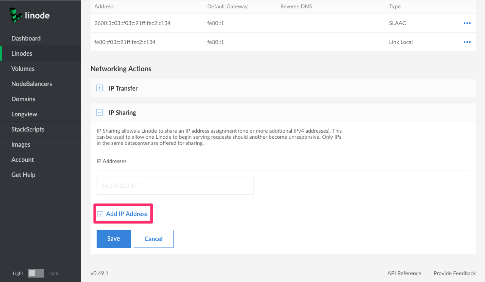
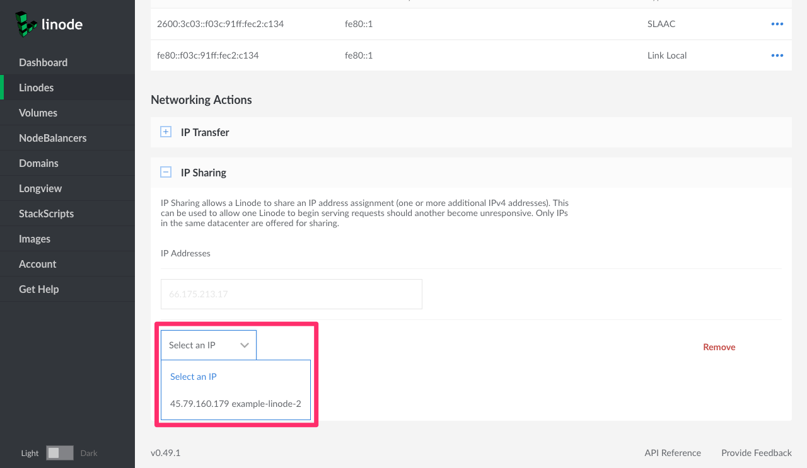

---
author:
  name: Linode
  email: docs@linode.com
description: Our guide to the remote access area of the Linode Manager.
keywords: ["remote access", "ip addresses", "ip failover", "swapping ip addresses", "console access"]
license: '[CC BY-ND 4.0](https://creativecommons.org/licenses/by-nd/4.0)'
aliases: ['remote-access/','networking/remote-access/']
modified: 2019-03-05
modified_by:
  name: Phil Zona
published: 2016-08-23
title: Remote Access
classic_manager_link: platform/manager/remote-access-classic-manager/
---

The Networking tab of the Linode detail page in the [Cloud Manager](https://cloud.linode.com) contains important network settings for your Linode. Use this tab to find your IP address, set the reverse DNS, configure IP sharing (called IP failover in the Classic Manager), and swap IP addresses with another Linode. You can also access the Linode Shell (Lish) console to remotely connect to your Linode and troubleshoot problems.

## Access Section

The Access section displays default gateways, and DNS resolvers. It also provides quick access to SSH and Lish commands.

## Setting Reverse DNS

The ability to associate an IP address with a domain name is referred to as *forward* DNS resolution. *Reverse* DNS lookup is the inverse process, where an IP address resolves to its designated domain name. Official Internet documents state that "every Internet-reachable host should have a name," and that the name should match a reverse pointer record. (See [RFC 1033](http://tools.ietf.org/html/rfc1033) and [RFC 1912](http://tools.ietf.org/html/rfc1912).)

Here's how to set reverse DNS for your domain names:


Before setting reverse DNS, verify that you have created a matching forward DNS record for the IP address. For instructions, see [Adding DNS Records](/docs/websites/hosting-a-website/#add-dns-records). If you use a third-party DNS provider, create the forward DNS record with your provider's management tool.


1.  Log in to the [Cloud Manager](https://cloud.linode.com).
2.  Click the **Linodes** link in the sidebar.
3.  Select your Linode. The Linode's detail page appears.
4.  Click the **Networking** tab.
5.  Select the **more options ellipsis** for the IP address to which you'd like to add a reverse pointer record.
6.  Select the **Edit RDNS** menu option, as shown in the below image.

    

7.  The *Edit Reverse DNS* menu appears. Enter a domain as shown in the below image.

    

8.  Click **Save**. You will be taken back to the Linode's detail page where you can verify the reverse DNS entry under the Reverse DNS column.

9.  Repeat steps 1-8 for every other domain name you host on your Linode.

You have successfully configured reverse DNS.

 
If you receive the message that **no match was found**, this indicates that you need to update the forward DNS for this domain. Make sure the domain or subdomain in question resolves to the IP address for which you are trying to set the reverse DNS. If you've recently made a DNS change, you may need to wait 24-48 hours for it to propagate.


## Resetting Reverse DNS

To reset reverse DNS to the Linode domain, which will be something like **li12-345.members.linode.com**, follow these instructions:

1.  Log in to the [Cloud Manager](https://cloud.linode.com).
2.  Click the **Linodes** link in the sidebar.
3.  Select your Linode. The Linode's detail page appears.
4.  Click the **Networking** tab.
5.  Select the **more options ellipsis** for the IP address to which you'd like to add a reverse pointer record.
6.  Select the **Edit RDNS** menu option, as shown in the below image.

    

1.  Remove the domain name from the text field and click **Save**.

The reverse DNS will be reset.

## Configuring IP Sharing


This feature is not yet supported in the Toronto data center.


*IP sharing*, called IP failover in the Classic Manager, is the process by which an IP address is reassigned from one Linode to another in the event the first one fails or goes down. If you're using two Linodes to make a website [highly available](/docs/websites/introduction-to-high-availability/) with Keepalived or a similar service, you can use the Linode Manager to configure IP failover. Here's how:

1.  Log in to the [Cloud Manager](https://cloud.linode.com).
2.  Click the **Linodes** link in the sidebar. A list of your available Linodes will appear.
3.  Select the Linode on which you wish to configure IP sharing. The Linode's detail page appears.
4.  Click the **Networking** tab.
5.  Expand the **IP Sharing** panel.
6.  Click on **Add IP Address**.

    

7.  A dropdown menu with available Linodes within the same data center appears. Select the Linode you would like to share an IP address with.

    

8.  Click **Save**.

You have successfully configured IP sharing. Now, when a failover service such as Keepalived detects failure of your chosen Linode, its IP address will be assigned to the new Linode to avoid an interruption in service. For more information on a practical use case, see our guide on [hosting a website with high availability](/docs/websites/host-a-website-with-high-availability/).

## Networking Restrictions

Linode's philosophy is to provide a plain Internet connection to every customer. We also implement some networking restrictions to prevent malicious activity and the abuse of our service.

By default, Linodes are able to send and receive traffic only for the MAC and IP addresses they are assigned. This restriction also applies to all ARP and IPv6 Neighbor Discovery traffic.

If you want to allow one Linode to use another Linode's IP address, such as for a high availability setup, you will need to enable IP Sharing in the Cloud Manager for every Linode that needs to use the IP address. For more information on enabling IP Sharing, please see the [previous section](#configuring-ip-sharing) of this guide.

## Transferring IP Addresses

If you have two Linodes in the same data center, you can use the *IP transfer* feature to swap their IP addresses. This could be useful in several situations. For example, if you've built a new server to replace an old one, you could swap IP addresses instead of updating the DNS records.


This process will only swap **IPv4** addresses, not IPv6.


Here's how to transfer IP addresses:

1.  Log in to the [Cloud Manager](https://cloud.linode.com).
2.  Click the **Linodes** link in the sidebar.
3.  Select a Linode. The Linode's detail page appears.
4.  Click the **Networking** tab.
5.  Expand the **IP Transfer** panel. The form below appears:

    

6.  Select an action from the dropdown menu. You can choose **move to** and **swap with**. "Swap with" switches the IP addresses of two Linodes. "Move to" moves an IP address from one Linode to another. To choose the "move to" option the Linode you are moving an IP address from needs to have more than one public IP address.

    
The menu only displays Linodes hosted in the same data center as the current Linode.


7.  Click **Save**. You have now transferred an IP address.

8.  Enable [Network Helper](/docs/platform/network-helper/) and reboot your Linode.

    Network Helper automatically configures static IP address configuration files, and will update them with the new IP address. It's turned on by default for newer Linodes. For older Linodes, unless you've modified the networking configuration, DHCP assigns the IP address on boot.

    If Network Helper is turned off *and* you've [configured a static IP address](/docs/networking/linux-static-ip-configuration/), you'll need to update the configuration for the new addresses, or turn Network Helper on.

    
If the IP is unreachable after a few minutes, you may need to notify the router directly of the IP change with the `arp` command run on your Linode:

    arping -c5 -I eth0 -S 198.51.100.10 198.51.100.1
    ping -c5 198.51.100.10 198.51.100.1

Replace `198.51.100.10` with your new IP address, and `198.51.100.1` with the gateway address listed in your Remote Access tab under "Default Gateways".


## Adding Private IP Addresses

The Cloud Manager allows you to add private IP addresses for fast and secure connections between Linodes located in the same data center. Here's how to add a private IP address:

1.  Log in to the [Cloud Manager](https://cloud.linode.com).
2.  Click the **Linodes** link in the sidebar.
3.  Select a Linode. The Linode's detail page appears.
4.  Click the **Networking** tab.
5.  Select the **Add Private IPv4** link, as shown below.

    

6.  The Linode Manager assigns a private IP address to your Linode.
7.  Make sure [Network Helper](/docs/platform/network-helper/) is enabled on your configuration profile, and reboot your Linode. Otherwise, configure static networking. See the [Linux Static IP Configuration](/docs/networking/linux-static-ip-configuration/) guide for instructions.

If you'd like to add more than one private IP address to your Linode, please [contact support](/docs/platform/billing-and-support/support/).


Private IPs in the same data center can communicate over the private network. This means a Linode's private IP address is accessible to all Linodes in a data center. It is recommended to set up firewall rules for your Linode to secure its network traffic. See our [firewall guides](/docs/security/firewalls/) for details on setting up firewall rules.


## Adding Public IP Addresses

You can use the Linode Manager to add additional public IP addresses to your account. However, due to the [impending exhaustion of the IPv4 address space](http://en.wikipedia.org/wiki/IPv4_address_exhaustion), Linode requires users to provide technical justification. To add another public IP address, please [contact support](/docs/platform/billing-and-support/support/) with your justification.

## Console Access

The Lish console allows you to access your Linode at any time, even if you've messed up your network settings. To access Lish, use the Lish console or an SSH client application installed on your computer. For more information about Lish, including usage tips, see [Using the Linode Shell](/docs/platform/manager/using-the-linode-shell-lish/).

### Using the Lish Console

If you need to quickly access Lish, use the Lish Console to open it directly from your web browser. Here's how:

1.  Log in to the [Cloud Manager](https://cloud.linode.com).
2.  Click the **Linodes** link in the sidebar.
3.  Select a Linode. The Linode's detail page appears.
4.  Click the **Networking** tab.
5.  Select the **Launch Console** link as shown below.

    

6.  Enter a username and password to log in.

You are now logged in to the Lish console.

## Using SSH

You can also access Lish with an SSH client application installed on your computer. Here's how:

1.  Log in to the [Cloud Manager](https://cloud.linode.com).

2.  Accessing Lish via SSH requires additional authentication over and above your Linode's username and password. To change your authentication requirements or to add an SSH key, navigating to **My Profile**:

    

3.  Click on the **LISH** tab.

    

4.  If you want to use SSH key pair authentication, copy and paste your public key in to the **SSH Public Key** field, and then click **Save**. You can optionally add more than one SSH public key by click **Add SSH Public Key**.
5.  To log in to Lish over SSH, click the **Linodes** link in the sidebar.
6.  Select a Linode. The Linode's detail page appears.
7.  Click the **Networking** tab.
8.  Copy the **Lish via SSH** text in the *Access* pane:

    

9.  Paste the text into the shell of your choice.
10. Your SSH client connects to your Linode via Lish.

You are now logged in to Lish via SSH.

