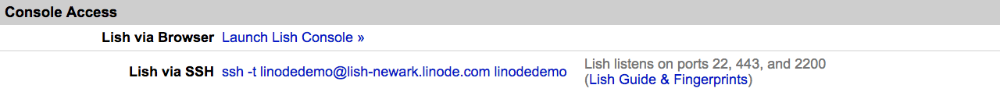
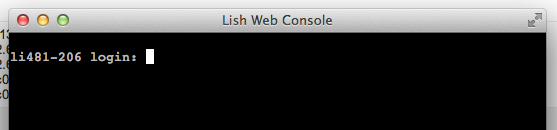
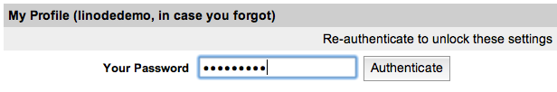
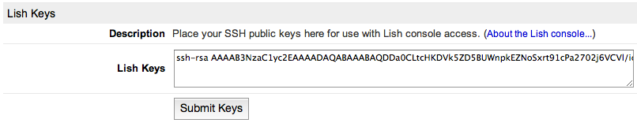

---
author:
  name: Linode
  email: docs@linode.com
description: 'Learn how to use Lish as a shell for managing or rescuing your Linode.'
keywords: ["Console", "Shell", "Lish", "rescue"]
license: '[CC BY-ND 4.0](https://creativecommons.org/licenses/by-nd/4.0)'
aliases: ['using-lish-the-linode-shell/','troubleshooting/using-lish-the-linode-shell/','networking/using-the-linode-shell-lish/','platform/using-the-linode-shell-lish/']
modified: 2019-02-07
modified_by:
  name: Linode
published: 2009-08-04
title: 'Using the Linode Shell (Lish)'
---

The Linode Shell (*Lish*) provides console access to all of your Linodes. It also allows you to perform actions like rebooting a Linode or switching to a different configuration profile without having to open the Linode Manager. Lish is also a good rescue tool. The console provides out-of-band access to your Linode, which means you can use Lish to access your Linode even when you are unable to connect directly via SSH. This is useful if firewall settings or a bad network configuration prevent you from accessing your Linode using SSH. Lish can also be useful if you need to access your secure server on a local computer whose public key has not been added to the allowed list.

## Connect to Lish

There are two ways to access Lish. You can use a terminal application to connect to a *Lish SSH gateway*, or you can log in to the [Linode Manager](https://manager.linode.com) and use the Lish console in your web browser. This section explains both methods.

 
Lish used to be accessible via a direct SSH connection to your Linode's host machine, but as of May 10, 2013, all users must connect to a Lish SSH gateway to access Lish. For more information, please see [this blog post](https://blog.linode.com/2013/04/30/lish-ssh-gateway/).


### Use a Terminal Application

You can connect to Lish with the SSH client of your choice. For example, you can use the Terminal application in Mac OS X, PuTTY in Windows, or your favorite X11 terminal emulator.

1.  Select a Lish SSH gateway. There's one in every data center. You can use any gateway to access your Linodes, but we recommend using one close to your Linode's data center. The gateway boxes are available over IPv4 and IPv6.
    -   lish-atlanta.linode.com
    -   lish-dallas.linode.com
    -   lish-frankfurt.linode.com
    -   lish-fremont.linode.com
    -   lish-london.linode.com
    -   lish-newark.linode.com
    -   lish-singapore.linode.com
    -   lish-tokyo.linode.com
    -   lish-tokyo2.linode.com

2.  Open a terminal window and enter the following command, replacing `username` with your Linode Manager username, and `location` with your preferred Lish SSH gateway. Lish listens for connections on ports 22, 443, and 2200.

        ssh username@location

    For example, logging in as `user` via the Newark gateway would look like:

        ssh user@lish-newark.linode.com

    
Users who have been granted "Access" rights on a particular Linode will have access to that Linode’s Lish console via the gateway. Linodes that a user can't access in the Linode Manager won’t show up in the Lish list. For more information about creating user accounts and configuring permissions, see [Accounts and Passwords](/docs/platform/manager/accounts-and-passwords/).


3.  Verify that the Lish SSH gateway's fingerprint is valid. [Click here](#lish-gateway-fingerprints) for more information.
4.  Enter the password you use to log in to the Linode Manager. You are now at the Lish shell. A list of your Linodes appears, as shown below:

        Linodes located in this data center:
        linode241706         Newark, NJ
        linode276072         Newark, NJ

        Linodes located in other data centers:
        linode287497         Dallas, TX

    
You can add a public SSH key for Lish in the Linode Manager to automatically connect to Lish without a password. See [this section](#add-your-public-key) for more information.


5.  At the Lish command prompt, type a Linode's name from the list. For example, typing `linode241706` will connect you to the screen console session for that Linode.
6.  Log in to the Linode with your username and password.

After you log in, you'll have console access to your Linode. You'll be able to restart services like `sshd`, edit firewall settings, and make other changes to your Linode. To exit your Linode's console, press **CTRL+A** then **D** to return to the host machine, and then press **CTRL+D** to return to the Lish menu. If you'd like to see the list of your Linodes again, type `list` from the gateway.

### Use a Web Browser

You can also connect to Lish using a web browser. This is useful when you don't have access to a terminal application, or if you just need quick and easy console access from the Linode Manager.

1.  Log in to the Linode Manager.
2.  Select a Linode.
3.  Click on the **Remote Access** tab.
4.  In the **Console Access** section, click **Launch Lish Console**, as shown below.

    

5.  The Lish Web Console window appears with your Linode's console, as shown below.

    

6.  From here, you can log in to your Linode with your root username and password, or any other username and password.

Now you can use the console, or exit to the Lish prompt by pressing **CTRL+A** then **D**. You cannot exit to a Lish gateway box using your web browser. To exit the session entirely, just close the Lish Web Console window.

### Add Your Public Key

If you don't want to enter your password every time you connect to Lish, you can add your public SSH key to the Linode Manager. If you haven't yet created SSH keys, please see our [Public Key Authentication with SSH](/docs/security/use-public-key-authentication-with-ssh/) guide for more information.

1.  Log in to the [Linode Manager](https://manager.linode.com).
2.  Select the **my profile** link.
3.  Enter your password, and then click **Authenticate**, as shown below.

    

4.  Select the **Lish Settings** tab.
5.  Copy your public SSH key into the **Lish Keys** field, as shown below.

    

6.  Click **Submit Keys**. Your Lish key will be saved in the Linode Manager.

Now you can log in to any of the Lish gateway boxes without having to type your password.

If you wish to disable Lish access for users without keys, use the **Authentication modes** dropdown menu on the same page, and then click **Save Setting**.

## Understanding Lish Commands

The Lish shell provides access to many functions which are otherwise only accessible via the Linode Manager web-based administration tool. Enter the `help` command to see a full list of available commands. The output provides an introduction to Lish functionality:

    kill            - kill stuck screen sessions
    exit            - exit from lish
    help            - this menu

    [return]        - connect to console
    version         - display running kernel version
    boot            - boot last used (or the only) config profile
    boot N          - boot the specified config profile
    shutdown        - shut down the Linode
    reboot          - shut down, then boot the last used config profile
    reboot N        - shut down, then boot the specified config profile
    sysrq X         - send SysRq X to your Linode
    destroy         - pulls the plug on a running Linode, no fs sync, no warning

    jobs            - view the job queue for your Linode
    configs         - view the configuration profiles for your Linode
    config N        - view configuration profile details for profile N
    status          - view the status of your Linode
    logview         - view contents of console log

There are two ways to run these commands for a specific Linode. If you are at the main Lish gateway, you can prefix the command with a Linode ID, like this:

    linode123456 logview

You can also bring up the Linode's console, then type **CTRL+A** then **D** to drop back to the host for that Linode. Now all of the commands above will be run for that Linode specifically. To exit back to the main Lish menu, type `exit`.


You can activate the ability to scroll back through the Lish console by pressing **CTRL-A + ESC**


## Advanced Lish Tricks

While the Lish interface as described above is useful as a basic command-line interface, you may find that you want to issue commands to your Linode without going through the Lish login process.

You can directly connect to a Linode's console:

    ssh -t [manager-username]@lish-[location].linode.com [linode-name]

You can also append Lish commands to the SSH command on your system prompt. For instance, to reboot your system, using your Linode Manager username, location, and the host-id for your Linode:

    ssh -t [manager-username]@lish-[location].linode.com [linode-name] reboot

Similarly, you can generate a view of the log using Lish:

    ssh -t [manager-username]@lish-[location].linode.com [linode-name] logview

This command format works for all Lish functionality.

## Lish Gateway Fingerprints and MD5s

The valid fingerprints for the Lish gateway boxes in our data centers and their MD5s are as follows:

### Atlanta

lish-atlanta.linode.com

<!-- old keys, need to be removed when old lish-atlanta box is officially retired -->

    RSA 59:30:1a:0b:93:5e:3f:4b:6f:d1:96:ff:7e:9e:12:f8
    DSA 0b:90:ed:f2:a1:e0:55:5b:38:6e:5d:6e:fa:00:63:7f
    ECDSA SHA256 9V/AK2EcQFjYzm1PU3XhOJbzhwYCoqqThl2vnFxbyvg

<!-- new keys for new box -->

    RSA SHA256:FdFLmDO9WbaZW5RO+y2KlVyzuDge4hKzH1DR9Y8VYjM
    ECDSA SHA256:KSIK727f5RY49FaBsFa2UhA/HyjcTaMD62FuKauSdjE
    ED25519 SHA256:yVR9Wwl/4aYnZYtIvWgiavCb1CUN/J6YHshGDlPvCUs

    MD5:26:3b:e3:f4:0e:97:ec:6b:30:1c:76:3b:3b:69:39:86  (RSA)
    MD5:ea:2c:6f:11:3f:48:bd:12:bc:81:52:01:05:d5:17:4b  (ECDSA)
    MD5:74:63:b9:ec:22:b1:3a:78:67:d3:f0:1c:b9:b4:ab:e9  (ED25519)

### Dallas

lish-dallas.linode.com

<!-- old keys, need to be removed when old lish-dallas box is officially retired -->

    RSA 6d:3d:b5:d0:42:1c:49:45:a6:47:29:bd:88:4e:58:d4
    DSA 58:bc:07:fa:c1:61:a4:3b:b5:00:3b:9b:6b:78:c6:c5
    ECDSA SHA256 IVXyNAH78L7KJFgfrScp948+56BTew8Z41nOkAw2kGo

<!-- new keys for new box -->

    RSA SHA256:kY9nTDp2xAG1HQPRfDKYUR8t6ldd51RTTDsFDDMsDTI
    ECDSA SHA256:NP/vuIdkObvvZWApVA93OOuUqRBz6PeDrvMfg9kglxA
    ED25519 SHA256:EKxqkhsOZ+9J8w7VBdOWLiaqHR2b8A8bamKt2K8UBh8

    MD5:db:9c:e3:4e:68:13:56:d3:7e:5a:eb:58:9e:49:ba:a7  (RSA)
    MD5:0b:78:a4:39:be:41:17:63:bb:6a:f8:1e:ab:93:9f:91  (ECDSA)
    MD5:54:c2:9a:61:d0:c2:4e:be:a5:eb:fb:7a:0b:22:12:22  (ED25519)

### Frankfurt

lish-frankfurt.linode.com

<!-- old keys, need to be removed when old lish-frankfurt box is officially retired -->

    RSA 43:76:22:43:0e:01:cb:84:6a:80:b9:9b:90:34:c7:b1
    DSA 87:2d:c9:5a:76:06:e6:3d:08:70:1b:2e:a6:b4:e8:c2
    ECDSA SHA256 4F/M6SYqrukVHJJbCkzw4tw4TjRVfAY98cDKwqXT9MY

<!-- new keys for new box -->

    RSA SHA256:TyBXJDtYyCi1jRL4ZxAVCWsZg0+jpTv1BErAsDMQqIE
    ECDSA SHA256:StQiYqmw7JiA45Vrchrahbv/JK5H6J7+iRDmwPRwzTU
    ED25519 SHA256:7cyQLGYKOrMxoegTTcoi3gAetGRhA3mDtkftl4eR99U

    MD5:ee:49:b2:0a:e5:13:59:37:e5:f6:12:50:ad:20:5c:e7  (RSA)
    MD5:ba:49:5f:8e:8f:1e:46:33:11:a4:a8:8a:ac:fb:5b:46  (ECDSA)
    MD5:03:1e:29:c8:ea:81:1a:20:f8:b5:83:a9:1d:63:a4:a8  (ED25519)

### Fremont

lish-fremont.linode.com

<!-- old keys, need to be removed when old lish-fremont box is officially retired -->

    RSA 2c:43:0e:fc:88:f2:3a:dd:01:43:3a:fc:9f:67:9f:66
    DSA 19:30:1a:48:85:aa:78:ab:46:8d:0f:4d:00:88:e6:b7
    ECDSA SHA256 0BmmvUv/itqa1ruA4KmqzMFaY4Ijdw/YW+SoiMJT1mo

<!-- new keys for new box -->

    RSA SHA256:UJgQK2qaOgVBt8jMnCVOMJ0DvfYOxMcj7GlSdPPzVG8
    ECDSA SHA256:nQg6/hsNHu20w0nEC0PP4DCFrEsNgY3PeVteHw0SzXM
    ED25519 SHA256:OX3imiePFMl6d5N+IaYhGZQ07nuApcUgnd2YRbFNKH0

    MD5:92:45:5d:19:1a:f2:ea:c5:82:bc:cc:13:01:36:fa:1d  (RSA)
    MD5:83:a0:e0:ef:dc:69:47:02:7e:0c:e6:eb:15:34:96:50  (ECDSA)
    MD5:22:f3:51:2f:4c:aa:39:3e:96:19:27:59:0f:36:cd:c7  (ED25519)

### London

lish-london.linode.com

<!-- old keys, need to be removed when old lish-london box is officially retired -->

    RSA 71:27:30:cd:dc:69:7a:fe:58:4a:04:e6:6b:5f:b4:e2
    DSA ce:41:c0:48:2c:93:de:c8:d2:a9:bf:3f:97:1f:04:ad
    ECDSA SHA256 L7sQgnpnoBwRoyIYXAFBs8SdSnwtyYmhXs1p/mQDKQM

<!-- new keys for new box -->

    RSA SHA256:2PaY0MUmKbR59G4d7SDYB5su5acwcvXC/bTo1/S0DA4
    ECDSA SHA256:UUcp3Wm1VdQ0cniEiJiTZ2yU6a7iZjLCBsUIq7bg9E4
    ED25519 SHA256:uMaAJ9emISvLbOBYMK+CVoUQ9b1LvX1FqYwaW/Vkmjc

    MD5:68:57:86:77:68:1b:04:c9:82:83:74:76:de:12:9a:a4  (RSA)
    MD5:1e:d1:51:b1:23:38:f9:ce:01:d8:db:0c:37:20:30:bb  (ECDSA)
    MD5:64:a8:43:5a:37:f1:27:b1:b3:b5:59:28:fa:dc:b8:dd  (ED25519)

### Newark

lish-newark.linode.com

<!-- old keys, need to be removed when old lish-newark box is officially retired -->

    RSA 11:2a:57:a4:f8:ca:42:b2:c0:ab:17:58:0d:0c:b7:8b
    DSA a1:e2:f5:5a:71:f9:b8:98:d9:a6:4c:65:e5:05:ea:04
    ECDSA SHA256 p+fsr503gCnyZhAG7wx5mzrvw9MIPdgzvKauScUm8wk

<!-- new keys for new box -->

    RSA SHA256:k/rA5QC0gboUE9ogel51dvpgzObSpFMu8Tf143ViIzI
    ECDSA SHA256:W4Le4WDt4wCgPATFu9KqCq4eigjAj0abuZJYUDbhTY0
    ED25519 SHA256:TT+wcHzOZVH6YFq+WEbhIl1U6wfioNyH3yfIz5ByZlU

    MD5:91:d1:68:d1:55:e2:ec:85:5f:75:6a:97:ba:e8:a7:38  (RSA)
    MD5:00:55:0a:6b:c0:0c:6a:f1:01:96:ab:31:25:7e:9f:a7  (ECDSA)
    MD5:20:79:84:26:56:31:41:af:ea:86:9d:46:55:8e:b9:7e  (ED25519)

### Singapore

lish-singapore.linode.com

<!-- old keys, need to be removed when old lish-singapore box is officially retired -->

    RSA 06:26:d8:2a:12:8b:2f:d7:6c:54:72:5a:a7:7b:da:7b
    DSA 0c:f9:f9:d6:f3:0a:f6:bb:82:82:07:4b:51:db:e2:35
    ECDSA SHA256 LzlyP1Uj1nne2KwCkB5HlOWoHLH/7YrApZlNCn5204A

<!-- new keys for new box -->

    RSA SHA256:r//4/dCUjFiydsRa1g7vqO9NcUzUdXNVgVgsV5ofrug
    ECDSA SHA256:aEuTP8kkEKBefl3Yg3hH+Y9vyrNXHWKywvs3a6Ai648
    ED25519 SHA256:q1G1pBrLuhsUAnZ04SOYoxVthKYyLz+wA0hBAUVkKtE

    MD5:f7:8e:8d:9c:db:e2:e4:54:a2:77:9b:fa:6d:5e:a2:b4  (RSA)
    MD5:30:23:c8:4b:1c:93:23:ca:a5:29:79:94:e0:6b:95:f0  (ECDSA)
    MD5:4c:d1:55:68:a1:90:6c:15:9b:af:c1:f7:27:31:68:29  (ED25519)

### Tokyo

lish-tokyo.linode.com

<!-- old keys, need to be removed when old lish-tokyo box is officially retired -->

    RSA af:ec:f0:b8:87:33:d5:12:04:0d:7c:bb:a6:c5:5f:be
    DSA 1d:7d:bd:5c:a1:41:29:c3:78:de:e7:0f:d3:f2:63:34
    ECDSA SHA256 XcBYWsYm4p/bZ/tfWEntUzScDlTxvzTrmd7emeRBMJc

<!-- new keys for new box -->

    RSA SHA256:UHujIQqUK6pqWWXBqisDupMWZG9AYOfTj+fk6ngDWU8
    ECDSA SHA256:3WoiJTxvm4vqS4J5elOqZKyTauhs3KqNfkJ7ZqeL+Ew
    ED25519 SHA256:mWnf8zIboHHR324p0EuwOPCQLaJBTiS4IMCx4F4nVCM

    MD5:65:30:47:ee:6d:e8:17:20:ce:bb:10:27:7e:70:d9:25  (RSA)
    MD5:a5:02:90:36:40:8d:6e:ab:51:dd:06:c6:90:7a:12:d6  (ECDSA)
    MD5:eb:e1:1c:9f:ad:3b:2a:cd:c8:54:58:d4:0d:23:bf:86  (ED25519)

### Tokyo 2

lish-tokyo2.linode.com

<!-- old keys, need to be removed when old lish-tokyo2 box is officially retired -->

    RSA 2c:60:9a:ce:cf:4b:8d:4e:8f:09:ae:e0:c2:b0:fb:b7
    DSA 2d:0f:b0:a5:d0:bd:4a:71:1a:75:dc:de:b1:06:61:a6
    ECDSA SHA256 nE/1fY3QdCXuoTBfnvQtXzwFVOnO+/gbijm4ZM9wvaY

<!-- new keys for new box -->

    RSA SHA256:6Wx3ELzTHhgCaeiQhgKQYoyYoGF7TS1LNapz1Bn7zL8
    ECDSA SHA256:dQnfvEzgEJUNRtL4I8qPwMMouZaNbgFDXv4+cX8CsRQ
    ED25519 SHA256:2WP7xJlGR8OYDziGLwz1BXYomJsfJcvVu3CoRtSATjg

    MD5:8c:ee:f3:62:96:23:37:47:3a:49:75:2b:62:4f:3f:d4  (RSA)
    MD5:f6:ef:22:78:5e:0c:2b:30:ca:57:2f:d6:17:1e:b1:23  (ECDSA)
    MD5:92:cf:28:2c:1f:db:8d:2b:00:96:2a:15:e4:a1:b5:cc  (ED25519)