---
author:
  name: Nathan Melehan
  email: docs@linode.com
description: 'Shows how to use the CPanel Transfer Tool to copy CPanel accounts to a new Linode running WHM and CPanel.'
keywords: ["cpanel", "transfer tool", "migrate", "website migration"]
license: '[CC BY-ND 4.0](https://creativecommons.org/licenses/by-nd/4.0)'
modified: 2018-08-21
modified_by:
  name: Linode
published: 2018-08-21
title: How to Migrate a CPanel Server to Linode
external_resources:
  - '[CPanel Documentation - How to Move All cPanel Accounts from One Server to Another](https://documentation.cpanel.net/display/CKB/How+to+Move+All+cPanel+Accounts+from+One+Server+to+Another)'
  - '[How to Transfer Accounts and Configurations Between cPanel Servers](https://documentation.cpanel.net/display/CKB/How+to+Transfer+Accounts+and+Configurations+Between+cPanel+Servers)'
  - '[CPanel Documentation - Transfer Tool](https://documentation.cpanel.net/display/68Docs/Transfer+Tool)'

---

This guide describes how to migrate from a server running WHM and CPanel on another host to Linode. This transfer is completed using CPanel's official [Transfer Tool](https://documentation.cpanel.net/display/70Docs/Transfer+Tool). Prior to using the Transfer Tool, you will complete a basic WHM installation on a new Linode. Read the [Best Practices when Migrating to Linode](/docs/platform/migrate-to-linode/best-practices-when-migrating-to-linode/) guide prior to following this guide for more information about migrating your sites.


The Transfer Tool only transfers your CPanel accounts, and not your WHM settings. You will need to recreate your WHM settings on your new Linode separately.

This guide does not cover how to handle CPanel deployments that are part of a DNS cluster. For guidance on migrating a CPanel server in a DNS cluster, see CPanel's [official documentation](https://documentation.cpanel.net/display/CKB/How+to+Move+All+cPanel+Accounts+from+One+Server+to+Another).


## Migrate Your CPanel Accounts

### Deploy Your Linode

1.  Follow Linode's [Getting Started](/docs/getting-started/) guide and choose CentOS 7 as your Linux image when deploying. Choose a Linode plan with enough storage space to accommodate the data within the CPanel accounts on your current host.

1.  Follow the [How to Secure Your Server](/docs/security/securing-your-server/) guide and create a limited Linux user with `sudo` privileges.

1.  Follow the [Install CPanel on Linode](/docs/websites/cms/install-cpanel-on-centos/) guide to stand up a new WHM/CPanel installation. When following this guide, use the generic domain name for your Linode for WHM's **Hostname** setting. This generic domain will be listed under the Remote Access tab for your Linode in the Linode Manager, and it will have the form `liXY-ABC.members.linode.com`.

    
You will set the Hostname to be your actual domain name later on in this guide. If you set the Hostname setting to your domain name now, the WHM and CPanel dashboards on your new Linode will redirect to your current host, and you will not be able to access the settings for your new Linode.


### Use the CPanel Transfer Tool

1.  Visit `http://your_linode_ip_address:2087` in your web browser to load the WHM dashboard. Your browser will display a warning about the SSL/TLS certificate provided by the web server, but you can bypass this message.

1.  When presented with the WHM Login form, login with the root user and password for your Linode.

    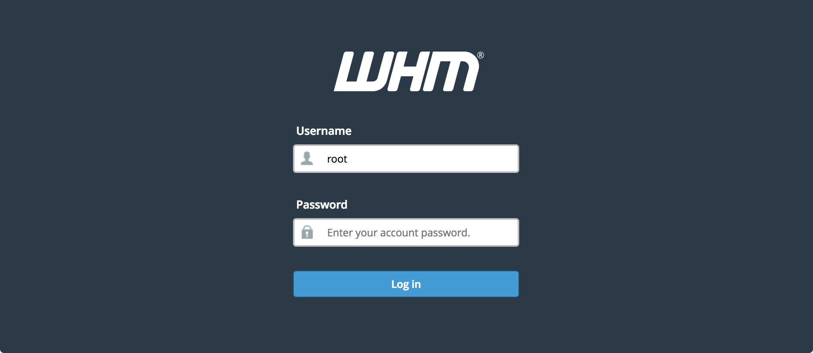

1.  In the menu on the left side of the WHM dashboard, scroll down to the **Transfers** section and choose the **Transfer Tool** option:

    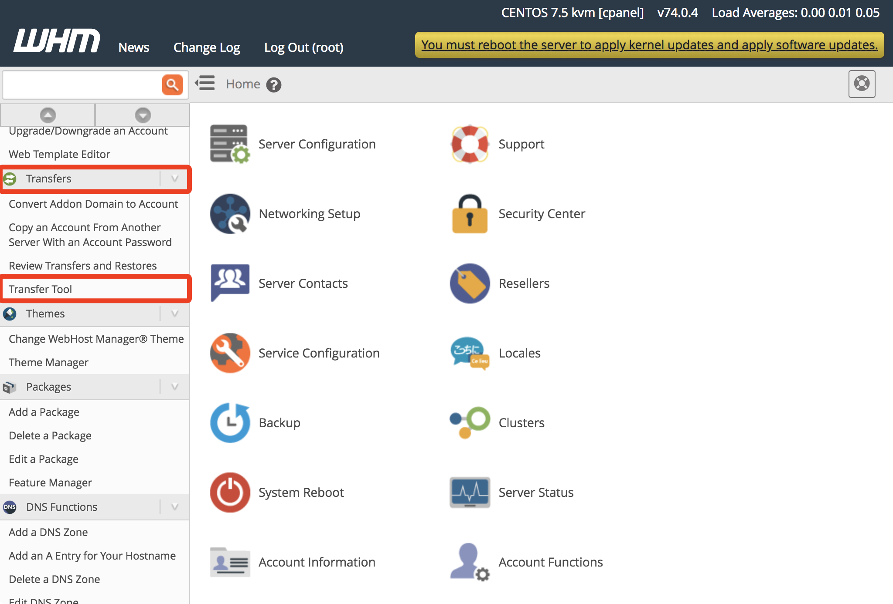

1.  In the **Remote Server Address** field, enter your current host's IP address:

    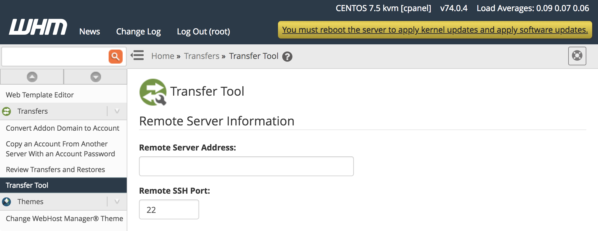

1.  If you have the root password for your current host and if root logins are allowed on that host, enter the root credentials from your current host under the **Authentication** section.

    If you don't have the root credentials or if root logins are not allowed, you will need the credentials of another user with 'sudo' privileges on your current host. Enter that username and password and choose **sudo** for the **Root Escalation Method** field.

    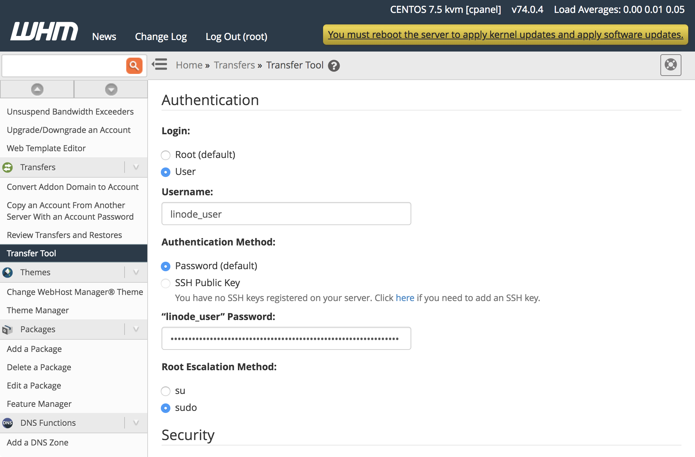

1.  Click the **Fetch Account List** button at the bottom of the form.

1.  A new page will load with forms listing the **Service Configurations**, **Packages**, and **Accounts** from your current host. Click the checkboxes on each item in these sections to enable their transfer. You will need to click the **Show** button for the **Service Configurations** section to see the options in that area:

    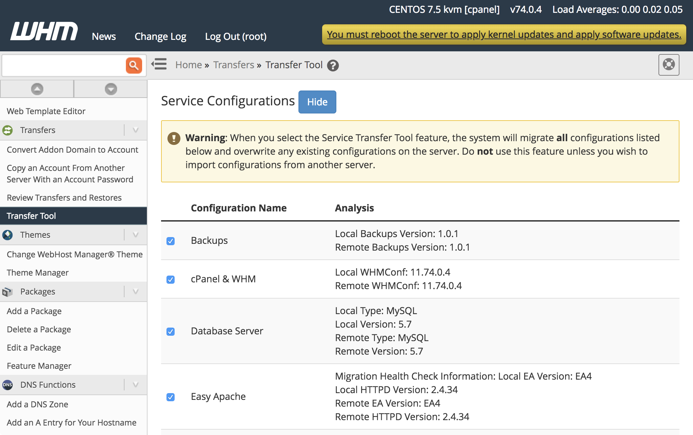

1.  When all of the options are selected, click the **Copy** button at the bottom of the page. A new page will appear showing the progress for your transfer:

    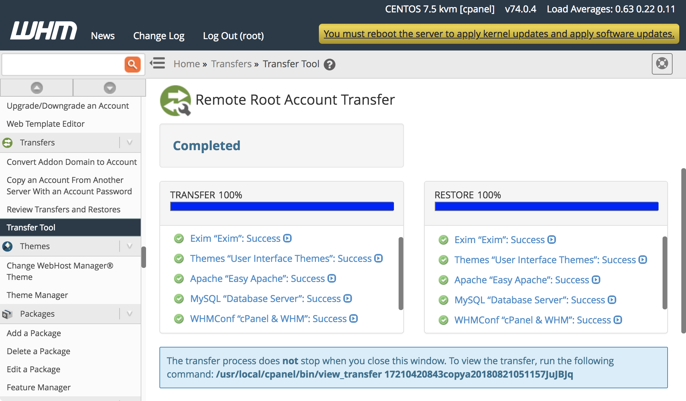

## Verify Transferred Accounts

Your CPanel accounts show now be fully transferred to your new Linode, but you should verify that all information was transferred successfully. You can do this by logging into CPanel on your new Linode for each account that was transferred and reviewing the contents of the dashboard. In addition, the specific information in the following sections should be reviewed.

### Verify IP Address Assignments

The Transfer Tool tries to assign your new Linode IP to the transferred CPanel accounts, but it will sometimes leave your old host's IP in place, so you should confirm which IP is assigned to your CPanel accounts:

1.  In the menu on the left side of the WHM dashboard, navigate to the **Account Information** section and choose the **List Accounts** option:

    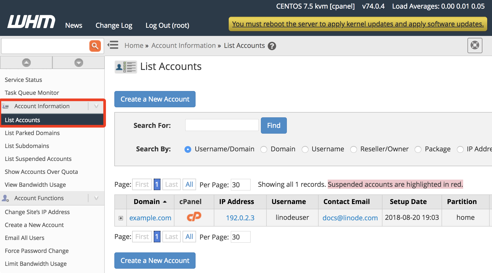

1.  Verify that your new Linode's IP is listed for the accounts. If it is not listed, use the [CPanel IP Migration Wizard](https://documentation.cpanel.net/display/68Docs/IP+Migration+Wizard) tool to update your account configurations with the new IP.

### Verify SSL Certificates

The official [CPanel migration documentation](https://documentation.cpanel.net/display/CKB/How+to+Move+All+cPanel+Accounts+from+One+Server+to+Another#HowtoMoveAllcPanelAccountsfromOneServertoAnother-ReinstallallSSLcertificates.) notes that SSL certificates (apart from the self-signed certificates that CPanel provides) need to be manually downloaded from the source CPanel server and then installed on the new Linode.

When writing this guide it was found that the SSL certificates from the test source server did actually transfer automatically. Still, it's recommended that you verify your SSL certificates are present on the new server, and that you backup the certificate files from the source server.

1.  The SSL certificates on your current CPanel host are located in `/etc/ssl`. Download them to your computer:

        scp -r root@current_host_ip_address:/etc/ssl ~

    Instead of using SCP to download the files, you can also use [FileZilla](/docs/tools-reference/file-transfer/filezilla/).

1.  If you are not able to login as `root` to your host, login as a user with `sudo` privileges and then copy those files to the user's home folder:

        ssh your_sudo_user@current_host_ip_address
        sudo cp -r /etc/ssl ~
        sudo chown $(whoami):$(whoami) ssl
        exit

    Then download the files from the user's home folder:

        scp -r root@current_host_ip_address:~/ssl ~

    After downloading the files, log back into your host and remove the files from the `sudo` user's home folder:

        rm -r ~/ssl

1.  If you do not have terminal access to your current host, you can also copy the certificates from the CPanel interface. Load CPanel on your current host by visiting `http://your_current_host_ip_address:2083` in your web browser and enter your CPanel account credentials.

    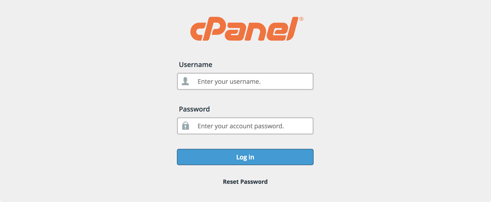

    Visit the **SSL/TLS** section and view the private keys, certificate signing requests, and certificates listed. Copy and paste each of these to text files on your computer. Repeat this for each CPanel account on your current host.

    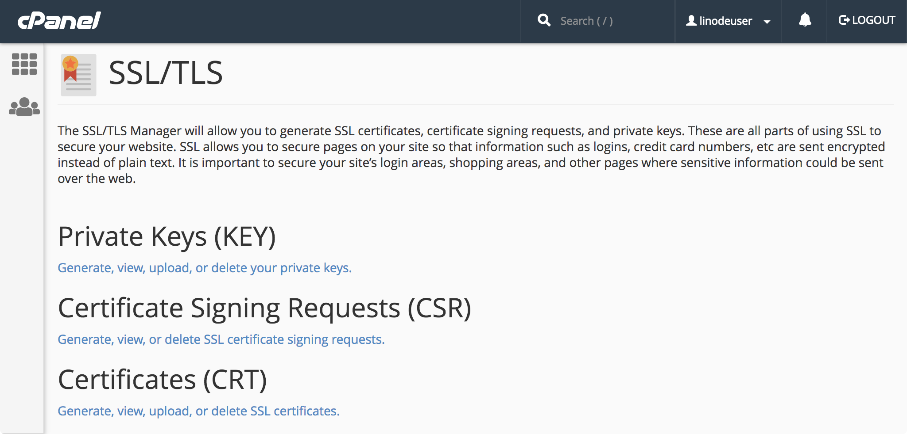

1.  Visit `http://your_linode_ip_address:2083` in your web browser to load the CPanel dashboard on your Linode. Your browser will display a warning about the SSL/TLS certificate provided by the web server, but you can bypass this message.

1.  When presented with the CPanel Login form, enter the credentials you use for your CPanel account on your current host. These credentials were transferred by the Transfer Tool and are the same as before.

1.  Visit the **SSL/TLS** section and review the private keys and certificates sections. If you do not see your private keys and certificates, use the **Upload a New Private Key** and **Upload a New Certificate** forms to add them.

1.  Visit the **SSL/TLS** section again and navigate to the **Install and Manage SSL for your site (HTTPS)** page. Click the **Certificate Details** link to view which certificate is installed for your site.

    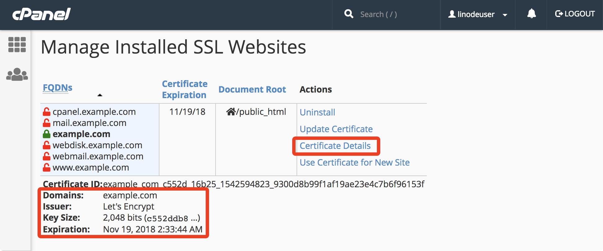

1.  If your certificate is not being used, click the **Browse Certificates** button and choose your certificate from the dialog that appears. After choosing your certificate, click the **Install Certificate** button at the bottom of the page.

1.  Repeat steps 4-8 for each transferred CPanel account.

### Test Your New CPanel Deployment

If you visit your Linode's IP address directly in your browser, the website served by your CPanel account will not appear. This is because the CPanel server expects your domain name to be passed in your web request, and you have not updated your DNS yet.

The [Previewing Websites Without DNS](/docs/networking/dns/previewing-websites-without-dns/) guide describes a way to visit your domain prior to updating your DNS records. When you have updated your DNS, this workaround will no longer be necessary to view your site.

## Migrating DNS Records

After completing the CPanel migration, update your DNS records to reflect your new Linode's IP. Once this is done, visitors will start loading your CPanel accounts' services from your Linode.



## Update WHM Hostname

After your DNS changes have propagated, update WHM's hostname to be your domain. In the menu on the left side of the WHM dashboard, navigate to the **Networking Setup** section and choose the **Change Hostname** option. Enter the new hostname in form that appears and click the **Change** button:

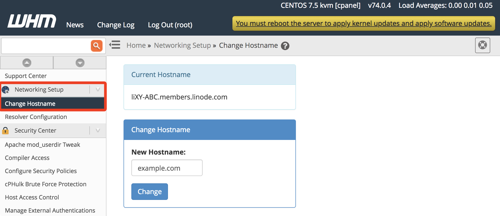

## Transfer CPanel License

If you previously purchased your license directly from CPanel, [update your license](https://documentation.cpanel.net/display/MAN/Transfer+a+license) to feature your new Linode's IP address. If you purchased your license through your previous host, then you will need to purchase a new license from CPanel for your Linode deployment. As an alternative to purchasing from CPanel, a free CPanel subscription is included for each of your Linodes if you are a Linode Managed subscriber.