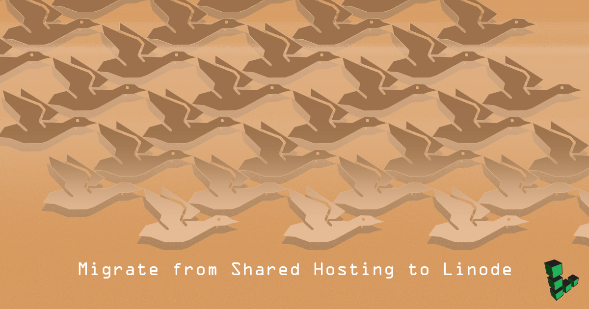
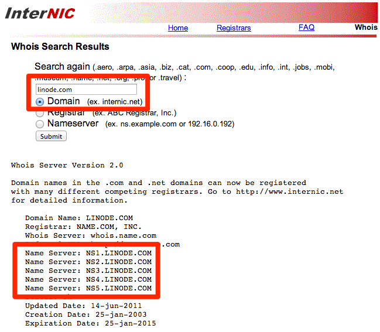

---
author:
  name: Linode
  email: docs@linode.com
description: 'Migrate your website from a shared host to a Linode cloud server running a LAMP stack.'
keywords: ["shared hosting", "migrate", "website migration"]
license: '[CC BY-ND 4.0](https://creativecommons.org/licenses/by-nd/4.0)'
aliases: ['/migrate-to-linode/migrate-from-shared-hosting-to-linode/','/migrate-to-linode/migrate-from-shared-hosting/','/migrate-from-shared/']
modified: 2019-03-06
modified_by:
  name: Linode
published: 2013-10-18
title: Migrate from Shared Hosting to Linode
tags: ["linode platform"]
---

This guide walks you through the steps to migrate your website from a shared hosting provider to a Linode running a LAMP stack. A Linode server gives you much more power and flexibility than a shared host, but these advantages come at the cost of increased complexity and system administration responsibility.

The biggest change between shared hosting and Linode's cloud is that with Linode you have full administrative access to the server without intervention. This means that you will be solely responsible for keeping your software updated and your valuable data backed up. Our [Guides and Tutorials](/docs/) area contains all of the information you'll need for basic [server administration](/docs/tools-reference/linux-system-administration-basics/), [security hardening](/docs/security/securing-your-server/) and [system backups](/docs/security/backups/backing-up-your-data/).

## Before You Begin

This guide makes three assumptions:

*   You already have a [Linode account](https://login.linode.com/signup).
*   You know how to sign in to the [Linode Cloud Manager](https://cloud.linode.com/).
*   You have a basic knowledge of [how to use SSH](/docs/security/authentication/use-public-key-authentication-with-ssh/).


Because this guide is intended to be general in nature, it does not take into account the specific dependencies or frameworks of each individual setup. If you're unsure whether or not your website is compatible with a LAMP configuration, we strongly suggest consulting your web developer before proceeding.


See our [Getting Started](/docs/getting-started-new-manager/) guide for more information on signing up and setting up your Linode.

## Prepare Your Domain Name to Move

An optional but recommended first step is to lower the *Time to Live* (TTL) setting for your domain, so the migration won't have a negative impact on your site's visitors. TTL tells DNS caching servers how long to save information about your domain. Since a DNS address' corresponding server IP address is typically not changed often, the default TTL is often about 24 hours.

When changing servers, however, you want a shorter TTL to make sure that when you update your domain information, it quickly takes effect. Otherwise, your domain could resolve to your old server's IP address for up to 24 hours.

1.  Locate your current *nameservers* in your shared hosting provider's account control panel. If you're not sure what your nameservers are, you can find out with a [Whois Search tool](http://www.internic.net/whois.html). You will see several nameservers listed, probably all at the same company.

    

2.  Contact your domain registrar for details on how to shorten the TTL for your domain. Every provider is a little different, so you may have to ask for instructions.

3.  Make a note of your current TTL. It will be listed in seconds, so you need to divide by 3600 to get the number of hours (e.g. 86,400 seconds = 24 hours). This is the amount of time that you need to wait between now and when you actually move your domain.

4.  Adjust your TTL to its shortest setting. For example, 300 seconds is equal to 5 minutes, so that's a good choice if it's available.

5.  Make sure you wait out the original TTL from Step 3 before actually moving your domain. In the meantime, you can continue through this guide to back up your data, deploy your Linode and upload your website. For more information on domain TTL, see our [DNS guide](/docs/platform/manager/dns-manager/#set-the-time-to-live-or-ttl).

## Back Up Your Website

The next step is to back up your site from your old server to your local computer. You can do this multiple ways, although you may find it easiest to work directly through your host's control panel from your web browser. The location of your website on the server will vary among hosting providers, though it should be something along the lines of `/home/account_name/public_html`.

You may want to explore whether the application you use for your website has its own backup instructions, such as the combination of [WordPress](https://codex.wordpress.org/WordPress_Backups) and [phpMyAdmin](http://docs.phpmyadmin.net/en/latest/faq.html?highlight=backup#how-can-i-backup-my-database-or-table), for example. Regardless of the backup method, every website is made up of files and databases so you can use the instructions in this section to back up every type of website.

If you have a MySQL or MariaDB database on your old server, you will also need to back it up. Your old host probably has a control panel that will allow you to make an easy backup of your database. Contact that host for instructions if you are not sure how to do it. If your old host does not have a database backup solution, you can follow our instructions to [Back Up Your MySQL Databases](/docs/databases/mysql/use-mysqldump-to-back-up-mysql-or-mariadb/) using the command line.

**Shared Host's Control Panel**

[CPanel](https://documentation.cpanel.net/display/ALD/Backup%20Wizard) and [Plesk](https://docs.plesk.com/en-US/onyx/administrator-guide/backing-up-and-restoration.59256/) have their own backup methods, in addition to being able to create a single *.tar.gz* or *.zip* file from within their file managers for you to download.

**Terminal (Linux / OS X)**

Linux and OS X can use [SCP](https://en.wikipedia.org/wiki/Secure_copy) natively from the command line. To download your site's public files to your local user's home directory using SCP:

    scp example_user@server_ip_address:/home/account_name/public_html ~/

  
The exact location of your website's files may vary depending on your specific implementation. Contact your site's developer to confirm the location of your website's files.
  

**FileZilla (Linux / OS X / Windows)**

See [our Filezilla guide](/docs/tools-reference/file-transfer/filezilla/) to use it for your site backups.

## Install a Basic Web Server on Your Linode

The next step is to build the software environment needed for your site to function properly. Once that's complete, you can install a content management system of your choice such as [WordPress](https://wordpress.org/) or [Drupal](https://www.drupal.com/). There are many possibilities; see our [web servers](/docs/web-servers/) guides for available options. This guide will assume the use of a LAMP stack, one of the most common web server configurations.

### LAMP Stack

[LAMP](https://en.wikipedia.org/wiki/LAMP_%28software_bundle%29) stands for the following:

*  **Linux:** A LAMP stack will work on most common Linux distributions. While there will be no discernible difference to your site's users, each distro has advantages and disadvantages to consider. See our [LAMP Guides](/docs/web-servers/lamp/) section for installation instructions on various distros.
*  **Apache:** A web server that handles HTTP and HTTPS internet traffic.
*  **MySQL:** A database server.
*  **PHP:** A software language that allows you to create and configure dynamic website content.

To install a LAMP stack on Ubuntu, follow the steps in our [How to Install a LAMP Stack on Ubuntu 18.04](/docs/web-servers/lamp/install-lamp-stack-on-ubuntu-18-04/) guide.

## Get Your Website Live

Once you've installed all the underlying software for your Linode, you can upload your website to the new server. This will replace the Apache test page shown by default when you first install Apache on your Linode.

1.  Follow the steps in our [hosting a website](/docs/websites/hosting-a-website-ubuntu-18-04/#configure-name-based-virtual-hosts) guide to configure name-based virtual hosts for Apache on your Linode.

2.  Upload your website's files from your local computer to `/var/www/html/example.com/public_html` on your Linode. The process to do this is similar to how you downloaded your site's files to your local computer when creating a backup from your shared host. The only differences are the source and destination of the transfer.

    For example, to *upload* to your Linode using SCP on Linux or OS X:

        scp ~/example.com example_user@server_ip_address:/var/www/html/example.com/public_html

    
`example_user` should be the user on your Linode you want to log in as, and `example.com` should be replaced by your domain name.


    If you have a database, you'll need to upload it to your Linode. If you're more comfortable using a control panel, you may want to [install phpMyAdmin](/docs/databases/mysql/install-mysql-phpmyadmin-ubuntu-14-04/) at this point. You can also [restore your database](/docs/databases/mysql/back-up-your-mysql-databases/#restoring-an-entire-dbms-from-backup) using the command line.

3.  Now check your website's IP address in your browser. Your website should be displayed.

    
Your website may not yet function completely correctly if it is URL-dependent. A website created with WordPress is an example of a URL-dependent website. Because you're using the IP address instead of the URL, WordPress gets confused. It should start working correctly once you move your domain to point to your Linode.


### A Note About Email

A Linode can run both your web server and an [email server](/docs/email/running-a-mail-server/) for your site. If you use a separate email host like Google Apps, you will need to make sure you preserve the correct *MX records* for email when you move your domain. If you use a mail service at your old host, you may need to consider where you're going to move your email. See [Running a Mail Server](/docs/email/running-a-mail-server/) for more details.

## Move Your Domain

The last step in your migration is to point your domain at your Linode's IP address. If you decided to shorten your TTL, make sure you've waited out the original time period.

1.  Follow our instructions on [adding a domain zone](/docs/platform/manager/dns-manager-new-manager/#add-a-domain-zone) to create DNS records at Linode for your domain.

2.  If you use a third-party email service, edit the default MX records.

3.  Log in to your domain registrar's control panel and update the name servers to use Linode's:

    *  `ns1.linode.com`
    *  `ns2.linode.com`
    *  `ns3.linode.com`
    *  `ns4.linode.com`
    *  `ns5.linode.com`

4.  Wait five minutes (or the time you set for your TTL) for the domain to propagate. If you did not shorten your TTL, this may take up to 48 hours.

5.  Navigate to your domain in a web browser. It should now show the website being served from your Linode, rather than your old host. If you can't tell the difference, you can use the [DIG utility](/docs/networking/dns/use-dig-to-perform-manual-dns-queries/). It should show the IP address for your Linode.

6.  [Set reverse DNS](/docs/networking/dns/configure-your-linode-for-reverse-dns/) for your domain.

    
If you're having trouble seeing your site at the new IP address, you may need to try visiting it in a different browser, or in a private browsing session. Sometimes your browser will cache old DNS data, even if it has updated everywhere else.


Your website is now fully migrated to Linode. It is a good idea to wait a few days before cancelling your shared hosting service to make sure that everything is running smoothly, and you don't need to obtain more files from your shared host.

## Next Steps

Your server is only as secure as you make it. Follow our [Securing Your Server](/docs/security/securing-your-server/) guide to make sure your Linode is hardened against unauthorized access.
